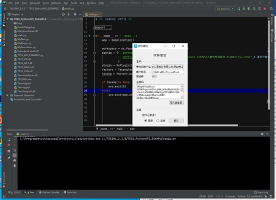

# 注意事项

## 软件激活及试用期

用户在首次使用Python环境运行范例或开发文件时，也需要激活，具体激活界面如下：

​    试用用户与首次激活软件流程相同，采用安装包的Cert文件夹下的JidaTraffic_key激活即可。

​    软件的试用期为30天，以前激活过软件的客户激活V3.0.1版本时重新延长30天试用期（识别激活电脑的物理地址）。试用期结束后将无法调用接口的二次开发功能。

​    商业版用户使用不受限制。

## 度量单位

TESS NG在运行过程涉及的度量单位有多种，有基本的度量单位，如：长度单位，复合型度量单位，如：速度单位。在启动TESS NG后需要设置长度基本度量单位，默认基本度量单位是像素，像素与米存在转换关系，这个关系通常在画路网前设置像素比时就已确定。

​    在二次开发过程中需要根据说明将大部分与长度有关的单位改成像素。像素与米制的相互转换方法如下，默认情况下1个像素表示1米：

​    米制转换像素：def m2p(value:float) -> float:

​    像素转换米制：def p2m(value:float) -> float:

## 插件函数被TESSNG调用频次设置

TESSNG调用插件方法的频次是指对插件实现的PyCustomerSimulator接口方法调用频次。

可以在PyCustomerSimulator的initVehicle(self, pIVehicle:Tessng.IVehicle)方法里通过pIVehicle设置TESSNG对PyCustomerSimulator不同方法调用频次及是否允许插件重绘车辆。

是否允许对车辆重绘方法的调用：默认为False，如果允许，可以传入True，如：pIVehicle.setIsPermitForVehicleDraw(True)。可以通过pIVehicle得到该车辆类型及ID等信息来确定是否允许对该车辆重绘。

当"__custsimubysteps"设置为True时，**默认调用频次比较低，很多低到毫无意义，只为减少调用次数，不至于影响仿真运行效率**。如果某方法被实现，需要对该方法调用频次进行调整。可参见范例。

假设仿真精度是steps，即每秒计算steps次，各方法默认调用频次如下：

- 车辆相关方法调用频次
  - 计算下一位置前处理方法beforeNextPoint被调用频次：每steps * 300个仿真周期调用一次，即5分钟调用一次；
  - 具体车辆一个步长计算完成后的处理方法afterStep被调用频次：每steps * 300个仿真周期调用一次，即5分钟调用一次；
  - 确定是否停止车辆运行并移出路网方法isStopDriving调用频次：每steps * 300个仿真周期调用一次，即5分钟调用一次；

- 驾驶行为相关方法调用频次
  - 重新设置期望速度方法reCalcdesirSpeed被调用频次：每steps * 300个仿真周期调用一次，即5分钟调用一次，如果该方法被实现，建议将该方法调用频次设为1个计算周期调用1次或更大。
  - 计算最大限速方法calcMaxLimitedSpeed被调用频次：每steps * 300个仿真周期调用一次，即5分钟调用一次。如果该方法被实现，建议将该方法调用频次设为20个计算周期调用1次或更小。
  - 计算限制车道方法calcLimitedLaneNumber被调用频次：每steps个仿真周期调用一次，即每秒调用一次。如果该方法被实现，建议将该方法调用频次设为20个计算周期调用1次或更小。
  - 计算车道限速方法calcSpeedLimitByLane被调用频次：每steps个仿真周期调用一次，即每秒调用一次。如果该方法被实现，建议将该方法调用频次设为20个计算周期调用1次或更小。
  - 计算安全变道方法calcChangeLaneSafeDist被调用频次：每steps个仿真周期调用一次，即每秒调用一次。如果该方法被实现，建议将该方法调用频次设为20个计算周期调用1次或更小。
  - 重新计算是否可以左强制变道方法reCalcToLeftLane被调用频次：每steps个仿真周期调用一次，即每秒调用一次。如果该方法被实现，建议将该方法调用频次设为20个计算周期调用1次或更小。
  - 重新计算是否可以右强制变道方法reCalcToRightLane被调用频次：每steps个仿真周期调用一次，即每秒调用一次。如果该方法被实现，建议将该方法调用频次设为20个计算周期调用1次或更小。
  - 重新计算是否可以左自由变道方法reCalcToLeftFreely被调用频次：每steps个仿真周期调用一次，即每秒调用一次。如果该方法被实现，建议将该方法调用频次设为20个计算周期调用1次或更小。
  - 重新计算是否可以右自由变道方法reCalcToRightFreely被调用频次：每steps个仿真周期调用一次，即每秒调用一次。如果该方法被实现，建议将该方法调用频次设为20个计算周期调用1次或更小。
  - 计算跟驰类型后处理方法afterCalcTracingType被调用频次：每steps * 300个仿真周期调用一次，即5分钟调用一次。如果该方法被实现，建议将该方法调用频次设为20个计算周期调用1次或更小。
  - 连接段上汇入到车道前处理方法beforeMergingToLane被调用频次：每steps * 300个仿真周期调用一次，即5分钟调用一次。如果该方法被实现，建议将该方法调用频次设为1个计算周期调用1次或更大。
  - 重新计算跟驰状态参数方法reSetFollowingType被调用频次：每steps * 300个仿真周期调用一次，即5分钟调用一次。如果该方法被实现，建议将该方法调用频次设为1个计算周期调用1次或更大。
  - 计算加速度方法calcAcce被调用频次：每steps * 300个仿真周期调用一次，即5分钟调用一次。如果该方法被实现，建议将该方法调用频次设为1个计算周期调用1次或更大。
  - 重新计算加速度方法reSetAcce被调用频次：每steps * 300个仿真周期调用一次，即5分钟调用一次。如果该方法被实现，建议将该方法调用频次设为1个计算周期调用1次或更大。
  - 重置车速方法reSetSpeed被调用频次：每steps * 300个仿真周期调用一次，即5分钟调用一次。如果该方法被实现，建议将该方法调用频次设为1个计算周期调用1次或更大。
  - 重新计算角度方法reCalcAngle被调用频次：每steps * 300个仿真周期调用一次，即5分钟调用一次。如果该方法被实现，建议将该方法调用频次设为1个计算周期调用1次或更大。
  - 计算后续道路前处理方法beforeNextRoad被调用频次：每steps * 300个仿真周期调用一次，即5分钟调用一次。如果该方法被实现，建议将该方法调用频次设为1个计算周期调用1次或更大。
  

<!-- ex_nonav -->
