# 问答列表

### 1. TESSNG 如何激活？

答： 官网联系销售购买正版license

### 2. 打开TESSNG时出现以下错误如何解决？


**答：**此问题可能是由于该动态库损坏或win7 sp1以下系统设备问题，用户可下载该动态库后复制覆盖到本机对应位置(64位系统为C:\Windows\System32)，如仍未解决，则建议升级系统，升级后再次点击进入即可。

### 3. 在V3系列二次开发中如出现以下错误如何解决？

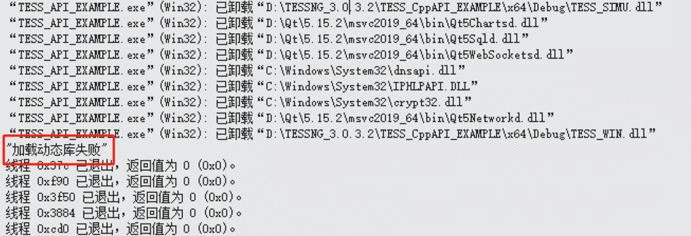

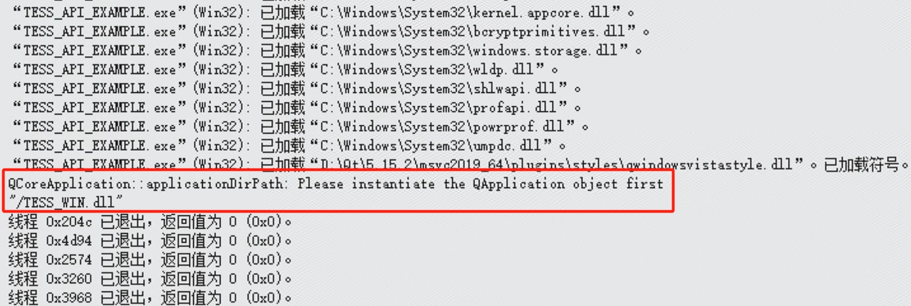

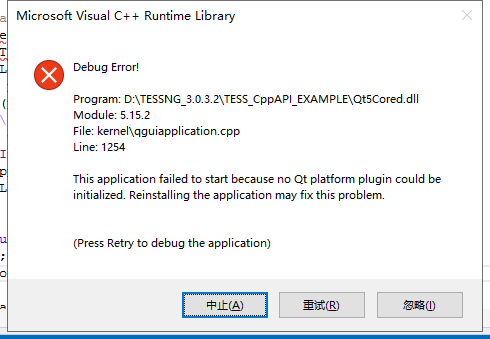

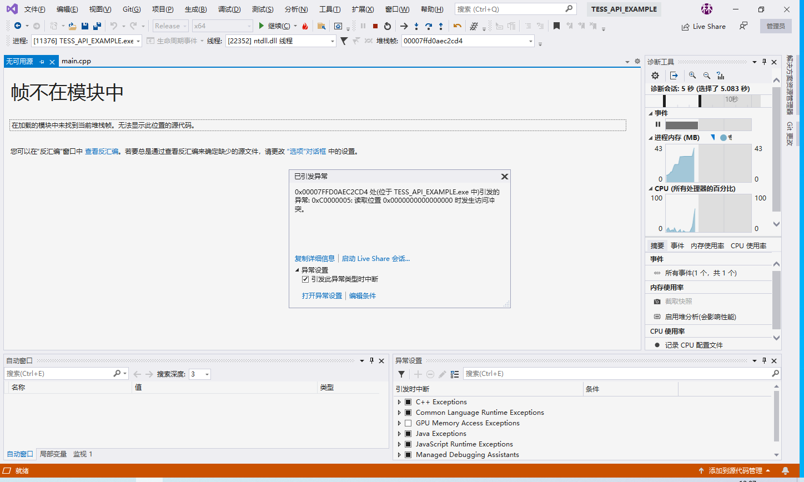

**答：**此问题均有可能是C:\windows\system32中缺少libcrypto-1_1-x64.dll库，将TESSNG安装目录下的该库复制到system32下即可。

### 4. 在python二次开发中，出现以下问题如何解决？

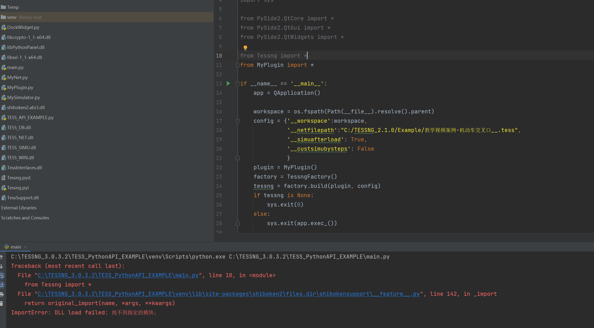

**答：**解释器的Python版本并非3.6，需要更改python版本。

### 5. 在python二次开发中，如出现以下问题如何解决？

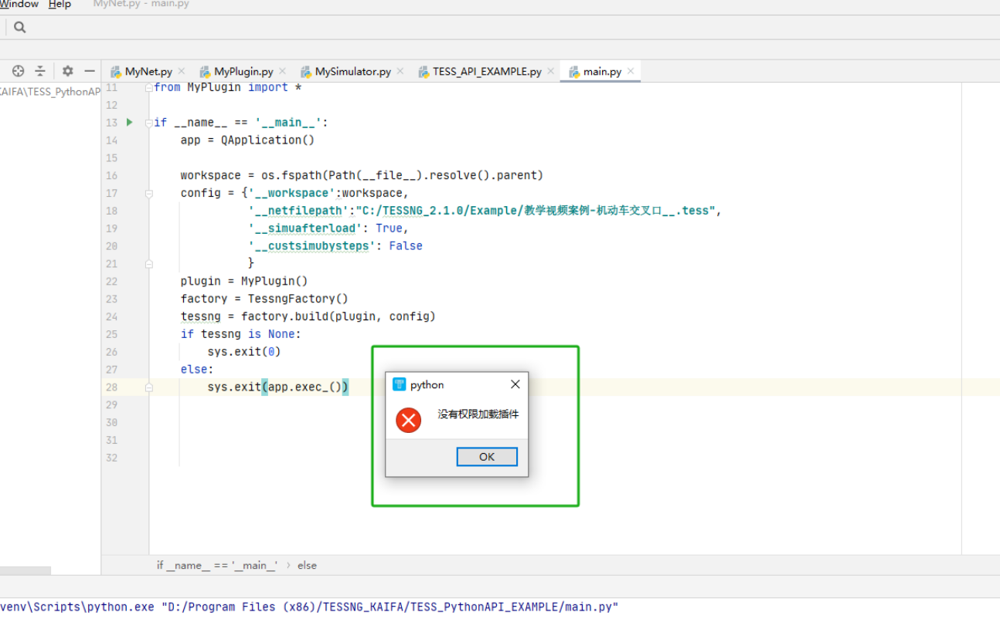

**答：**该问题是由于试用版的激活码已过期，python试用版支持一个月，可更换电脑后运行。

### 6. 为什么设置背景图后，鼠标在边界无法拖动？

**答：**场景大小未设置，点击基本参数按钮，调整场景大小为对应大小。或导入背景图后设置场景比例尺。

### 7. 我绘制了两个路段，但是和仿真底图不重合，这个我怎么调整呢？

**答：**可以选中断点，然后在想要调整的路段上右键添加断点，通过拖动断点来使路段拟合底图。

### 8. 我二次开发写在MySimulator自带的一些函数中的代码为什么没有生效？

**答：**可能是因为试用期已过，没有权限加载插件。

### 9. 我安装了TESSNG V3.1，为什么没有TESS_PythonAPI_EXAMPLE这个文件夹？

**答：**案例代码文件夹需要下载V3系列二次开发版本获取。

### 10. 为什么我这里输入1（小客车），但是实际仿真中却有两种车型呢？

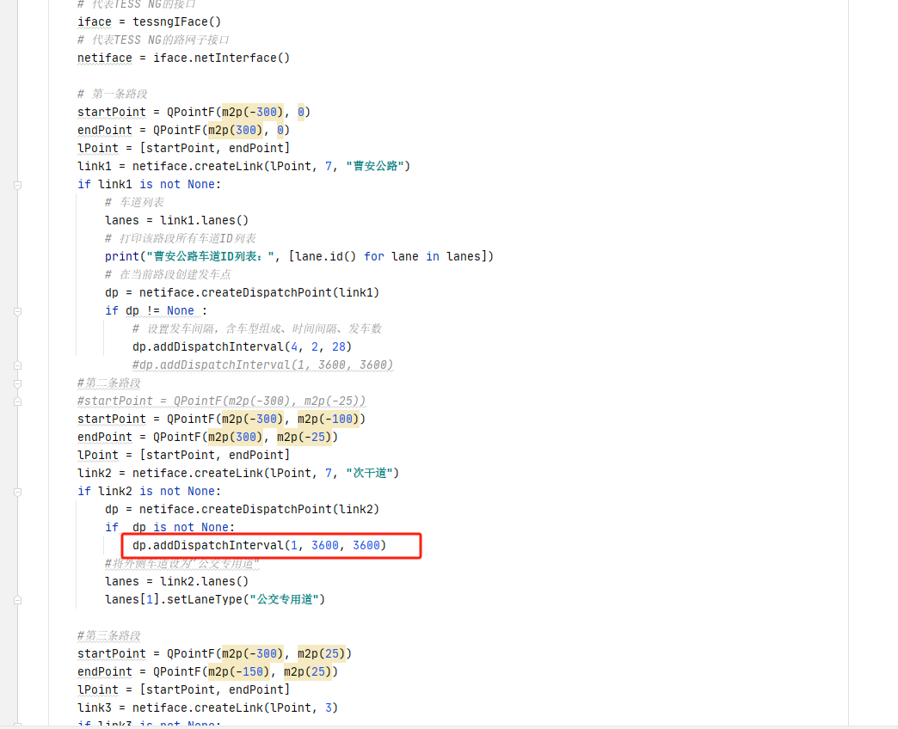

**答：**请看下车辆类型1里面是否包含了小客车和大客车，这个方法中的第一个参数指的是车型组成的ID，不是车辆类型的ID。

### 11. 这个 self.mSimuCount 的作用是什么呢？

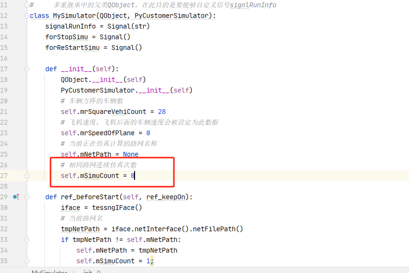

**答：**是案例中记录仿真次数的，点击开始仿真后，点击结束，这个参数会加一。

### 12. 我想实现这样一种场景：所有的货车行驶过程中，当到达某一指定地点后都需要停车一定时间（比如5min）卸货，然后再按照既定路线行驶。可以使直接停，也可以是慢慢停。

**答：**在MySimulator中有ref_reSetSpeed和ref_reCalcdesirSpeed函数，前者控制车辆速度，后者控制车辆期望速度。这两个函数会在计算完成车辆下一帧的状态后进入，此时可以在这两个函数中进行判断，若车辆为货车且到达指定地点，将其速度或期望速度降为0。

```python
def ref_reSetSpeed(self, vehi, ref_inOutSpeed):
    # 若当前车辆为货车，且到达指定地点(假设距路段1起点100-120m处为指定停车地点),将车辆速度设置为0
    if vehi.vehicleTypeCode() == 4 and vehi.roadId() == 1 and 100 <= vehi.vehicleDriving().distToStartPoint() <= 120:
        ref_inOutSpeed.value = 0
        return True
    return False
```

### 13. 我想让TESSNG不要每次都弹窗，能做到吗？

**答：**可以在config中将参数__allowspopup设置为false

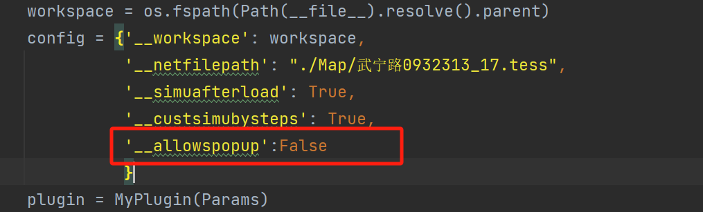

### 14. 在C++二次开发中，运行TESS_CPPAPI_EXAMPLE后左上角不显示版本号，且打开其它路网时报以下错误：

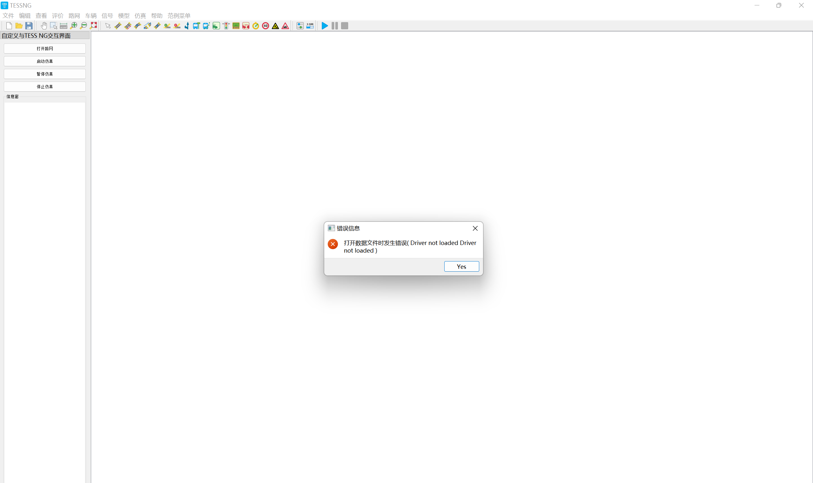

**答：**运行时的qt动态库版本不匹配，请确认运行时依赖库为qt5.15.9版本，或将TESSNG根目录下qt相关动态库复制到运行目录下（x64/release或x64/debug）

### 15. 在C++二次开发中，Release运行TESS_CPPAPI_EXAMPLE后未显示TESSNG GUI窗口且立即结束运行

**答：**运行时依赖的系统环境动态库或第三方动态库不匹配，请将TESSNG根目录下qt相关动态库复制到运行目录下（x64/release或x64/debug）运行后再次尝试。

### 16. 在C++二次开发中，TESSNG打开后闪退，且运行TESS_CPPAPI_EXAMPLE后报错“Cannot mix incompatible Qt library (5.15.2) with this library (5.15.9)”

**答：**运行时依赖的qt版本动态库掺杂了5.15.2版本的动态库，与5.15.9版本的动态库不兼容。解决方法是将安装的5.15.9版本qt目录下msvc/bin中的q开头的动态库复制到tessng运行目录下，覆盖原本的动态库即可。

### 17. 在C++二次开发中，TESSNG打开后不显示版本号，且打开路网时报以下错误。

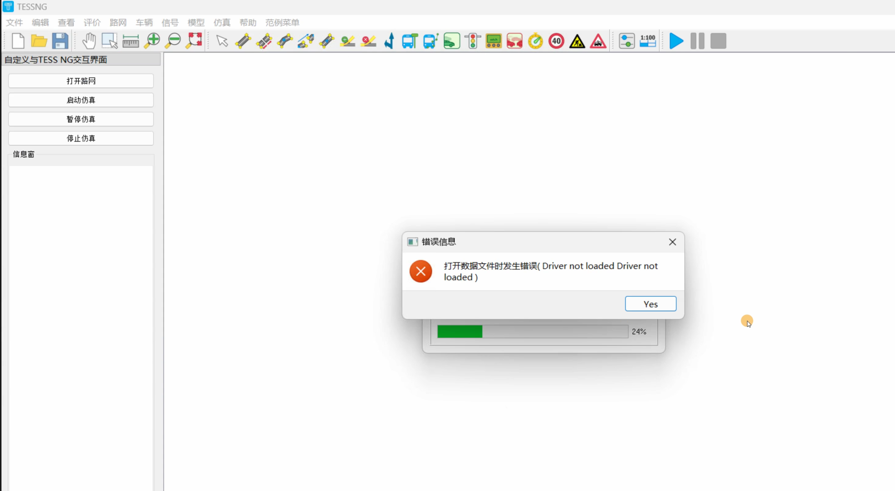

**答：**运行时依赖的qt版本动态库插件为5.15.2版本，请修改为5.15.9版本，或将TESSNG根目录下的plugins文件夹复制到运行目录下。

### 17. 在python二次开发中，如报以下错误：


**答：**原因为当前python版本不匹配，建议下载anaconda3后，创建python3.6虚拟环境，安装pyside2即可解决。


<!-- ex_nonav -->
