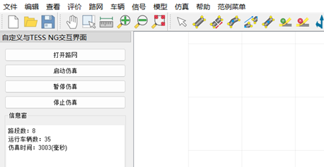
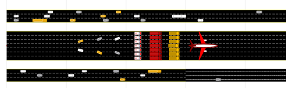
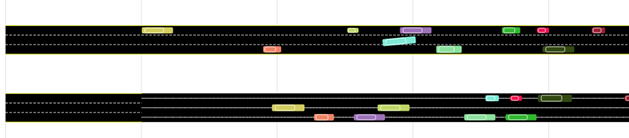

* # 简介

  ## 1. 研发背景

  TESS NG微观交通仿真系统融合了交通工程、软件工程、系统仿真等交叉学科领域的最新技术研发而成，主要特点为：完全自主知识产权、便捷快速的建模能力，开放的外部接口模块以及定制化的用户服务等。

    TESS NG强化设计，在软件功能扩展、项目建设过程中对大量功能的实现进行抽象，将抽象的逻辑过程在TESS NG内部与核心功能相融合。这些抽象的逻辑细化成接口方法，抽象接口方法的具体实现留给具体运用。在此架构设计下，开发出车路协同、在线仿真、微宏观一体化仿真等插件模块。目前这些抽象接口的设计和运用已经成熟。

  TESS NG的二次开发通过用户编写代码与TESS NG交互来实现能力扩张与功能定制。

  TESS NG python API与C++API功能完全一致。python API是在C++API基础上封装的，由于python语法与C++相比存在一些差别，为了使python API 的调用方式尽可能与C++ API调用方式保持一致，对少数几个C++ 方法进行了调整，最终C++ API 与 python API 在功能上完全一致，只是python少数几个方法名不同（避免重载带来复杂性）。

  用户可以通过二次开发实现高度自动化，定制化的业务场景仿真，是实现交通数字孪生，学术实验的有效方法之一。

  ## 2. API支持语言

  TESSNG 目前支持C++, Python两种语言的二次开发接口；其中python版本建议使用python3.6。

  ## 3. 接口架构

  TESS NG和插件相互调用，实现对TESS NG运行过程从精细到粗放各个层次的控制。

  

  ​    TESS NG通过实现TessInterface及其三个子接口，将自身主要功能暴露给用户，用户启动TESS NG后可以通过tessngIFace()方法获取TESS NG的顶层接口，再通过顶层接口获取三个子接口，调用子接口方法。TESS NG加载插件后可以调用python实现的插件接口方法，用户可以在插件方法中通过TessInterface及其子接口控制仿真运行，及仿真过程中车辆驾驶行为、信号灯色、路径车辆分配等等。

  ## 4. 范例说明

  范例“TESS NG PYAPI EXAMPLE”展示了在窗体界面、路网展示、仿真过程三个方面如何对TESS NG施加影响。

  范例启动时从内存加载插件，企业版用户可成功加载插件，之后加载路网。如果成功加载了插件，插件会检测路网上的路段数，如果没有路段会创建几条路段、连接段以及发车点。之后TESS NG 再根据config参数"__simuafterload"值决定是否起动仿真。

  

  ### 4.1 增加窗体控件

  在窗体界面上的影响：范例在窗体放置一个QDockWidget对象，QDockWidget对象包含了自定义界面，自定义界面上放置一些控件，通过这些控件操作TESS NG的路网加载、仿真运行，如下图如示：

  

  

  ### 4.2 改变路网元素展示内容

  在路网展示上的影响：范例在加载路网后判断路网上是否有路段，如果没有则创建几条路段、连接段和几个发车点。其中名称为“曹安路”的路段的标签显示路段名，其它路段标签显示ID，连接段标签显示的都是名称，如下图所示：

  

  

  ### 4.3. 控制车辆驾驶行为

  在仿真过程上的影响：范例在仿真过程的影响包括初始化车辆车道、位置、速度，从几个方面改变车辆速度，以及控制自由变道，如下图所示：

  

   

  通过车辆对象设置车辆长度函数setLength(self, len:float, bRestWidth:bool)中，如果bRestWidth为“True”，则车身宽度会随长度等比例变化，如果设为False，则车身宽度不会改变。

  ### 4.4. 在路段和连接段中间任意位置发车

  在仿真过程上的影响：范例在仿真过程动态从路段及连接段上距起点一定距离的位置发车，无需发车点发车，如下图所示：

  

  

  

  

  <!-- ex_nonav -->

  
