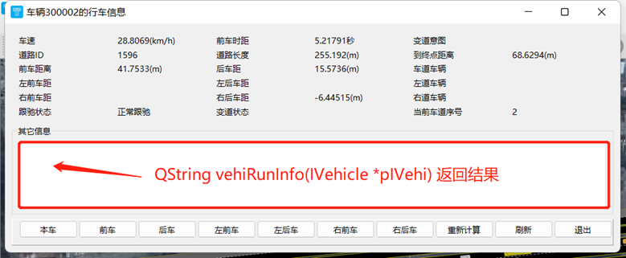

# 接口详情

## 1. 配置文件 config.json 及插件方法调用频次

### 1.1. 配置文件config.json属性详解

在TESSNG.exe相同路径下有一配置文件config.json，文本文件配置了一些重要信息，说明如下：

```
{
	"__netfilepath":"xxx.tess",		
	"__simuafterload":false,
	"__timebycpu":false,
	"__writesimuresult":true,
	"__custsimubysteps":false
}

```

"__netfilepath"：指定TESSNG启动后加载的路网文件的全路径名；

"__simuafterload"：指定TESSNG加载路网文件（指定的路网文件或临时空白路网文件）后是否启动仿真；

"__timebycpu"：指定每个仿真周期时间计算依据，是cpu时钟确定的时长（现实时长），还是由仿真精度确定的时长。在线仿真且算力吃紧时可以尝试设置此属性为true；

"__writesimuresult":是否输出仿真结果，默认为true，如果设为false，仿真结束后不会将仿真结果写文件，而且在仿真过程中当车辆驰出路网一段时间后会将车辆回收到可用队列，减少内存占用。

"__custsimubysteps"：设置TESSNG对插件方法调用频次的依据，设为false表示每个计算周期调用一次，即不依据插件端设置的调用频次；设为true时TESSNG依据插件设置的调用频次对插件实现的CustomerSimulator方法进行调用。

C++二次开发环境下，绝大多数情况下"__custsimubysteps"设为false不会影响计算效率。

### 1.2. 插件方法调用频次控制

TESSNG调用插件方法的频次是指对插件实现的PyCustomerSimulator接口方法调用频次。

当"__custsimubysteps"设置为True时，**默认调用频次比较低，很多低到毫无意义，只为减少调用次数，不至于影响仿真运行效率**。如果某方法被实现，需要对该方法调用频次进行调整。可参见范例。

假设仿真精度是steps，即每秒计算steps次，各方法默认调用频次如下：

1）、车辆相关方法调用频次

计算下一位置前处理方法beforeNextPoint被调用频次：每steps * 300个仿真周期调用一次，即5分钟调用一次；

具体车辆一个步长计算完成后的处理方法afterStep被调用频次：每steps * 300个仿真周期调用一次，即5分钟调用一次；

确定是否停止车辆运行并移出路网方法isStopDriving调用频次：每steps * 300个仿真周期调用一次，即5分钟调用一次；

2）、驾驶行为相关方法调用频次

TESSNG调用插件方法的频次是指对插件实现的CustomerSimulator接口方法调用频次。

可以在CustomerSimulator::initVehicle(IVehicle *pIVehicle)方法里通过参数IVehicle设置TESSNG对不同方法调用频次。

当"__custsimubysteps"设置为true时，默认调用频次比较低，需要进行适当调整。

假设仿真精度是steps，即每秒计算steps次，默认设置如下：

1）、车辆相关方法调用频次

\#是否允许对车辆重绘方法的调用

pIVehicle ->setIsPermitForVehicleDraw(false)

计算下一位置前处理方法beforeNextPoint被调用频次：每steps * 300个仿真周期调用一次，即5分钟调用一次。

计算下一位置方法nextPoint被调用频次：每steps * 300个仿真周期调用一次，即5分钟调用一次。

具体车辆一个步长计算完成后的处理方法afterStep被调用频次：每steps * 300个仿真周期调用一次，即5分钟调用一次。

确定是否停止车辆运行并移出路网方法isStopDriving调用频次：每steps * 300个仿真周期调用一次，即5分钟调用一次。

2）、驾驶行为相关方法调用频次

重新设置期望速度方法reCalcdesirSpeed被调用频次：每steps * 300个仿真周期调用一次，即5分钟调用一次。

计算最大限速方法calcMaxLimitedSpeed被调用频次：每steps * 300个仿真周期调用一次，即5分钟调用一次。

计算限制车道方法calcLimitedLaneNumber被调用频次：每steps个仿真周期调用一次，即每秒调用一次。

计算车道限速方法calcSpeedLimitByLane被调用频次：每steps个仿真周期调用一次，即每秒调用一次。

计算到限速区距离方法isCalcDistToReduceArea被调用频次：每steps个仿真周期调用一次，即每秒调用一次。

计算安全变道方法calcChangeLaneSafeDist被调用频次：每steps个仿真周期调用一次，即每秒调用一次。

重新计算是否可以左强制变道方法reCalcToLeftLane被调用频次：每steps个仿真周期调用一次，即每秒调用一次。

重新计算是否可以右强制变道方法reCalcToRightLane被调用频次：每steps个仿真周期调用一次，即每秒调用一次。

重新计算是否可以左自由变道方法reCalcToLeftFreely被调用频次：每steps个仿真周期调用一次，即每秒调用一次。

重新计算是否可以右自由变道方法reCalcToRightFreely被调用频次：每steps个仿真周期调用一次，即每秒调用一次。

计算跟驰类型后处理方法afterCalcTracingType被调用频次：每steps * 300个仿真周期调用一次，即5分钟调用一次。

连接段上汇入到车道前处理方法beforeMergingToLane被调用频次：每steps * 300个仿真周期调用一次，即5分钟调用一次。

重新计算跟驰状态参数方法reSetFollowingType被调用频次：每steps * 300个仿真周期调用一次，即5分钟调用一次。

计算加速度方法calcAcce被调用频次：每steps * 300个仿真周期调用一次，即5分钟调用一次。

重新计算加速度方法reSetAcce被调用频次：每steps * 300个仿真周期调用一次，即5分钟调用一次

重置车速方法reSetSpeed被调用频次：每steps * 300个仿真周期调用一次，即5分钟调用一次

重新计算角度方法reCalcAngle被调用频次：每steps * 300个仿真周期调用一次，即5分钟调用一次

计算后续道路前处理方法beforeNextRoad被调用频次：每steps * 300个仿真周期调用一次，即5分钟调用一次。


## 2. 路网基本元素

### 2.1 IRoadNet

路网基本信息接口，设计此接口的目的是为了TESS NG在导入外源路网时能够保存这些路网的属性，如路网中心点坐标、路网大地坐标等。

接口文件：IRoadNet.h

接口方法：

Ø **long id()**

路网ID

Ø **QString netName()**

路网名称

Ø **QString url()**

源数据路径，可以是本地文件，可以是网络地址

Ø **QString type()**

来源分类："TESSNG"表示TESSNG自建；"OpenDrive"表示由OpenDrive数据导入；"GeoJson"表示由geojson数据导入

Ø **QString bkgUrl()**

背景路径

Ø **QJsonObject otherAttrs()**

Ø 其它属性json数据**QString explain()**

获取路网说明

Ø **QPointF centerPoint()**

获取路网中心点位置

### 2.2 ISection

路段与连接段的父类接口

接口文件：ISection.h

接口方法：

Ø **int gtype()**

类型，GLinkType 或 GConnectorType。在文件Plugin/_netitemtype.h中定义了一批常量，每一个数值代表路网上一种元素类型。如：GLinkType代表路段、GConnectorType代表连接段。

Ø **bool isLink()**

是否是路段

Ø **long id()**

获取ID，如果是Link，id是Link的ID，如果是连接段，id是连接段ID

Ø **long sectionId()**

获取ID，如果是Link，id是Link的ID，如果是连接段，id是连接段ID+10000000，从而区分路段与连接段

Ø **QString name()**

获取Section名称，路段名或连接段名

Ø **void setName(QString name)**

设置Section名称

Ø **qreal v3z()**

获取Section高程

Ø **qreal length()**

获取Section长度，默认单位：像素

Ø **QList<ILaneObject\*> laneObjects()**

车道与“车道连接”的父类接口列表

举例：

```c++
if (pConn) {
			//连接段车道连接列表
			QList<ILaneObject*> lConnLaneObjs;
			lConnLaneObjs = pConn->laneObjects();
			for (ILaneObject*& pLaneObj : lConnLaneObjs) {
				qDebug() << "上游车道ID" << pLaneObj->fromLaneObject()->id() << "下游车道ID" << pLaneObj->toLaneObject()->id() << endl;
			}
		}
```

Ø **ISection\* fromSection(long id)**

根据ID获取上游Section。如果当前是路段, id 为 0 返回空指针，否则返回上游指定ID的连接段；如果当前是连接段，id 为 0 返回上游路段，否则返回空指针。

举例：

```c++
//根据id获取路段5上游id为2的连接段
ISection* pSectionLink = gpTessInterface->netInterface()->findLink(5);
	ISection* pSectionConnector = pSectionLink ->fromSection(2);
	if (pSectionConnector) {
		if (pSectionConnector ->gtype() == NetItemType::GConnectorType) {
			qDebug() << "路段5上游id为2的section为：" << pSectionConnector ->id() << endl;
		}
	}
```

Ø **ISection\* toSection(long id)**

根据ID获取下游 Sction。如果当前是路段, id 为 0 返回空指针，否则返回下游指定ID的连接段；如果当前是连接段，id 为 0 返回下游路段，否则返回空指针。

Ø **void setOtherAttr(QJsonObject otherAttr)**

设置路段或连接段其它属性

Ø **ILink\* castToLink()**

转换成ILink，如果当前为连接段则返回空指针

举例：

```c++
QList<ISection*> lLinksAndConnector = createExampleLinkAndConnector(QStringLiteral("信控编辑"), -50);
	ILink* pLink1 = lLinksAndConnector.front()->castToLink();
```

Ø **IConnector\* castToConnector()**

转换成IConnector，如果当前为路段则返回空指针

举例：

```c++
IConnector* pConn = lLinksAndConnector.back()->castToConnector();
```

Ø **QPolygonF polygon()**

获取Section的多边型轮廓顶点构成的多边形

Ø **int workerKey()**

Worker节点标识，在分布式环境可用

Ø **void setWorkerKey(int key)**

设置Worker节点，在分布式环境可用

Ø **int fromWorkerKey()**

上游Worker节点标识，在分布式环境可用

Ø **void setFromWorkerKey(int key)**

设置上游Worker节点标识，在分布式环境可用

### 2.3 ILaneObject

车道与车道连接的父类接口

接口文件：ILaneObject.h

接口方法：

Ø **int gtype()**

类型，GLaneType或GLaneConnectorType

Ø **bool isLane()**

是否车道

Ø **long id()**

获取ID，如果是Lane，id是Lane的ID， 如果是车道连接，id是“车道连接”ID

Ø **qreal length()**

获取车道或“车道连接”长度，默认单位：像素

Ø **ISection\* section()**

获取所属的ISection

Ø **ILaneObject\* fromLaneObject(long id)**

根据ID获取上游 LaneObject。如果当前是车道, id 为 0 返回空指针，否则返回上游指定ID的“车道连接”；如果当前是连接段，id 为 0 返回上游车道，否则返回空指针。

Ø **ILaneObject\* toLaneObject(long id)**

根据ID获取下游 LaneObject。如果当前是车道, id 为 0 返回空指针，否则返回下游指定ID的“车道连接”；如果当前是连接段，id 为 0 返回下游车道，否则返回空指针。

Ø **QList<QPointF> centerBreakPoints()**

车道或“车道连接”中心线断点集

Ø **QList<QPointF> leftBreakPoints()**

车道或“车道连接”左侧线断点集

Ø **QList<QPointF> rightBreakPoints()**

车道或“车道连接”右侧线断点集

Ø **QList<QVector3D> centerBreakPoint3Ds()**

车道或“车道连接”中心线断点(三维)集

Ø **QList<QVector3D> leftBreakPoint3Ds()**

车道或“车道连接”左侧线断点(三维)集

Ø **QList<QVector3D> rightBreakPoint3Ds()**

车道或“车道连接”右侧线断点(三维)集

Ø **QList<QVector3D> leftBreak3DsPartly(QPointF fromPoint, QPointF toPoint)**

车道或“车道连接”左侧部分断点(三维)集

参数：

[in] fromPoint：中心线上某一点作为起点

[in] toPoint：中心线上某一点作为终点

Ø **QList<QVector3D> rightBreak3DsPartly(QPointF fromPoint, QPointF toPoint)**

车道或“车道连接”右侧部分断点(三维)集

参数：

[in] fromPoint：中心线上某一点作为起点

[in] toPoint：中心线上某一点作为终点

Ø **qreal distToStartPoint(const QPointF p)**

中心线上一点到起点距离

Ø **qreal distToStartPointWithSegmIndex(const QPointF p, int segmIndex, bool bOnCentLine)**

中心线上一点到起点距离，附加条件是该点所在车道上的分段序号

参数：

[in] p：当前中心线上点或附近点的坐标

[in] segmIndex：参数p点所在车道上的分段序号

[in] bOnCentLine：参数p点是否在中心线上

Ø **bool getPointAndIndexByDist(qreal dist, QPointF& outPoint, int& outIndex)**

求中心线起点向前延伸dist距离后所在点及分段序号, 如果目标点不在中心线上返回false，否则返回true

参数：

[in] dist：中心线起点向前延伸的距离

[out] outPoint：中心线起点向前延伸dist距离后所在点

[out] outIndex：中心线起点向前延伸dist距离后所在分段序号

举例：

```c++
//路段5最左侧车道向前延伸140米后所在点及分段序号
ILink* pLink = gpTessInterface->netInterface()->findLink(5);
	ILaneObject* pLaneObjLeft = pLink ->laneObjects().back();
	QPointF outPoint;
	int outIndex;
	qreal dist = m2p(140);
	if (pLaneObjLeft ->getPointAndIndexByDist(dist, outPoint, outIndex)) {
qDebug() << "路段5最左侧车道向前延伸140米后所在点坐标为：(" << outPoint.x() <<","<< outPoint.y() <<")，分段序号为：" << outIndex << endl;
	}
```

Ø **bool getPointByDist(qreal dist, QPointF& outPoint)**

求中心线起点向前延伸dist距离后所在点, 如果目标点不在中心线上返回false，否则返回true

Ø **void setOtherAttr(QJsonObject attr)**

设置车道或“车道连接”其它属性

Ø **ILane\* castToLane()**

将ILaneObject转换为ILane，如果当前ILaneObject是“车道连接”则返回空指针

Ø **ILaneConnector\* castToLaneConnector()**

将ILaneObject转换为ILaneConnector，如果当前ILaneObject是车道则返回空指针

### 2.4 ILink

路段接口

接口文件：ilink.h

接口方法：

Ø **int gtype()**

类型，返回GLinkType

Ø **long id()**

获取路段ID

Ø **qreal length()**

获取路段长度，默认单位：像素

Ø **qreal width()**

获取路段宽度，默认单位：像素

Ø **qreal z()**

获取路段高程

Ø **qreal v3z()**

获取路段高程，过载ISection的方法

Ø **QString name()**

获取路段名称

Ø **void setName(QString name)**

设置路段名称

Ø **QString linkType()**

获取路段类型，如：城市主干道、城市次干道、人行道等

Ø **void setType(QString type)**

设置路段类型，路段类型有10种，分别为：高速路、城市快速路、匝道、城市主要干道、次要干道、地方街道、非机动车道、人行道、公交专用道和机非共享

Ø **int laneCount()**

获取车道数

Ø **double limitSpeed()**

获取路段最高限速，单位：千米/小时

Ø **void setLimitSpeed(qreal speed)**

设置最高限速

参数：

[in] speed：最高限速，单位：千米/小时

  举例：

```c++
//以L5路段为例
	if (planNumber == 3) {
		ILink* pLink5 = gpTessInterface->netInterface()->findLink(5);
		qreal minSpeedOfLink5 = pLink5->minSpeed();
		if (limitSpeed >= minSpeedOfLink5) {
			pLink5->setLimitSpeed(static_cast<qreal>(limitSpeed));
		}
	}

```

Ø **qreal minSpeed()**

最低限速，单位：千米/小时

举例：

```
qreal minSpeedOfLink5 = pLink5->minSpeed();
```

Ø **QList<ILane\*> lanes()**

车道接口列表

Ø **QList<ILaneObject\*> laneObjects()**

车道及“车道连接”的接口列表

Ø **QList<QPointF> centerBreakPoints()**

路段中心线断点集

Ø **QList<QPointF> leftBreakPoints()**

路段左侧线断点集

Ø **QList<QPointF> rightBreakPoints()**

路段右侧线断点集

Ø **QList<QVector3D> centerBreakPoint3Ds()**

路段中心线断点(三维)集

Ø **QList<QVector3D> leftBreakPoint3Ds()**

路段左侧线断点(三维)集

Ø **QList<QVector3D> rightBreakPoint3Ds()**

路段右侧线断点(三维)集

Ø **QList<IConnector\*> fromConnectors()**

上游连接段列表

Ø **QList<IConnector\*> toConnectors()**

下游连接段列表

Ø **ISection\* fromSection(long id)**

根据ID获取上游Section。如果当前是路段, id 为 0 返回空指针，否则返回上游指定ID的连接段；如果当前是连接段，id 为 0 返回上游路段，否则返回空指针。

Ø **ISection\* toSection(long id)**

根据ID获取下游 Sction。如果当前是路段, id 为 0 返回空指针，否则返回下游指定ID的连接段；如果当前是连接段，id 为 0 返回下游路段，否则返回空指针。

Ø **void setOtherAttr(QJsonObject otherAttr)**

设置路段其它属性

Ø **void setLaneTypes(QList<QString> lType)**

设置车道属性，属性类型包括："机动车道"、"机非共享"、"非机动车道"、"公交专用道"

Ø **void setLaneOtherAtrrs(QList<QJsonObject> lAttrs)**

设置车道其它属性

Ø **qreal distToStartPoint(const QPointF p)**

中心线上一点到起点距离

Ø **bool getPointAndIndexByDist(qreal dist, QPointF& outPoint, int& outIndex)**

求中心线起点向前延伸dist距离后所在点及分段序号, 如果目标点不在中心线上返回false，否则返回true

参数：

[in] dist：中心线起点向前延伸的距离

[out] outPoint：中心线起点向前延伸dist距离后所在点

[out] outIndex：中心线起点向前延伸dist距离后所在分段序号

Ø **bool getPointByDist(qreal dist, QPointF& outPoint)**

求中心线起点向前延伸dist距离后所在点, 如果目标点不在中心线上返回false，否则返回true

Ø **QPolygonF polygon()**

获取路段的多边型轮廓顶点

### 2.5 ILane

车道接口

接口文件：ILane.h

接口方法：

Ø **int gtype()**

类型，车道类型为GLaneType

Ø **long id()**

获取车道ID

Ø **ILink \*link()**

获取车道所在路段

Ø **ISection\* section()**

获取车道所属Section

Ø **qreal length()**

获取车道长度，默认单位：像素

Ø **qreal width()**

获取车道宽度，默认单位：像素

Ø **int number()**

获取车道序号，从0开始（自外侧往内侧）

Ø **QString actionType()**

获取车道的行为类型

Ø **ILaneObject\* fromLaneObject(long id)**

根据ID获取上游 LaneObject。id 为 0 返回空指针，否则返回上游指定ID的“车道连接

Ø **ILaneObject\* toLaneObject(long id)**

根据ID获取下游 LaneObject。id 为 0 返回空指针，否则返回下游指定ID的“车道连接”

Ø **QList<QPointF> centerBreakPoints()**

获取车道中心点断点集，断点坐标用像素表示

Ø **QList<QPointF> leftBreakPoints()**

车道左侧线断点集

Ø **QList<QPointF> rightBreakPoints()**

车道右侧线断点集

Ø **QList<QVector3D> centerBreakPoint3Ds()**

车道中心线断点(三维)集

Ø **QList<QVector3D> leftBreakPoint3Ds()**

车道左侧线断点(三维)集

Ø **QList<QVector3D> rightBreakPoint3Ds()**

车道右侧线断点(三维)集

Ø **QList<QVector3D> leftBreak3DsPartly(QPointF fromPoint, QPointF toPoint)**

车道左侧部分断点(三维)集

参数：

[in] fromPoint：中心线上某一点作为起点

[in] toPoint：中心线上某一点作为终点

Ø **QList<QVector3D> rightBreak3DsPartly(QPointF fromPoint, QPointF toPoint)**

车道右侧部分断点(三维)集

参数：

[in] fromPoint：中心线上某一点作为起点

[in] toPoint：中心线上某一点作为终点

Ø **qreal distToStartPoint(const QPointF p)**

中心线上一点到起点距离

Ø **qreal distToStartPointWithSegmIndex(const QPointF p, int segmIndex = 0, bool bOnCentLine = true)**

中心线上一点到起点距离，附加条件是该点所在车道上的分段序号

参数：

[in] p：当前中心线上该点坐标

[in] segmIndex：该点所在车道上的分段序号

[in] bOnCentLine：是否在中心线上

Ø **bool getPointAndIndexByDist(qreal dist, QPointF& outPoint, int& outIndex)**

求中心线起点向前延伸dist距离后所在点及分段序号, 如果目标点不在中心线上返回false，否则返回true

参数：

[in] dist：中心线起点向前延伸的距离

[out] outPoint：中心线起点向前延伸dist距离后所在点

[out] outIndex：中心线起点向前延伸dist距离后所在分段序号

Ø **bool getPointByDist(qreal dist, QPointF& outPoint)**

求中心线起点向前延伸dist距离后所在点, 如果目标点不在中心线上返回false，否则返回true

Ø **void setOtherAttr(QJsonObject attr)**

设置车道其它属性

Ø **void setLaneType(QString type)**

设置车道类型

参数：

[in] type：车道类型，选下列几种类型其中一种："机动车道"、"机非共享"、"非机动车道"、"公交专用道"

Ø **QPolygonF polygon()**

获取车道的多边型轮廓顶点

### 2.6 IConnector

连接段接口

接口文件：IConnector.h

接口方法：

Ø **int gtype()**

类型，连接段类型为GConnectorType

Ø **long id()**

获取连接段ID

Ø **qreal length()**

获取连接段长度

Ø **qreal z()**

获取连接段高程

Ø **qreal v3z()**

获取连接段高程，继承自ISection的方法

Ø **QString name()**

获取连接段名称

Ø **void setName(QString name)**

设置连接段名称

Ø **Link\* fromLink()**

获取起始路段

Ø **Link\* toLink()**

获取目标路段

Ø **ISection\* fromSection(long id)**

根据ID获取上游Section。如果当前是路段, id 为 0 返回空指针，否则返回上游指定ID的连接段；如果当前是连接段，id 为 0 返回上游路段，否则返回空指针。

Ø **ISection\* toSection(long id)**

根据ID获取下游 Sction。如果当前是路段, id 为 0 返回空指针，否则返回下游指定ID的连接段；如果当前是连接段，id 为 0 返回下游路段，否则返回空指针。

Ø **qreal limitSpeed()**

获取最高限速，以起始路段的最高限速作为连接段的最高限速

Ø **qreal minSpeed()**

获取最低限速，以起始路段的最低限速作为连接段的最低限速

Ø **QList<ILaneConnector\*> laneConnectors()**

获取车道连接列表

Ø **QList<ILaneObject\*> laneObjects()**

车道及“车道连接”的接口列表

举例：

```c++
if (pConn) {
			//连接段车道连接列表
			QList<ILaneObject*> lConnLaneObjs;
			lConnLaneObjs = pConn->laneObjects();
			for (ILaneObject*& pLaneObj : lConnLaneObjs) {
				qDebug() << "上游车道ID" << pLaneObj->fromLaneObject()->id() << "下游车道ID" << pLaneObj->toLaneObject()->id() << endl;
			}
		}
```

Ø **void setLaneConnectorOtherAtrrs(QList<QJsonObject> lAttrs)**

设置包含的“车道连接”其它属性

Ø **void setOtherAttr(QJsonObject otherAttr)**

设置连接段其它属性

Ø **QPolygonF polygon()**

获取连接段的多边型轮廓顶点

### 2.7 ILaneConnector

“车道连接”接口

接口文件：ILaneConnector.h

接口方法：

Ø **int gtype()**

类型，GLaneType或GLaneConnectorType，车道连接段为GLaneConnectorType

Ø **long id()**

获取车道连接ID

Ø **IConnector\* connector()**

获取车道连接所在连接段

Ø **ISection\* section()**

获取车道所属Section

Ø **ILane \*fromLane()**

上游车道

Ø **ILane \*toLane()**

下游车道

Ø **ILaneObject\* fromLaneObject(long id)**

根据ID获取上游 LaneObject。id 为 0 返回空指针，否则返回上游指定ID的“车道连接

举例：

```c++
if (pConn) {
			//连接段车道连接列表
			QList<ILaneObject*> lConnLaneObjs;
			lConnLaneObjs = pConn->laneObjects();
			for (ILaneObject*& pLaneObj : lConnLaneObjs) {
				qDebug() << "上游车道ID" << pLaneObj->fromLaneObject()->id() << "下游车道ID" << pLaneObj->toLaneObject()->id() << endl;
			}
		}
```

Ø **ILaneObject\* toLaneObject(long id)**

根据ID获取下游 LaneObject。id 为 0 返回空指针，否则返回下游指定ID的“车道连接”

举例：

```c++
for (ILaneObject*& pLaneObj : lConnLaneObjs) {
				qDebug() << "上游车道ID" << pLaneObj->fromLaneObject()->id() << "下游车道ID" << pLaneObj->toLaneObject()->id() << endl;
			}
```

Ø **qreal length()**

“车道连接”长度

Ø **QList<QPointF> centerBreakPoints()**

获取“车道连接”中心线断点集，断点坐标用像素表示

Ø **QList<QPointF> leftBreakPoints()**

“车道连接”左侧线断点集

Ø **QList<QPointF> rightBreakPoints()**

“车道连接”右侧线断点集

Ø **QList<QVector3D> centerBreakPoint3Ds()**

“车道连接”中心线断点(三维)集

Ø **QList<QVector3D> leftBreakPoint3Ds()**

“车道连接”左侧线断点(三维)集

Ø **QList<QVector3D> rightBreakPoint3Ds()**

“车道连接”右侧线断点(三维)集

Ø **QList<QVector3D> leftBreak3DsPartly(QPointF fromPoint, QPointF toPoint)**

“车道连接”左侧部分断点(三维)集

Ø **QList<QVector3D> rightBreak3DsPartly(QPointF fromPoint, QPointF toPoint)**

“车道连接”右侧部分断点(三维)集

Ø **qreal distToStartPoint(const QPointF p)**

中心线上一点到起点距离

Ø **qreal distToStartPointWithSegmIndex(const QPointF p, int segmIndex = 0, bool bOnCentLine = true)**

中心线上一点到起点距离，附加条件是该点所在车道上的分段序号

参数：

[in] p：当前中心线上该点坐标

[in] segmIndex：该点所在车道上的分段序号

[in] bOnCentLine：是否在中心线上

Ø **bool getPointAndIndexByDist(qreal dist, QPointF& outPoint, int& outIndex)**

求中心线起始point向前延伸dist距离后所在点及分段序号, 如果目标点不在中心线上返回false，否则返回true

参数：

[in] dist：中心线起点向前延伸的距离

[out] outPoint：中心线起点向前延伸dist距离后所在点

[out] outIndex：中心线起点向前延伸dist距离后所在分段序号

Ø **bool getPointByDist(qreal dist, QPointF& outPoint)**

求中心线起始point向前延伸dist距离后所在点, 如果目标点不在中心线上返回false，否则返回true

Ø **void setOtherAttr(QJsonObject attr)**

设置车道连接其它属性

### 2.8 IConnectorArea

面域接口

接口文件：IConnectorArea.h

接口方法：

Ø **long id()**

面域ID

Ø **QList<IConnector\*> allConnector()**

面域相关所有连接段

Ø **QPointF centerPoint()**

面域中心点

Ø **int workerKey()**

获取Worker 标识符，分布式环境可用

Ø **void setWorkerKey(int key)**

设置 Worker 标识符，分布式环境可用

### 2.9 IDispatchPoint

发车点接口

接口文件：IDispatchPoint.h

接口方法：

Ø **long id()**

获取发车点ID

Ø **QString name()**

获取发车名称

Ø **ILink \*link()**

获取发车点所在路段

Ø **long addDispatchInterval(long vehiCompId, int interval, int vehiCount)**

为发车点增加发点间隔

参数：

vehicCompId：车型组成ID

interval：时间段，单位：秒

vehiCount：发车数

返回值：

返回发车间隔ID

举例：

```c++
if (pLink1) {
		//创建发车点
		IDispatchPoint* pDp = gpTessInterface->netInterface()->createDispatchPoint(pLink1);
		if (pDp) {
			pDp->addDispatchInterval(1, 200, 400);//200秒400辆车
		}
	}

```

Ø **void setDynaModified(bool bModified)**

设置是否被动态修改，默认情况下发车信息被动态修改后，整个文件不能保存，以免破坏原有发车设置

Ø **QPolygonF polygon()**

获取发车点多边型轮廓的顶点

### 2.10 IDecisionPoint

决策点接口 

接口文件：IDecisionPoint.h

接口方法：

Ø **long id()**

决策点ID

Ø **QString name()**

决策点名称

Ø **ILink \*link()**

决策点所在路段

Ø **qreal distance()**

距路段起点距离，默认单位：像素

Ø **QList<IRouting\*> routings()**

相关决策路径

Ø **void setDynaModified(bool bModified)**

设置是否被动态修改，默认情况下发车信息被动态修改后，整个文件不能保存，以免破坏原有发车设置

参数：

[in] bModified：是否被动态修改，true为被动态修改，false为未被动态修改

Ø **QPolygonF polygon()**

决策点多边型轮廓的顶点

### 2.11 IRouting

路径接口 

接口文件：IRouting.h

接口方法：

Ø **long id()**

路径ID

Ø **qreal calcuLength()**

计算路径长度

Ø **QList<ILink\*> getLinks()**

获取路段序列

Ø **long deciPointId()**

所属决策点ID

Ø **bool contain(ISection\* pRoad)**

根据所给道路判断是否在当前路径上

Ø **ISection\* nextRoad(ISection\* pRoad)**

根据所给道路求下一条道路

参数：

[in] pRoad：路段或连接段

### 2.12 ISignalLamp

信号灯接口

接口文件：isignallamp.h

接口方法：

Ø **long id()**

获取信号灯ID

Ø **void setName(QString name)**

设置信号灯名称

Ø **void setLampColor(QString colorStr)**

设置信号灯颜色

参数：

colorStr：字符串表达的颜色，有四种可选，分别是"红"、"绿"、"黄"、"灰"，，或者是"R"、"G"、"Y"、"grey"。 

Ø **ISignalGroup \*signalGroup()**

获取信号灯组

Ø **ISignalPhase\* signalPhase()**

获取相位

Ø **void setDistToStart(qreal dist)**

设置信号灯距车道起点（或“车道连接”起点）距离，默认单位：像素

Ø **QPolygonF polygon()**

获取信号灯多边型轮廓的顶点

### 2.13 ISignalPhase

信号灯相位

接口文件：ISignalPhase.h

接口方法：

Ø **long id()**

相位ID

Ø **int number()**

相位序号

Ø **QString phaseName()**

相位名称

Ø **ISignalGroup\* signalGroup()**

相位所在信号灯组

Ø **QList<ISignalLamp\*> signalLamps()**

相关信号灯列表

Ø **QList<Online::ColorInterval> listColor()**

相位灯色列表

Ø **void setColorList(QList<Online::ColorInterval> lColor)**

设置信号灯列表

参数：

[in] lColor：灯色时长信息，包含信号灯颜色和信号灯时长

举例：

```c++
// 以L12路段相位直行信号灯相位为例（ID为7），由红90绿32黄3红25改为红10绿110黄3红28
	if (planNumber == 2) {
		ISignalPhase* pSignalPhase7OfL12 = gpTessInterface->netInterface()->findSignalPhase(7);
		Online::ColorInterval redIntervalFront("红", 10), greenInterval("绿", 110), yellowInterval("黄", 3), redIntervalBack("红", 28);
		pSignalPhase7OfL12->setColorList(QList<Online::ColorInterval>() << redIntervalFront << greenInterval << yellowInterval << redIntervalBack);
	}
```

Ø **void setNumber(int number)**

设置相位序号

Ø **void setPhaseName(QString name)**

设置相位名称

### 2.14 ISignalGroup

信号灯组

接口文件：ISignalGroup.h

Ø **long id()**

灯组ID

Ø **QString groupName ()**

灯组名

Ø **int periodTime()**

信号周期 秒

Ø **long fromTime()**

起始时间，单位：秒

Ø **long toTime()**

结束时间 单位：秒

Ø **QList<ISignalPhase\*> phases()**

相位列表

Ø **void setName(QString name)**

设置信号灯组名称

Ø **void setPeriodTime(int period)**

设置信号周期

参数：

[in] period：信号周期，单位：秒

Ø **void setFromTime(long time)**

设置起始时间，单位：秒

Ø **void setToTime(long time)**

设置结束时间，单位：秒

### 2.15 IBusLine

公交线路接口

接口文件：IBusLine.h

接口方法：

Ø **long id()**

获取公交线路ID

Ø **QString name()**

线路名称

Ø **double length()**

长度,单位：像素

Ø **int dispatchFreq()**

发车间隔(秒)

Ø **int dispatchStartTime()**

发车开始时间(秒)

Ø **int dispatchEndTime()**

发车结束时间(秒)

Ø **qreal desirSpeed()**

期望速度(km/h)

Ø **int passCountAtStartTime()**

起始载客人数

Ø **QList<ILink\*> links()**

公交线路经过的路段

Ø **QList<IBusStation\*> stations()**

线路所有站点

Ø **QList<IBusStationLine\*> stationLines()**

公交站点线路，当前线路相关站点的上下客等参数

Ø **void setName(QString name)**

设置线路名称

Ø **void setDispatchFreq(int freq)**

设置发车间隔，单位：秒

Ø **void setDispatchStartTime(int startTime)**

设置开始发车时间

Ø **void setDispatchEndTime(int endTime)**

设置结束发车时间

Ø **void setDesirSpeed(qreal desirSpeed)**

设置线路的期望速度

举例：

```c++
//创建公交线路
IBusLine* pBusLine = gpTessInterface->netInterface()->createBusLine(QList<ILink*>() << pLink10 << pLink11);
if (pBusLine) {
			pBusLine->setDesirSpeed(m2p(60));
}

```

Ø **void setPassCountAtStartTime(int count)**

设置起始载客人数

### 2.16 IBusStation

公交站点接口

接口文件：IBusStation.h

接口方法：

Ø **long id()**

获取公交站点ID

Ø **QString name()**

线路名称

Ø **int laneNumber()**

公交站点所在车道序号

Ø **qreal x()**

位置X

Ø **qreal y()**

位置Y

Ø **qreal length()**

长度

Ø **int stationType()**

站点类型 1：路边式、2：港湾式

Ø **ILink\* link()**

公交站点所在路段

Ø **ILane\* lane()**

公交站点所在车道

Ø **qreal distance()**

公交站点的起始位置距路段起点距离，默认单位：像素

Ø **void setName(QString name)**

设置站点名称

Ø **void setDistToStart(qreal dist)**

设置站点起始点距车道起点距离，默认单位：像素

参数：

[in] dist：距车道起点距离

Ø **void setLength(qreal length)**

设置长度，默认单位：像素

Ø **void setType(int type)**

设置站点类型

参数：

[in] type：站点类型，1 路侧式、2 港湾式

Ø **QPolygonF polygon()**

公交站点多边型轮廓的顶点

### 2.17 IBusStationLine

公交站点-线路接口，通过此接口可以获取指定线路某站点运行参数，如靠站时间、下客百分比等，还可以设置部分参数。

接口文件：IBusStationLine.h

接口方法：

Ø **long id()**

获取公交“站点-线路”ID

Ø **long stationId()**

公交站点ID

Ø **long lineId()**

公交线路ID

Ø **int busParkingTime()**

车辆停靠时间(秒)

Ø **qreal getOutPercent()**

下客百分比

Ø **qreal getOnTimePerPerson()**

平均每位乘客上车时间

Ø **qreal getOutTimePerPerson()**

平均每位乘客下车时间

Ø **void setBusParkingTime(int time)**

设置车辆停靠时间(秒)

举例：

```c++
QList<IBusStationLine*> lStationLine = pBusLine->stationLines();
		if (!lStationLine.isEmpty())
		{
			IBusStationLine* pStationLine = lStationLine.first();
			// 设置车辆停靠时间(秒)
			pStationLine->setBusParkingTime(20);
		}
}
```

Ø **void setGetOutPercent(qreal percent)**

设置下客百分比

Ø **void setGetOnTimePerPerson(qreal time)**

设置平均每位乘客上车时间

Ø **void setGetOutTimePerPerson(qreal time)**

设置平均每位乘客下车时间

### 2.18  IVehicleDrivInfoCollector

数据采集器接口

接口文件：IVehicleDrivInfoCollector.h

接口方法：

Ø **long id()**

获取采集器ID

Ø **QString collName()**

获取采集器名称

Ø **bool onLink()**

是否在路段上，如果true则connector()返回nullptr

Ø **ILink\* link()**

采集器所在路段

Ø **IConnector\* connector()**

采集器所在连接段

Ø **ILane\* lane()**

如果采集器在路段上则lane()返回所在车道，laneConnector()返回nullptr

Ø **ILaneConnector\* laneConnector()**

如果采集器在连接段上则laneConnector返回“车道连接”,lane()返回nullptr

Ø **qreal distToStart()**

采集器距离起点距离，默认单位：像素

Ø **QPointF point()**

采集器所在点

Ø **long fromTime()**

采集器工作起始时间，单位：秒

Ø **long toTime()**

采集器工作停止时间，单位：秒

Ø **long aggregateInterval()**

集计数据时间间隔，单位：秒

Ø **void setName(QString name)**

设置采集器名称

Ø **void setDistToStart(qreal dist)**

设置采集器距车道起点（或“车道连接”起点）距离

参数：

[in] dist：采集器距离车道起点（或“车道连接”起点）的距离，默认单位：像素

举例：

```c++
IVehicleDrivInfoCollector* pCollector = gpTessInterface->netInterface()->createVehiCollectorOnLink(pLeftLane, dist);
// 将采集器设置到距路段起点400米处
pCollector->setDistToStart(m2p(400));
```

Ø **void setFromTime(long time)**

设置工作起始时间(秒)

Ø **void setToTime(long time)**

设置工作结束时间(秒)

Ø **void setAggregateInterval(int interval)**

设置集计数据时间间隔(秒)

Ø **QPolygonF polygon()**

获取采集器的多边型轮廓顶点

### 2.19  IVehicleQueueCounter

排队计数器接口

接口文件：IVehicleQueueCounter.h

接口方法：

Ø **long id()**

获取计数器ID

Ø **QString counterName()**

获取计数器名称

Ø **bool onLink()**

是否在路段上，如果true则connector()返回nullptr

Ø **ILink\* link()**

计数器所在路段

Ø **IConnector\* connector()**

计数器所在连接段

Ø **ILane\* lane()**

如果计数器在路段上则lane()返回所在车道，laneConnector()返回nullptr

Ø **ILaneConnector\* laneConnector()**

如果计数器在连接段上则laneConnector返回“车道连接”,lane()返回nullptr

Ø **qreal distToStart()**

计数器距离起点距离，默认单位：像素

Ø **QPointF point()**

计数器所在点

举例：

```c++
//在路段9最左侧车道100米处创建排队计数器
IVehicleQueueCounter* pCounter = gpTessInterface->netInterface()->createVehiQueueCounterOnLink(pLeftLane, dist);
qDebug() << "计数器所在点坐标为：(" << pCounter->point().x() <<","<< pCounter->point().y()<<")" << endl;
```

Ø **long fromTime()**

计数器工作起始时间，单位：秒

Ø **long toTime()**

计数器工作停止时间，单位：秒

Ø **long aggregateInterval()**

计数集计数据时间间隔，单位：秒

Ø **void setName(QString name)**

设置计数器名称

Ø **void setDistToStart(qreal dist)**

设置计数器距车道起点（或“车道连接”起点）距离

参数：

[in] dist：计数器距离车道起点（或“车道连接”起点）的距离，默认单位：像素

Ø **void setFromTime(long time)**

设置工作起始时间(秒)

Ø **void setToTime(long time)**

设置工作结束时间(秒)

Ø **void setAggregateInterval(int interval)**

设置集计数据时间间隔(秒)

Ø **QPolygonF polygon()**

获取计数器的多边型轮廓顶点

### 2.20  IVehicleTravelDetector

行程时间检测器接口

接口文件：IVehicleTravelDetector.h

接口方法：

Ø **long id()**

获取检测器ID

Ø **QString detectorName()**

获取检测器名称

Ø **bool isStartDetector()**

是否检测器起始点

Ø **bool isOnLink_startDetector()**

检测器起点是否在路段上，如果否，则起点在连接段上

Ø **bool isOnLink_endDetector()**

检测器终点是否在路段上，如果否，则终点在连接段上

Ø **ILink\* link_startDetector()**

如果检测器起点在路段上则link_startDetector()返回起点所在路段，laneConnector_startDetector()返回nullptr

Ø **ILaneConnector\* laneConnector_startDetector()**

如果检测器起点在连接段上则laneConnector_startDetector()返回起点“车道连接”,link_startDetector()返回nullptr

Ø **ILink\* link_endDetector()**

如果检测器终点在路段上则link_endDetector()返回终点所在路段，laneConnector_endDetector()返回nullptr

Ø **ILaneConnector\* laneConnector_endDetector()**

如果检测器终点在连接段上则laneConnector_endDetector()返回终点“车道连接”,link_endDetector()返回nullptr

Ø **qreal distance_startDetector()**

检测器起点距离所在车道起点或“车道连接”起点距离，默认单位：像素

Ø **qreal distance_endDetector()**

检测器终点距离所在车道起点或“车道连接”起点距离，默认单位：像素

Ø **QPointF point_startDetector()**

检测器起点位置

Ø **QPointF point_endDetector()**

检测器终点位置

Ø **long fromTime()**

检测器工作起始时间，单位：秒

Ø **long toTime()**

检测器工作停止时间，单位：秒

Ø **long aggregateInterval()**

集计数据时间间隔，单位：秒

Ø **void setName(QString name)**

设置检测器名称

Ø **void setDistance_startDetector(qreal dist)**

设置检测器起点距车道起点（或“车道连接”起点）距离，默认单位：像素

Ø **void setDistance_endDetector(qreal dist)**

设置检测器终点距车道起点（或“车道连接”起点）距离，默认单位：像素

Ø **void setFromTime(long time)**

设置工作起始时间，单位：秒

举例：

```c++
QList<IVehicleTravelDetector*> lVehicleTravelDetector = gpTessInterface->netInterface()->createVehicleTravelDetector_link2link(link, link, m2p(50), m2p(550));
		if (!lVehicleTravelDetector.empty()) {
			for (IVehicleTravelDetector* detector : lVehicleTravelDetector) {
				detector->setFromTime(10);
				detector->setToTime(60);
			}
		}
```

Ø **void setToTime(long time)**

设置工作结束时间，单位：秒

Ø **void setAggregateInterval(int interval)**

设置集计数据时间间隔，单位：秒

Ø **QPolygonF polygon_startDetector()**

获取行程时间检测器起始点多边型轮廓的顶点

Ø **QPolygonF polygon_endDetector()**

获取行程时间检测器终止点多边型轮廓的顶点

### 2.21  IGuidArrow

导向箭头接口

接口文件：IGuidArrow.h

接口方法：

Ø **long id()**

获取导向箭头ID

Ø **ILane\* lane()**

获取导向箭头所在的车道

Ø **qreal length()**

获取导向箭头的长度，默认单位：像素

Ø **qreal distToTerminal()**

获取导向箭头到的终点距离，默认单位：像素

Ø **Online::GuideArrowType arrowType()**

获取导向箭头的类型，导向箭头的类型分为：直行、左转、右转、直行或左转、直行或右转、直行左转或右转、左转或右转、掉头、直行或掉头和左转或掉头

举例：

```c++
IGuidArrow* pGuideArrow = gpTessInterface->netInterface()->createGuidArrow(pRightLane, length, distToTerminal, arrowType);
	qDebug() << "导向箭头类型为：" << pGuideArrow->arrowType() << endl;
```

Ø **QPolygonF polygon()**

获取导向箭头的多边型轮廓的顶点

### 2.22 IAccidentZone

事故区接口

接口文件：IAccidentZone.h

接口方法：

Ø **long id()**

获取事故区ID

Ø **QString name()**

获取事故区名称

Ø **qreal location()**

获取事故区距所在路段起点的距离，默认单位：像素

Ø **qreal zoneLength()**

获取事故区长度，默认单位：像素

Ø **ISection\* section()**

获取事故区所在的路段或连接段

Ø **long roadId()**

获取事故区所在路段的ID

Ø **QString roadType()**

获取事故区所在的道路类型(路段或连接段)

举例：

```c++
// 获取事故区所在的道路类型
IAccidentZone* pAccidentZone = gpTessInterface->netInterface()->createAccidentZone(accidentZone);
qDebug() << pAccidentZone-> roadType() << endl;
```

Ø **QList<ILaneObject\*> laneObjects()**

获取事故区占用的车道列表

Ø **int level()**

事故等级，分4级，默认为未定等级(0级)持续时间未定，事故区不会自动移除，一般事故(1级)持续时间10分钟，普通事故(2)级持续时间1小时，重大事故(3级)持续时间3小时

Ø **long duration()**

事故持续时间，单位：秒。如果值为0，事故持续时间由事故等级决定，大于0则由此值决定

Ø **int needRescue()**

是否需要救援，如果为-1，由事故等级决定，重大事故需要求援，如为0不需救援，如果为1需要救援

Ø **long waitTimeBeforeRescue()**

救援车辆发车时间距事故产生的时间，默认单位：秒，默认60秒

Ø **int rescueTime()**

救援时间，默认60秒，即救援车辆停靠在事故区旁的时间，单位秒

### 2.23 IRoadWorkZone

施工区接口

接口文件：IRoadWorkZone.h

接口方法：

Ø **long id()**

获取施工区ID

Ø **QString name()**

获取施工区名称

Ø **qreal location()**

获取施工区距所在路段起点的距离，默认单位：像素

Ø **qreal zoneLength()**

获取施工区长度，默认单位：像素

Ø **qreal limitSpeed()**

施工区限速（最大车速:像素/秒）

Ø **long sectionId()**

获取施工区所在路段或连接段的ID

举例：

```c++
//获取路段9上施工区所在路段的ID
IRoadWorkZone* pWorkZone = gpTessInterface->netInterface()->createRoadWorkZone(workZone);
	qDebug() <<"施工区所在路段或连接段ID为：" << pWorkZone->sectionId() << endl;
```

Ø **QString sectionName()**

获取施工区所在路段或连接段的名称

Ø **QString sectionType()**

获取施工区所在道路的道路类型，link:路段, connector:连接段

Ø **QList<ILaneObject\*> laneObjects()**

获取施工区所占的车道列表

Ø **long duration()**

施工持续时间，单位：秒。自仿真过程创建后，持续时间大于此值，则移除

## 3   车辆及驾驶行为

### 2.1 IVehicle

车辆接口，用于访问、控制车辆。通过此接口可以读取车辆属性，初始化时设置车辆部分属性，仿真过程读取当前道路情况、车辆前后左右相邻车辆及与它们的距离，可以在车辆未驰出路网时停止车辆运行等。

接口文件：ivehicle.h

接口方法：

Ø **long id()**

车辆ID，车辆ID的组成方式为 x * 100000 + y，每个发车点的x值不一样，从1开始递增，y是每个发车点所发车辆序号，从1开始递增。第一个发车点所发车辆ID从100001开始递增，第二个发车点所发车辆ID从200001开始递增。

Ø **ILink \*startLink()**

车辆进入路网时起始路段

Ø **long startSimuTime()**

车辆进入路网时起始时间

Ø **long roadId()**

车辆所在路段或连接段ID

Ø **void \*road()**

道路，如果在路段上返回ILink, 如果在连接段上返回IConnector

Ø **ISection\* section()**

车辆所在的Section，即路段或连接段

Ø **ILaneObject\* laneObj()**

Ø 车辆所在的车道或“车道连接”**int segmIndex()**

车辆在当前LaneObject上分段序号

Ø **bool roadIsLink()**

车辆所在道路是否路段

Ø **QString roadName()**

道路名

Ø **qreal initSpeed(qreal speed = -1)**

初始化车速

参数：

[in] speed：车速，如果大于0，车辆以指定的速度从发车点出发，单位：像素/秒

Ø **void initLane(int laneNumber, qreal dist = -1, qreal speed = -1)**

初始化车辆, laneNumber:车道序号，从0开始；dist，距起点距离，单位像素；speed：车速，像素/秒

参数：

[in] laneNumber：车道序号，从0开始

[in] dist：距离路段起点距离，单位：像素

[in] speed：起动时的速度，单位：像素/秒

举例：

```c++
//初始化飞机位置
if (tmpId == 1) {
			pIVehicle->setVehiType(12);
			pIVehicle->initLane(3, m2p(105), 0);
		}
```

Ø **void initLaneConnector(int laneNumber, int toLaneNumber, qreal dist = -1, qreal speed = -1)**

初始化车辆, laneNumber: “车道连接”起始车道在所在路段的序号，从0开始自右往左；**toLaneNumber**:“车道连接”目标车道在所在路段的序号，从0开始自右往左， dist，距起点距离，单位像素；speed：车速，像素/秒

参数：

[in] laneNumber：车道序号，从0开始自右侧至左侧

[in] toLaneNumber：车道序号，从0开始自右侧至左侧

[in] dist：距离路段起点距离，单位：像素

Ø [in] speed：起动时的速度，单位：像素/秒**void setVehiType(int code)**

设置车辆类型，车辆被创建时已确定了类型，通过此方法可以改变车辆类型

参数：

[in] code：车辆类型编码

Ø **void setColor(QString color)**

设置车辆颜色

参数：

[in] color：颜色RGB，如："#EE0000"

Ø **qreal length()**

车辆长度，单位：像素

Ø **void setLength(qreal len , bool bRestWidth = false)**

设置车辆长度

参数：

[in] len：车辆长度，单位：像素

[in] bRestWidth：是否同比例约束宽度，默认为false

Ø **long laneId()**

如果toLaneId() 小于等于0，那么laneId()获取的是当前所在车道ID，如果toLaneId()大于0，则车辆在“车道连接”上，laneId()获取的是上游车道ID

Ø **long toLaneId()**

下游车道ID。如果小于等于0，车辆在路段的车道上，否则车辆在连接段的“车道连接”上

Ø **ILane \*lane()**

获取当前车道，如果车辆在“车道连接”上，获取的是“车道连接”的上游车道

Ø **ILane \*toLane()**

如果车辆在“车道连接”上，返回“车道连接”的下游车道，如果当前不在“车道连接”上，返回空指针

Ø **ILaneConnector\* laneConnector()**

获取当前“车道连接”，如果在车道上，返回空指针

Ø **long currBatchNumber()**

当前仿真计算批次

Ø **int roadType()**

车辆所在道路类型。在文件Plugin/_netitemtype.h中定义了一批常量，每一个数值代表路网上一种元素类型。如：GLinkType代表路段、GConnectorType代表连接段。

Ø **qreal limitMaxSpeed()**

车辆所在路段或连接段最大限速，兼顾到车辆的期望速度，单位：像素/秒

Ø **qreal limitMinSpeed()**

车辆所在路段或连接段最小限速，兼顾到车辆的期望速度，单位：像素/秒

Ø **long vehicleTypeCode()**

车辆类型编码。打开TESSNG，通过菜单“车辆”->“车辆类型”打开车辆类型编辑窗体，可以看到不同类型车辆的编码

Ø **QString vehicleTypeName()**

获取车辆类型名，如“小客车”

Ø **QString name()**

获取车辆名称

Ø **IVehicleDriving\* vehicleDriving()**

获取车辆驾驶行为接口

Ø **void driving()**

驱动车辆。在每个运算周期，每个在运行的车辆被调用一次该方法

Ø **QPointF pos()**

当前位置，横纵坐标单位：像素

Ø **float zValue()**

当前高程，单位：像素

Ø **qreal acce()**

当前加速度，单位：像素/秒^2

Ø **qreal currSpeed()**

当前速度，单位：像素/秒

Ø **qreal angle()**

当前角度，北向0度顺时针

Ø **bool isStarted()**

是否在运行，如果返回false，表明车辆已驰出路网或尚未上路

Ø **IVehicle \*vehicleFront()** 

前车

Ø **IVehicle \*vehicleRear()**

后车

Ø **IVehicle \*vehicleLFront(**

左前车

Ø **IVehicle \*vehicleLRear()**

左后车

Ø **IVehicle \*vehicleRFront()**

右前车

Ø **IVehicle \*vehicleRRear()**

右后车

Ø **qreal vehiDistFront()**

前车间距，单位：像素

Ø **qreal vehiSpeedFront()**

前车速度，单位：像素/秒

Ø **qreal vehiHeadwayFront()**

距前车时距

Ø **qreal vehiDistRear()**

后车间距，单位：像素

Ø **qreal vehiSpeedRear()**

后车速度，单位：像素/秒

Ø **qreal vehiHeadwaytoRear()**

距后车时距

Ø **qreal vehiDistLLaneFront()**

相邻左车道前车间距，单位：像素

Ø **qreal vehiSpeedLLaneFront()**

相邻左车道前车速度，单位：像素/秒

Ø **qreal vehiDistLLaneRear()**

相邻左车道后车间距，单位：像素

Ø **qreal vehiSpeedLLaneRear(**

相邻左车道后车速度，单位：像素/秒

Ø **qreal vehiDistRLaneFront()**

相邻右车道前车间距，单位：像素

Ø **qreal vehiSpeedRLaneFront()**

相邻右车道前车速度，单位：像素/秒

Ø **qreal vehiDistRLaneRear()**

相邻右车道后车间距，单位：像素

Ø **qreal vehiSpeedRLaneRear()**

相邻右车道后车速度，单位：像素/秒

Ø **void setDynaInfo(void \*pDynaInfo)**

设置动态信息

Ø **void \*dynaInfo()**

获取动态信息

Ø **QList<QPointF> lLaneObjectVertex()**

车道或车道连接中心线内点集

Ø **IRouting \*routing()**

当前路径

Ø **Vehicle \*vehicle()**

车辆

Ø **QPicture picture()**

获取车辆图片

Ø **QPolygonF boundingPolygon()**

获取车辆由方向和长度决定的四个拐角构成的多边型

Ø **void setTag(long tag)**

设置标签表示的状态

Ø **long tag()**

获取标签表示的状态

Ø **void setTextTag(QString text)**

设置文本信息，用于在运行过程保存临时信息，方便开发

Ø **QString textTag()**

文本信息，运行过程临时保存的信息，方便开发

Ø **void setJsonInfo(QJsonObject info)**

设置json格式数据

Ø **QJsonObject jsonInfo()**

返回json格式数据

Ø **QVariant jsonProperty(QString propName)**

返回json字段值

Ø **void setJsonProperty(QString key, QVariant value)**

设置json数据属性

### 2.2 IVehicleDriving

驾驶行为接口，通过此接口可以控制车辆的左右变道、设置车辆角度，对车辆速度、坐标位置等进行控制，可以在路网中间停止车辆运行，将车辆移出路网，等等。

接口文件：ivehicledriving.h

接口方法：

Ø **IVehicle \*vehicle()**

当前驾驶车辆

Ø **long getRandomNumber()**

获取随机数

Ø **bool nextPoint()**

计算下一点位置，过程包括计算车辆邻车关系、公交车是否进站是否出站、是否变道、加速度、车速、移动距离、跟驰类型、轨迹类型等

Ø **long zeroSpeedInterval()**

当前车速为零持续时间(毫秒)

Ø **bool isHavingDeciPointOnLink()**

当前是否在路段上且有决策点

Ø **int followingType()**

跟驰车辆的类型，即当前车辆前车的类型，分为：0：停车，1: 正常，5：急减速，6：急加速，7：汇入， 8：穿越，9：协作减速，10：协作加速，11：减速待转，12：加速待转

Ø **bool isOnRouting()**

当前是否在路径上

Ø **void stopVehicle()**

停止运行，将车辆移出路网

Ø **qreal angle()**

旋转角，北向0度顺时针

Ø **void setAngle(qreal angle)**

设置车辆旋转角

参数：

[in] angle：旋转角，一周360度

举例：

```c++
//9. 修改车辆航向角，以L5路段为例
	if (mpSecondDevCasesObj->mActionControlMethodNumber == 9) {
		if (pIVehicle->roadId() == 5) {
			pIVehicle->vehicleDriving()->setAngle(45);
		}
	}
```

Ø **QVector3D euler(bool bPositive = false)**

返回车辆欧拉角

参数：

[in] bPositive：车头方向是否正向计算，如果bPosiDire为false则反向计算

Ø **qreal desirSpeed()**

当前期望速度，与车辆自身期望速度和道路限速有关，不大于道路限速，单位：像素/秒

Ø **ISection\* getCurrRoad()**

返回当前所在路段或连接段

Ø **ISection\* getNextRoad()**

下一路段或连接段

Ø **int differToTargetLaneNumber()**

与目标车道序号的差值，不等于0表示有强制变道意图，大于0有左变道意图，小于0有右变道意图，绝对值大于0表示需要强制变道次数

Ø **void toLeftLane(****bool** **bFource** **=** **false****)**

左变道

参数：

[in] bFource：是否强制変道，默认为false

Ø **void toRightLane(****bool** **bFource** **=** **false****)**

右变道

参数：

[in] bFource：是否强制変道，默认为false

Ø **int laneNumber()**

当前车道序号，最右侧序号为0

Ø **void initTrace()**

初始化轨迹

Ø **void setTrace(QList<QPointF> &lPoint)**

设置轨迹

参数：

[in] lPoint：轨迹点坐标集合

Ø **void calcTraceLength()**

计算轨迹长度

Ø **int tracingType()**

返回轨迹类型，分为：0：跟驰，1：左变道，2：右变道，3：左虚拟変道，4：右虚拟变道，5：左转待转，6：右转待转，7：入湾，8：出湾

Ø **void setTracingType(int type)**

设置轨迹类型

Ø **void setLaneNumber(int number)**

设置当前车道序号

参数：

[in] number：车道序号

Ø **qreal currDistanceInRoad()**

当前路段或连接段上已行驶距离，单位：像素

Ø **void setCurrDistanceInRoad(qreal dist)**

设置当前路段或连接段已行驶距离

参数：

[in] dist：距离，单位：像素

Ø **void setVehiDrivDistance(qreal dist)**

设置当前已行驶总里程

参数：

Ø [in] dist：总里程，单位：像素**qreal getVehiDrivDistance()**

已行驶总里程

Ø **qreal currDistanceInSegment()**

当前分段已行驶距离

Ø **void setCurrDistanceInSegment(qreal dist)**

设置当前分段已行驶的距离

Ø **void setSegmentIndex(int index)**

设置分段序号

Ø **void setCurrDistanceInTrace(qreal dist)**

设置曲化轨迹上行驶的距离

Ø **void setIndexOfSegmInTrace(int index)**

设置曲化轨迹上的分段序号

Ø **void setChangingTracingType(bool b)**

设置是否改变轨迹，当设为true时会对轨迹初始化，如设轨迹分段序号为0，等

Ø **qreal currDistance()**

当前时间段移动距离

Ø **setX(qreal posX)**

设置横坐标

参数：

[in] posX：横坐标：单位：像素

Ø **setY(qreal posY)**

设置纵坐标

参数：

[in] posY：纵坐标：单位：像素

Ø **void setV3z(qreal v3z)**

设置高程坐标

参数：

[in] v3z：高程坐标：单位：像素

Ø **QList<QPointF> changingTrace()**

变轨点集，车辆不在车道中心线或“车道连接”中心线上时的轨迹，如变道过程的轨迹点集

Ø **qreal changingTraceLength()**

变轨长度

Ø **qreal distToStartPoint(bool fromVehiHead = false, bool bOnCentLine = true)**

在车道或车道连接上到起点距离

参数：

[in] fromVehiHead：是否从车头计算，如果为false，从车辆中心点计算，默认值为false

[in] bOnCentLine：当前是否在中心线上

Ø **qreal distToEndpoint(bool fromVehiHead = false)**

在车道或“车道连接”上车辆到终端距离

参数：

[in] fromVehiHead：是否从车头计算，如果为false，从车辆中心点计算，默认值为false

Ø **bool setRouting(IRouting \*pRouting)**

设置路径，外界设置的路径不一定有决策点，可能是临时创建的，如果车辆不在此路径上则设置不成功并返回false

举例：

```c++
// 修改车辆路径，将L1路段所有车辆修改为右转路径
	if (mpSecondDevCasesObj->mActionControlMethodNumber == 4) {
		for (IVehicle*& vehi : lAllVehi) {
			if (vehi->roadId() == 1) {
				QList<IDecisionPoint*> lDecisionPoint = gpTessInterface->netInterface()->decisionPoints();
				IDecisionPoint* pDecisionPointInLink1 = nullptr;
				for (IDecisionPoint*& pDecisionPoint : lDecisionPoint) {
					if (pDecisionPoint->link()->id() == 1) {
						pDecisionPointInLink1 = pDecisionPoint;
						break;
					}
				}
				QList<IRouting*> lRoutingsOfDecisionPointInLink1;
				if (pDecisionPointInLink1) {
					lRoutingsOfDecisionPointInLink1 = pDecisionPointInLink1->routings();
				}
				if (!lRoutingsOfDecisionPointInLink1.isEmpty()) {
					if (vehi->routing() != lRoutingsOfDecisionPointInLink1.back()) {
						if (vehi->vehicleDriving()->setRouting(lRoutingsOfDecisionPointInLink1.back())) {
							mRunInfo = QStringLiteral("L1路段所有车辆路径修改为右转！");
							emit(forRunInfo(mRunInfo));
						}
					}
				}
			}
		}
	}
```

Ø **IRouting\* routing()**

当前路径

Ø **bool moveToLane(ILane\* pLane, const qreal dist)**

将车辆移到另一条车道上

参数：

[in] pLane：目标车道

[in] dist：到目标车道起点距离，单位：像素

Ø **bool moveToLaneConnector(ILaneConnector\* pLaneConnector, const qreal dist)**

将车辆移到另一条车道连接上

参数：

[in] pLaneConnector：目标车道

[in] dist：到目标车道起点距离，单位：像素

举例：

```c++
//20秒时，移动飞机
if (simuTime == 20 * 1000) {
		//查找飞机和id为1的车道
		IVehicle* pPlane = gpTessInterface->simuInterface()->getVehicle(100001);
		ILane* pLane = gpTessInterface->netInterface()->findLane(1);
		if (pPlane ->vehicleDriving()->moveToLane(pLane, m2p(400))) {
			qDebug() << "移动飞机成功" << endl;
		}
	}

```

Ø **bool move(ILaneObject\* pILaneObject, const qreal dist)**

移动车辆到到另一条车道或“车道连接”

参数：

[in] pILaneObject：目标车道或“车道连接”

[in] dist：到目标车道起点距离，单位：像素

举例：

```c++
// 车辆移动测试时，将L5路段车辆移动过路口的各个车道
	if (mpSecondDevCasesObj->mActionControlMethodNumber == 2) {
		for (int i = 0; i < lAllVehi.size(); ++i) {
			if (lAllVehi[i]->roadId() == 5) {
				ILink* nextLink = gpTessInterface->netInterface()->findLink(9);
				QList<ILaneObject*> lNextLinkLaneObj = nextLink->laneObjects();
				if (lAllVehi[i]->vehicleDriving()->move(lNextLinkLaneObj[i % lNextLinkLaneObj.size()], static_cast<double>(i % 100))) {
					mRunInfo = QStringLiteral("L5路段车辆转移成功！");
					emit(forRunInfo(mRunInfo));
				}
			}
		}
		mpSecondDevCasesObj->mActionControlMethodNumber = 0;
	}
```

## 4  TessInterface

TessInterface 是TESSN对外暴露的顶级接口，下面有三个子接口：NetInterface、SimuInterface、GuiInterface，分别用于访问或控制路网、仿真过程和用户交互界面。

下面是几个接口方法的说明：

Ø **QJsonObject config()**

获取json对象，其中保存了config.json配置文件中的信息。

每次加载路网时会重新加载配置信息，上次通过setConfigProperty()方法设置的属性会在重新加载路网后丢失。

Ø **void setConfigProperty(QString key, QVariant value)**

设置配置属性

Ø **void releasePlugins()**

卸载并释放插件

Ø **NetInterface \*netInterface()**

返回用于访问控制路网的接口NetInterface

Ø **SimuInterface \*simuInterface()**

返回用于控制仿真过程的接口SimuInterface

Ø **GuiInterface \*guiInterface()**

返回用于访问控制用户介面的接口GuiInterface

Ø **Bool loadPluginFromMem()**

从内存加载插件，此方法便于用户基于API进行二次开发。

下面对三个子接口进行详解：

### 4.1 NetInterface

接口文件：netinterface.h

NetInterface是TessInterface的子接口，用于访问、控制路网的接口，通过这个接口可以从文件加载路网、创建路段、连接段、发车点等。

下面对NetInterface接口方法作详细解释。

Ø **void openNetFle(QString filePath)**

打开保存在文件中的路网

参数：

[in] filePath：路网文件全路径名

举例：

```c++
openNetFile(QString::fromLocal8Bit("C:/TESSNG/Example/杭州武林门区域路网公交优先方案.tess"));
```

Ø **void openNetByNetId(long netId)**

从专业数据库加载路网

Ø **void saveRoadNet()**

保存路网

Ø **QString netFilePath()**

获取路网文件全路径名，如果是专业数据保存的路网，返回的是路网ID

Ø **IRoadNet\* roadNet()**

获取路网对象

Ø **IRoadNet\* netAttrs()**

获取路网对象，如果路网是从opendrive导入的，此路网对象可能保存了路网中心点所在的经纬度坐标，以及大地坐标等信息

Ø **IRoadNet\* setNetAttrs (QString name, QString sourceType = QString("TESSNG"), QPointF centerPoint = QPointF(), QString backgroundUrl = QString(), QJsonObject otherAttrsJson = QJsonObject())**

设置路网基本信息

参数：

[in] name:路网名称

[in] centerPoint:中心点坐标所在路网，默认为(0,0)，用户也可以将中心点坐标保存到otherAttrsJson字段里

[in] sourceType:数据来源分类，默认为 “TESSNG”，表示路网由TESSNG软件直接创建。取值“OPENDRIVE”，表示路网是经过opendrive路网导入而来

[in] backgroundUrl：底图路径

[in] otherAttrsJson:保存在json对象中的其它属性，如大地坐标等信息。

Ø **QGraphicsScene\* graphicsScene()**

获取场景对象指针

Ø **QGraphicsView\* graphicsView()**

获取视图对象指针

Ø **qreal sceneScale()**

场景中的像素比，单位：米/像素

Ø **void setSceneSize(qreal w, qreal h)**

设置场景大小，参数w及h分别是场景宽度和高度，单位：米

Ø **qreal sceneWidth()**

场景宽度，单位：米

Ø **qreal sceneHeigth()**

场景高度，单位：米

Ø **QByteArray backgroundMap()**

背景图

Ø **QList<ISection\*> sections()**

所有Section

Ø **QList<long> linkIds()**

路段ID集

Ø **int linkCount()**

路段数

Ø **int QList<ILink\*> links()**

路段集

Ø **ILink \*findLink(long id)**

根据路段ID查找路段

举例：

```c++
// 根据路段ID获取路段
		ILink* pLink3 = gpTessInterface->netInterface()->findLink(3);
		ILink* pLink10 = gpTessInterface->netInterface()->findLink(10);
		ILink* pLink6 = gpTessInterface->netInterface()->findLink(6);
		ILink* pLink7 = gpTessInterface->netInterface()->findLink(7);
		ILink* pLink8 = gpTessInterface->netInterface()->findLink(8);
```

Ø **ILane\* findLane(long id)**

根据车道ID查找车道

Ø **ILaneConnector\* findLaneConnector(long id)**

根据“车道连接”ID查找“车道连接” 

Ø **QList<long> connectorIds()**

连接段ID集

Ø **int connectorCount()**

连接段数

Ø **QList<IConnector\*> connectors()**

连接段集

Ø **IConnector \*findConnector(long id)**

根据连接段ID查找连接段

Ø **IConnectorArea\* findConnectorArea(long id)**

根据面域ID查找面域

Ø **IConnector\* findConnectorByLinkIds(long fromLinkId, long toLinkId)**

根据起始路段ID及目标路段ID查找连接段

Ø **ILaneConnector \* findLaneConnector(long fromLaneId, long toLaneId)**

根据起始车道ID及目标车道ID查找“车道连接”

Ø **int guidArrowCount()**

导向箭头数

Ø **QList<long> guidArrowIds()**

导向箭头ID集

Ø **QList<IGuidArrow\*> guidArrows()**

导向箭头集

Ø **IGuidArrow\* findGuidArrow(long id)**

根据ID查询导向箭头

Ø **int signalLampCount()**

信号灯数

Ø **QList<long> signalLampIds()**

信号灯ID集

Ø **QList<ISignalLamp\*> signalLamps()**

信号灯集

Ø **ISignalLamp\* findSignalLamp(long id)**

根据信号灯ID查找信号灯

Ø **ISignalPhase\* findSignalPhase(long id)**

根据信号相位ID查找信号相位

举例：

```c++
ISignalPhase*  pSignalPhase7OfL12 =  gpTessInterface->netInterface()->findSignalPhase(7);  
```

Ø **int signalGroupCount()**

信号灯组数

Ø **QList<long> signalGroupIds()**

信号灯组ID集

Ø **QList<ISignalGroup\*> signalGroups()**

信号灯组集

Ø **ISignalGroup\* findSignalGroup(long id)**

根据信号灯组ID查找信号灯组

Ø **QList<IDispatchPoint\*> dispatchPoints()**

发车点集。

Ø **IDispatchPoint\* findDispatchPoint(long id)**

根据发车点ID查找发车点

参数：

[in] id：发车点ID

Ø **QList<IBusLine\*> buslines()**

公交线路集

Ø **IBusLine \*findBusline(long buslineId)**

根据公交线路ID查找公交线路

参数：

[in] buslineId：公交线路ID

Ø **IBusLine \*findBuslineByFirstLinkId(long linkId)**

根据公交线路起始路段ID查找公交线路

参数：

[in] linkId：公交线路起始段ID

Ø **QList<IBusStation\*> busStations()**

公交站点集

Ø **IBusStation\* findBusStation(long stationId)**

根据公交站点ID查询公交站点

Ø **QList<IBusStationLine\*> findBusStationLineByStationId(long stationId)**

根据公交站点ID查询相关BusLineStation

Ø **QList<IConnectorArea\*> allConnectorArea()**

面域集

Ø **QList<QPointF> laneCenterPoints(long laneId)**

**指定车道中心线断点集**

参数：­

[in]laneId：指定车道ID

Ø **QList<QPointF> linkCenterPoints(long linkId)**

指定路段中心线断点集

参数：

[in]linkId：指定路段ID

Ø **bool judgeLinkToCross(long linkId)**

判断路段去向是否进入交叉口，以面域是否存在多连接段以及当前路段与后续路段之间的角度为依据

Ø **long getIDByItemName(QString name)**

根据路网元素名获取自增ID

参数：

[in] name：路网元素名。路网元素名的定义在文件plugin/_netitem.h中定义

Ø **ILink\* createLink(QList<QPointF> lCenterPoint, int laneCount, QString linkName = QString(), bool bAddToScene = true)**

创建路段

参数：

[in] lCenterPoint：路段中心线断点集

[in] laneCount：车道数

[in] linkName：路段名，默认为空，将以路段ID作为路段名

[in] bAddToScene：创建后是否放入路网场景，默认为true

  举例：

```c++
//创建两条路段
	QPointF startPoint1 = QPointF(m2p(-300), m2p(Posy));//m2p(数字)后的坐标可以对上原点在中心的坐标，TESSNG中的坐标始终是像素
	QPointF endPoint1 = QPointF(m2p(-50), m2p(Posy));
	QList<QPointF> lPoint1;
	lPoint1 << startPoint1 << endPoint1;
	ILink* pLink1 = gpTessInterface->netInterface()->createLink(lPoint1, 3, LinkName + QStringLiteral("路段1"));

	QPointF startPoint2 = QPointF(m2p(50), m2p(Posy));//m2p(数字)后的坐标可以对上原点在中心的坐标，TESSNG中的坐标始终是像素
	QPointF endPoint2 = QPointF(m2p(300), m2p(Posy));
	QList<QPointF> lPoint2;
	lPoint2 << startPoint2 << endPoint2;
	ILink* pLink2 = gpTessInterface->netInterface()->createLink(lPoint2, 3, LinkName + QStringLiteral("路段2"));
```

返回：路段对象指针。

Ø **ILink\* createLink3D(QList<QVector3D> lCenterV3, int laneCount, QString linkName = QString(), bool bAddToScene = true)**

创建路段

参数：

[in] lCenterV3：路段中心线断点序列，每个断点都是三维空间的点

[in] laneCount：车道数

[in] linkName：路段名

返回：路段对象指针。

Ø **ILink\* createLinkWithLaneWidth(QList<QPointF> lCenterPoint, QList<qreal> lLaneWidth, QString linkName = QString(), bool bAddToScene = true)**

创建路段

参数：

[in] lCenterPoint：路段中心线断点序列

[in] lLaneWidth：车道宽度列表

[in] linkName：路段名

[in] bAddToScene：是否加入场景，默认为true

返回：路段对象指针。

Ø **ILink\* createLink3DWithLaneWidth(QList<QVector3D> lCenterV3, QList<qreal> lLaneWidth, QString linkName = QString(), bool bAddToScene = true)**

创建路段

参数：

[in] lCenterV3：路段中心线断点序列，每个断点都是三维空间的点

[in] lLaneWidth：车道宽度列表

[in] linkName：路段名

[in] bAddToScene：是否加入场景，默认为true

返回：路段对象指针。

Ø **ILink\* createLink3DWithLanePoints(QList<QVector3D> lCenterLineV3, QList<QMap<QString, QList<QVector3D>>> lanesWithPoints, QString linkName = QString(), bool bAddToScene = true)**

创建路段

参数：

[in] lCenterLineV3：路段中心点集(对应TESSNG路段中心点)，每个[in\点都是三维空间的

[in] lanesWithPoints：车道数据集合，每个成员是QMap<QString, QList<QVector3D>>类型数据，有三个key，分别是“left”、“center”、“right”、分别表示一条车道左、中、右侧断点序列。

[in] linkName：路段名，默认为路段ID

[in] bAddToScene：是否加入路网，默认true表示加入

返回：路段对象指针

Ø **IConnector\* createConnector(long fromLinkId, long toLinkId, QList<int> lFromLaneNumber, QList<int> lToLaneNumber, QString connName = QString(), bool bAddToScene = true)**

创建连接段

参数：

[in] fromLinkId：起始路段ID

[in] toLinkId：目标路段ID

[in] lFromLaneNumber：连接段起始车道序号集

[in] LToLaneNumber：连接段目标车道序号集

[in] connName：连接段名，默认为空，将以两条路段的ID连接起来作为名称

[in] bAddToScene：创建后是否放入路网场景，默认为true

举例：

```c++
//创建连接段
	if (pLink1 && pLink2) {
		QList<int> lFromLaneNumber = QList<int>() << 1 << 2 << 3;
		QList<int> lToLaneNumber = QList<int>() << 1 << 2 << 3;
		pConn = gpTessInterface->netInterface()->createConnector(pLink1->id(), pLink2->id(), lFromLaneNumber, lToLaneNumber, LinkName + QStringLiteral("连接段"));
}
```

Ø **IConnector\* createConnector3DWithPoints(long fromLinkId, long toLinkId, QList<int> lFromLaneNumber, QList<int> lToLaneNumber, QList<QMap<QString, QList<QVector3D>>> laneConnectorWithPoints, QString connName = QString(), bool bAddToScene = true);**

创建连接段，创建连接段后将“车道连接”中自动计算的断点集用参数laneConnectorWithPoints断点替换

参数：

[in] fromLinkId：起始路段ID

[in] toLinkId：目标路段ID

[in] lFromLaneNumber：起始路段参于连接的车道序号

[in] lToLaneNumber：目标路段参于连接的车道序号

[in] laneConnectorWithPoints：“车道连接”数据列表，成员是QMap<QString, QList<QVector3D>>类型数据，有三种key，分别是“left”、“center”、“right”，表示一条“车道连接”左、中、右侧断点序列

[in] connName：连接段名，默认将起始路段ID和目标路段ID用“_”连接表示连接段名，如“100_101”。

[in] bAddToScene：是否加入到场景，默认为true

返回：连接段对象指针

Ø **IDispatchPoint\* createDispatchPoint(ILink \*pLink, QString dpName = QString(), bool bAddToScene = true)**

创建发车点

参数：

[in] pLink：路段，在其上创建发车点

[in] dpName：发车点名称，默认为空，将以发车点ID作为名称

[in] bAddToScene：创建后是否放入路网场景，默认为true

举例：

```c++
if (pLink1) {
		//创建发车点
		IDispatchPoint* pDp = gpTessInterface->netInterface()->createDispatchPoint(pLink1);
		if (pDp) {
			pDp->addDispatchInterval(1, 200, 400);//200秒400辆车
		}
	}
```

Ø **long createVehicleComposition(QString name, QList<Online::VehicleComposition> lVehiComp)**

创建车型组成，如果车型组成名已存在或相关车型编码不存在或相关车型占比小于0则返回-1，否则新建车型组成，并返回车型组成编码

参数：

[in] name：车型组成名

[in] lVehiComp：不同车型占比列表

举例：

```c++
// 创建车辆组成及指定车辆类型
		QList<Online::VehiComposition> lVehiTypeProportion;
		// 车型组成：小客车0.3，大客车0.2，公交车0.1，货车0.4
		lVehiTypeProportion.push_back(Online::VehiComposition(1, 0.3));
		lVehiTypeProportion.push_back(Online::VehiComposition(2, 0.2));
		lVehiTypeProportion.push_back(Online::VehiComposition(3, 0.1));
		lVehiTypeProportion.push_back(Online::VehiComposition(4, 0.4));
		int vehiCompositionID = gpTessInterface->netInterface()->createVehicleComposition("动态创建车型组成", lVehiTypeProportion);
		if (vehiCompositionID != -1) {
			qDebug() << "车型组成创建成功，id为：" << vehiCompositionID << endl;
			// 新建发车点,车型组成ID为动态创建的，600秒发300辆车
			if (pLink1) {
				IDispatchPoint* dp = gpTessInterface->netInterface()->createDispatchPoint(pLink1);
				if (dp) {
					dp->addDispatchInterval(vehiCompositionID, 600, 300);
					bVehiCompositionFlag = true;
				}
			}
		}
```

Ø **IRouting \*shortestRouting(ILink\* pFromLink, ILink\* pToLink)**

计算最短路径

参数：

[in] pFromLink：起始路段

[in] pToLink：目标路段

返回：最短路径对象，包含经过的路段对象序列

Ø **IRouting \*createRouting(QList<ILink\*> lILink)**

用连续通达的路段序列创建路径

参数：

[in] lILink：路段对象序列

返回：路径对象

Ø **QList<IDecisionPoint\*> decisionPoints()**

决策点列表

Ø **IDecisionPoint\* findDecisionPoint(long id)**

根据ID查找决策点

[in] id：决策点ID

返回：决策点对象

Ø **QList<IVehicleDrivInfoCollector\*> vehiInfoCollectors()**

所有车辆检测器

Ø **IVehicleDrivInfoCollector\* findVehiInfoCollector(long id)**

根据ID查询车辆检测器

参数：

[in] id：车辆检测器ID

返回：车辆检测器对象

Ø **QList<IVehicleQueueCounter\*> vehiQueueCounters()**

所有排队计数器

Ø **IVehicleQueueCounter\* findVehiQueueCounter(long id)**

根据ID查询车辆排队计数器

参数：

[in] id：排队计数器ID

返回：排队计数器对象

Ø **QList<IVehicleTravelDetector\*> vehiTravelDetectors()**

所有车辆行程时间检测器，返回列表中的每一个元素是一对行程时间检测器的起始检测器

Ø **IVehicleTravelDetector\* findVehiTravelDetector(long id)**

根据ID查询车辆行程时间检测器，返回一对行程时间检测器中起始检测器

参数：

[in] id：行程时间检测器ID

返回：行程时间检测器对象

Ø **IRouting\* findRouting(long id)**

根据路径ID查找路径

Ø **QList<Online::CrossPoint> crossPoints(ILaneConnector\* pLaneConnector)**

当前“车道连接”穿过其它“车道连接”形成的交叉点列表

参数：

[in] pLaneConnector：“车道连接”对象

返回：交叉点列表

举例：

```c++
//当前“车道连接”穿过其它“车道连接”形成的交叉点列表
ILaneConnector* pLaneConnector = gpTessInterface->netInterface()->findConnector(6)->laneConnectors()[2];
	QList<Online::CrossPoint> crossPoints = gpTessInterface->netInterface()->crossPoints(pLaneConnector);
	for (Online::CrossPoint crossPoint : crossPoints) {
		qDebug() << "主车道连接，即被交叉的“车道连接”：" << crossPoint.mpLaneConnector->id();
	qDebug() << "交叉点坐标为：(" << crossPoint.mCrossPoint.x() << "," << crossPoint.mCrossPoint.y() << ")"<<endl;
	}
```

Ø **bool createEmptyNetFile(QString filePath, long dbver = 5)**

创建空白路网

参数：

[in] filePath：空白路网全路径名

[in] dbver:：数据库版本

Ø **ILink\* createLink3DWithLanePointsAndAttrs(QList<QVector3D> lCenterLineV3, QList<QMap<QString, QList<QVector3D>>> lanesWithPoints, QList<QString> lLaneType, QList<QJsonObject> lAttr = QList<QJsonObject>(), QString linkName = QString(), bool bAddToScene = true)**

创建路段

参数：

[in] lCenterLineV3：路段中心点集(对应TESSNG路段中心点)

[in] lanesWithPoints：车道点集的集合

[in] lLaneType:车道类型集

[in] lAttr:车道附加属性集

[in] linkName：路段名，默认为路段ID,

[in] bAddToScene：是否加入路网，默认true表示加入

返回：路段对象

Ø **void removeLink(ILink\* pLink)**

移除路段，从场景中移除pLink，但不从文件中删除，保存路网后才会从路网文件中删除

参数：

[in] pLink：将要移除的路段

Ø **ILink\* updateLink(_Link link, QList<_Lane> lLane = QList<_Lane>(), QList<QPointF> lPoint = QList<QPointF>())**

更新路段，更新后返回路段对象

参数：

[in] link：更新的路段数据

[in] lLink：更新的车道列表数据

[in] lPoint：更新的断点集合

返回：更新后的路段对象

Ø **void removeConnector(IConnector\* pConnector)**

移除连接段，从场景中移除pLink，但不从文件中删除，保存路网后才会从路网文件中删除

参数：

[in] pConnector：连接段对象

Ø **IConnector\* updateConnector(_Connector connector)**

更新连接段，更新后返回连接段对象

参数：

[in] connector：连接段数据

返回：更新后的连接段对象

Ø **IGuidArrow\* createGuidArrow(ILane\* pLane, qreal length, qreal distToTerminal, Online::GuideArrowType arrowType)**

创建导向箭头

参数：

[in] pLane:车道

[in] length:长度，默认单位：像素

[in] distToTerminal：到车道终点距离，默认单位：像素

[in] arrowType：箭头类型

返回：导向箭头对象

举例：

```c++
//在路段4的最右侧车道上添加直行或右转箭头,导向箭头距离路段起终点不能小于9米
	ILink* pLink = gpTessInterface->netInterface()->findLink(4);
	if (pLink) {
		ILane* pRightLane = pLink->lanes().front();
		qreal length = m2p(4.0);
		qreal distToTerminal = m2p(50);
		Online::GuideArrowType arrowType = Online::GuideArrowType::StraightRight;
		if (pRightLane) {
IGuidArrow* pGuideArrow = gpTessInterface->netInterface()->createGuidArrow(pRightLane, length, distToTerminal, arrowType);
			qDebug() << "创建箭头成功，箭头所在车道为：" << pGuideArrow->lane()->id() << endl;
		}
}
```

Ø **void removeGuidArrow(IGuidArrow \*pArrow)**

移除导向箭头

参数：

[in] pArrow：导向箭头对象

Ø **bool removeDispatchPoint(IDispatchPoint\* pDispPoint)**

移除发车点

参数：

[in] pDispPoint：发车点对象

Ø **bool createVehicleType(VehicleType _vt)**

创建车型，如果创建成功，会将新创建的车辆类型存放到全局数据里供使用

参数：

[in] vt：车辆类型数据

Ø **bool removeVehicleComposition(long vehiCompId)**

移除车型组成

参数：

[in] vehiCompId：车型组成ID

Ø **IDecisionPoint\* createDecisionPoint(ILink\* pLink, qreal distance, QString name = QString())**

创建决策点

参数：

[in] pLink：决策点所在的路段

[in] distance：决策点距离路段起点的距离，默认单位：像素

[in] name：决策点的名称

返回：决策点对象

举例：

```c++
//创建决策点
		mpDecisionPoint = gpTessInterface->netInterface()->createDecisionPoint(pLink3, m2p(30));
```

Ø **IRouting\* createDeciRouting(IDecisionPoint \*pDeciPoint, QList<ILink\*> lILink)**

创建决策路径

参数：

[in] pDeciPoint：决策点

[in] lILink：决策路径所包含的路段集合

举例：

```c++
//创建路径(左，直，右)
		IRouting* decisionRoutingLeft = gpTessInterface->netInterface()->createDeciRouting(mpDecisionPoint, QList<ILink*>() << pLink3 << pLink10 << pLink6);
		IRouting* decisionRoutingStraight = gpTessInterface->netInterface()->createDeciRouting(mpDecisionPoint, QList<ILink*>() << pLink3 << pLink10 << pLink8);
		IRouting* decisionRoutingRight = gpTessInterface->netInterface()->createDeciRouting(mpDecisionPoint, QList<ILink*>() << pLink3 << pLink10 << pLink7);
```

Ø **bool removeDeciRouting(IDecisionPoint\* pDeciPoint, IRouting\* pRouting)**

删除决策路径

参数：

[in] pDeciPoint：决策点

[in] pRouting：将要删除的路径

举例：

```c++
if (gpTessInterface->netInterface()->removeDeciRouting(mpDecisionPoint, mpDecisionPoint->routings().back())) {
			bPlanNumberFlag2 = true;
			qDebug() << "删除右转路径成功" << endl;
		}
```

Ø **IDecisionPoint\* updateDecipointPoint(_DecisionPoint deciPoint, QList<_RoutingFLowRatio> lFlowRatio = QList<_RoutingFLowRatio>())**

更新决策点及其各路径不同时间段流量比

参数：

[in] deciPoint：决策点数据

[in] lFlowRatio：各路径按时间段流量比的数据集合

返回：更新后的决策点

举例：

```c++
//分配左直右流量比
		_RoutingFLowRatio _flowRatioLeft, _flowRatioStraight, _flowRatioRight;
		_flowRatioLeft.RoutingFLowRatioID = 1;
		_flowRatioLeft.routingID = decisionRoutingLeft->id();
		_flowRatioLeft.startDateTime = 0;
		_flowRatioLeft.endDateTime = 999999;
		_flowRatioLeft.ratio = 2.0;
		_flowRatioStraight.RoutingFLowRatioID = 2;
		_flowRatioStraight.routingID = decisionRoutingStraight->id();
		_flowRatioStraight.startDateTime = 0;
		_flowRatioStraight.endDateTime = 999999;
		_flowRatioStraight.ratio = 3.0;
		_flowRatioRight.RoutingFLowRatioID = 3;
		_flowRatioRight.routingID = decisionRoutingRight->id();
		_flowRatioRight.startDateTime = 0;
		_flowRatioRight.endDateTime = 999999;
		_flowRatioRight.ratio = 1.0;
		// 决策点数据
		_DecisionPoint _decisionPointData;
		_decisionPointData.deciPointID = mpDecisionPoint->id();
		_decisionPointData.deciPointName = mpDecisionPoint->name();
		QPointF decisionPointPos;
		if (mpDecisionPoint->link()->getPointByDist(mpDecisionPoint->distance(), decisionPointPos)) {
			_decisionPointData.X = decisionPointPos.x();
			_decisionPointData.Y = decisionPointPos.y();
			_decisionPointData.Z = mpDecisionPoint->link()->z();
		}
		//更新决策点及其各路径不同时间段流量比
		mpDecisionPoint = gpTessInterface->netInterface()->updateDecipointPoint(_decisionPointData, QList<_RoutingFLowRatio>() << _flowRatioLeft << _flowRatioStraight << _flowRatioRight);
```

Ø **IVehicleDrivInfoCollector\* createVehiCollectorOnLink(ILane\* pLane, qreal dist)**

在路段的车道上创建车辆采集器

参数：

[in] pLane：车道对象

[in] dist：路车道起点距离，默认单位：像素

返回：车辆采集器

举例：

```c++
//在路段9最左侧车道100米处创建车辆采集器
ILink* pLink = gpTessInterface->netInterface()->findLink(9);
	if (pLink) {
		ILane* pLeftLane = pLink->lanes().back();
		qreal dist = m2p(100);
		IVehicleDrivInfoCollector* pCollector = gpTessInterface->netInterface()->createVehiCollectorOnLink(pLeftLane, dist);}
```

Ø **IVehicleDrivInfoCollector\* createVehiCollectorOnConnector(ILaneConnector\* pLaneConnector, qreal dist)**

在连接段的“车道连接”上创建采集器

参数：

[in] pLaneConnector：“车道连接”对象

[in] dist：距“车道连接”起点距离，单位像素

Ø **bool removeVehiCollector(IVehicleDrivInfoCollector\* pCollector)**

移除车辆信息采集器

参数：

[in] pCollector：车辆信息采集器

Ø **IVehicleQueueCounter\* createVehiQueueCounterOnLink(ILane\* pLane, qreal dist)**

在路段的车道上创建车辆排队计数器

参数：

[in] pLane：车道对象

[in] dist：默认单位：像素

返回：排队计数器对象

举例：

```c++
//在路段9最左侧车道100米处创建排队计数器
ILink* pLink = gpTessInterface->netInterface()->findLink(9);
if (pLink) {
		ILane* pLeftLane = pLink->lanes().back();
		qreal dist = m2p(100);
		IVehicleQueueCounter* pCounter = gpTessInterface->netInterface()->createVehiQueueCounterOnLink(pLeftLane, dist);}
```

Ø **IVehicleQueueCounter\* createVehiQueueCounterOnConnector(ILaneConnector\* pLaneConnector, qreal dist)**

在连接段的车道连接上创建车辆排队计数器

参数：

[in] pLaneConnector：“车道连接”对象

[in] dist：距“车道连接”起点距离，默认单位：像素

返回：排队计数器对象

Ø **QList<IVehicleTravelDetector\*> createVehicleTravelDetector_link2link(ILink\* pStartLink, ILink\* pEndLink, qreal dist1, qreal dist2)**

创建行程时间检测器，起点和终点都在路段上

参数：

[in] dist1：检测器起点距所在路段起始点距离，默认单位：像素

[in] dist2：检测器终点距所在路段起始点距离，默认单位：像素

举例：

```c++
//在路段9 50-550米处创建行程检测器
ILink* pLink = gpTessInterface->netInterface()->findLink(9);
if (pLink) {
QList<IVehicleTravelDetector*> pDetector = gpTessInterface->netInterface()->createVehicleTravelDetector_link2link(pLink, pLink, m2p(50), m2p(550));}
```

Ø **QList<IVehicleTravelDetector\*> createVehicleTravelDetector_link2conn(ILink\* pStartLink, ILaneConnector\* pEndLaneConnector, qreal dist1, qreal dist2)**

创建行程时间检测器，起点在路段上，终点都在连接段的“车道连接”上

参数：

[in] pStartLink：检测器起点所在路段对象

[in] pEndLaneConnector：检测器终点所在“车道连接”对象

[in] dist1：检测器起点距所在路段起始点距离，默认单位：像素

[in] dist2：检测器终点距所在“车道连接”起始点距离，默认单位：像素

返回：行程时间检测器对象

Ø **QList<IVehicleTravelDetector\*> createVehicleTravelDetector_conn2link(ILaneConnector\* pStartLaneConnector, ILink\* pEndLink, qreal dist1, qreal dist2)**

创建行程时间检测器，起点在连接段的“车道连接”上，终点在路段上

参数：

[in] pStartLaneConnector：检测器起点所在“车道连接”对象

[in] pEndLink：检测器终点所在路段对象

[in] dist1：检测器起点距所在"车道连接”起始点距离，默认单位：像素

[in] dist2：检测器终点距所在路段起始点距离，默认单位：像素

返回：行程时间检测器对象

Ø **QList<IVehicleTravelDetector\*> createVehicleTravelDetector_conn2conn(ILaneConnector\* pStartLaneConnector, ILaneConnector\* pEndLaneConnector, qreal dist1, qreal dist2)**

创建行程时间检测器，起点和终点都在连接段的“车道连接”上

参数：

[in] pStartLaneConnector：检测器起点所在“车道连接”对象

[in] pEndLaneConnector：检测器终点所在“车道连接”对象

[in] dist1：检测器起点距所在"车道连接”起始点距离，默认单位：像素

[in] dist2：检测器终点距所在“车道连接”起始点距离，默认单位：像素

返回：行程时间检测器对象

Ø **ISignalGroup\* createSignalGroup(QString name, int period, long fromTime, long toTime)**

创建信号灯组

参数：

[in] name：灯组名称 

[in] period：周期，默认单位：秒

[in] fromTime：起始时间，默认单位：秒

[in] toTime:结束时间,默认单位：秒

返回：信号灯组对象

举例：

```c++
//创建信号灯组
	ISignalGroup* pSignalGroup = gpTessInterface->netInterface()->createSignalGroup(QObject::tr("信号灯组1"), 60, 1, 3600);
```

Ø **ISignalPhase\* createSignalPhase(ISignalGroup\* pGroup, QString name, QList<Online::ColorInterval> lColor)**

创建相位

参数：

[in] pGroup：信号灯组

[in] name：相位名称

[in] lColor：相位灯色序列，新建相位排在已有相位序列的最后

返回：信号相位对象

举例：

```c++
//创建相位,40秒绿灯，黄灯3秒，全红3秒
	Online::ColorInterval green("绿", 40), yellow("黄", 3), red("红", 3);
	ISignalPhase* pSignalPhase = gpTessInterface->netInterface()->createSignalPhase(pSignalGroup, QObject::tr("信号灯组1相位1"), QList<Online::ColorInterval>() << green << yellow << red);
```

Ø **void removeSignalPhase(ISignalGroup\* pGroup, long phaseId)**

移除已有相位，相位移除后，原相位序列自动重排,

参数：

[in] pGroup：信号灯组对象

[in] phaseId：将要移除的相位ID

Ø **ISignalLamp\* createSignalLamp(ISignalPhase\* pPhase, QString name, long laneId, long toLaneId, qreal distance)**

创建信号灯

参数：

[in] pPhase：相位对象

[in] name：信号灯名称

[in] laneId：信号灯所在车道ID，或所在“车道连接”上游车道ID

[in] toLaneId：信号灯所在“车道连接”下游车道ID

[in] distance：信号灯距车道或“车道连接”起点距离，默认单位：像素

返回：信号灯对象

举例：

```c++
//创建信号灯
	for (int i = 0, size = lConnLaneObjs.size(); i < size; ++i) {
		ISignalLamp* pSignalLamp = gpTessInterface->netInterface()->createSignalLamp(pSignalPhase, QObject::tr("信号灯%1").arg(i + 1), lConnLaneObjs[i]->fromLaneObject()->id(),  lConnLaneObjs[i]->toLaneObject()->id(), m2p(2.0));
	}
```

Ø **IBusLine\* createBusLine(QList<ILink\*> lLink)**

创建公交线路，lLink列表中相邻两路段可以是路网上相邻两路段，也可以不相邻，如果不相邻，TESSNG会在它们之间创建一条最短路径。如果lLink列表中相邻路段在路网上不相邻并且二者之间不存在最短路径，则相邻的第二条路段及后续路段无效。

参数：

[in] lLink，公交线路经过的路段对象集

返回：公交线路对象

举例：

```c++
//创建公交线路
IBusLine* pBusLine = gpTessInterface->netInterface()->createBusLine(QList<ILink*>() << pLink10 << pLink11);
if (pBusLine) {
			pBusLine->setDesirSpeed(m2p(60));
}
```

Ø **bool removeBusLine(IBusLine\* pBusLine)**

移除公交线路

参数：

[in] pBusLine：将要移除的公交线路对象

Ø **IBusStation\* createBusStation(ILane\* pLane, qreal length, qreal dist, QString name = QString())**

创建公交站点

参数：

[in] pLane：车道

[in] length:站点长度(单位像素)

[in] dist:站点起始点距车道起点距离(单位像素)

返回：公交站点对象

举例：

```c++
//创建公交线路
IBusLine* pBusLine = gpTessInterface->netInterface()->createBusLine(QList<ILink*>() << pLink10 << pLink11);
if (pBusLine) {
			pBusLine->setDesirSpeed(m2p(60));
			IBusStation* pBusStation1 = gpTessInterface->netInterface()->createBusStation(pLink10->lanes()[0], m2p(30), m2p(50), "公交站1");
			IBusStation* pBusStation2 = gpTessInterface->netInterface()->createBusStation(pLink11->lanes()[0], m2p(15), m2p(50), "公交站2");
}
```

Ø **bool removeBusStation(IBusStation\* pStation)**

移除公交站点

参数：

[in] pStation：公交站点对象

Ø **bool addBusStationToLine(IBusLine\* pBusLine, IBusStation\* pStation)**

将公交站点关联到公交线路上

参数：

[in] pBusLine：公交线路

[in] pStation：公交站点

举例：

```c++
//创建公交线路
if (pBusStation1 && gpTessInterface->netInterface()->addBusStationToLine(pBusLine, pBusStation1)) {
				pBusStation1->setType(2);
				qDebug() << "公交站1已关联到公交线路" << endl;
			}
if (pBusStation2 && gpTessInterface->netInterface()->addBusStationToLine(pBusLine, pBusStation2)) {
				qDebug() << "公交站2已关联到公交线路" << endl;
			}
```

Ø **bool removeBusStationFromLine(IBusLine\* pBusLine, IBusStation\* pStation)**

将公交站点与公交线路的关联关系解除

参数：

[in] pBusLine：公交线路

[in] pStation：公交站点

Ø **bool initSequence(QString schemaName = QString())**

初始化数据库序列，对保存路网的专业数据库序列进行初始化，目前支持PostgreSql

参数：

[in] schemaName：数据库的schema名称

Ø **void addCustomerItem(CustomerGraphicsObject\* pCustObj)**

将客户路网元素添加到场景

参数：

[in] pCustObj：客户定义的路网元素

Ø **void removeCustomerItem(CustomerGraphicsObject\* pCustObj)**

从场景移除客户路网元素

参数：

[in] pCustObj：将要移除的路网元素

Ø **void buildNetGrid(qreal width = 25)**

路网的网格化

参数：

[in] width：单元格宽度，默认单位：米

Ø **QList<ISection\*> findSectionOn1Cell(QPointF point)**

根据point查询所在单元格所有经过的ISection

参数：

[in] point：路网场景中的点

返回：ISection列表

Ø **QList<ISection\*> findSectionOn4Cell(QPointF point)**

根据point查询最近4个单元格所有经过的ISection

参数：

[in] point：路网场景中的一个点

返回：ISection列表

Ø **QList<ISection\*> findSectionOn9Cell(QPointF point)**

根据point查询最近9个单元格所有经过的ISection

参数：

[in] point：路网场景中的一个点

返回：ISection列表

Ø **QList<Online::Location> locateOnSections(QPointF point, QList<ISection\*> lSection, qreal referDistance = 0)**

根据point对lSection列表中每一个Section所有LaneObject求最短距离，返回Location列表，列表按最短距离排序，从小到大

参数：

[in] point：路网场景中的一个点

[in] lSection：section列表

[in] referDistance：LaneObject上与point最近的点到LaneObject起点距离，默认单位：像素，是大约数，只为提高计算效率，默认值为0

返回：Online::Location列表

举例：

```c++
//根据point对lSection列表中每一个Section所有LaneObject求最短距离
QList<ISection*> lSections = gpTessInterface->netInterface()->sections();
	QPointF point(0, 0);
	QList<Online::Location> locations = gpTessInterface->netInterface()->locateOnSections(point, lSections);
	for (Online::Location& location : locations) {
		qDebug() << "相关车道或“车道连接”为：" << location.pLaneObject->id();
	qDebug() << "pLaneObject上的最近点为：(" << location.point.x() << "," << location.point.y() << ")";
		qDebug() << "到最近点的最短距离为：" << location.leastDist;
		qDebug() << "最近点到起点的里程：" << location.distToStart;
		qDebug() << "最近点所在分段序号：" << location.segmIndex << endl;
	}
```

Ø **QList<Online::Location> locateOnCrid(QPointF point, int cellCount = 1)**

point周围若干个单元格里查询LaneObject

参数：

[in] point：路网场景中的一个点

[in] cellCount：单元格数，小于1时默认为1，大于1小于4时默认为4，大于4时默认为9

返回：Online::Location列表

Ø **QRectF boundingRect()**

路网外围Rect，用以获取路网边界

Ø **IRoadWorkZone\* createRoadWorkZone(Online::DynaRoadWorkZoneParam param)**

创建施工区

参数：

[in] param：动态施工区信息，数据类型在文件 Plugin/_datastruct.h中定义

举例：

```c++
Online::DynaRoadWorkZoneParam workZone;
//道路ID
workZone.roadId = 9;
//施工区名称
workZone.name = "施工区，限速60";
//位置，距路段或连接段起点距离，单位米
workZone.location = m2p(200);
//施工区长度，单位米
workZone.length = m2p(200);
//车辆经过施工区的最大车速，单位千米/小时
workZone.limitSpeed = m2p(60);
//施工区施工时长，单位秒
workZone.duration = 50;
//施工区起始车道
workZone.mlFromLaneNumber.append(2);
//创建施工区
IRoadWorkZone* pZone = gpTessInterface->netInterface()->createRoadWorkZone(workZone);
```

Ø **void removeRoadWorkZone(IRoadWorkZone\* pIRoadWorkZone)**

移除施工区

参数：

Ø [in] pIRoadWorkZone：将要移除的施工区对象**QList<IRoadWorkZone\*> roadWorkZones()**

Ø 获取所有施工区**IRoadWorkZone\* findRoadWorkZone(long roadWorkZoneId)**

根据ID查询施工区

参数：

[in] roadWorkZoneId：施工区ID

返回：施工区对象

Ø **IAccidentZone\* createAccidentZone(Online::DynaAccidentZoneParam param)**

创建事故区

参数：

[in] param：动态事故区信息，数据类型在文件 Plugin/_datastruct.h中定义

举例：

```c++
Online::DynaAccidentZoneParam accidentZone;
	//道路ID
	accidentZone.roadId = 9;
	//事故区名称
	accidentZone.name = "最左侧车道发生事故";
	//位置，距路段或连接段起点距离，单位米
	accidentZone.location = m2p(200);
	//事故区长度，单位米
	accidentZone.length = m2p(50);
	//事故区起始车道序号列表
	accidentZone.mlFromLaneNumber.append(2);
	//事故等级
	accidentZone.level = 1;
	//创建事故区
	IAccidentZone* pZone = gpTessInterface->netInterface()->createAccidentZone(accidentZone);
```

Ø **void removeAccidentZone(IAccidentZone\* pIAccidentZone)**

移除事故区

Ø **QList<IAccidentZone\*> accidentZones()**

获取所有事故区

Ø **IAccidentZone\* findAccidentZone(long accidentZoneId)**

根据ID查询事故区

参数：

[in] accidentZoneId：事故区ID

### 4.2 SimuInterface

接口文件： simuinterface.h

SimuInterface是TessInterface的子接口， 通过此接口可以启动、暂停、停止仿真，可以设置仿真精度，获取仿真过程车辆对象、车辆状态（包括位置信息），获取几种检测器检测的样本数据和集计数据，等等。

下面对SimuInterface接口方法作详细解释。

Ø **bool byCpuTime()**

仿真时间是否由现实时间确定。

一个计算周期存在两种时间，一种是现实经历的时间，另一种是由仿真精度决定的仿真时间，如果仿真精度为每秒20次，仿真一次相当于仿真了50毫秒。默认情况下，一个计算周期的仿真时间是由仿真精度决定的。在线仿真时如果算力不够，按仿真精度确定的仿真时间会与现实时间存在时差。

Ø **void setByCpuTime(bool bByCpuTime)**

设置是否由现实时间确定仿真时间，如果设为true，每个仿真周期现实经历的时间作为仿真时间，这样仿真时间与现实时间相吻合。

参数：

[in] bByCpuTime：是否由现实时间确定仿真时间

Ø **void startSimu()**

启动仿真

举例：

```c++
/*
	'''1. 启动、暂停、恢复、停止仿真'''
	*/
	if (planNumber == float(1.1)) {
		gpTessInterface->simuInterface()->startSimu();
	}
	if (planNumber == float(1.2)) {
		gpTessInterface->simuInterface()->pauseSimu();
	}
	if (planNumber == float(1.3)) {
		gpTessInterface->simuInterface()->stopSimu();
	}
	if (planNumber == float(1.4)) {
		gpTessInterface->simuInterface()->pauseSimuOrNot();
	}

```

Ø **void pauseSimu()**

暂停仿真

Ø **void stopSimu()** 

停止仿真运行 

Ø **void pauseSimuOrNot()**

暂停或恢复仿真。如果当前处于仿真运行状态，此方法暂停仿真，如果当前处于暂停状态，此方法继续仿真

Ø **bool isRunning()**

仿真是否在进行

Ø **bool isPausing()**

仿真是否处于暂停状态

Ø **bool isRecordTrace()**

仿真是否记录车辆轨迹

Ø **void setIsRecordTrace(bool bRecord)**

设置是否记录车辆轨迹

参数：

[in] bRecord：是否记录车辆轨迹

Ø **long simuIntervalScheming()**

预期仿真时长，即仿真设置窗口设置的仿真时间

Ø **void setSimuIntervalScheming(long interval)**

设置预期仿真时长

参数：

[in] interval：预期仿真时长，默认单位：秒

举例：

```c++
gpTessInterface->simuInterface()->setSimuIntervalScheming(30); 
```

Ø **int simuAccuracy()**

获取仿真精度

Ø **void setSimuAccuracy(int accuracy)**

设置仿真精度，即每秒计算次数

参数：

[in] accuracy：每秒计算次数

举例：

```c++
  gpTessInterface->simuInterface()->setSimuAccuracy(10); 
```

Ø **int acceMultiples()**

获取加速倍数

Ø **void setAcceMultiples(int multiples)**

设置加速倍数

参数：

[in] multiples 加速倍数

举例：

```c++
  gpTessInterface->simuInterface()->setAcceMultiples(10); 
```

Ø **void setThreadCount(int count)**

设置工作线程数

Ø **long batchNumber()**

当前仿真批次

Ø **qreal batchIntervalReally()**

当前批次实际时间

Ø **qint64 startMSecsSinceEpoch()**

获取仿真开始的现实时间

Ø **qint64 stopMSecsSinceEpoch()**

仿真结束的现实时间

Ø **long simuTimeIntervalWithAcceMutiples()**

获取当前已仿真时间

Ø **long vehiCountTotal()**

车辆总数，包括已创建尚未进入路网的车辆、正在运行的车辆、已驶出路网的车辆

Ø **long vehiCountRunning()**

正在运行车辆数

Ø **IVehicle\* getVehicle(long vehiId)**

根据车辆ID获取车辆对象

参数：

[in] vehiId：车辆ID

举例：

```c++
//2.3 根据车辆id获取具体的车辆信息,以id为300001的车辆为例
	if (planNumber == float(2.3)) {
		IVehicle* vehi300001 = gpTessInterface->simuInterface()->getVehicle(300001);
		if (vehi300001) {
			QString runInfoOfVehi = QStringLiteral("%0车辆信息为:\n").arg(vehi300001->id());
			runInfoOfVehi += QStringLiteral("所在路段ID:%0\n").arg(vehi300001->roadId());
			runInfoOfVehi += QStringLiteral("所在车道序号:%0\n").arg(vehi300001->lane()->number() + 1);
			runInfoOfVehi += QStringLiteral("当前车速:%0\n").arg(vehi300001->currSpeed());
			runInfoOfVehi += QStringLiteral("当前加速度:%0\n").arg(vehi300001->acce());
			runInfoOfVehi += QStringLiteral("当前角度:%0\n").arg(vehi300001->angle());
			runInfoOfVehi += QStringLiteral("当前位置:(%1,%2)\n").arg(vehi300001->pos().x()).arg(vehi300001->pos().y());
			runInfoOfVehi += QStringLiteral("其它：......\n");
			emit(showDynaInfo(runInfoOfVehi));
		}
	}
```

Ø **QList<IVehicle\*> allVehiStarted()**

所有正在运行车辆

举例：

```c++
if (planNumber == float(2.1)) {
		//所有在运行车辆
		QList<IVehicle*> lAllVehi = gpTessInterface->simuInterface()->allVehiStarted();
		QString runInfo = QStringLiteral("路网在途车辆共%0辆，ID为:\n").arg(lAllVehi.size());
		for (IVehicle*& vehi : lAllVehi) {
			runInfo += QStringLiteral("车辆%0,当前坐标(%1,%2)\n").arg(vehi->id()).arg(vehi->pos().x()).arg(vehi->pos().y());
		}
		emit(showDynaInfo(runInfo));
	}
```

Ø **QList<IVehicle\*> allVehicle()**

所有车辆

Ø **QList<Online::VehicleStatus> getVehisStatus()**

获取所有正在运行的车辆状态，包括轨迹

返回：车辆状态列表，包括轨迹。数据结构“Online::VehicleStatus”在文件 Plugin/_datastruct.h中定义

举例： 

```c++
QList<Online::VehicleStatus> lVehiStatus =  gpTessInterface->simuInterface()->getVehisStatus (); 
```

Ø **QList<Online::VehiclePosition> getVehiTrace(long vehiId)**

获取指定车辆运行轨迹

参数：

[in] vehiId：车辆ID

返回：车辆运行轨迹。数据结构Online::VehiclePosition在文件Plugin/ _datastruct.h中定义

举例：

```c++
QList<Online::VehiclePosition>  lVp = gpTessInterface->simuInterface()->getVehiTrace (100);  
```

Ø **QList<Online::SignalPhaseColor> getSignalPhasesColor()**

获取当前所有信号灯组相位颜色

返回:当前相位颜色列表，包括各相位当前颜色设置的时间和已持续时间，数据结构Online::SignalPhaseColor在文件Plugin/ _datastruct.h中定义

为了实现动态信号控制，可以在插件接口实现的方法bool CustomerSimulator::calcDynaSignalContralParameters()中通过getSignalPhasesColor方法获取当前信号灯相位颜色及持续时间，再根据当前交通状态重新计算信号控制参数，并返回计算后的信号控制参数。

Ø **QList<Online::VehiInfoCollected> getVehisInfoCollected()**

获取当前完成穿越车辆数据采集器的所有车辆信息

返回：采集的车辆信息列表。数据结构Online::VehiInfoCollected在文件Plugin/_datastruct.h中定义。

举例：

```c++
 QList<Online::VehiInfoCollected> lVehiInfo =  gpTessInterface->simuInterface()->getVehisInfoCollected(); 
```

Ø **QList<Online::VehiInfoAggregated> getVehisInfoAggregated()**

获取最近集计时间段内采集器采集的所有车辆集计信息

返回：采集器集计数据列表。数据结构Online:: VehiInfoAggregated在文件Plugin/_datastruct.h中定义；

举例：

```c++
QList<Online::VehiInfoAggregated> lVInfo =  gpTessInterface->simuInterface()->getVehisInfoAggregated();
```

Ø **QList<Online::VehiQueueCounted> getVehisQueueCounted()**

获取当前排队计数器计数的车辆排队信息

返回：车辆排队信息。数据结构Online::VehiQueueCounted在文件Plugin/_datastruct.h中定义；

举例： 

```c++
QList<Online::VehiQueueCounted> lVehiQueue =  gpTessInterface->simuInterface()->getVehisQueueCounted(); 
```

Ø **QList<Online::VehiQueueAggregated> getVehisQueueAggregated()**

获取最近集计时间段内排队计数器集计数据

参数：

返回：排队计数器集计数据列表

举例：

```c++
QList<Online::VehiQueueAggregated> lVqa =  gpTessInterface->simuInterface()->getVehisQueueAggregated();  
```

Ø **QList<Online::VehiTravelDetected > getVehisTravelDetected()**

​    获取当前行程时间检测器完成的行程时间检测信息

参数：

返回：行程时间检测器数据

举例：

```c++
QList<Online::VehiTravelDetected> lVTravel =  gpTessInterface->simuInterface()->getVehisTravelDetected();  
```

Ø **QList<Online::VehiInfoAggregated> getVehisInfoAggregated()**

获取最近集计时间段内行程时间检测器集计数据

返回：行程时间集计数据列表

举例：

```c++
 QList<Online::VehiTravelAggregated> lVT =  gpTessInterface->simuInterface()->getVehisTravelAggregated(); 
```

Ø **IVehicle\* createGVehicle(Online::DynaVehiParam dynaVehi)**

动态创建车辆

**参数****:**

[in]: dynaVehi：动态车辆信息，数据类型在文件 Plugin/_datastruct.h中定义举例：

```c++
Online::DynaVehiParam dvpLane0, dvpLane1, dvpLane2;
			// 在指定车道和位置动态加载车辆(示例：在0,1,2车道不同位置动态加载车辆)
			dvpLane0.vehiTypeCode = 1;
			dvpLane1.vehiTypeCode = 2;
			dvpLane2.vehiTypeCode = 3;
			dvpLane0.roadId = pLink3->id();
			dvpLane1.roadId = pLink3->id();
			dvpLane2.roadId = pLink3->id();
			dvpLane0.laneNumber = 0;
			dvpLane1.laneNumber = 1;
			dvpLane2.laneNumber = 2;
			dvpLane0.dist = m2p(50);
			dvpLane1.dist = m2p(100);
			dvpLane2.dist = m2p(50);
			dvpLane0.speed = 20;
			dvpLane1.speed = 30;
			dvpLane2.speed = 40;
			dvpLane0.color = "#FF0000";
			dvpLane1.color = "#008000";
			dvpLane2.color = "#0000FF";
			auto vehi_lane0 = gpTessInterface->simuInterface()->createGVehicle(dvpLane0);
			auto vehi_lane1 = gpTessInterface->simuInterface()->createGVehicle(dvpLane1);
			auto vehi_lane2 = gpTessInterface->simuInterface()->createGVehicle(dvpLane2);

```

Ø **IVehicle\* createBus(IBusLine\* pBusLine, qreal startSimuDateTime)**

动态创建公交车

参数：

[in] pBusLine：公交线路

[in] startSimuDateTime：发车时间，单位毫秒

举例：

```c++
// 动态创建公交车  
IVehicle* pBus =  gpTessInterface->simuInterface()->createBus(pBusLine, 10 * 1000);
```

Ø **QString catchSnapshotAsString()**

创建快照，需要分布式组件支持

Ø **bool loadSnapshotFromString(QString data)**

加载快照，需要分布式组件支持

参数：

[in] data：快照数据

Ø **void stopVehicleDriving(IVehicle \*pVehicle)**

停止指定车辆的仿真运行，车辆被移出路网

参数：

[in] pVehicle：车辆对象

Ø **QList<IVehicle\*> vehisInLink(long linkId)** 

指定ID路段上的车辆

参数

[in] linkId：路段ID

返回：车辆列表

举例：

```c++
//2.2 根据路段|车道获取车辆list,以L5路段，lane20车道为例。
	if (planNumber == float(2.2)) {
		QList<IVehicle*> lVehiOnLink5 = gpTessInterface->simuInterface()->vehisInLink(5);
		QString runInfoOfLinkAndLane = QStringLiteral("L5路段车辆共%0辆，ID为:\n").arg(lVehiOnLink5.size());
		for (IVehicle*& vehi : lVehiOnLink5) {
			runInfoOfLinkAndLane += QStringLiteral("车辆%0,当前坐标(%1,%2)\n").arg(vehi->id()).arg(vehi->pos().x()).arg(vehi->pos().y());
		}
		QList<IVehicle*> lVehiOnLane20 = gpTessInterface->simuInterface()->vehisInLane(20);
		runInfoOfLinkAndLane += QStringLiteral("Lane20车道车辆共%0辆，ID为:\n").arg(lVehiOnLane20.size());
		for (IVehicle*& vehi : lVehiOnLane20) {
			runInfoOfLinkAndLane += QStringLiteral("车辆%0,当前坐标(%1,%2)\n").arg(vehi->id()).arg(vehi->pos().x()).arg(vehi->pos().y());
		}
		emit(showDynaInfo(runInfoOfLinkAndLane));
	}
```

Ø **QList<IVehicle\*> vehisInLane(long laneId)**

指定ID车道上的车辆

参数：

[in] laneId：车道ID

返回：车辆列表

Ø **QList<IVehicle\*> vehisInConnector(long connectorId)**

指定ID连接段上的车辆

参数：

[in] connectorId：连接段ID

返回：车辆列表

Ø **QList<IVehicle\*> vehisInLaneConnector(long connectorId, long fromLaneId, long toLaneId)**

指定连接段ID及上游车道ID和下游车道ID相关“车道连接”上的车辆

参数：

[in] connectorId: 连接段ID

[in] fromLaneId：上游车道ID

[in] toLaneId：下游车道ID

返回：车辆列表

### 4.3 GuiInterface

接口文件：guiinterface.h

GuiInterface是TessInterface的子接口， 通过此接口可以访问控制TESSNG主窗体，在主窗体上创建菜单、自定义窗体等。

Ø **QMainWindow \*mainWindow()**

TESSNG主窗体

 

## 1.4   TessPlugin

TessPlugin是用户开发的插件顶级接口，下面有三个子接口：CustomerNet、CustomerSimulator、CustomerGui。TESS NG通过这三个子接口分别在路网、仿真过程、窗体这三个方面与用户插件进行交互。

虽然用户可以通过接口TessInterface下的三个子接口仿真控制TESS NG的路网、仿真过程及窗体，但用户只能调用接口方法，不能深入接口方法内部改变运行逻辑。通过实现接口TessPlugin子接口的方法，用户可以在TESS NG的方法内部施加影响，改变运行逻辑。

TessPlugin下的子接口CustomerNet、CustomerSimulator可以让用户较多地参于加载路网及仿真过程，改变TESSNG内部运行逻辑。比如，通过实现CustomerNet、CustomerSimulator接口方法可以让用户加载路网后进行必要的处理，点击仿真按钮后根据需要确定是否继续仿真或者放弃，还可以在仿真过程对部分或全部车辆的速度施加影响，主动干预车辆的自由变道，等等。

插件的三个子接口CustomerNet、CustomerSimulator、CustomerGui的所有方法都有默认实现，用户可以根据需要实现其中部分方法或全部方法，这些方法都由TESSNG在加载并初化插件、打开路网前后、仿真前、仿真过程中、仿真结束后进行调用，正是通过TESS NG对这些接口方法的调用达到控制或影响TESS NG运行的目的。

由于插件接口方法调用的场景、目的都不一样，为了统一对插件接口方法理解，很多方法采用如下结构形式：

```c++
virtual bool method(type &outParam) {return false;}
```

TESS NG在调用这些方法时作以下理解：如果返加值为false，视为用户没有反应，忽略。如果返回值为true，表明用户有反应，这时再视参数outParam值进行处理。举范例中的一个例子，曹安路上的车辆排成方正，飞机后的车辆速度重新设置，保持与飞机相同的速度。CustomerSimulator的子类MySimulator实现了reSetSpeed方法如下：

```c++
bool MySimulator::reSetSpeed(IVehicle *pIVehicle, qreal &inOutSpeed) {

   long tmpId = pIVehicle->id() % 100000;

   QString roadName = pIVehicle->roadName();

   if (roadName == QString::fromLocal8Bit("曹安路")) {

       if (tmpId == 1) {

            mrSpeedOfPlane = pIVehicle->currSpeed();

       }

       else if (mrSpeedOfPlane >= 0) {

            inOutSpeed = mrSpeedOfPlane;

            **return true;**

       }

   }

   **return false;**

}
```

TESS NG在计算车辆的速度后会调用插件的reSetSpeed方法，如果该方法返回true，视插件对此方法作出响应，这时再用outSpeed值取代原先计算的车速。TESS NG调用插件reSetSpeed方法的过程如下：

```c++
if (gpTessPlugin && gpTessPlugin->customerSimulator()){

   qreal outSpeed = mrCurrSpeed;

   if (gpTessPlugin->customerSimulator()->reSetSpeed(mpGVehicle, outSpeed)){

       mrCurrSpeed = outSpeed;

   }

}
```

下面对CustomerNet、CustomerSimulator两个子接口进行详解

### 1.4.1 CustomerNet

接口文件：Plugin/ customernet.h

CustomerNet是TessPlugin子接口，用户实现这个接口，TESSNG在加载路网前后会调用用户实现的接口方法。范例在加载临时路网后创建路段、连接段和发车点。TESSNG在绘制部分路网元素时也会调用CustomerNet实现类相关方法。范例通过实现方法labelNameAndFont让部分路段和连接段用路段名（默认为ID）绘制标签。

下面对NetInterface接口方法作详细解释。

Ø **bool netFileSuffix(QString &suffix)**

路网文件后缀，由用户通过参数suffix设置

参数：

[out] suffix：路网文件后缀名

Ø **QMap<QString, QString> customerTableDDL()**

添加用户设计的表

返回：用户数据库的表定义map，key为表名，value为表的定义

Ø **void insertCustomerData()**

插入用户插件创建的表数据

Ø **void deleteCustomerData()**

删除用户插件创建的表数据

Ø **void beforeLoadNet()**

打开路网前调用，用户可以通过此方法在加载路网前作必要的初始化准备工作

Ø **void afterLoadNet()**

加载路网后调用。

举例：

```c++
范例加载路网后读路段数，如果路段数为0创建路段、连接段和发车点，创建完成后启动仿真。
void MyNet::afterLoadNet() {
	//读路段数
	if (gpTessInterface->netInterface()->linkCount() > 0) {
		return;
	}
	//创建路网
	createNet();
	//启动仿真
	gpTessInterface->simuInterface()->startSimu();
}
```

Ø **bool removeItemFromScene(CustomerGraphicsObject \*pItem)**

从场景中移除插件创建的对象

参数：

[in] pItem：将表移除的路网对象，由二次开发创建

Ø **bool linkType(QList<QString> &lType)**

路段类型

参数：

[out] lType：用户定义的路段类型列表

Ø **bool laneType(QList<QString> &lType)**

车道类型

参数：

[out] lType：用户定义的车道类型列表

Ø **bool linkBuildGLanes(ILink \*pILink)**

创建车道

参数：

[in] pILink：路段对象

返回：如果返回true，表示用户已创建了车道，TESSNG不再创建

Ø **bool isPermitForCustDraw()**

Ø 默认为true，是否允许调用客户绘制，默认为true。本方法的目的是在python环境减少不必要的对python代码调用，消除对运行效率的负面影响，在C++环境可以不考虑实现此方法。**bool linkBrushColor(long linkId, QColor& color)**

路段笔刷颜色

参数：

[in] linkId：路段ID

[out] color：笔刷颜色

返回：如果返回false，TESSNG会忽略，否则用color颜色绘制路段

Ø **bool paint(int itemType, long itemId, QPainter \*painter)**

绘制路网元素

参数：

[in] itemType：路网元素类型，在plugin/_netitemtype.h文件中定义

[in] itemId：路网元素ID

[in] painter：QPainter指针

返回：如果返回true，TESSNG认为插件已绘制，TESSNG不再绘制，否则TESSNG进行绘制。

Ø **bool paintLaneObject(ILaneObject\* pILaneObj, QPainter\* painter)**

绘制车道或车道连接

参数：

[in] pILaneObj：车道或车道连接

[in] painter：QPainter指针

Ø **bool laneBrushAndPen(long laneId, QBrush &brush, QPen &pen)**

根据指定车道ID设置绘制车道的笔刷

[in] laneId：车道ID

[out] brush：绘刷

[out] pen：绘笔

返回：false 忽略，true 用brush及pen参数绘制ID等于laneId的车道

Ø **bool connectorAreaBrushColor(long connAreaId, QColor& color)**

面域笔刷颜色

参数：

[in] connAreaId：面域ID

[out] color：笔刷颜色

返回：false：忽略，true：TESSNG用color绘制面域

Ø **bool labelNameAndFont(int itemType, long itemId, GraphicsItemPropName &outPropName, qreal &outFontSize)**

根据路网元素类型及ID确定用标签用ID或名称作为绘制内容。

参数：

[in] itemType：路段元素类型，类型常量在文件Plugin/_netitemtype.h中定义；

[in] itemId：路网元素ID；

[out] outPropName：枚举值，在文件Plugin/_netitem.h中定义，如果赋值GraphicsItemPropName::Id，则用ID作为绘制内容，如果赋值GraphicsItemPropName::Name，则用路网元素名作为绘制内容；

 [out] outFontSize：字体大小，单位：米。假设车道宽度是3米，如果赋给outFontSize的值是6，绘出的文字将占用两个车道的宽度。

返回：false 忽略，true 则根据设定的outPropName 值确定用ID或名称绘制标签，并且用指定大小绘制。

举例：

```c++
// 范例中的路段和连接段的标签内容部分是名称，部分是ID。
bool MyNet::labelNameAndFont(int itemType, long itemId, GraphicsItemPropName &outPropName, qreal &outFontSize) {
	if (itemType == GConnectorType) {
		outPropName = GraphicsItemPropName::Name;
		outFontSize = 6;
		return true;
	}
	else if (itemType == GLinkType) {
		if (itemId == 1 || itemId == 5 || itemId == 6) {
			outPropName = GraphicsItemPropName::Name;
			outFontSize = 6;
			return true;
		}
	}
	return false;
}
```

Ø **bool isDrawLinkCenterLine(long linkId)**

是否绘制路段中心线

参数：

[in] linkId：路段ID；

返回值：true绘制，false不绘制。

Ø **bool isDrawLinkCorner(long linkId)**

是否绘制路段四个拐角的圆形和正方型。

参数：

[in] linkId：路段ID；

返回值：true绘制，false不绘制。

Ø **bool isDrawLaneCenterLine(long laneId)**

是否绘制车道中心线。

参数：

[in] laneId：车道ID；

返回值：true绘制，false不绘制。

Ø **void afterViewKeyReleaseEvent(QKeyEvent \*event)**

QGraphicsView的keyReleaseEvent事件后行为，用户可以根据自己的需要接入键盘事件，实现自身业务逻辑。

Ø **void afterViewMouseDoubleClickEvent(QMouseEvent \* event)**

QGraphicsView的mouseDoubleClickEvent事件后的行为，用户可以根据自己的需要编写鼠标双击事件响应代码。

Ø **void afterViewMouseMoveEvent(QMouseEvent \*event)**

QGraphicsView的mouseMoveEvent事件后的行为，用户可以根据自己的需要编写鼠标移动事件响应代码。

Ø **void afterViewMousePressEvent(QMouseEvent \*event)**

QGraphicsView的mousePressEvent事件后的行为，用户可以根据自己的需要编写鼠标点击事件响应代码。

Ø **void afterViewMouseReleaseEvent(QMouseEvent \*event)**

QGraphicsView的mouseReleaseEvent事件后的行为，用户可以根据自己的需要编写鼠标释放事件响应代码。

Ø **void afterViewResizeEvent(QResizeEvent \*event)**

QGraphicsView的resizeEvent事件后的行为，用户可以根据自己的需要编写屏幕缩放事件响应代码。

Ø **void afterViewWheelEvent(QWheelEvent \*event)**

QGraphicsView的鼠标滚动事件后的行为，用户可以根据自己的需要编写鼠标滚动事件后响应代码。

Ø **void afterViewScrollContentsBy(int dx, int dy)**

QGraphicsView滚动条移动事件后的行为，用户可以根据自己的需要实现视窗滚动条移动后响应代码。

### 1.4.2 CustomerSimulator

接口文件：Plugin/customersimulator.h

CustomerSimulator是TessPlugin子接口，用户实现这个接口。TESS NG在仿真前后以及仿真过程中调用这个接口实现的方法，达到与插件交互的目的，用户可以通过这个接口的实现在仿真前后以及仿真运算过程中对TESS NG的仿真进行干预，大到可以控制仿真是否进行，小到干预某一车辆的驾驶行为。

用户对车辆驾驶行为的干预主要通过车速和变道来实现。对车速的干预主要有以下几个方法：

1）重新计算车速；

2）修改路段限速；

3）重新计算加速度；

4）修改跟驰安全距离和安全时距、重新设置前车距

以上几个方法的优先级依次降低。在没有插件干预的情况下，车辆行驶的最高速度受到道路的最高速度限制；在有插件的干预下，如果直接修改了车速，则不受道路最高限速的限制。

下面对CustomerSimulator接口方法作详细解释。

Ø **void beforeStart(bool &keepOn)**

仿真前的准备。如果需要，用户可通过设置keepOn为false来放弃仿真。

参数：

[out] keepOn：是否继续，默认为true； 

Ø **void afterStart()**

启动仿真后的操作。这个方法的处理时间尽量短，否则影响仿真时长的计算，因为调用这个方法的过程仿真已经计时。仿真前的操作尽可能放到beforeStart方法中处理。

Ø **void afterStop()**

仿真结束后的操作，如果需要，用户可以在此方法释放资源。

Ø **bool calcSimuConfig(Online::SimuConfig& config)**

计算仿真参数 

参数：

[out] config：仿真参数信息。数据结构Online::SimuConfig 在文件Plugin/_datastruct.h中定义。

返回：false：忽略，true：用config中的参数更新仿真参数，如果仿真已启动，仿真精度及线程数不能更新，仿真时长及加速倍数可以更新

Ø **QList<Online::DispatchInterval> calcDynaDispatchParameters()**

计算动态发车信息，用来修改发车点相关参数，此方法可以用来实现实时动态仿真。

返回：动态发车信息列表。数据结构Online::DispatchInterval在文件Plugin/_datastruct.h中定义。

举例：

```c++
QList<Online::DispatchInterval> MySimulator::calcDynaDispatchParameters()
{
	QList<Online::DispatchInterval> lDispatchInterval;
	if (mpSecondDevCasesObj->mActionControlMethodNumber == 1)
	{
		QTime t = QTime::currentTime();
		qDebug() << t;
		long currSecs = t.hour() * 3600 + t.minute() * 60 + t.second();
		Online::DispatchInterval di = Online::DispatchInterval();
		di.dispatchId = 11;
		di.fromTime = currSecs;
		di.toTime = di.fromTime + 300 - 1;
		di.vehiCount = 300;
		di.mlVehicleConsDetail << Online::VehiComposition(1, 90) << Online::VehiComposition(2, 10);
		lDispatchInterval << di;
		mpSecondDevCasesObj->mActionControlMethodNumber = 0;
	}
	return lDispatchInterval;
}
```

Ø **QList<Online::DecipointFlowRatioByInterval> calcDynaFlowRatioParameters()**

一个或一次数据来源里保存的所有决策点在一个时间间隔的路径流量分配信息，此方法可以用来实现实时动态仿真。

返回：决策点流量分配信息，数据结构Online::DecipointFlowRatioByInterval在文件Plugin/_datastruct.h中定义。

Ø **QList<Online::SignalContralParam> calcDynaSignalContralParameters()**

一个或一次数据来源里保存的所有信号灯组的信号控制信息。

返回：信号灯组控制信息列表，数据结构Online::SignalContralParam在文件Plugin/_datastruct.h中定义。

Ø **void initVehicle(IVehicle \*pIVehicle)**

初始化车辆，此方法在车辆起动加入路网时被调用，用户可以在这个方法里调用IVehicle的setVehiType方法重新设置类型，调用initLane或initLaneConnector方法对车辆的车道序号、起始位置、车辆大小进行初始化。

参数：

[in] pIVehicle：车辆对象

举例：

```c++
bool MySimulator::initVehicle(IVehicle *pIVehicle) {
	long tmpId = pIVehicle->id() % 100000;
	QString roadName = pIVehicle->roadName();
	if (roadName == QString::fromLocal8Bit("曹安路")) {
		//飞机
		if (tmpId == 1) {
			pIVehicle->setVehiType(12);
			pIVehicle->initLane(3, m2p(105), 0);
		}
		//工程车
		else if (tmpId >= 2 && tmpId <= 8) {
			pIVehicle->setVehiType(8);
			pIVehicle->initLane((tmpId - 2) % 7, m2p(80), 0);
		}
		//消防车
		else if (tmpId >= 9 && tmpId <= 15) {
			pIVehicle->setVehiType(9);
			pIVehicle->initLane((tmpId - 2) % 7, m2p(65), 0);
		}
		//救护车
		else if (tmpId >= 16 && tmpId <= 22) {
			pIVehicle->setVehiType(10);
			pIVehicle->initLane((tmpId - 2) % 7, m2p(50), 0);
		}
		//最后两队列小车
		else if (tmpId == 23) {
			pIVehicle->setVehiType(1);
			pIVehicle->initLane(1, m2p(35), 0);
		}
		else if (tmpId == 24) {
			pIVehicle->setVehiType(1);
			pIVehicle->initLane(5, m2p(35), 0);
		}
		else if (tmpId == 25) {
			pIVehicle->setVehiType(1);
			pIVehicle->initLane(1, m2p(20), 0);
		}
		else if (tmpId == 26) {
			pIVehicle->setVehiType(1);
			pIVehicle->initLane(5, m2p(20), 0);
		}
		else if (tmpId == 27) {
			pIVehicle->setVehiType(1);
			pIVehicle->initLane(1, (5), 0);
		}
		else if (tmpId == 28) {
			pIVehicle->setVehiType(1);
			pIVehicle->initLane(5, (5), 0);
		}
		if (tmpId >= 23 && tmpId <= 28) {
			pIVehicle->setLength(m2p(4.5), true);
		}
}
}

```

Ø **void beforeCreateGVehiclesForBusLine(IBusLine\* pBusLine, bool& keepOn)**

创建公交车辆前的预处理

参数：

[in] pBusLine：公交线路

[in、out] keepOn：是否继续执行创建公交车辆，如果KeepOn被赋值为false，TESSNG不再创建公交车辆

Ø **bool beforeCalcLampColor(bool& keepOn)**

计算信号灯色前的预处理。

参数：

[in、out] 是否断续计算

返回：如果返回 true，且keepOn等于false，TESSNG不再计算信号灯色。

Ø **bool calcLampColor(ISignalLamp \*pSignalLamp)**

计算信号灯的灯色。ISignalLamp有设置信号灯颜色方法。

参数：

[in] pSignalLamp：信号灯对象；

返回值：

如果返回true，表明用户已修改了信号灯颜色，TESS NG不再计算灯色。

举例：

```c++
bool MySimulator::calcLampColor(ISignalLamp* pSignalLamp) {
	if (mpSecondDevCasesObj->mContorlMeasureMethodNumber == 1) {
		// 将所有信号灯变为绿色
		pSignalLamp->setLampColor("绿");
		return true;
	}
	return false;
}
```

Ø **bool reCalcToLeftLane(IVehicle \*pIVehicle)**

计算是否要左强制变道，TESS NG在移动车辆时计算强制左变道的条件，当条件不足时让插件计算，如果返回值为true，强制左变道。

参数：

[in] pIVehicle：车辆对象。

返回：false：忽略，true：强制左变道

Ø **bool reCalcToRightLane(IVehicle \*pIVehicle)**

计算是否要右强制变道，TESS NG在移动车辆时计算强制右变道的条件，当条件不足时让插件计算，如果返回值为true，强制右变道。

参数：

[in] pIVehicle：车辆对象

返回：false：忽略，true：强制右变道

Ø **void beforeToLeftFreely(IVehicle\* pIVehicle, bool &bKeepOn)**

自由左变道前处理，如果bKeepOn被赋值为false，TESSNG不再计算是否自由左变道

参数：

[in] pIVehicle：车辆

[in、out] bKeepOn：是否继续，如果设为false，不再计算是否可以左自由变道

Ø **void beforeToRightFreely(IVehicle\* pIVehicle, bool& bKeepOn)**

自由右变道前处理，如果bKeepOn被赋值为false，TESSNG不再计算是否自由右变道

[in] pIVehicle：车辆

[in、out] bKeepOn：是否继续，如果设为false，不再计算是否可以右自由变道

  举例：

```c++
// 自由左变道前处理
	void MySimulator::beforeToLeftFreely(IVehicle* pIVehicle, bool& bKeepOn) {
	if (pIVehicle->roadId() == 9) {
		pIVehicle->setColor("#0000FF");
		}
}
//自由右变道前处理
void  MySimulator::beforeToRightFreely(IVehicle* pIVehicle, bool& bKeepOn) {
	if (pIVehicle->roadId() == 9) {
		pIVehicle->setColor("#EE0000");
	}
}
```

Ø **bool reCalcToLeftFreely(IVehicle \*pIVehicle)**

重新计算是否要自由左变道。TESS NG在移动车辆时计算自由左变道条件，当条件不足时让插件计算，如果返回值为true，自由左变道。

[in] pIVehicle：车辆

返回：false：忽略，true：左自由変道，但在一些特殊场景也会放弃变道，如危险

Ø **bool reCalcToRightFreely(IVehicle \*pIVehicle)**

重新计算是否要自由右变道。TESS NG在移动车辆时计算自由右变道条件，当条件不足时让插件计算，如果返回值为true，自由右变道。

参数：

[in] pIVehicle：车辆对象

返回：false：忽略，true：右自由変道，但在一些特殊场景也会放弃变道，如危险

Ø **bool reCalcDismissChangeLane(IVehicle\* pIVehicle)**

重新计算是否撤销变道，通过pIVehicle获取到自身条件数据及当前周边环境条件数据，判断是否要撤销正在进行的变道。

参数：

[in] pIVehicle：车辆

返回：true 如果当前变道完成度不超过三分之一，则撤销当前变道行为；false 忽略。

举例：

```c++
bool MySimulator::reCalcDismissChangeLane(IVehicle* pIVehicle) {
	//强制车辆不变道，禁止L2路段所有车辆右变道
	if (mpSecondDevCasesObj->mActionControlMethodNumber == 5)
	{
		if (pIVehicle->roadId() == 2) {
			if (mpSecondDevCasesObj->judgeVehicleLaneChangeDirection(pIVehicle) == QStringLiteral("right")) {
				return true;
			}
		}
	}
	//强制L5路段中间车道向右变道
	if (mpSecondDevCasesObj->mActionControlMethodNumber == 6) {
		if (pIVehicle->roadId() == 5 && (pIVehicle->lane()->number() == 0 || pIVehicle->lane()->number() == 1)) {
			if (mpSecondDevCasesObj->judgeVehicleLaneChangeDirection(pIVehicle) == QStringLiteral("left")) {
				return true;
			}
		}
	}
	return false;
}
```

Ø **bool reCalcdesirSpeed(IVehicle \*pIVehicle, qreal &inOutDesirSpeed)**

重新计算期望速度，TESS NG调用此方法时将车辆当前期望速度赋给inOutDesirSpeed，如果需要，用户可在此方法重新计算期望速度，并赋给inOutDesirSpeed。

参数：

[in] pIVehicle：车辆对象；

[in、out] inOutDesirSpeed：重新设置前后的车辆期望速度，单位：像素/秒；

举例：

```c++
/* 范例中飞机的期望速度被重新计算，仿真前5秒期望速度为0，飞机处于静止状态，5至10秒飞机的期望速度是20km/h，10秒后期望速度是40km/h。这段代码展示如何通过重新设置期望速度来控制车速。代码如下 */：
bool MySimulator::reCalcdesirSpeed(IVehicle *pIVehicle, qreal &inOutDesirSpeed) {
	long tmpId = pIVehicle->id() % 100000;
	QString roadName = pIVehicle->roadName();
	if (roadName == QString::fromLocal8Bit("曹安路")) {
		if (tmpId <= mrSquareVehiCount) {
			//当前已仿真时间
			long simuTime = gpTessInterface->simuInterface()->simuTimeIntervalWithAcceMutiples();
			if (simuTime < 5 * 1000) {
				inOutDesirSpeed =  0;
			}
			else if (simuTime < 10 * 1000) {
				inOutDesirSpeed = m2p(20 / 3.6);
			}
			else {
				inOutDesirSpeed = m2p(40 / 3.6);
			}
			return true;
		}
	}
	return false;
}
```

Ø **bool reSetFollowingType(IVehicle\* pIVehicle, int& outTypeValue)**

重新设置跟驰类型，在计算加速度的过程中被调用

参数：

[in] pIVehicle：车辆对象

[out] outTypeValue：跟驰类型，0：停车，1: 正常，5：急减速，6：急加速，7：汇入, 8：穿越，9：协作减速，10：协作加速，11：减速待转，12：加速待转

返回：false：忽略，true：用outTypeValue设置车辆驾驶行为的跟驰类型

Ø **bool reSetFollowingParam(IVehicle \*pIVehicle, qreal &inOutSafeInterval, qreal &inOutSafeDistance)**

重新设置跟驰模型的安全间距和安全时距。

参数：

[in] pIVehicle：车辆对象；

[in、out] inOutSafeInterval：安全时距，单位：秒；

[in、out] inOutSafeDistance：安全间距：单位：像素；

返回：false：忽略，true：用inOutSafeInterval设置安全时距，用inOutSafeDistance设置安全间距

举例：

```c++
范例将第二条连接段上的车辆跟车安全间距设为30米。代码如下：
bool MySimulator::reSetFollowingParams(IVehicle *pIVehicle, qreal &inOutSi, qreal &inOutSd) {
	QString roadName = pIVehicle->roadName();
	if (roadName == QString::fromLocal8Bit("连接段2")) {
		inOutSd = m2p(30);
		return true;
	}
	return false;
}
```

Ø **QList<Online::FollowingModelParam> reSetFollowingParams()**

重新设置跟驰模型参数，影响所有车辆。此方法被TESSNG调用，用得到跟驰模型数据取代当前仿真正在采用的跟驰模型。

返回：跟驰参数列表，可对机动车和非机车的跟驰参数重新设置，设置以后会一直被采用，直到被新的参数所代替。

Ø **bool reSetDistanceFront(IVehicle\* pIVehicle, qreal& distance, qreal& s0)**

重新设置前车距及安全跟车距离

参数：

[in] pIVehicle：车辆对象

[in、out] distance：当前车辆与前车的距离，默认单位：像素

[in、out] s0：安全跟车距离，默认单位：像素

返回：false：忽略，true：用distance设置前车距，用s0设置安全跟车距离

Ø **bool reSetSpeed(IVehicle \*pIVehicle, qreal &inOutSpeed)**

重新设置车速。TESS NG调用此方法时将当前计算所得车速赋给inOutSpeed，如果需要，用户可以在此方法重新计算车速并赋给inOutSpeed。

参数：

[in] pIVehicle：车辆对象；

[in、out] inOutSpeed：重新计算前后的车速，单位：像素/秒。

返回：false：忽略，true：用inOutSpeed设置车辆当前速度

举例：

```c++
//重新设置速度
bool MySimulator::reSetSpeed(IVehicle* pIVehicle, qreal& inOutSpeed) {
	// 3. 修改车辆速度，将L5路段车辆修改为0
	if (mpSecondDevCasesObj->mActionControlMethodNumber == 3) {
		if (pIVehicle->roadId() == 5) {
			inOutSpeed = 0;
			return true;
		}
	}
	// 7.强制车辆闯红灯,让L12等待的车辆强制闯红灯
	if (mpSecondDevCasesObj->mActionControlMethodNumber == 7) {
		if (pIVehicle->roadId() == 12) {
			qreal vehiCurrSpeed = pIVehicle->currSpeed();
			qreal vehiCurrentDistToEnd = pIVehicle->vehicleDriving()->distToEndpoint(true);
			if (m2p(vehiCurrSpeed) < 20 && p2m(vehiCurrentDistToEnd) < 3) {
				// 生成一个随机浮点数，范围在 [0.0, 1.0)
				double randomNumber = QRandomGenerator::global()->generateDouble();
				if (randomNumber < 0.8) {
					inOutSpeed = m2p(15);
					return true;
				}
			}
		}
	}
	return false;
}
```

Ø **void beforeMergingToLane(IVehicle \*pIVehicle, bool &keepOn)**

在“车道连接”上汇入车道前的计算，可以让TESS NG放弃汇入计算，以便于用户实现自己的汇入逻辑。

参数：

[in] pIVehicle：车辆对象；

[out] keepOn：是否放弃，默认为true。赋值keepOn为false，TESSNG则放弃汇入。

Ø **void afterOneStep ()**

一个计算批次后的计算，这个时候所有车辆都完成同一个批次的计算。通常在这个方法中获取车辆轨迹、检测器数据、进行必要的小计等。在这个方法中进行的计算基本不影响仿真结果的一致性，但效率不高，如果计算量大对仿真效率会有影响。

举例：

```c++
// 范例中在这个方法中获取车辆对象和轨迹等信息。代码如下：
void MySimulator:: afterOneStep () {
	//当前仿真计算批次
	long batchNum = gpTessInterface->simuInterface()->batchNumber();
	//当前已仿真时间，单位：毫秒
	long simuTime = gpTessInterface->simuInterface()->simuTimeIntervalWithAcceMutiples();
	//ID为1的路段上所有已启动车辆
	QList<IVehicle*> lVehi = gpTessInterface->simuInterface()->vehisInLink(1);
	//车辆轨迹
	QList<Online::VehicleStatus> lVehiStatus;
	gpTessInterface->simuInterface()->getAllVehicleStatus(lVehiStatus);
	//车辆数据采集信息
	QList<Online::VehiInfoCollected> lOutVehiInfo;
	gpTessInterface->simuInterface()->getVehisInfoCollected(simuTime, lOutVehiInfo);
}
```

Ø **void duringOneStep()**

该方法在各个工作线程进行同一批次的计算过程中调用，这时存在部分车辆计算完成，部分车辆仍在计算过程中。这个方法中的计算不够安全，但效率较高。

Ø **void beforeNextRoad(IVehicle\* pIVehicle, QGraphicsItem\*& pRoad, bool& keepOn)**

计算下一道路前的处理

参数：

[in] pIVehicle：车辆

[in] pRoad：暂不使用

[in、out] keepOn：是否继续计算，false：TESSNG不再计算后续道路，true：继续计算

Ø **QList<ILaneConnector\*> candidateLaneConnectors(IVehicle\* pIVehicle, QList<ILaneConnector\*> lInLC)**

计算当车辆离开路段时后续可经过的“车道连接”, lLaneConnector是已计算出的当前车道可达的所有“车道连接”，用户可以从中筛选或重新计算。如果车辆有路径，则忽略

返回：后续可达的“车道连接”列表

Ø **ILaneConnector\* candidateLaneConnector(IVehicle\* pIVehicle, ILaneConnector\* pCurrLaneConnector)**

计算车辆后续“车道连接”，此时车辆正跨出当前路段，将驶到pCurrLaneConnector。此方法可以改变后续“车道连接”。如果返回的“车道连接”为空，TESSNG会忽略此方法的调用。如果返回的“车道连接”不在原有路径上，或者此方法设置了新路径且新路径不经过返回的“车道连接”，TESSNG调用此方法后会将路径设为空。

Ø **void beforeNextPoint(IVehicle \*pIVehicle, bool &keepOn)**

计算车辆移动到下一点前的操作，用户可以通过此方法让TESSNG放弃对指定车辆到下一点的计算。

参数：

[in] pIVehicle：车辆对象；

[out] keepOn：是否继续, 默认为true，如果keepOn赋值为false，TESSNG放弃移动到下一点的计算，但不移出路网。

Ø **QList<int> calcLimitedLaneNumber(IVehicle\* pIVehicle)**

计算限制车道序号：如管制、危险等，最右侧编号为0。

参数：

[in] pVehicle：车辆对象；

返回：车道序号集，保存车辆不可以驰入的车道序号。

Ø **bool calcSpeedLimitByLane(ILink\* pILink, int laneNumber, qreal& outSpeed)**

由车道确定的限制车速（最高速度, 公里/小时）

参数：

[in] pILink：路段

[in] laneNumber：,laneNumber:车道序号，最右侧编号为0

[in、out] outSpeed：限制速度，公里/小时

返回：false：忽略，true：用outSpeed限制指定车道速度

Ø **bool calcMaxLimitedSpeed(IVehicle \*pIVehicle, qreal &inOutLimitedSpeed)**

重新计算车辆当前最大限速，不受道路限速的影响。在没有插件干预的情况下，车辆速度大于道路限度时按道路最大限速行驶，在此方法的干预下，可以提高限速，让车辆大于道路限速行驶。

TESS NG调用此方法时将当前最高限速赋给inOutLimitedSpeed，如果需要，用户可以在方法里重新设置inOutLimitedSpeed值。

参数：

[in] pIVehicle：车辆对象；

[in、out] inOutLimitedSpeed：计算前后的最大限速，单位：像素/秒。

返回结果：

​    如果返回false则忽略，否则取inOutLimitedSpeed为当前道路最大限速：

举例：

```c++
//下面代码，如果车辆pIVehicle所处当前道路最高限速小于50km/h，则将最高限速设为50km/h。
bool MySimulator::calcMaxLimitedSpeed(IVehicle *pIVehicle, qreal &inOutLimitedSpeed){
	if (inOutLimitedSpeed < m2p(50 / 3.6)){
		inOutLimitedSpeed = m2p(50 / 3.6);
		return true;
	}
	return false;
}
```

Ø **bool calcDistToEventObj(IVehicle\* pIVehicle, qreal& dist)**

计算到事件对象距离，如到事故区、施工区的距离

参数：

[in] pIVehicle：车辆

[in、out] dist：车辆中心点距事件对象距离，单位像素

返回：false：忽略，true：用dist计算安全变道距离等

Ø **bool calcChangeLaneSafeDist(IVehicle\* pIVehicle, qreal& dist)**

计算安全变道距离。

参数：

[in] pIVehicle：车辆，计算该车辆安全变道距离。

[in、out] dist：安全变道距离，保存了TESSNG已算得的值，用户可以在此方法重新计算。

返回：false 忽略，true TESSNG取dist作为安全变道距离

Ø **void busArriving(IVehicle\* pIVehicle, IBusStationLine\* pStationLine, int alightingCount, int alightingTime, int boardingCount, int boardingTime)**

公交到站

参数：

[in] pIVehicle：车辆对象

[in] pStationLine：站点线路

[in] alightingCount：下客人数

[in] alightingTime：下客所需总时间，默认单位：秒

[in] boardingCount：上客人数

[in] boardingTime：上客所需总时间，默认单位：秒

Ø **void afterStep (IVehicle \*pIVehicle)**

完成车辆pIVehicle“一个批次计算”后的处理。可以在此获取车辆当前信息，如当前道路、位置、方向角、速度、期望速度、前后左右车辆等。

参数：

[in] pIVehicle：车辆对象；

Ø **bool calcAcce(IVehicle \*pIVehicle, qreal &acce)**

计算加速度

[in] pIVehicle：待计算加速度的车辆

[out] acce：计算结果

返回：false 忽略，true 则TESNG用调用此方法后所得acce作为当前车辆的加速度。

Ø **bool isCalcVehicleVector3D()**

是否计算车辆3D属性，如欧拉角等

Ø **QVector3D calcVehicleEuler(IVehicle\* pIVehicle, bool bPosiDire = true)**

计算欧拉角

参数：

[in] pIVehicle：车辆对象

[in] bPosiDire：车头方向是否正向计算，如果bPosiDire为false则反向计算

Ø **bool reSetAcce(IVehicle \*pIVehicle, qreal &inOutAcce)**

重新计算加速度。TESS NG调用此方法时将当前计算所得加速度赋给inOutAcce，如果需要，用户可以在此方法中重新计算加速度并赋给inOutAcce。

参数：

[in] pIVehicle：车辆对象；

[in、out] inOutAcce：重新计算前后的加速度，单位：像素/秒^2；

返回结果：

如果返回false则忽略，如果返回true，则将inOutAcce作为当前加速度。

举例：

```c++
// 范例中车辆在第一条连接段上的加速度被重新计算。代码如下：
bool MySimulator::reSetAcce(IVehicle *pIVehicle, qreal &inOutAcce) {
	QString roadName = pIVehicle->roadName();
	if (roadName == QString::fromLocal8Bit("连接段1")) {
		//如果车速大于20km/h，加速度设为-5m/s/s
		if (pIVehicle->currSpeed() > m2p(20 / 3.6) ) {
			inOutAcce = m2p(-5);
			return true;
		}
		//如果车速大于10km/h，加速度设为-1m/s/s
		else if (pIVehicle->currSpeed() > m2p(20 / 3.6) ) {
			inOutAcce = m2p(-1);
			return true;
		}
	}
	return false;
}
```

Ø **void afterCalcTracingType(IVehicle\* pIVehicle)**

计算跟驰类型后处理

参数：

[in] pIVehicle：车辆

Ø **bool travelOnChangingTrace(IVehicle\* pIVehicle)**

是否在变轨迹上

参数：

[in] pIVehicle：车辆

Ø **bool boundingRect(IVehicle\* pIVehicle, QRectF& outRect) const**

获取车辆边界矩形

参数：

[in] pIVehicle：车辆对象

[out] outRect：车辆边界矩形

Ø **bool shape(IVehicle\* pIVehicle, QPainterPath& outShape) const**

获取车辆图形路径

参数：

[in] pIVehicle：车辆对象

[out] outShape：车辆形状路径

Ø **bool paintVehicle(IVehicle\* pIVehicle, QPainter\* painter)**

绘制车辆

参数：

[in] pIVehicle：车辆对象

[in] painter：笔刷

返回：true，TESSNG不再绘制车辆，false，TESSNG认为用户没有绘制，继续绘制

Ø **bool paintVehicleWithRotation(IVehicle\* pIVehicle, QPainter\* painter, qreal& inOutRotation)**

绘制车辆，绘制前将车辆对象旋转指定角度

参数：

[in] pIVehicle：车辆对象

[in] painter：QPainter指针

[in] inOutRotation：旋转的角度

返回：true，TESSNG不再绘制车辆，false，TESSNG认为用户没有绘制，继续绘制

Ø **void rePaintVehicle(IVehicle\* pIVehicle, QPainter\* painter)**

绘制车辆后的再绘制，客户可在此方法增加绘制内容

参数：

[in] pIVehicle，要重绘制的车辆

[in] painter，QPainter对象

Ø **bool reCalcAngle(IVehicle \*pIVehicle, qreal &inOutAngle)**

重新计算角度。TESS NG调用此方法时将当前算得的角度赋给inOutAngle，如果需要，用户可在此方法中重新计算车辆角度，并将算得的角度赋给inOutAngle。

参数：

[in] pIVehicle：车辆对象；

[in、out] inOutAngle：重新计算前后角度，北向0度顺时针；

Ø **bool isStopDriving(IVehicle \*pIVehicle)**

是否停车运行，TESS NG在计算下一点位置后调用，判断是否要停止车辆pIVehicle的运行。

参数：

[in] pIVehicle：车辆对象；

返回结果：

如果返回true，则停止该车辆运行，移出路网。

Ø **bool isPassbyEventZone(IVehicle\* pIVehicle)**

是否正在经过事件区（如：施工区、限速区等）

参数：

[in] pIVehicle：车辆对象；

Ø **void beforeStopVehicle(IVehicle \*pIVehicle)**

车辆停止运行前的处理。

参数：

[in] pIVehicle：车辆对象；

Ø **void afterStopVehicle(IVehicle \*pIVehicle)**

车辆停止运行后的处理

参数：

[in] pIVehicle：车辆对象。

举例：

```c++
//8. 强制清除车辆,以L5路段为例，清除所有小客车
	if (mpSecondDevCasesObj->mActionControlMethodNumber == 8) {
		for (IVehicle*& pIVehicle : lAllVehi) {
			if (pIVehicle->roadId() == 5 && pIVehicle->vehicleTypeCode() == 1) {
				pIVehicle->vehicleDriving()->stopVehicle();
			}
		}
	}
```

Ø **bool recoveredSnapshot()**

用快照恢复仿真场景，分布式环境可用

Ø **QString vehiRunInfo(IVehicle\* pIVehicle)**

车辆运行信息。在仿真过程中如果某辆车被单选，按ctrl+i 会弹出被单选车辆运行状态，其中文本框中的“其它信息”就是当前方法返回的，开发者可以借此对实现的业务逻辑进行了解，用户可以了解仿真过程中具体车辆的一些特殊信息。




<!-- ex_nonav -->

