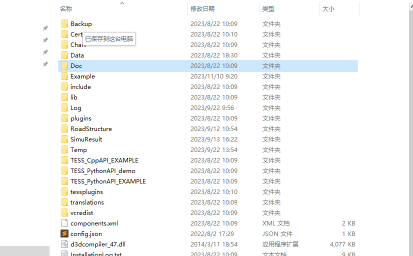
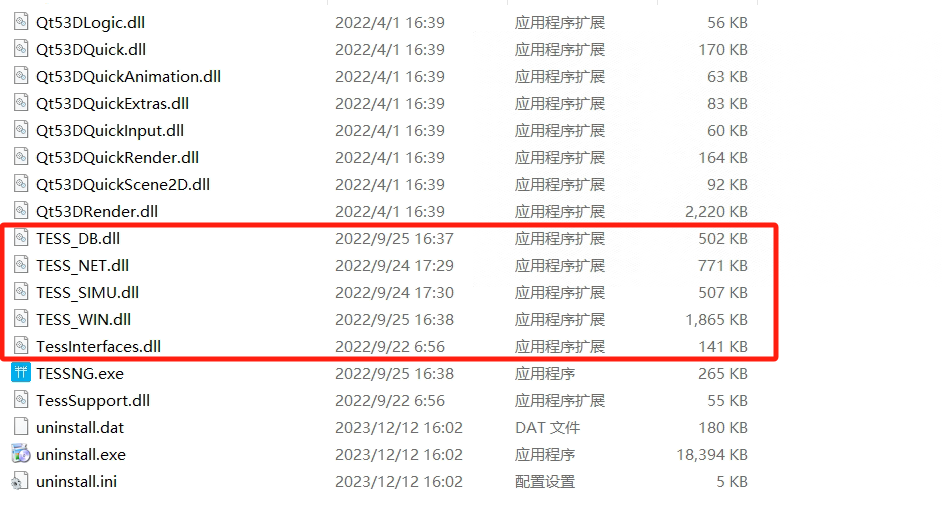
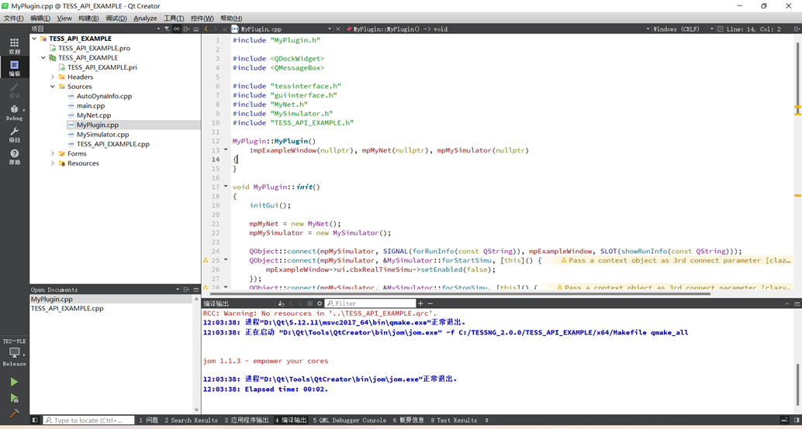

# 软件安装

## 下载

win10系统: [TESSNG V3.1 二次开发包](https://139.196.85.33/downloads/)

Linux系统: [TESSNG V3.1 二次开发包](https://139.196.85.33/downloads/)

## 安装与激活

**第一步：下载TESSNG Python二次开发包** [TESSNG V3.1 二次开发包](https://139.196.85.33/downloads/)**并解压**



开发包位于软件根目录下，主要文件截图如下：



**第二步：TESS NG的C++ API运行环境配置**

TESS NG的API可以在VS环境下编译，同时也可以在QT Creator环境下编译。范例工程的源码都是utf-8字符编码，工程文件TESS_API_EXAMPLE.pro是Qt Creator 工程文件，在Qt 5.15.9环境下编译通过，TESS_API_EXAMPLE.vcxproj是VS工程文件，在Visual Studio 2019 + Qt Visual Studio Tools + Qt 5.15.9环境编译通过。  两种环境的配置说明如下：

**（1）VS编译环境配置**

(1.1)安装QT5.15.9；

(1.2)安装Visual C++2019，并在此环境下安装插件Qt Visual Studio Tools及Force UTF-8(No BOM)。QT VS Tools安装完成并完成QT的路径设置后，应确认该插件是否识别了正确的QT版本，打开菜单栏Qt VS Tools 下的QT Project Settings选项，在弹出窗口中检查右侧Qt Installation的版本名称与之前选择安装路径的Qt版本是否一致，如不一致，查看Qt Installation下拉框中是否有其他可选版本，如果没有其他选项，建议在QT VS Tools下的Qt Options中重新导入Qt路径；

(1.3) 用Visual C++2019打开范例工程，属性“c/c++”的命令行增加：/utf-8。

**（2）Qt Creator编译环境配置**

用户在仅安装QT 5.15.9的情况下，也可以在QT环境实现编译，用户可以根据自己实现的环境，选择平台进行编译测试，QT平台的编译状态如下：



第三步：启动TESSNG

TESS NG二次开发非常方便，在main.cpp文件中加入简单几行代码就可以启动TESSSNG。代码如下：

```C++
#include <QtWidgets/QApplication>
#include <QTextCodec>
#include <QLibrary>
#include "tessinterface.h"

int main(int argc, char *argv[])
{
	QString qtPluginDir = QString::fromLocal8Bit("C:/TESSNG/plugins");
	QCoreApplication::addLibraryPath(qtPluginDir);
	QApplication a(argc, argv);
	QMainWindow *pWindow = tessng();
	if (pWindow){
		pWindow->showMaximized ();
	}
	bool result = a.exec();
	if (pWindow) {
		delete pWindow;
	}
	return result;
}
```

结果如下：


如果打开TESSNG时自动加载指定路网文件，可以将代码换成：

```C++
QMainWindow *pWindow = tessng();
QString netFilePath = QString::fromLocal8Bit("C:/TESSNG/Example/上海虹桥机场.tess");
QMainWindow *pWindow = tessng(netFilePath);
```

或者在配置文件config.json设置"__netfilepath"属性值为路网文件的全路径名。

结果如下：


API打开文件

注意：以上两种自动加载路网的方法不能同时使用。

第四步：激活TESSNG软件license

用户在首次使用二次开发包时需要激活软件；激活方式：运行项目，弹出激活弹窗，选择激活license文件。

试用用户与首次激活软件流程相同，采用安装包的Cert文件夹下的JidaTraffic_key激活即可。

​    软件的试用期为30天，以前激活过软件的客户激活V3.0.1版本时重新延长30天试用期（识别激活电脑的物理地址）。试用期结束后将无法调用接口的二次开发功能。

​    商业版用户使用不受限制。

第五步： 激活后关闭弹窗，重新运行项目即可运行范例


<!-- ex_nonav -->

