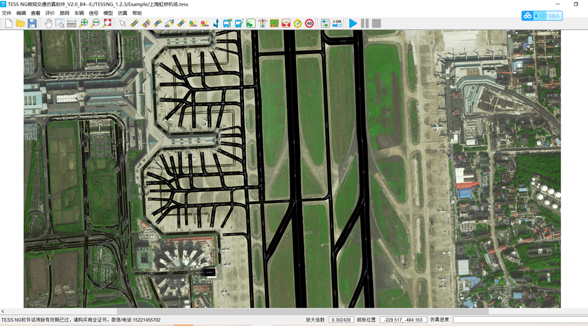
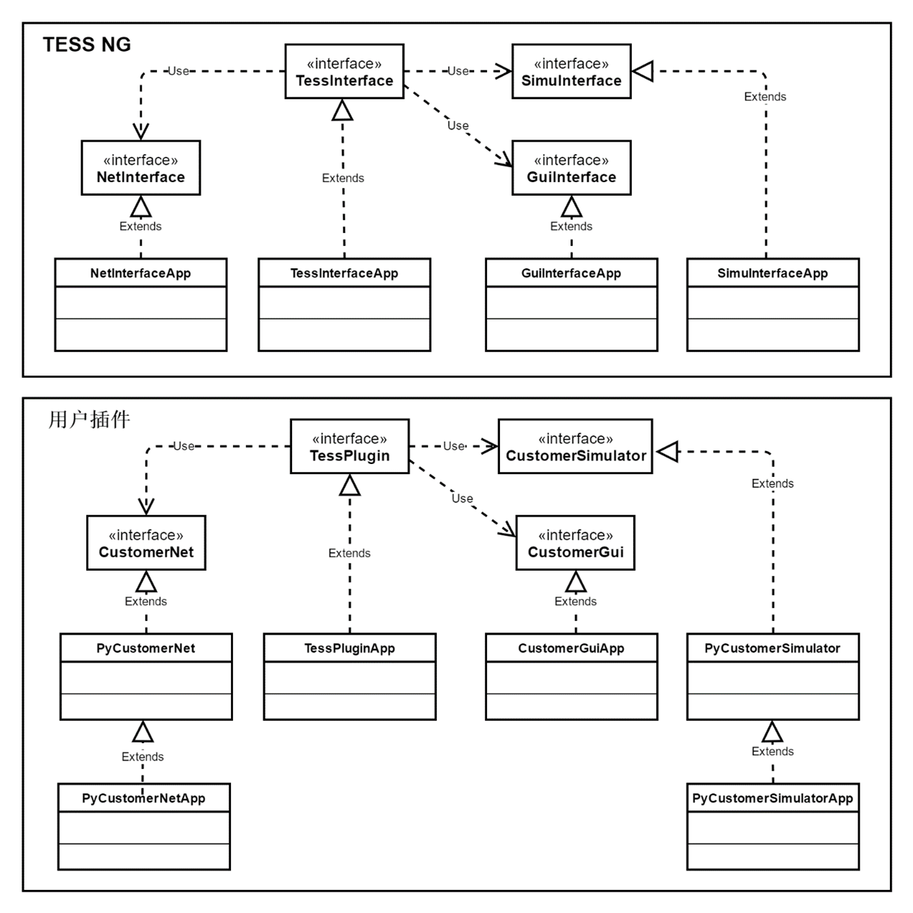
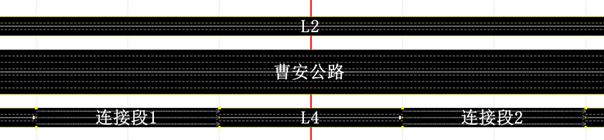

# 快速入门

## 1 运行DEMO

用户需要将安装包目录下的 TESS_CppAPI_EXAMPLE 下的具体的C++头文件和源文件加入工程，并核查文件路径即可运行项目。**注：如果路径错误，会加载默认路网及出现其它异常情况。**

### 1.1. 启动TESSNG

#### 1.1.1 简单启动

​    在配置完毕TESS NG环境后，启动TESS NG二次开发非常方便，在main.cpp文件中加入简单几行代码就可以启动TESSSNG。代码如下：

```C++
#include <QtWidgets/QApplication>
#include <QTextCodec>
#include <QLibrary>
#include "tessinterface.h"

int main(int argc, char *argv[])
{
	QString qtPluginDir = QString::fromLocal8Bit("C:/TESSNG/plugins");
	QCoreApplication::addLibraryPath(qtPluginDir);
	QApplication a(argc, argv);
	QMainWindow *pWindow = tessng();
	if (pWindow){
		pWindow->showMaximized ();
	}
	bool result = a.exec();
	if (pWindow) {
		delete pWindow;
	}
	return result;
}
```

结果如下：


如果打开TESSNG时自动加载指定路网文件，可以将代码换成：

```C++
QMainWindow *pWindow = tessng();
QString netFilePath = QString::fromLocal8Bit("C:/TESSNG/Example/上海虹桥机场.tess");
QMainWindow *pWindow = tessng(netFilePath);
```

或者在配置文件config.json设置"__netfilepath"属性值为路网文件的全路径名。

结果如下：



注意：以上两种自动加载路网的方法不能同时使用。

#### 1.1.2 通过配置文件加载路网、加载后仿真计算

在TESSNG.exe文件相同路径创建一文本文件config.json。在此文件中增加两个属性如下：

```
{
	"__netfilepath":"C:/TESSNG_2.2.0/Examles/杭州武林门区域路网公交优先方案.tess",	
	"__simuafterload":true
}

```

其中"__netfilepath"指定TESS NG启动时加载的文件路径，"__simuafterload"指定TESS NG启动加载路网文件（指定的路网文件或临时空白路网文件）后是否立即仿真计算。

### 1.2. 通过插件与TESS NG交互

​    与TESS NG交互、对TESS NG施加控制，主要是通过插件方式实现的，插件可以是符合TESS NG插件规范的动态连接库，由TESS NG启动时加载，也可以直接在内存中创建，启动TESS NG时主动加载。

范例通过插件在TESS NG主窗体增加一个QDockWidget对象， QDockWidget对象包含一个用户创建的QWidget，在这个QWidget上可以创建按钮、信息框等组件，用于和TESS NG进行交互。将QDockWidget对象加入TESS NG主窗体是通过调用TessInterface子接口GuiInterface的方法addDockWidgetToMainWindow来实现的，范例在TessPlugin的实现方法initGui()中来完成。范例实现TessPlugin的initGui()代码如下：

```c++
void MyPlugin::initGui() {
	mpExampleWindow = new TESS_API_EXAMPLE();
	QDockWidget *pDockWidget = new QDockWidget(QString::fromLocal8Bit("TESSNG API 范例"), (QWidget *)gpTessInterface->guiInterface()->mainWindow());
	pDockWidget->setObjectName(QStringLiteral("mainDockWidget"));
	pDockWidget->setFeatures(QDockWidget::NoDockWidgetFeatures);
	pDockWidget->setAllowedAreas(Qt::LeftDockWidgetArea);
	pDockWidget->setWidget(mpExampleWindow->centralWidget());
	gpTessInterface->guiInterface()->addDockWidgetToMainWindow(static_cast<Qt::DockWidgetArea>(1), pDockWidget);
}

```

范例实例化插件后从内存加载插件，代码如下：

```c++
//创建插件实例
MyPlugin *p = new MyPlugin();
p->initGui();
p->initCustNet();
p->initCustSimu();
//加载插件
gpTessInterface->loadPluginFromMem(p);

```

启动TESS NG结果如下：


范例在自定义界面上按放了几个按钮，其中按钮“启动仿真”的槽函数里用下列代码启动仿真：

```c++
void TESS_API_EXAMPLE::startSimu() {
	if (!gpTessInterface->simuInterface()->isRunning() || gpTessInterface->simuInterface()->isPausing()) {
		gpTessInterface->simuInterface()->startSimu();
	}
}
```

## 2 度量单位

TESS NG在运行过程涉及的度量单位有多种，有基本的度量单位，如：长度单位，复合型度量单位，如：速度单位。在启动TESS NG后需要设置长度基本度量单位，目前只支持像素，像素与米存在转换关系，这个关系通常在画路网前设置像素比时就已确定。设置方法是#include “UnitChange.h”后，调用setUnitOfMeasure方法，如范例：

```c++
setUnitOfMeasure(UnitOfMeasure::Pixel);
```

在二次开发过程中需要根据说明将大部分与长度有关的单位改成像素。像素与米制的相互转换方法如下：

​    米制转换像素：qreal m2p(qreal value);

​    像素转换米制：qreal p2m(qreal value);

## 3 接口架构

TESS NG和插件相互调用，实现对TESS NG运行过程从精细到粗放各个层次的控制。



TESS NG通过实现TessInterface及其三个子接口，将自身主要功能暴露给用户，用户启动TESS NG后可以通过全局指针变量gpTessInterface获取三个子接口，调用子接口方法。TESS NG加载插件后可以调用插件实现的方法，用户可以在插件方法中通过TessInterface及其子接口控制仿真运行，及仿真过程中车辆驾驶行为、信号灯色、路径车辆分配等等。

## 4 范例简介

范例“TESS NG API EXAMPLE”展示了在窗体界面、路网展示、仿真过程三个方面如何对TESS NG施加影响。范例工程基于Qt5.15环境创建，源代码在TESS NG3.x安装路径子文件夹/TESS_API_EXAMPLE下。其中TESS_API_EXAMPLE.pro是Qt Creator 工程文件，在Qt5.15环境下编译通过，TESS_API_EXAMPLE.vcxproj是VS工程文件，在Visual Studio 2019 + Qt Visual Studio Tools + Qt5.15环境编译通过。

企业版可以使用二次开发功能，试用版可以在一个月内正常使用。

范例启动时从内存加载插件，之后加载路网。如果成功加载了插件，插件会检测路网上的路段数，如果没有路段会创建几条路段、连接段以及发车点，如果配置文件config.json属性"__simuafterload"设为true加载路网后立即启动仿真。

### 4.1 增加窗体控件

在窗体界面上的影响：范例在窗体放置一个QDockWidget对象，QDockWidget对象包含了自定义界面，自定义界面上放置一些控件，通过这些控件操作TESS NG的路网加载、仿真运行，如下图如示：


### 4.2 改变路网元素展示内容

在路网展示上的影响：范例在加载路网后判断路网上是否有路段，如果没有则创建几条路段、连接段和几个发车点。其中名称为“曹安路”的路段的标签显示路段名，其它路段标签显示ID，连接段标签显示的都是名称，如下图所示：




### 4.3 控制车辆驾驶行为

在仿真过程上的影响：范例在仿真过程的影响包括初始化车辆车道、位置、速度，从几个方面改变车辆速度，以及控制自由变道，如下图所示：


### 4.4 在路段和连接段中间任意位置发车

在仿真过程上的影响：范例在仿真过程动态从路段及连接段上距起点一定距离的位置发车，无需发车点发车，如下图所示：


<!-- ex_nonav -->

