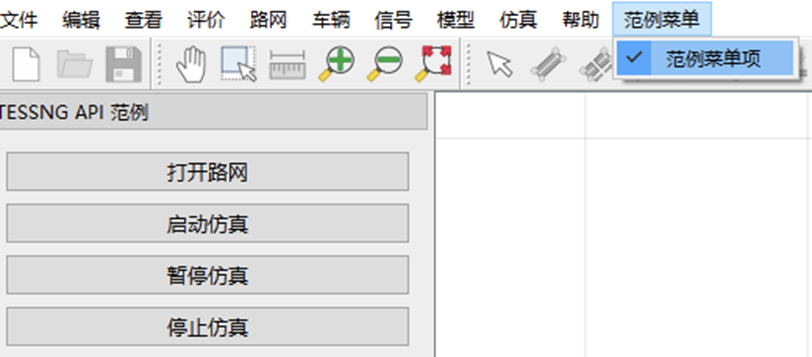
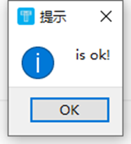
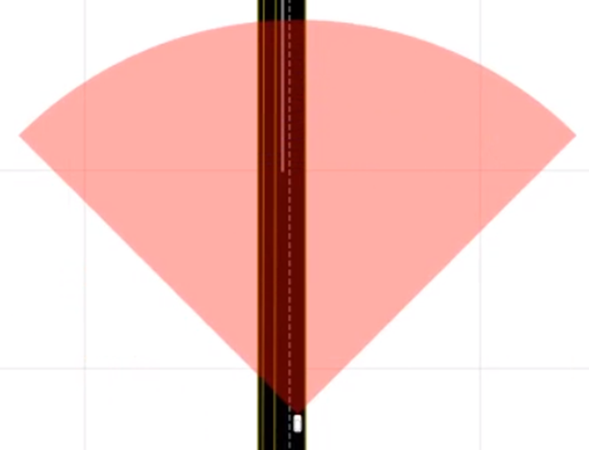
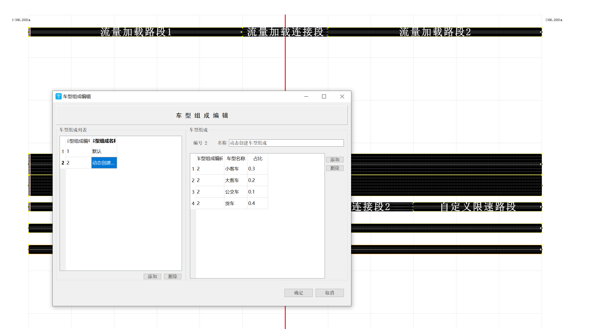

# 高频接口实战

| 大类           | 功能点                           |
| -------------- | -------------------------------- |
| 仿真窗口操作   | 自定义菜单栏；自定义按钮事件     |
| 路网编辑       | 新建路网                         |
|                | 获取，修改，删除路网             |
|                | 新增编辑路网上的附着物           |
| 信控编辑       | 新建信号灯                       |
|                | 信号灯组新建，编辑               |
|                | 双环信控方案下发                 |
| 需求加载与管理 | 流量加载                         |
|                | 路径管理                         |
|                | 路径重构                         |
| 仿真运行       | 流程控制                         |
|                | 动作控制                         |
|                | 管控手段控制                     |
| 底层模型修改   | 跟驰模型                         |
|                | 换道模型                         |
|                | 冲突交互模型（暂不支持二次开发） |
|                | 车辆汇入模型                     |
|                | 车辆穿越模型                     |
| 仿真输出       | 检测器编辑                       |
|                | 采集器编辑                       |
|                | 输出控制                         |
| 特殊应用场景   | 公交系统                         |
|                | 行人系统                         |
|                | 停车场系统                       |
|                | 收费站系统                       |

本章所有接口范例均可在安装包《安装目录/SecondaryDevCases/SecondaryDevCases.h》中找到；用户可以到GitHub下载

[GitHub](https://github.com/jida-traffic/TESSNG_SecondaryDev_Doc) 

[官网下载](): 

## 1. 界面交互

### 1.1. 增加菜单及菜单项

可以在main()方法中实例化TESS NG后创建菜单及菜单项，代码如下:

```c++
QMainWindow *pWindow = tessng();
	if (pWindow)
	{
		QMenuBar *pMenuBar = gpTessInterface->guiInterface()->menuBar();
		QMenu *pMenu = new QMenu(pMenuBar);
		pMenu->setObjectName(QString::fromUtf8("menuExample"));
		pMenuBar->addAction(pMenu->menuAction());
		pMenu->setTitle(QString::fromLocal8Bit("范例菜单"));

		QAction *pActionOk = new QAction(pMenuBar->parent());
		pActionOk->setObjectName("actionExample");
		pActionOk->setText(QString::fromLocal8Bit("范例菜单项"));
		pActionOk->setCheckable(true);

		pMenu->addAction(pActionOk);

		QObject::connect(pActionOk, &QAction::triggered, []() {
			QMessageBox::information(gpTessInterface->guiInterface()->mainWindow(), QString::fromLocal8Bit("提示"), QString("is ok!"));
		});
	}
```

结果如下：



点击菜单项“范例菜单项”弹出对话框：



如果希望增加菜单的功能放到插件的动态库中，让TESS NG加载插件时创建菜单，则上述代码需要移至插件接口的实现代码中，如范例；将上述代码放到TessPlugin的initGui()方法中。

### 1.2. **获取车辆在路网二维平面上所有可移动的轨迹**

路网二维平面主要由路段连接段组成，路段由路段自身和车道组成，连接段由连接段自身和“车道连接”组成，路段、车道、“车道连接”都存在中心线断点序列，车辆都是在这些点构成的线上移动的。取得这些断点序列的步骤如下：

1）获取所有路段；

2）获取路段的所有车道；

3）获取车道的中心线断点序列

4）获取所有连接段

5）获取连接段的所有“车道连接”

6）获取“车道连接”中心线断点序列

实现的代码如下：

```c++
//获取所有路段
	QList<ILink*> lLink = gpTessInterface->netInterface()->links();
	foreach(ILink *pLink, lLink) {
		QList<ILane*> lLane = pLink->lanes();
		foreach(ILane *pLane, lLane) {
			QList<QPointF> lPoint= pLane->centerBreakPoints();
		}
	}
//获取所有连接段
	QList<IConnector*> lConn = gpTessInterface->netInterface()->connectors();
	foreach(IConnector *pConn, lConn) {
		QList<ILaneConnector*> lLaneConn = pConn->laneConnectors();
		foreach(ILaneConnector *pLC, lLaneConn) {
			QList<QPointF> lPoint = pLC->centerBreakPoints();
		}
	}

```

### 1.3. **增加车辆显示内容**

下图展示自动驾驶车辆，雷达探测范围100米。



为了增添车辆展示的内容，可以实现接口CustomerSimulator的如下方法：

```c++
void rePaintVehicle (IVehicle *pIVehicle, QPainter *painter)
```

## 2. 路网编辑

### 2.1.  代码新建路网

1- 新建link

2- 新建connector

```c++
//第一条路段
	QPointF startPoint = QPointF(m2p(-300), 0);
	QPointF endPoint = QPointF(m2p(300), 0);
	QList<QPointF> lPoint;
	lPoint << startPoint;
	lPoint << endPoint;
	ILink *pLink1 = gpTessInterface->netInterface()->createLink(lPoint, 7, "曹安公路");
	if (pLink1) {
		//创建发车点
		IDispatchPoint *pDp = gpTessInterface->netInterface()->createDispatchPoint(pLink1);
		if (pDp) {
			pDp->addDispatchInterval(1, 2, 28);
		}
	}

	//创建第二条路段
	startPoint = QPointF(m2p(-300), m2p(-25));
	endPoint = QPointF(m2p(300), m2p(-25));
	lPoint.clear();
	lPoint << startPoint;
	lPoint << endPoint;
	ILink *pLink2 = gpTessInterface->netInterface()->createLink(lPoint, 3, "次干道");
	if (pLink2) {
		//创建发车点
		IDispatchPoint *pDp = gpTessInterface->netInterface()->createDispatchPoint(pLink2);
		if (pDp) {
			pDp->addDispatchInterval(1, 3600, 3600);
		}
		//修改车道类型
		pLink2->lanes()[0]->setLaneType(QObject::tr("公交专用道"));
	}

	//创建第三条路段
	startPoint = QPointF(m2p(-300), m2p(25));
	endPoint = QPointF(m2p(-150), m2p(25));
	lPoint.clear();
	lPoint << startPoint;
	lPoint << endPoint;
	ILink *pLink3 = gpTessInterface->netInterface()->createLink(lPoint, 3);
	if (pLink3) {
		//创建发车点
		IDispatchPoint *pDp = gpTessInterface->netInterface()->createDispatchPoint(pLink3);
		if (pDp) {
			pDp->addDispatchInterval(1, 3600, 3600);
		}
	}

	//创建第四条路段
	startPoint = QPointF(m2p(-50), m2p(25));
	endPoint = QPointF(m2p(50), m2p(25));
	lPoint.clear();
	lPoint << startPoint;
	lPoint << endPoint;
	ILink *pLink4 = gpTessInterface->netInterface()->createLink(lPoint, 3);

	//创建第五条路段
	startPoint = QPointF(m2p(150), m2p(25));
	endPoint = QPointF(m2p(300), m2p(25));
	lPoint.clear();
	lPoint << startPoint;
	lPoint << endPoint;
	ILink *pLink5 = gpTessInterface->netInterface()->createLink(lPoint, 3, "自定义限速路段");
	if (pLink5) {
		pLink5->setLimitSpeed(30);
	}

	//创建第六条路段
	startPoint = QPointF(m2p(-300), m2p(50));
	endPoint = QPointF(m2p(300), m2p(50));
	lPoint.clear();
	lPoint << startPoint;
	lPoint << endPoint;
	ILink *pLink6 = gpTessInterface->netInterface()->createLink(lPoint, 3, "动态发车路段");
	if (pLink6) {
		pLink6->setLimitSpeed(80);
	}

	//创建第七条路段
	startPoint = QPointF(m2p(-300), m2p(75));
	endPoint = QPointF(m2p(-250), m2p(75));
	lPoint.clear();
	lPoint << startPoint;
	lPoint << endPoint;
	ILink *pLink7 = gpTessInterface->netInterface()->createLink(lPoint, 3);
	if (pLink7) {
		pLink7->setLimitSpeed(80);
	}

	//创建第八条路段
	startPoint = QPointF(m2p(-50), m2p(75));
	endPoint = QPointF(m2p(300), m2p(75));
	lPoint.clear();
	lPoint << startPoint;
	lPoint << endPoint;
	ILink *pLink8 = gpTessInterface->netInterface()->createLink(lPoint, 3);
	if (pLink8) {
		pLink8->setLimitSpeed(80);
	}

	//创建第一条连接段
	if (pLink3 && pLink4) {
		QList<int> lFromLaneNumber = QList<int>() << 1 << 2 << 3;
		QList<int> lToLaneNumber = QList<int>() << 1 << 2 << 3;
		IConnector *pConn1 = gpTessInterface->netInterface()->createConnector(pLink3->id(), pLink4->id(), lFromLaneNumber, lToLaneNumber
			, "连接段1");
	}

	//创建第二条连接段
	if (pLink4 && pLink5) {
		IConnector *pConn2 = gpTessInterface->netInterface()->createConnector(pLink4->id(), pLink5->id(), QList<int>() << 1 << 2 << 3, QList<int>() << 1 << 2 << 3, "连接段2");
	}

	//创建第三条连接段
	if (pLink7 && pLink8) {
		IConnector *pConn3 = gpTessInterface->netInterface()->createConnector(pLink7->id(), pLink8->id(), QList<int>() << 1 << 2 << 3, QList<int>() << 1 << 2 << 3, "动态发车连接段");
	}
```


### 2.2. 地图转TESSNG路网

需要使用到Python工具，导入opendrive， osm shapely生成tessng路网；直接使用pytessng的工具代码;

截图：


工具链接：[pytessng](https://pypi.org/search/?q=pytessng)

安装命令： 

```
pip install pytessng
```


### 2.3. 修改路网元素

1-修改删除link编号，名称，形状，长度，宽度等属性

2-修改connector的laneconnector连接关系，形状；

3- 获取link, connector, connectorarea, laneconnector形状，属性

用户可以先获取目标对象，在修改对象属性

详见[接口详解]


### 2.4. 编辑路网附着物

1-新建删除车道导向箭头；

```
IGuidArrow* pGuideArrow = gpTessInterface->netInterface()->createGuidArrow(pRightLane, length, distToTerminal, arrowType);
    qDebug() << "导向箭头类型为：" << pGuideArrow->arrowType() << endl;

```

2-限速区：指定车道位置设置，限速区的长度，生效时间, 速度值

```c++
//重新计算期望速度
bool MySimulator::reCalcdesirSpeed(IVehicle* pIVehicle, qreal& inOutDesirSpeed) {
	// L5最右侧车道50-100m处，限速10，持续30s
	if (mpSecondDevCasesObj->mActionControlMethodNumber == 10) {
		//当前已仿真时间，单位：秒
		long simuTime = gpTessInterface->simuInterface()->simuTimeIntervalWithAcceMutiples() / 1000;
		if (!mpSecondDevCasesObj->reCalcdesirSpeedFlag) {
			//当前已仿真时间，单位：毫秒
			mpSecondDevCasesObj->reCalcdesirSpeedStartTime = gpTessInterface->simuInterface()->simuTimeIntervalWithAcceMutiples() / 1000;
			mpSecondDevCasesObj->reCalcdesirSpeedFlag = true;
			mRunInfo = QStringLiteral("L5路段最右侧车道50-100m处设置限速区，限速10km/h，持续时间30s！");
			emit(forRunInfo(mRunInfo));
		}
		if (pIVehicle->vehicleDriving()->laneNumber() == 0 && pIVehicle->roadId() == 5) {
			if (pIVehicle->vehicleDriving()->distToStartPoint() < m2p(100) && pIVehicle->vehicleDriving()->distToStartPoint() > m2p(50)) {
				inOutDesirSpeed = 10;
			}
		}
		if (simuTime - mpSecondDevCasesObj->reCalcdesirSpeedStartTime >= 30) {
			mRunInfo = QStringLiteral("L5路段最右侧车道50-100m处限速区已关闭，车辆正常行驶！");
			emit(forRunInfo(mRunInfo));
			mpSecondDevCasesObj->mActionControlMethodNumber = 0;
		}
		return true;
	}
	return false;
}
```

3-施工区：根据车辆序号和位置，施工区长度新建

```c++
Online::DynaRoadWorkZoneParam workZone;
	//道路ID
	workZone.roadId = 9;
	//施工区名称
	workZone.name = "施工区，限速60";
	//位置，距路段或连接段起点距离，单位米
	workZone.location = m2p(200);
	//施工区长度，单位米
	workZone.length = m2p(200);
	//车辆经过施工区的最大车速，单位千米/小时
	workZone.limitSpeed = m2p(60);
	//施工区施工时长，单位秒
	workZone.duration = 50;
	//施工区起始车道
	workZone.mlFromLaneNumber.append(2);
	//创建施工区
	IRoadWorkZone* pZone = gpTessInterface->netInterface()->createRoadWorkZone(workZone);
```

5-事故区：根据车道序号，位置，影响范围新建

```c++
Online::DynaAccidentZoneParam accidentZone;
	//道路ID
	accidentZone.roadId = 9;
	//事故区名称
	accidentZone.name = "最左侧车道发生事故";
	//位置，距路段或连接段起点距离，单位米
	accidentZone.location = m2p(200);
	//事故区长度，单位米
	accidentZone.length = m2p(50);
	//事故区起始车道序号列表
	accidentZone.mlFromLaneNumber.append(2);
	//事故等级
	accidentZone.level = 1;
	//创建事故区
	IAccidentZone* pZone = gpTessInterface->netInterface()->createAccidentZone(accidentZone);

```

6-公交站：根据车道序号，位置，长度，类型设置；

```c++
//创建公交线路
IBusLine* pBusLine = gpTessInterface->netInterface()->createBusLine(QList<ILink*>() << pLink10 << pLink11);
if (pBusLine) {
			pBusLine->setDesirSpeed(m2p(60));
}

```


详见接口详解

## 3. 信控编辑

### 3.1. 新建信号灯

1- 根据车道序号，位置新建信号灯

```c++
//创建信号灯
	for (int i = 0, size = lConnLaneObjs.size(); i < size; ++i) {
		ISignalLamp* pSignalLamp = gpTessInterface->netInterface()->createSignalLamp(pSignalPhase, QObject::tr("信号灯%1").arg(i + 1), lConnLaneObjs[i]->fromLaneObject()->id(),  lConnLaneObjs[i]->toLaneObject()->id(), m2p(2.0));
	}
```


### 3.2.  编辑信号灯组

2- 新建信号灯组，设置信号相位相序和灯色

核心代码

```c++
//创建示例路段和连接段
QList<ISection*> SecondaryDevCases::createExampleLinkAndConnector(QString LinkName, int Posy) {
	//创建两条路段
	QPointF startPoint1 = QPointF(m2p(-300), m2p(Posy));//m2p(数字)后的坐标可以对上原点在中心的坐标，TESSNG中的坐标始终是像素
	QPointF endPoint1 = QPointF(m2p(-50), m2p(Posy));
	QList<QPointF> lPoint1;
	lPoint1 << startPoint1 << endPoint1;
	ILink* pLink1 = gpTessInterface->netInterface()->createLink(lPoint1, 3, LinkName + QStringLiteral("路段1"));

	QPointF startPoint2 = QPointF(m2p(50), m2p(Posy));//m2p(数字)后的坐标可以对上原点在中心的坐标，TESSNG中的坐标始终是像素
	QPointF endPoint2 = QPointF(m2p(300), m2p(Posy));
	QList<QPointF> lPoint2;
	lPoint2 << startPoint2 << endPoint2;
	ILink* pLink2 = gpTessInterface->netInterface()->createLink(lPoint2, 3, LinkName + QStringLiteral("路段2"));
	IConnector* pConn = nullptr;
	//创建连接段
	if (pLink1 && pLink2) {
		QList<int> lFromLaneNumber = QList<int>() << 1 << 2 << 3;
		QList<int> lToLaneNumber = QList<int>() << 1 << 2 << 3;
		pConn = gpTessInterface->netInterface()->createConnector(pLink1->id(), pLink2->id(), lFromLaneNumber, lToLaneNumber, LinkName + QStringLiteral("连接段"));
		if (pConn) {
			//连接段车道连接列表
			QList<ILaneObject*> lConnLaneObjs;
			lConnLaneObjs = pConn->laneObjects();
			for (ILaneObject*& pLaneObj : lConnLaneObjs) {
				qDebug() << "上游车道ID" << pLaneObj->fromLaneObject()->id() << "下游车道ID" << pLaneObj->toLaneObject()->id() << endl;
			}
		}
	}
	return QList<ISection*>() << pLink1 << pLink2 << pConn;
}

//信控编辑
void SecondaryDevCases::signalControllerEdit() {

	QList<ISection*> lLinksAndConnector = createExampleLinkAndConnector(QStringLiteral("信控编辑"), -50);
	ILink* pLink1 = lLinksAndConnector.front()->castToLink();
	IConnector* pConn = lLinksAndConnector.back()->castToConnector();
	//连接段车道连接列表
	QList<ILaneObject*> lConnLaneObjs;
	lConnLaneObjs = pConn->laneObjects();
	//创建发车点
	if (pLink1) {
		//创建发车点
		IDispatchPoint* pDp = gpTessInterface->netInterface()->createDispatchPoint(pLink1);
		if (pDp) {
			pDp->addDispatchInterval(1, 200, 400);//200秒400辆车
		}
	}
	//创建信号灯组
	ISignalGroup* pSignalGroup = gpTessInterface->netInterface()->createSignalGroup(QObject::tr("信号灯组1"), 60, 1, 3600);
	//创建相位,40秒绿灯，黄灯3秒，全红3秒
	Online::ColorInterval green("绿", 40), yellow("黄", 3), red("红", 3);
	ISignalPhase* pSignalPhase = gpTessInterface->netInterface()->createSignalPhase(pSignalGroup, QObject::tr("信号灯组1相位1"),
		QList<Online::ColorInterval>() << green << yellow << red);
	//创建信号灯
	for (int i = 0, size = lConnLaneObjs.size(); i < size; ++i) {
		ISignalLamp* pSignalLamp = gpTessInterface->netInterface()->createSignalLamp(pSignalPhase, QObject::tr("信号灯%1").arg(i + 1),
			lConnLaneObjs[i]->fromLaneObject()->id(), lConnLaneObjs[i]->toLaneObject()->id(), m2p(2.0));
	}
}
```


### 3.3. 信控方案下发

3- 支持双环结构信控方案下发（前提是已正确新建信号灯；已知一个路口所有进口道的流向及车道对应的信号灯id）

核心代码 

```c++
//双环信控方案下发
void SecondaryDevCases::doubleRingSignalControl(long currentSimuTime) {
	// 读取方案数据
	QFile jsonFile("./Data/Signal_Plan_Data_1109.json");
	if (!jsonFile.open(QIODevice::ReadOnly | QIODevice::Text)) {
		qDebug() << "Error: Could not open Signal_Plan_Data_1109.json";
		return;
	}
	QByteArray jsonData = jsonFile.readAll();
	jsonFile.close();
	QJsonDocument doc = QJsonDocument::fromJson(jsonData);
	QJsonObject signalGroupsDict = doc.object();
	for (QJsonObject::iterator it = signalGroupsDict.begin(); it != signalGroupsDict.end(); ++it) {
		QString groupName = it.key();
		QJsonObject group = it.value().toObject();
		ISignalGroup* pCurrentSignalGroup = nullptr;
		// 通过灯组名称查询到灯组
		QList<ISignalGroup*> lAllSignalGroups = gpTessInterface->netInterface()->signalGroups();
		for (ISignalGroup*& pSignalGroup : lAllSignalGroups) {
			if (pSignalGroup->groupName() == groupName) {
				pCurrentSignalGroup = pSignalGroup;
				break;
			}
		}
		if (!pCurrentSignalGroup) {
			qDebug() << "FindError: The signalGroup not in current net.";
			break;
		}
		//获取当前灯组相位
		QList<ISignalPhase*> lCurrentSignalGroupPhases = pCurrentSignalGroup->phases();
		// 获取所有灯组的起始时间
		QStringList lSignalGroupStartTime = group.keys();
		for (QJsonObject::iterator it2 = group.begin(); it2 != group.end(); ++it2) {
			QString startTime = it2.key();
			// 获取下一个元素的迭代器
			QJsonObject::iterator nextIt = std::next(it2);
			QString endTime = (nextIt != group.end()) ? nextIt.key() : "24:00";
			// 起始时间和结束时间的秒数表示
			long startTimeSeconds = Functions::timeToSeconds(startTime);
			long endTimeSeconds = Functions::timeToSeconds(endTime);
			// 若当前仿真时间位于当前时段内，修改当前时段信号灯组的相位
			if (startTimeSeconds <= currentSimuTime && currentSimuTime < endTimeSeconds) {
				QJsonObject currentGroupData = it2.value().toObject();
				int periodTime = currentGroupData[QStringLiteral("cycle_time")].toInt();
				int yellowInteral = currentGroupData[QStringLiteral("yellow_interval")].toInt();
				QJsonArray phases = currentGroupData[QStringLiteral("phases")].toArray();
				// 修改周期
				pCurrentSignalGroup->setPeriodTime(periodTime);
				for (const QJsonValueRef& phase : phases) {
					QJsonObject phaseObj = phase.toObject();
					QString phaseName = phaseObj[QStringLiteral("phase_name")].toString();
					int phaseNumber = phaseObj[QStringLiteral("phase_number")].toInt();
					qDebug() << "phaseName" << phaseName << phaseNumber << endl;
					QList<Online::ColorInterval> lColorInterval;
					lColorInterval.append(Online::ColorInterval(QStringLiteral("红"), phaseObj[QStringLiteral("start_time")].toInt()));
					lColorInterval.append(Online::ColorInterval(QStringLiteral("绿"), phaseObj[QStringLiteral("green_time")].toInt()));
					lColorInterval.append(Online::ColorInterval(QStringLiteral("黄"), yellowInteral));
					int remainingTime = periodTime - phaseObj[QStringLiteral("start_time")].toInt() - phaseObj[QStringLiteral("green_time")].toInt() - yellowInteral;
					if (remainingTime > 0) {
						lColorInterval.append(Online::ColorInterval(QStringLiteral("红"), remainingTime));
					}
					// 当前灯组包含的相位序号
					ISignalPhase* pCurrentPhase = nullptr;
					for (ISignalPhase*& pCurrentSignalGroupPhase : lCurrentSignalGroupPhases) {
						if (phaseNumber == pCurrentSignalGroupPhase->number()) {
							pCurrentPhase = pCurrentSignalGroupPhase;
							break;
						}
					}
					// 若已存在该相位，修改相位灯色顺序，否则添加相位
					if (pCurrentPhase) {
						// 修改相位
						pCurrentPhase->setColorList(lColorInterval);
						qDebug() << pCurrentPhase->id() << "相位设置成功" << endl;
					}
					else {
						ISignalPhase* pSignalPhase = gpTessInterface->netInterface()->createSignalPhase(pCurrentSignalGroup, phaseName, lColorInterval);
						// 设置相位序号
						pSignalPhase->setNumber(phaseNumber);
						qDebug() << pSignalPhase->id() << "相位创建成功" << endl;
					}
					// 设置相位包含的信号灯
					QJsonArray lampList = phaseObj[QStringLiteral("lamp_lst")].toArray();
					for (const QJsonValue& lampId : lampList) {
						ISignalLamp* pLamp = gpTessInterface->netInterface()->findSignalLamp(lampId.toInt());
						if (!pLamp) {
							/*
							 * 目前一个信号灯属于多个相位，相位间不交叉。
							 * 因此如果要实际下发方案时，应按照仿真时间实时管理相位序号。
							 */
							pLamp->setPhaseNumber(phaseNumber);
							qDebug() << pLamp->id() << "序号信号灯相位设置成功" << endl;
						}
						else {
							qDebug() << "FindError:未查找到信号灯:" << lampId.toInt();
						}
					}
				}
				break;
			}

		}
	}
}

```


## 4. 需求加载与管理

### 4.1. 流量加载

支持多种方式加载车辆，供用户灵活使用

1-新建发车点，设置发车流量时间间隔；设置发车分布；设置车辆组成，车辆类型（发车点已创建后无法修改车辆组成和车辆类型，可以创建车辆组成和车辆类型后设置发车点）；



2-动态发车：不设置发车点，在指定车道和位置处加载车辆（一辆一辆加载）

核心代码

```c++
//流量加载示例路段和连接段创建
void SecondaryDevCases::trafficLoadingPrePare() {
	QList<ISection*> lLinksAndConnector = createExampleLinkAndConnector(QStringLiteral("流量加载"), -50);
	ILink* pLink1 = lLinksAndConnector.front()->castToLink();
	/* 2.动态发车 */
	QList<ISection*> lLinksAndConnectorDynaVehi = createExampleLinkAndConnector(QStringLiteral("动态发车"), -25);
	ILink* pLink3 = lLinksAndConnectorDynaVehi.front()->castToLink();
	lTrafficLoadingSections << pLink1;
	lTrafficLoadingSections << pLink3;
}

//流量加载
void SecondaryDevCases::trafficLoading(float planNumber) {
	static bool bVehiCompositionFlag = false;
	ILink* pLink1 = nullptr;
	ILink* pLink3 = nullptr;
	if (!lTrafficLoadingSections.isEmpty()) {
		pLink1 = lTrafficLoadingSections.front()->castToLink();
		pLink3 = lTrafficLoadingSections.back()->castToLink();
	}
	if (planNumber == 1 && !bVehiCompositionFlag) {
		// 创建车辆组成及指定车辆类型
		QList<Online::VehiComposition> lVehiTypeProportion;
		// 车型组成：小客车0.3，大客车0.2，公交车0.1，货车0.4
		lVehiTypeProportion.push_back(Online::VehiComposition(1, 0.3));
		lVehiTypeProportion.push_back(Online::VehiComposition(2, 0.2));
		lVehiTypeProportion.push_back(Online::VehiComposition(3, 0.1));
		lVehiTypeProportion.push_back(Online::VehiComposition(4, 0.4));
		int vehiCompositionID = gpTessInterface->netInterface()->createVehicleComposition("动态创建车型组成", lVehiTypeProportion);
		if (vehiCompositionID != -1) {
			qDebug() << "车型组成创建成功，id为：" << vehiCompositionID << endl;
			// 新建发车点,车型组成ID为动态创建的，600秒发300辆车
			if (pLink1) {
				IDispatchPoint* dp = gpTessInterface->netInterface()->createDispatchPoint(pLink1);
				if (dp) {
					dp->addDispatchInterval(vehiCompositionID, 600, 300);
					bVehiCompositionFlag = true;
				}
			}
		}
	}
	else if (planNumber == 2) {
		if (pLink3) {
			Online::DynaVehiParam dvpLane0, dvpLane1, dvpLane2;
			// 在指定车道和位置动态加载车辆(示例：在0,1,2车道不同位置动态加载车辆)
			dvpLane0.vehiTypeCode = 1;
			dvpLane1.vehiTypeCode = 2;
			dvpLane2.vehiTypeCode = 3;
			dvpLane0.roadId = pLink3->id();
			dvpLane1.roadId = pLink3->id();
			dvpLane2.roadId = pLink3->id();
			dvpLane0.laneNumber = 0;
			dvpLane1.laneNumber = 1;
			dvpLane2.laneNumber = 2;
			dvpLane0.dist = m2p(50);
			dvpLane1.dist = m2p(100);
			dvpLane2.dist = m2p(50);
			dvpLane0.speed = 20;
			dvpLane1.speed = 30;
			dvpLane2.speed = 40;
			dvpLane0.color = "#FF0000";
			dvpLane1.color = "#008000";
			dvpLane2.color = "#0000FF";
			auto vehi_lane0 = gpTessInterface->simuInterface()->createGVehicle(dvpLane0);
			auto vehi_lane1 = gpTessInterface->simuInterface()->createGVehicle(dvpLane1);
			auto vehi_lane2 = gpTessInterface->simuInterface()->createGVehicle(dvpLane2);
		}
	}
}
```

3- 路径（veh path）加载：单车车辆路径（根据方式4间接实现）

或者通过IVehicleDriving类实现

```c++
// 修改车辆路径，将L1路段所有车辆修改为右转路径
	for (IVehicle*& vehi : lAllVehi) {
			if (vehi->roadId() == 1) {
				QList<IDecisionPoint*> lDecisionPoint = gpTessInterface->netInterface()->decisionPoints();
				IDecisionPoint* pDecisionPointInLink1 = nullptr;
				for (IDecisionPoint*& pDecisionPoint : lDecisionPoint) {
					if (pDecisionPoint->link()->id() == 1) {
						pDecisionPointInLink1 = pDecisionPoint;
						break;
					}
				}
				QList<IRouting*> lRoutingsOfDecisionPointInLink1;
				if (pDecisionPointInLink1) {
					lRoutingsOfDecisionPointInLink1 = pDecisionPointInLink1->routings();
				}
				if (!lRoutingsOfDecisionPointInLink1.isEmpty()) {
					if (vehi->routing() != lRoutingsOfDecisionPointInLink1.back()) {
						if (vehi->vehicleDriving()->setRouting(lRoutingsOfDecisionPointInLink1.back())) {
							mRunInfo = QStringLiteral("L1路段所有车辆路径修改为右转！");
							emit(forRunInfo(mRunInfo));
						}
					}
				}
			}
		}
```

4- flow 路径加载：发车点+静态路径

```c++
//路径加载
void SecondaryDevCases::flowLoading(float planNumber, long currentTime) {
	static bool bPlanNumberFlag1 = false;
	static bool bPlanNumberFlag2 = false;
	//标准四岔路口流量加载，L3-C2-L10为例
	if (planNumber == 1 && !bPlanNumberFlag1) {
		// 根据路段ID获取路段
		ILink* pLink3 = gpTessInterface->netInterface()->findLink(3);
		ILink* pLink10 = gpTessInterface->netInterface()->findLink(10);
		ILink* pLink6 = gpTessInterface->netInterface()->findLink(6);
		ILink* pLink7 = gpTessInterface->netInterface()->findLink(7);
		ILink* pLink8 = gpTessInterface->netInterface()->findLink(8);
		//新建发车点
		if (pLink3) {
			IDispatchPoint* dp = gpTessInterface->netInterface()->createDispatchPoint(pLink3);
			if (dp) {
				dp->addDispatchInterval(1, 600, 300);
			}
		}
		//创建决策点
		mpDecisionPoint = gpTessInterface->netInterface()->createDecisionPoint(pLink3, m2p(30));
		//创建路径(左，直，右)
		IRouting* decisionRoutingLeft = gpTessInterface->netInterface()->createDeciRouting(mpDecisionPoint, QList<ILink*>() << pLink3 << pLink10 << pLink6);
		IRouting* decisionRoutingStraight = gpTessInterface->netInterface()->createDeciRouting(mpDecisionPoint, QList<ILink*>() << pLink3 << pLink10 << pLink8);
		IRouting* decisionRoutingRight = gpTessInterface->netInterface()->createDeciRouting(mpDecisionPoint, QList<ILink*>() << pLink3 << pLink10 << pLink7);
		//分配左直右流量比
		_RoutingFLowRatio _flowRatioLeft, _flowRatioStraight, _flowRatioRight;
		_flowRatioLeft.RoutingFLowRatioID = 1;
		_flowRatioLeft.routingID = decisionRoutingLeft->id();
		_flowRatioLeft.startDateTime = 0;
		_flowRatioLeft.endDateTime = 999999;
		_flowRatioLeft.ratio = 2.0;
		_flowRatioStraight.RoutingFLowRatioID = 2;
		_flowRatioStraight.routingID = decisionRoutingStraight->id();
		_flowRatioStraight.startDateTime = 0;
		_flowRatioStraight.endDateTime = 999999;
		_flowRatioStraight.ratio = 3.0;
		_flowRatioRight.RoutingFLowRatioID = 3;
		_flowRatioRight.routingID = decisionRoutingRight->id();
		_flowRatioRight.startDateTime = 0;
		_flowRatioRight.endDateTime = 999999;
		_flowRatioRight.ratio = 1.0;
		// 决策点数据
		_DecisionPoint _decisionPointData;
		_decisionPointData.deciPointID = mpDecisionPoint->id();
		_decisionPointData.deciPointName = mpDecisionPoint->name();
		QPointF decisionPointPos;
		if (mpDecisionPoint->link()->getPointByDist(mpDecisionPoint->distance(), decisionPointPos)) {
			_decisionPointData.X = decisionPointPos.x();
			_decisionPointData.Y = decisionPointPos.y();
			_decisionPointData.Z = mpDecisionPoint->link()->z();
		}
		//更新决策点及其各路径不同时间段流量比
		mpDecisionPoint = gpTessInterface->netInterface()->updateDecipointPoint(_decisionPointData, QList<_RoutingFLowRatio>() << _flowRatioLeft << _flowRatioStraight << _flowRatioRight);
		bPlanNumberFlag1 = true;
	}
	//移除右转路径
	else if (planNumber == 2 && bPlanNumberFlag1 && !bPlanNumberFlag2) {
		if (gpTessInterface->netInterface()->removeDeciRouting(mpDecisionPoint, mpDecisionPoint->routings().back())) {
			bPlanNumberFlag2 = true;
			qDebug() << "删除右转路径成功" << endl;
		}
	}
	else if (planNumber == 3) {
		flowLoadingSection(currentTime);
	}
}

```

5- 断面流量+转向比例（路径比例）加载

```c++
//路径断面流量加载
void SecondaryDevCases::flowLoadingSection(long currentTime) {
	// 读取方案数据
	QFile jsonFile("./Data/flow_ratio_quarter.json");
	if (!jsonFile.open(QIODevice::ReadOnly | QIODevice::Text)) {
		qDebug() << "Error: Could not open flow_ratio_quarter.json";
		return;
	}
	QByteArray jsonData = jsonFile.readAll();
	jsonFile.close();
	QJsonDocument doc = QJsonDocument::fromJson(jsonData);
	QJsonObject flowRatioQuarterDict = doc.object();
	for (QJsonObject::iterator it = flowRatioQuarterDict.begin(); it != flowRatioQuarterDict.end(); ++it) {
		int linkId = it.key().toInt();
		QJsonObject quarterRatios = it.value().toObject();
		IDecisionPoint* pCurrentDecisionPoint = nullptr;
		//查找决策点
		QList<IDecisionPoint*> lDecisionPoints = gpTessInterface->netInterface()->decisionPoints();
		for (IDecisionPoint*& pDecisionPoint : lDecisionPoints) {
			if (pDecisionPoint->link()->id() == linkId) {
				pCurrentDecisionPoint = pDecisionPoint;
				break;
			}
		}
		if (pCurrentDecisionPoint) {
			for (QJsonObject::iterator it2 = quarterRatios.begin(); it2 != quarterRatios.end(); ++it2) {
				QString quarterStartTime = it2.key();
				long quarterStartTimeSeconds = Functions::timeToSeconds(quarterStartTime);
				QJsonObject::iterator nextIt = std::next(it2);
				QString quarterEndTime = (nextIt != quarterRatios.end()) ? nextIt.key() : "24:00";
				long quarterEndTimeSeconds = Functions::timeToSeconds(quarterEndTime);
				if (currentTime < quarterEndTimeSeconds && currentTime >= quarterStartTimeSeconds) {
					qDebug() << quarterStartTime << quarterEndTimeSeconds << endl;
					QJsonObject quarterRatio = it2.value().toObject();
					QList<IRouting*> lDecisionPointRoutings = pCurrentDecisionPoint->routings();
					if (lDecisionPointRoutings.size() == 3) {
						// 分配左、直、右流量比
						_RoutingFLowRatio _flowRatioLeft, _flowRatioStraight, _flowRatioRight;
						_flowRatioLeft.RoutingFLowRatioID = lDecisionPointRoutings[0]->id();
						_flowRatioLeft.routingID = lDecisionPointRoutings[0]->id();
						_flowRatioLeft.startDateTime = 1;
						_flowRatioLeft.endDateTime = 99999;
						_flowRatioLeft.ratio = static_cast<long>(quarterRatio["left"].toInt());
						_flowRatioStraight.RoutingFLowRatioID = lDecisionPointRoutings[1]->id();
						_flowRatioStraight.routingID = lDecisionPointRoutings[1]->id();
						_flowRatioStraight.startDateTime = 1;
						_flowRatioStraight.endDateTime = 99999;
						_flowRatioStraight.ratio = static_cast<long>(quarterRatio["straight"].toInt());
						_flowRatioRight.RoutingFLowRatioID = lDecisionPointRoutings[2]->id();
						_flowRatioRight.routingID = lDecisionPointRoutings[2]->id();
						_flowRatioRight.startDateTime = 1;
						_flowRatioRight.endDateTime = 99999;
						_flowRatioRight.ratio = static_cast<long>(quarterRatio["right"].toInt());
						// 决策点数据
						_DecisionPoint _decisionPointData;
						_decisionPointData.deciPointID = pCurrentDecisionPoint->id();
						_decisionPointData.deciPointName = pCurrentDecisionPoint->name();
						QPointF decisionPointPos;
						if (pCurrentDecisionPoint->link()->getPointByDist(pCurrentDecisionPoint->distance(), decisionPointPos)) {
							_decisionPointData.X = decisionPointPos.x();
							_decisionPointData.Y = decisionPointPos.y();
							_decisionPointData.Z = pCurrentDecisionPoint->link()->z();
						}
						//更新决策点及其各路径不同时间段流量比
						IDecisionPoint* pUpdatedCurrentDecisionPoint = gpTessInterface->netInterface()->updateDecipointPoint(_decisionPointData, QList<_RoutingFLowRatio>() << _flowRatioLeft << _flowRatioStraight << _flowRatioRight);
						if (pUpdatedCurrentDecisionPoint) {
							qDebug() << quarterStartTime << "流量更新成功" << endl;
						}
					}
					else
					{
						qDebug() << pCurrentDecisionPoint->id() << "决策点需要包含3条路径" << endl;
					}
					break;
				}
			}
		}
	}
}
```


### 4.2.  路径管理

1- 新建决策点；新建决策路径，编辑决策路径流量比例，时间，路径的link,connector，删除路径。

```c++
		//创建决策点
		mpDecisionPoint = gpTessInterface->netInterface()->createDecisionPoint(pLink3, m2p(30));
		//创建路径(左，直，右)
		IRouting* decisionRoutingLeft = gpTessInterface->netInterface()->createDeciRouting(mpDecisionPoint, QList<ILink*>() << pLink3 << pLink10 << pLink6);
		IRouting* decisionRoutingStraight = gpTessInterface->netInterface()->createDeciRouting(mpDecisionPoint, QList<ILink*>() << pLink3 << pLink10 << pLink8);
		IRouting* decisionRoutingRight = gpTessInterface->netInterface()->createDeciRouting(mpDecisionPoint, QList<ILink*>() << pLink3 << pLink10 << pLink7);
		//分配左直右流量比
		_RoutingFLowRatio _flowRatioLeft, _flowRatioStraight, _flowRatioRight;
		_flowRatioLeft.RoutingFLowRatioID = 1;
		_flowRatioLeft.routingID = decisionRoutingLeft->id();
		_flowRatioLeft.startDateTime = 0;
		_flowRatioLeft.endDateTime = 999999;
		_flowRatioLeft.ratio = 2.0;
		_flowRatioStraight.RoutingFLowRatioID = 2;
		_flowRatioStraight.routingID = decisionRoutingStraight->id();
		_flowRatioStraight.startDateTime = 0;
		_flowRatioStraight.endDateTime = 999999;
		_flowRatioStraight.ratio = 3.0;
		_flowRatioRight.RoutingFLowRatioID = 3;
		_flowRatioRight.routingID = decisionRoutingRight->id();
		_flowRatioRight.startDateTime = 0;
		_flowRatioRight.endDateTime = 999999;
		_flowRatioRight.ratio = 1.0;
		// 决策点数据
		_DecisionPoint _decisionPointData;
		_decisionPointData.deciPointID = mpDecisionPoint->id();
		_decisionPointData.deciPointName = mpDecisionPoint->name();
		QPointF decisionPointPos;
		if (mpDecisionPoint->link()->getPointByDist(mpDecisionPoint->distance(), decisionPointPos)) {
			_decisionPointData.X = decisionPointPos.x();
			_decisionPointData.Y = decisionPointPos.y();
			_decisionPointData.Z = mpDecisionPoint->link()->z();
		}
		//更新决策点及其各路径不同时间段流量比
		mpDecisionPoint = gpTessInterface->netInterface()->updateDecipointPoint(_decisionPointData, QList<_RoutingFLowRatio>() << _flowRatioLeft << _flowRatioStraight << _flowRatioRight);
		bPlanNumberFlag1 = true;
	}
	//移除右转路径
	else if (planNumber == 2 && bPlanNumberFlag1 && !bPlanNumberFlag2) {
		if (gpTessInterface->netInterface()->removeDeciRouting(mpDecisionPoint, mpDecisionPoint->routings().back())) {
			bPlanNumberFlag2 = true;
			qDebug() << "删除右转路径成功" << endl;
		}
	}
	else if (planNumber == 3) {
		flowLoadingSection(currentTime);
	}
```

2 - 运行过程中编辑决策路径的属性（流量比例，时间段信息），暂时不要求新增，删除，修改已有路径的“路径”（link,connector）

见CustomerSimulator

```c++
QList<Online::DecipointFlowRatioByInterval> MySimulator::calcDynaFlowRatioParameters()
{
	QList<Online::DecipointFlowRatioByInterval> lDecipointFLowRatioByInterval;
	long batchNumber = gpTessInterface->simuInterface()->batchNumber();
	if (batchNumber == 100*1000)
	{
		Online::DecipointFlowRatioByInterval dfi = Online::DecipointFlowRatioByInterval();
		dfi.deciPointID = 1;
		dfi.startDateTime = 1;
		dfi.endDateTime = 84000;
		Online::RoutingFlowRatio rfr1 = Online::RoutingFlowRatio(1, 10);
		Online::RoutingFlowRatio rfr2 = Online::RoutingFlowRatio(2, 1);
		dfi.mlRoutingFlowRatio << rfr1;
		dfi.mlRoutingFlowRatio << rfr2;
		lDecipointFLowRatioByInterval << dfi;
	}
	return lDecipointFLowRatioByInterval;
}
```

以上两点需求可在流量加载中找到实现方式。


### 4.3.  路径重构

1- 断面流量+转向流量重构车辆路径，并加载到仿真中;(暂时忽略)

2- OD数据重构路径，并加载到仿真中(暂时忽略)

用户可以利用自有算法实现OD分配、路径重构，然后依据4.1中所述的流量加载方式实现TESSNG 软件加载路径重构结果


## 5. 仿真运行

### 5.1. 倒车入库

在实现自动泊车的仿真及调度时需要展示车辆倒车入库的过程，这个过程可让车辆顺向前移，将车辆旋转180度，展现的便是倒着行驶状态。


 为了实现倒着行驶效果，可以实现CustomerSimulator的如下方法

```c++
bool reCalcAngle(IVehicle *pIVehicle, qreal &outAngle)
```

 

### 5.2. 循环仿真

对加载的路网启动仿真后，不需要人工干预的情况下重复仿真指定次数，且每次仿真前自动进行参数设置，仿真后输出仿真结果到文件。

1）、仿真前判断当前仿真路网与上次仿真路网是否相同，如果不同设置仿真次数为1；

2）、仿真结束后判断仿真次数是否小于指定次数，如果小于指定次数则发送要求仿真的消息给TESSNG主窗体，TESSNG主窗体启动仿真。

```c++
//仿真结束后的处理
void MySimulator::afterStop() {
	//QDateTime dt = QDateTime::fromMSecsSinceEpoch(mrStartMSecs);
	//QString dtStr = dt.toString("yyyy年MM月dd日 hh时mm分ss秒");
	//QString startDtStr = QString("仿真开始现实时间:").append(dtStr);

	//dtStr = QDateTime::currentDateTime().toString("yyyy年MM月dd日 hh时mm分ss秒");
	//QString endDtStr = QString("仿真结束现实时间:").append(dtStr);

	//QMessageBox::information(nullptr, QString(), QString().append(startDtStr).append("\n").append(endDtStr));

	mSimuCount++;
	QString netfilePath = gpTessInterface->netInterface()->netFilePath();
	if (netfilePath.contains("深圳南海大道创业路交叉口CFI方案") && mSimuCount < 3)
	{
		emit(forReStartSimu());
	}

}
```


### 5.3. 流程控制

1-开始仿真

2- 暂停仿真

3- 恢复仿真

4-结束关闭仿真

5-生成仿真快照

6-加载仿真快照

```c++
//流程控制
void SecondaryDevCases::processControl(float planNumber) {
	/*
	'''1. 启动、暂停、恢复、停止仿真'''
	*/
	if (planNumber == float(1.1)) {
		gpTessInterface->simuInterface()->startSimu();
	}
	if (planNumber == float(1.2)) {
		gpTessInterface->simuInterface()->pauseSimu();
	}
	if (planNumber == float(1.3)) {
		gpTessInterface->simuInterface()->stopSimu();
	}
	if (planNumber == float(1.4)) {
		gpTessInterface->simuInterface()->pauseSimuOrNot();
	}
	/*
	'''2. 获取运动信息'''
	*/
	//2.1 获取路网在途车辆
	if (planNumber == float(2.1)) {
		//所有在运行车辆
		QList<IVehicle*> lAllVehi = gpTessInterface->simuInterface()->allVehiStarted();
		QString runInfo = QStringLiteral("路网在途车辆共%0辆，ID为:\n").arg(lAllVehi.size());
		for (IVehicle*& vehi : lAllVehi) {
			runInfo += QStringLiteral("车辆%0,当前坐标(%1,%2)\n").arg(vehi->id()).arg(vehi->pos().x()).arg(vehi->pos().y());
		}
		emit(showDynaInfo(runInfo));
	}
	//2.2 根据路段|车道获取车辆list,以L5路段，lane20车道为例。
	if (planNumber == float(2.2)) {
		QList<IVehicle*> lVehiOnLink5 = gpTessInterface->simuInterface()->vehisInLink(5);
		QString runInfoOfLinkAndLane = QStringLiteral("L5路段车辆共%0辆，ID为:\n").arg(lVehiOnLink5.size());
		for (IVehicle*& vehi : lVehiOnLink5) {
			runInfoOfLinkAndLane += QStringLiteral("车辆%0,当前坐标(%1,%2)\n").arg(vehi->id()).arg(vehi->pos().x()).arg(vehi->pos().y());
		}
		QList<IVehicle*> lVehiOnLane20 = gpTessInterface->simuInterface()->vehisInLane(20);
		runInfoOfLinkAndLane += QStringLiteral("Lane20车道车辆共%0辆，ID为:\n").arg(lVehiOnLane20.size());
		for (IVehicle*& vehi : lVehiOnLane20) {
			runInfoOfLinkAndLane += QStringLiteral("车辆%0,当前坐标(%1,%2)\n").arg(vehi->id()).arg(vehi->pos().x()).arg(vehi->pos().y());
		}
		emit(showDynaInfo(runInfoOfLinkAndLane));
	}
	//2.3 根据车辆id获取具体的车辆信息,以id为300001的车辆为例
	if (planNumber == float(2.3)) {
		IVehicle* vehi300001 = gpTessInterface->simuInterface()->getVehicle(300001);
		if (vehi300001) {
			QString runInfoOfVehi = QStringLiteral("%0车辆信息为:\n").arg(vehi300001->id());
			runInfoOfVehi += QStringLiteral("所在路段ID:%0\n").arg(vehi300001->roadId());
			runInfoOfVehi += QStringLiteral("所在车道序号:%0\n").arg(vehi300001->lane()->number() + 1);
			runInfoOfVehi += QStringLiteral("当前车速:%0\n").arg(vehi300001->currSpeed());
			runInfoOfVehi += QStringLiteral("当前加速度:%0\n").arg(vehi300001->acce());
			runInfoOfVehi += QStringLiteral("当前角度:%0\n").arg(vehi300001->angle());
			runInfoOfVehi += QStringLiteral("当前位置:(%1,%2)\n").arg(vehi300001->pos().x()).arg(vehi300001->pos().y());
			runInfoOfVehi += QStringLiteral("其它：......\n");
			emit(showDynaInfo(runInfoOfVehi));
		}
	}
	// 3. 设置仿真精度
	if (planNumber == 3) {
		gpTessInterface->simuInterface()->setSimuAccuracy(10);
	}
	// 4. 设置仿真开始结束时间
	if (planNumber == 4) {
		gpTessInterface->simuInterface()->setSimuIntervalScheming(30);
	}
	// 5. 设置仿真加速比
	if (planNumber == 5) {
		gpTessInterface->simuInterface()->setAcceMultiples(10);
	}
}
```


### 5.4.  动作控制

运行过程中的操作：

1- 修改发车流量信息

```c++
QList<Online::DispatchInterval> MySimulator::calcDynaDispatchParameters()
{
	QList<Online::DispatchInterval> lDispatchInterval;
	if (mpSecondDevCasesObj->mActionControlMethodNumber == 1)
	{
		QTime t = QTime::currentTime();
		qDebug() << t;
		long currSecs = t.hour() * 3600 + t.minute() * 60 + t.second();
		Online::DispatchInterval di = Online::DispatchInterval();
		di.dispatchId = 11;
		di.fromTime = currSecs;
		di.toTime = di.fromTime + 300 - 1;
		di.vehiCount = 300;
		di.mlVehicleConsDetail << Online::VehiComposition(1, 90) << Online::VehiComposition(2, 10);
		lDispatchInterval << di;
		mpSecondDevCasesObj->mActionControlMethodNumber = 0;
	}
	return lDispatchInterval;
}
```


2- 修改限速区，事故区信息；删除减速区，限速区，事故区

```c++
//重新计算期望速度
bool MySimulator::reCalcdesirSpeed(IVehicle* pIVehicle, qreal& inOutDesirSpeed) {
	// L5最右侧车道50-100m处，限速10，持续30s
	if (mpSecondDevCasesObj->mActionControlMethodNumber == 10) {
		//当前已仿真时间，单位：秒
		long simuTime = gpTessInterface->simuInterface()->simuTimeIntervalWithAcceMutiples() / 1000;
		if (!mpSecondDevCasesObj->reCalcdesirSpeedFlag) {
			//当前已仿真时间，单位：毫秒
			mpSecondDevCasesObj->reCalcdesirSpeedStartTime = gpTessInterface->simuInterface()->simuTimeIntervalWithAcceMutiples() / 1000;
			mpSecondDevCasesObj->reCalcdesirSpeedFlag = true;
			mRunInfo = QStringLiteral("L5路段最右侧车道50-100m处设置限速区，限速10km/h，持续时间30s！");
			emit(forRunInfo(mRunInfo));
		}
		if (pIVehicle->vehicleDriving()->laneNumber() == 0 && pIVehicle->roadId() == 5) {
			if (pIVehicle->vehicleDriving()->distToStartPoint() < m2p(100) && pIVehicle->vehicleDriving()->distToStartPoint() > m2p(50)) {
				inOutDesirSpeed = 10;
			}
		}
		if (simuTime - mpSecondDevCasesObj->reCalcdesirSpeedStartTime >= 30) {
			mRunInfo = QStringLiteral("L5路段最右侧车道50-100m处限速区已关闭，车辆正常行驶！");
			emit(forRunInfo(mRunInfo));
			mpSecondDevCasesObj->mActionControlMethodNumber = 0;
		}
		return true;
	}
	return false;
}
```


3-车辆位置移动

```c++
// 车辆移动测试时，将L5路段车辆移动过路口的各个车道
	if (mpSecondDevCasesObj->mActionControlMethodNumber == 2) {
		for (int i = 0; i < lAllVehi.size(); ++i) {
			if (lAllVehi[i]->roadId() == 5) {
				ILink* nextLink = gpTessInterface->netInterface()->findLink(9);
				QList<ILaneObject*> lNextLinkLaneObj = nextLink->laneObjects();
				if (lAllVehi[i]->vehicleDriving()->move(lNextLinkLaneObj[i % lNextLinkLaneObj.size()], static_cast<double>(i % 100))) {
					mRunInfo = QStringLiteral("L5路段车辆转移成功！");
					emit(forRunInfo(mRunInfo));
				}
			}
		}
		mpSecondDevCasesObj->mActionControlMethodNumber = 0;
	}
```


4-修改车辆速度

```c++
//重新设置速度
bool MySimulator::reSetSpeed(IVehicle* pIVehicle, qreal& inOutSpeed) {
	// 3. 修改车辆速度，将L5路段车辆修改为0
	if (mpSecondDevCasesObj->mActionControlMethodNumber == 3) {
		if (pIVehicle->roadId() == 5) {
			inOutSpeed = 0;
			return true;
		}
	}
	return false;
}

```


5-修改车辆路径

```c++
// 修改车辆路径，将L1路段所有车辆修改为右转路径
	if (mpSecondDevCasesObj->mActionControlMethodNumber == 4) {
		for (IVehicle*& vehi : lAllVehi) {
			if (vehi->roadId() == 1) {
				QList<IDecisionPoint*> lDecisionPoint = gpTessInterface->netInterface()->decisionPoints();
				IDecisionPoint* pDecisionPointInLink1 = nullptr;
				for (IDecisionPoint*& pDecisionPoint : lDecisionPoint) {
					if (pDecisionPoint->link()->id() == 1) {
						pDecisionPointInLink1 = pDecisionPoint;
						break;
					}
				}
				QList<IRouting*> lRoutingsOfDecisionPointInLink1;
				if (pDecisionPointInLink1) {
					lRoutingsOfDecisionPointInLink1 = pDecisionPointInLink1->routings();
				}
				if (!lRoutingsOfDecisionPointInLink1.isEmpty()) {
					if (vehi->routing() != lRoutingsOfDecisionPointInLink1.back()) {
						if (vehi->vehicleDriving()->setRouting(lRoutingsOfDecisionPointInLink1.back())) {
							mRunInfo = QStringLiteral("L1路段所有车辆路径修改为右转！");
							emit(forRunInfo(mRunInfo));
						}
					}
				}
			}
		}
	}
```


6-强制车辆不变道

```c++
bool MySimulator::reCalcDismissChangeLane(IVehicle* pIVehicle) {
	//强制车辆不变道，禁止L2路段所有车辆右变道
	if (mpSecondDevCasesObj->mActionControlMethodNumber == 5)
	{
		if (pIVehicle->roadId() == 2) {
			if (mpSecondDevCasesObj->judgeVehicleLaneChangeDirection(pIVehicle) == QStringLiteral("right")) {
				return true;
			}
		}
	}
	return false;
}

```


7-强制车辆变道

```c++
//计算是否要右自由变道
bool MySimulator::reCalcToRightFreely(IVehicle* pIVehicle) {
	if (pIVehicle->roadId() == 5 && pIVehicle->lane()->number() == 1 && mpSecondDevCasesObj->mActionControlMethodNumber == 6) {
		return true;
	}
	return false;
}

bool MySimulator::reCalcDismissChangeLane(IVehicle* pIVehicle) {
	//强制L5路段中间车道向右变道
	if (mpSecondDevCasesObj->mActionControlMethodNumber == 6) {
		if (pIVehicle->roadId() == 5 && (pIVehicle->lane()->number() == 0 || pIVehicle->lane()->number() == 1)) {
			if (mpSecondDevCasesObj->judgeVehicleLaneChangeDirection(pIVehicle) == QStringLiteral("left")) {
				return true;
			}
		}
	}
	return false;
}
```


8-强制车辆闯红灯

```c++
//重新设置速度
bool MySimulator::reSetSpeed(IVehicle* pIVehicle, qreal& inOutSpeed) {
	// 7.强制车辆闯红灯,让L12等待的车辆强制闯红灯
	if (mpSecondDevCasesObj->mActionControlMethodNumber == 7) {
		if (pIVehicle->roadId() == 12) {
			qreal vehiCurrSpeed = pIVehicle->currSpeed();
			qreal vehiCurrentDistToEnd = pIVehicle->vehicleDriving()->distToEndpoint(true);
			if (m2p(vehiCurrSpeed) < 20 && p2m(vehiCurrentDistToEnd) < 3) {
				// 生成一个随机浮点数，范围在 [0.0, 1.0)
				double randomNumber = QRandomGenerator::global()->generateDouble();
				if (randomNumber < 0.8) {
					inOutSpeed = m2p(15);
					return true;
				}
			}
		}
	}
	return false;
}
```


9-强制车辆停车

```c++
//重新设置速度
bool MySimulator::reSetSpeed(IVehicle* pIVehicle, qreal& inOutSpeed) {
	// 3. 修改车辆速度，将L5路段车辆修改为0
	if (mpSecondDevCasesObj->mActionControlMethodNumber == 3) {
		if (pIVehicle->roadId() == 5) {
			inOutSpeed = 0;
			return true;
		}
	}
	return false;
}
```

10-强制清除车辆（车辆消失）

```c++
//8. 强制清除车辆,以L5路段为例，清除所有小客车
	if (mpSecondDevCasesObj->mActionControlMethodNumber == 8) {
		for (IVehicle*& pIVehicle : lAllVehi) {
			if (pIVehicle->roadId() == 5 && pIVehicle->vehicleTypeCode() == 1) {
				pIVehicle->vehicleDriving()->stopVehicle();
			}
		}
		mpSecondDevCasesObj->mActionControlMethodNumber = 0;
	}
```


11-修改车辆航向角

```c++
void MySimulator::afterStep(IVehicle* pIVehicle) {
	//9. 修改车辆航向角，以L5路段为例
	if (mpSecondDevCasesObj->mActionControlMethodNumber == 9) {
		if (pIVehicle->roadId() == 5) {
			pIVehicle->vehicleDriving()->setAngle(45);
		}
	}
}
```


12-修改车辆速度，加速度

```c++
//重新设置速度
bool MySimulator::reSetSpeed(IVehicle* pIVehicle, qreal& inOutSpeed) {
	// 3. 修改车辆速度，将L5路段车辆修改为0
	if (mpSecondDevCasesObj->mActionControlMethodNumber == 3) {
		if (pIVehicle->roadId() == 5) {
			inOutSpeed = 0;
			return true;
		}
	}
	// 7.强制车辆闯红灯,让L12等待的车辆强制闯红灯
	if (mpSecondDevCasesObj->mActionControlMethodNumber == 7) {
		if (pIVehicle->roadId() == 12) {
			qreal vehiCurrSpeed = pIVehicle->currSpeed();
			qreal vehiCurrentDistToEnd = pIVehicle->vehicleDriving()->distToEndpoint(true);
			if (m2p(vehiCurrSpeed) < 20 && p2m(vehiCurrentDistToEnd) < 3) {
				// 生成一个随机浮点数，范围在 [0.0, 1.0)
				double randomNumber = QRandomGenerator::global()->generateDouble();
				if (randomNumber < 0.8) {
					inOutSpeed = m2p(15);
					return true;
				}
			}
		}
	}
	return false;
}

//计算加速度
bool MySimulator::calcAcce(IVehicle *pIVehicle, qreal &acce)
{
    if(pIVehicle->vehiDistFront() < m2p(5))
    {
        //前车距小于5米，让TESSNG计算加速度
        return false;
    }
    else if (pIVehicle->currSpeed() > m2p(10))
    {
        acce = m2p(-2);
        return true;
    }
    else if (pIVehicle->currSpeed() < m2p(1))
    {
        acce = m2p(2);
        return true;
    }
	return false;
}

```


```c++
/动作控制
void SecondaryDevCases::actionControl(float planNumber) {
	/*以动作控制案例-机动车交叉口路网的L5路段为例*/

	/*
	'''1. 修改发车流量信息'''
	修改发车流量信息需在MySimulator中的calcDynaDispatchParameters函数
	*/
	/*
	'''2. 车辆位置移动'''
		# 见MySimulator中的afterOneStep函数
	*/
	/*
	'''3. 修改车辆速度'''
		# 见MySimulator中的reSetSpeed函数
	*/
	/*
	'''4. 修改车辆路径'''
		 # 以L1路段上的路径为例，见MySimulator中的afterOneStep函数
	*/
	/*
	'''5. 强制车辆不变道'''
		 # 以L2路段上的路径为例，见MySimulator中的afterOneStep函数
	*/
	/*
	'''6. 强制车辆变道'''
		 # 以L5路段上的路径为例，见MySimulator中的afterOneStep函数
	*/
	/*
	'''7. 强制车辆闯红灯'''
		# 见MySimulator的reSetSpeed函数
	*/
	/*
	'''8. 强制清除车辆'''
		# 以L5路段上的路径为例，见afterOneStep
	*/
	/*
	'''9. 修改车辆航向角'''
		# 以L5路段上的路径为例，见afterStep
	*/
	/*
	   10. 车道关闭和恢复
		# 可由强制变道和不变道实现。
	*/
	mActionControlMethodNumber = planNumber;
}
```


### 5.5. 管控手段控制

1- 修改信号灯灯色（直接修改某个直行方向的信号灯颜色，如红色直接切换为绿色）

```c++
bool MySimulator::calcLampColor(ISignalLamp* pSignalLamp) {
	if (mpSecondDevCasesObj->mContorlMeasureMethodNumber == 1) {
		// 将所有信号灯变为绿色
		pSignalLamp->setLampColor("绿");
		return true;
	}
	return false;
}
```


2- 修改信号灯组方案

```c++
//双环信控方案下发
void SecondaryDevCases::doubleRingSignalControl(long currentSimuTime) {
	// 读取方案数据
	QFile jsonFile("./Data/Signal_Plan_Data_1109.json");
	if (!jsonFile.open(QIODevice::ReadOnly | QIODevice::Text)) {
		qDebug() << "Error: Could not open Signal_Plan_Data_1109.json";
		return;
	}
	QByteArray jsonData = jsonFile.readAll();
	jsonFile.close();
	QJsonDocument doc = QJsonDocument::fromJson(jsonData);
	QJsonObject signalGroupsDict = doc.object();
	for (QJsonObject::iterator it = signalGroupsDict.begin(); it != signalGroupsDict.end(); ++it) {
		QString groupName = it.key();
		QJsonObject group = it.value().toObject();
		ISignalGroup* pCurrentSignalGroup = nullptr;
		// 通过灯组名称查询到灯组
		QList<ISignalGroup*> lAllSignalGroups = gpTessInterface->netInterface()->signalGroups();
		for (ISignalGroup*& pSignalGroup : lAllSignalGroups) {
			if (pSignalGroup->groupName() == groupName) {
				pCurrentSignalGroup = pSignalGroup;
				break;
			}
		}
		if (!pCurrentSignalGroup) {
			qDebug() << "FindError: The signalGroup not in current net.";
			break;
		}
		//获取当前灯组相位
		QList<ISignalPhase*> lCurrentSignalGroupPhases = pCurrentSignalGroup->phases();
		// 获取所有灯组的起始时间
		QStringList lSignalGroupStartTime = group.keys();
		for (QJsonObject::iterator it2 = group.begin(); it2 != group.end(); ++it2) {
			QString startTime = it2.key();
			// 获取下一个元素的迭代器
			QJsonObject::iterator nextIt = std::next(it2);
			QString endTime = (nextIt != group.end()) ? nextIt.key() : "24:00";
			// 起始时间和结束时间的秒数表示
			long startTimeSeconds = Functions::timeToSeconds(startTime);
			long endTimeSeconds = Functions::timeToSeconds(endTime);
			// 若当前仿真时间位于当前时段内，修改当前时段信号灯组的相位
			if (startTimeSeconds <= currentSimuTime && currentSimuTime < endTimeSeconds) {
				QJsonObject currentGroupData = it2.value().toObject();
				int periodTime = currentGroupData[QStringLiteral("cycle_time")].toInt();
				int yellowInteral = currentGroupData[QStringLiteral("yellow_interval")].toInt();
				QJsonArray phases = currentGroupData[QStringLiteral("phases")].toArray();
				// 修改周期
				pCurrentSignalGroup->setPeriodTime(periodTime);
				for (const QJsonValueRef& phase : phases) {
					QJsonObject phaseObj = phase.toObject();
					QString phaseName = phaseObj[QStringLiteral("phase_name")].toString();
					int phaseNumber = phaseObj[QStringLiteral("phase_number")].toInt();
					qDebug() << "phaseName" << phaseName << phaseNumber << endl;
					QList<Online::ColorInterval> lColorInterval;
					lColorInterval.append(Online::ColorInterval(QStringLiteral("红"), phaseObj[QStringLiteral("start_time")].toInt()));
					lColorInterval.append(Online::ColorInterval(QStringLiteral("绿"), phaseObj[QStringLiteral("green_time")].toInt()));
					lColorInterval.append(Online::ColorInterval(QStringLiteral("黄"), yellowInteral));
					int remainingTime = periodTime - phaseObj[QStringLiteral("start_time")].toInt() - phaseObj[QStringLiteral("green_time")].toInt() - yellowInteral;
					if (remainingTime > 0) {
						lColorInterval.append(Online::ColorInterval(QStringLiteral("红"), remainingTime));
					}
					// 当前灯组包含的相位序号
					ISignalPhase* pCurrentPhase = nullptr;
					for (ISignalPhase*& pCurrentSignalGroupPhase : lCurrentSignalGroupPhases) {
						if (phaseNumber == pCurrentSignalGroupPhase->number()) {
							pCurrentPhase = pCurrentSignalGroupPhase;
							break;
						}
					}
					// 若已存在该相位，修改相位灯色顺序，否则添加相位
					if (pCurrentPhase) {
						// 修改相位
						pCurrentPhase->setColorList(lColorInterval);
						qDebug() << pCurrentPhase->id() << "相位设置成功" << endl;
					}
					else {
						ISignalPhase* pSignalPhase = gpTessInterface->netInterface()->createSignalPhase(pCurrentSignalGroup, phaseName, lColorInterval);
						// 设置相位序号
						pSignalPhase->setNumber(phaseNumber);
						qDebug() << pSignalPhase->id() << "相位创建成功" << endl;
					}
					// 设置相位包含的信号灯
					QJsonArray lampList = phaseObj[QStringLiteral("lamp_lst")].toArray();
					for (const QJsonValue& lampId : lampList) {
						ISignalLamp* pLamp = gpTessInterface->netInterface()->findSignalLamp(lampId.toInt());
						if (!pLamp) {
							/*
							 * 目前一个信号灯属于多个相位，相位间不交叉。
							 * 因此如果要实际下发方案时，应按照仿真时间实时管理相位序号。
							 */
							pLamp->setPhaseNumber(phaseNumber);
							qDebug() << pLamp->id() << "序号信号灯相位设置成功" << endl;
						}
						else {
							qDebug() << "FindError:未查找到信号灯:" << lampId.toInt();
						}
					}
				}
				break;
			}

		}
	}
}
```

3- 修改相位绿灯时间长度

```c++
if (planNumber == 2) {
		ISignalPhase* pSignalPhase7OfL12 = gpTessInterface->netInterface()->findSignalPhase(7);
		Online::ColorInterval redIntervalFront("红", 10), greenInterval("绿", 110), yellowInterval("黄", 3), redIntervalBack("红", 28);
		pSignalPhase7OfL12->setColorList(QList<Online::ColorInterval>() << redIntervalFront << greenInterval << yellowInterval << redIntervalBack);
	}
```


5- 修改link, connector 限速

```c++
/*
	'''3. 修改路段限速'''
	*/
	//以L5路段为例
	if (planNumber == 3) {
		ILink* pLink5 = gpTessInterface->netInterface()->findLink(5);
		qreal minSpeedOfLink5 = pLink5->minSpeed();
		if (limitSpeed >= minSpeedOfLink5) {
			pLink5->setLimitSpeed(static_cast<qreal>(limitSpeed));
		}
	}
```


```
//管控手段控制
void SecondaryDevCases::controlMeasures(float planNumber, int limitSpeed) {
	/*
	'''1. 修改信号灯灯色'''
	见MySimulator的calcLampColor函数
	*/
	mContorlMeasureMethodNumber = planNumber;
	/*
	'''2. 修改信号灯灯色'''
	*/
	// 以L12路段相位直行信号灯相位为例（ID为7），由红90绿32黄3红25改为红10绿110黄3红28
	if (planNumber == 2) {
		ISignalPhase* pSignalPhase7OfL12 = gpTessInterface->netInterface()->findSignalPhase(7);
		Online::ColorInterval redIntervalFront("红", 10), greenInterval("绿", 110), yellowInterval("黄", 3), redIntervalBack("红", 28);
		pSignalPhase7OfL12->setColorList(QList<Online::ColorInterval>() << redIntervalFront << greenInterval << yellowInterval << redIntervalBack);
	}
	/*
	'''3. 修改路段限速'''
	*/
	//以L5路段为例
	if (planNumber == 3) {
		ILink* pLink5 = gpTessInterface->netInterface()->findLink(5);
		qreal minSpeedOfLink5 = pLink5->minSpeed();
		if (limitSpeed >= minSpeedOfLink5) {
			pLink5->setLimitSpeed(static_cast<qreal>(limitSpeed));
		}
	}
}
```


## 6. 底层模型修改

### 6.1 跟驰模型

1-修改跟驰模型参数（机动车，非机动车）


```c++
// 修改跟驰模型参数
QList<Online::FollowingModelParam> MySimulator::reSetFollowingParams() {
	if (mpSecondDevCasesObj->mModelModifyMethodNumber == 1) {
		Online::FollowingModelParam followingModelParamMotor, followingModelParamNonmotor;
		// 机动车
		followingModelParamMotor.vtype = Online::MotorOrNonmotor::Motor;
		followingModelParamMotor.alfa = 5;
		followingModelParamMotor.beit = 3;
		followingModelParamMotor.safeDistance = 15;
		followingModelParamMotor.safeInterval = 10;
		
		// 非机动车
		followingModelParamNonmotor.vtype = Online::MotorOrNonmotor::Nonmotor;
		followingModelParamNonmotor.alfa = 3;
		followingModelParamNonmotor.beit = 1;
		followingModelParamNonmotor.safeDistance = 5;
		followingModelParamNonmotor.safeInterval = 6;

		return QList<Online::FollowingModelParam>() << followingModelParamMotor << followingModelParamNonmotor;
	}
	return QList<Online::FollowingModelParam>();
}
```


### 6.2. 换道模型

1-选择变道类型：强制变道，压迫变道，自由变道

暂不支持二次开发接口选择变道类型

2- 设置强制变道，压迫变道参数(暂不支持，仅支持自有变道参数修改)

```c++
/*
重新设置自由变道参数，
参数 safeTime : 安全操作时间，从驾驶员反应到实施变道(完成变道前半段)所需时间，默认4秒，
	ultimateDist:安全变道(完成变道前半段)后距前车距离，小于此距离压迫感增强，触发驾驶员寻求变道，
	targetRParm:目标车道后车影响系数，大于等于0小于等于1，此值越大目标车道后车距影响越大，反之则越小
*/
bool MySimulator::reSetChangeLaneFreelyParam(IVehicle* pIVehicle, int& safeTime, qreal& ultimateDist, qreal& targetRParam) {
	if (mpSecondDevCasesObj->mModelModifyMethodNumber == 2) {
		// 安全操作时间，从驾驶员反应到实施变道(完成变道前半段)所需时间，默认4秒
		safeTime = 100;
		// 安全变道(完成变道前半段)后距前车距离，小于此距离压迫感增强，触发驾驶员寻求变道
		ultimateDist = 50;
		// 目标车道后车影响系数，大于等于0小于等于1，此值越大目标车道后车距影响越大，反之则越小
		targetRParam = 0.1;
		return true;
	}
	return false;
}
```


### 6.3. 冲突交互模型

1-根据link,车道序号|连接器编号获取冲突连接器对的优先关系

2-修改连接器对的优先关系

3- 修改连接器对的冲突模型参数

4- 新增，修改，删除冲突模型参数

5-获取所有冲突关系的冲突连接器对

6- 一键设置同等路权的工具函数

7- 重置优先关系

8- 获取面域与连接器的映射关系

**目前版本暂不支持二次开发方式操作以上参数， 用户只能在建模阶段人工设置**

### 6.4.  车辆汇入模型

暂不支持二次开发操作，用户可根据跟车模型，自由换道模型调整车辆运动行为

### 6.5. 车辆穿越模型

暂不支持二次开发操作，用户可根据跟车模型，自由换道模型，冲突交互模型调整车辆运动行为


## 7. 仿真输出

### 7.1. 获取路网几何线性数据

路网二维平面主要由路段连接段组成，路段由路段自身和车道组成，连接段由连接段自身和“车道连接”组成，路段、车道、“车道连接”都存在中心线断点序列，车辆都是在这些点构成的线上移动的。取得这些断点序列的步骤如下：

1）获取所有路段；

2）获取路段的所有车道；

3）获取车道的中心线断点序列

4）获取所有连接段

5）获取连接段的所有“车道连接”

6）获取“车道连接”中心线断点序列

```c++
//加载完路网后的行为
void MyNet::afterLoadNet() {
	if (gpTessInterface->netInterface()->linkCount() == 0) {
		//软件打开后自动加载临时路网，因为临时路网上没有路段，所以下面创建路段等要素的语句得到执行
		createNet();
	}

	//获取所有路段
	QList<ILink*> lLink =  gpTessInterface->netInterface()->links();
	int minPointCount = 10000;
	foreach(ILink * pLink, lLink)
	{
		//==============创建当前路段SVG=================
		//路段中心线断点集
		QList<QPointF> lPoints = pLink->centerBreakPoints();
		//路段左侧断点集
		QList<QPointF> lLeftPoints = pLink->leftBreakPoints();
		//路段右侧断点集
		QList<QPointF> lRightPoints = pLink->rightBreakPoints();
		//创建路段SVG,略

		//===============创建当前路段所有车道SVG================
		//路段的所有车道
		QList<ILane*> lLane = pLink->lanes();
		foreach(ILane * pLane, lLane)
		{
			if (pLane->centerBreakPoint3Ds().size() < minPointCount)
			{
				minPointCount = pLane->centerBreakPoint3Ds().size();
			}
			//车道中心线断点集
			QList<QPointF> lPoint = pLane->centerBreakPoints();
			//车道左侧断点集
			QList<QPointF> lLeftPoint = pLane->leftBreakPoints();
			//车道右侧断点集
			QList<QPointF> lRightPoint = pLane->rightBreakPoints();
		}
	}
	qDebug() << minPointCount;

	//获取所有连接段
	QList<IConnector*> lConnector = gpTessInterface->netInterface()->connectors();
	foreach(IConnector* pConn, lConnector)
	{
		QList<ILaneConnector*> lLC = pConn->laneConnectors();
		foreach(ILaneConnector * pLC, lLC)
		{
			//"车道连接”左侧断点集
			QList<QPointF> lLeftPoint = pLC->leftBreakPoints();
			//“车道连接”右侧点集
			QList<QPointF> lRightPoint = pLC->rightBreakPoints();
			//=========编制svg===========

		}
	}

	//如果配置文件配置了加载后启动仿真，则TESSNG会启动仿真，本方法不用启动仿真，否则本方法启动仿真
	QJsonObject config =  gpTessPlugin->tessngConfig();
	if (config.value("__simuafterload").isBool() && config.value("__simuafterload").toBool())
	{
		return;
	}

}
```


### 7.2. 检测器|采集器|排队计数器编辑

1-根据车道序号，位置新建排队计数器

```c++
//在路段9最左侧车道100米处创建排队计数器
IVehicleQueueCounter* pCounter = gpTessInterface->netInterface()->createVehiQueueCounterOnLink(pLeftLane, dist);
qDebug() << "计数器所在点坐标为：(" << pCounter->point().x() <<","<< pCounter->point().y()<<")" << endl;

```

2-根据车道序号，位置新建行程时间检测器

```c++
//在路段9 50-550米处创建行程检测器
ILink* pLink = gpTessInterface->netInterface()->findLink(9);
if (pLink) {
QList<IVehicleTravelDetector*> pDetector = gpTessInterface->netInterface()->createVehicleTravelDetector_link2link(pLink, pLink, m2p(50), m2p(550));}

```

3-根据路段获取检测器

```c++
//3 - 根据路段，车道序号获取检测器(机动车交叉口案例：L5路段为起点，L9路段为终点)
	QList<IVehicleTravelDetector*>  lvehiTravelDetectors = gpTessInterface->netInterface()->vehiTravelDetectors();
	for (IVehicleTravelDetector*& pVehicleTravelDetector : lvehiTravelDetectors) {
		ILink* linkStartDetector = pVehicleTravelDetector->link_startDetector();
		ILink* linkEndDetector = pVehicleTravelDetector->link_endDetector();
		if (linkStartDetector) {
			if (linkStartDetector->id() == 5) {
				qDebug() << "find the startVehicleTravelDetector in L5:" << pVehicleTravelDetector->id() << endl;
			}
		}
		if (linkEndDetector) {
			if (linkEndDetector->id() == 9) {
				qDebug() << "find the endVehicleTravelDetector in L9:" << pVehicleTravelDetector->id() << endl;
			}
		}
	}
```

4- 根据检测器获取车道

目前仅支持车道连接

5-设置检测器属性，如检测开始结束时间，检测间隔

```c++
QList<IVehicleTravelDetector*> lVehicleTravelDetector = gpTessInterface->netInterface()->createVehicleTravelDetector_link2link(link, link, m2p(50), m2p(550));
		if (!lVehicleTravelDetector.empty()) {
			for (IVehicleTravelDetector* detector : lVehicleTravelDetector) {
				detector->setFromTime(10);
				detector->setToTime(60);
			}
		}

```

详见: 详见 [接口详解 IVehicleDrivInfoCollector]、[接口详解IVehicleQueueCounter]、[接口详解IVehicleTravelDetector]

### 7.3. 输出控制

1- 设置仿真过程中输出

```c++
//一个批次计算后的处理
void MySimulator::afterOneStep() {
	//============以下是获取一些仿真过程数据的方法============
	//当前仿真计算批次
	long batchNum = gpTessInterface->simuInterface()->batchNumber();
	//当前已仿真时间，单位：毫秒
	long simuTime = gpTessInterface->simuInterface()->simuTimeIntervalWithAcceMutiples();
	if (batchNum == 20 * 20)
	{
		gpTessInterface->simuInterface()->setAcceMultiples(100);
	}
	//开始仿真的现实时间
	qint64 startRealtime = gpTessInterface->simuInterface()->startMSecsSinceEpoch();
	//所有在运行车辆
	QList<IVehicle*> lAllVehi = gpTessInterface->simuInterface()->allVehiStarted();
	//ID为1的路段上所有已启动车辆
	QList<IVehicle*> lVehi = gpTessInterface->simuInterface()->vehisInLink(1);
	//车辆轨迹
	QList<Online::VehicleStatus> lVehiStatus = gpTessInterface->simuInterface()->getVehisStatus();
	
	//车辆数据采集信息
	QList<Online::VehiInfoCollected> lOutVehiInfo = gpTessInterface->simuInterface()->getVehisInfoCollected();
	//采集器集计信息
	QList<Online::VehiInfoAggregated> lOutVehiInfoAggre = gpTessInterface->simuInterface()->getVehisInfoAggregated();
	//车辆排队信息
	QList<Online::VehiQueueCounted> lOutVehiQueue = gpTessInterface->simuInterface()->getVehisQueueCounted();
	//车辆排队集计数据
	QList<Online::VehiQueueAggregated> lOutVehiQueueAggre = gpTessInterface->simuInterface()->getVehisQueueAggregated();
	//行程序时间采集信息
	QList<Online::VehiTravelDetected> lOutVehiTravel = gpTessInterface->simuInterface()->getVehisTravelDetected();
	//行程时间集计数据
	QList<Online::VehiTravelAggregated> lOutVehiTravelAggre = gpTessInterface->simuInterface()->getVehisTravelAggregated();
```

2- 设置仿真结束后输出

3- 设置轨迹输出频率，仿真过程中输出还是仿真结束后输出；输出的路径和名称

 4- 输出结构化路网

5- 输出连接器和车道的路网的映射关系


## 8. 特殊应用场景

### 8.1. 公交系统

1-新建公交站点（港湾式，路侧式）

```c++
//创建公交线路
		IBusLine* pBusLine = gpTessInterface->netInterface()->createBusLine(QList<ILink*>() << pLink10 << pLink11);
		if (pBusLine) {
			pBusLine->setDesirSpeed(m2p(60));
			IBusStation* pBusStation1 = gpTessInterface->netInterface()->createBusStation(pLink10->lanes()[0], m2p(30), m2p(50), "公交站1");
			IBusStation* pBusStation2 = gpTessInterface->netInterface()->createBusStation(pLink11->lanes()[0], m2p(15), m2p(50), "公交站2");
			if (pBusStation1 && gpTessInterface->netInterface()->addBusStationToLine(pBusLine, pBusStation1)) {
				pBusStation1->setType(2);
				qDebug() << "公交站1已关联到公交线路" << endl;
			}
			if (pBusStation2 && gpTessInterface->netInterface()->addBusStationToLine(pBusLine, pBusStation2)) {
				qDebug() << "公交站2已关联到公交线路" << endl;
			}
		}//站点类型 1：路边式、2：港湾式

```

2-新建公交线路

```c++
//创建公交线路
IBusLine* pBusLine = gpTessInterface->netInterface()->createBusLine(QList<ILink*>() << pLink10 << pLink11);
if (pBusLine) {
			pBusLine->setDesirSpeed(m2p(60));
}
```

3-编辑线路站点

```c++
//创建公交线路
IBusLine* pBusLine = gpTessInterface->netInterface()->createBusLine(QList<ILink*>() << pLink10 << pLink11);
if (pBusLine) {
			pBusLine->setDesirSpeed(m2p(60));
}

QList<IBusStationLine*> lStationLine = pBusLine->stationLines();
		if (!lStationLine.isEmpty())
		{
			IBusStationLine* pStationLine = lStationLine.first();
			// 设置车辆停靠时间(秒)
			pStationLine->setBusParkingTime(20);
		}
}
```


<!-- ex_nonav -->


 
