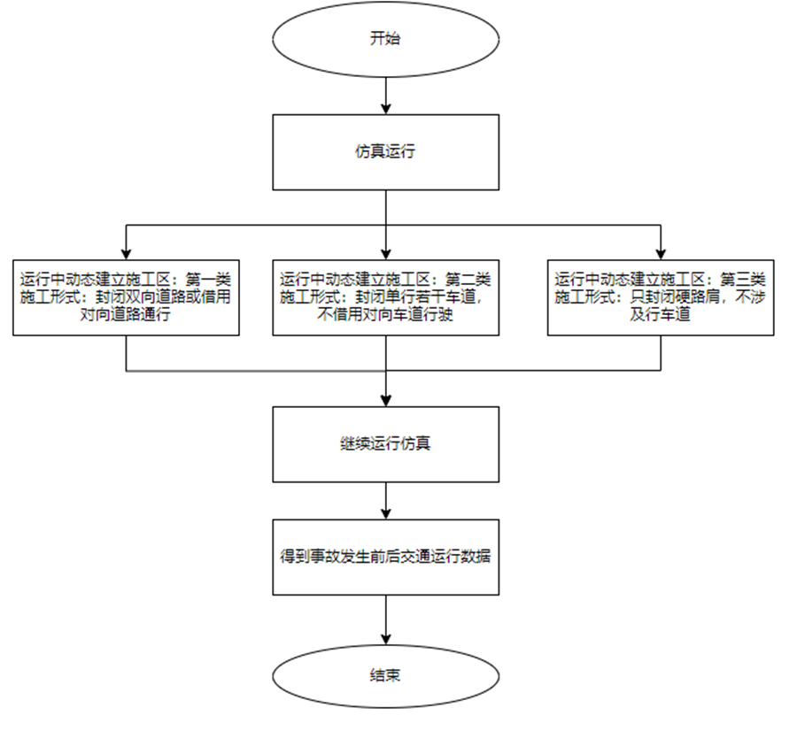

# 经典业务案例

| 大类             | 功能项                           |
| ---------------- | -------------------------------- |
| 高速             | 施工区仿真                       |
|                  | 事故，事件仿真                   |
|                  | 车道限速管控                     |
|                  | 车道关闭仿真                     |
|                  | 硬路肩，应急车道开放             |
|                  | 匝道信号控制                     |
|                  | 拥堵预警                         |
|                  | 高速管控预评价系统               |
|                  | 高快速路参数标定                 |
| 城市             | 单点信控自适应                   |
|                  | 交叉口车道车道渠化变更，可变车道 |
|                  | 干线协调                         |
|                  | 车辆路径诱导                     |
|                  | 拥堵预警                         |
|                  | 车道管控仿真                     |
|                  | 车辆事故仿真                     |
|                  | 车辆速度引导（VMS信息板）        |
|                  | 城市道路参数标定                 |
|                  | 公交信号优先                     |
| V2X 自动驾驶     | v2x交叉口                        |
|                  | 速度引导                         |
|                  | 车辆编队行驶                     |
| 自动驾驶联合仿真 | Carla对接                        |
|                  | prescan对接                      |
|                  | scanner对接                      |
|                  | 交通数字孪生：与UE5，unity结合   |
|                  | 自动驾驶测试场景设计             |

## 1. 案例效果及代码

### 1.1 施工区案例

实现国标三类施工区：借道，不借道，开放硬路肩

<video src="https://www.jidatraffic.com/newWebsite/video/8施工区.mp4"></video>

[github地址](https://github.com/jida-traffic/TESSNG_SecondaryDev_Doc/tree/main/TESS_PythonAPI_demo/3施工区插件开发)

### 1.2 事故事件案例

简述：模拟事故发生前后交通流演变

<video src="https://www.jidatraffic.com/newWebsite/video/9事件事故模拟(new).mp4"></video>

[github地址](https://github.com/jida-traffic/TESSNG_SecondaryDev_Doc/tree/main/TESS_PythonAPI_demo/4事件事故模拟)

### 1.3 车道管控

简述：事故事件发生后，采取车道动态限速，车道关闭， 硬路肩|应急车道开放等管控手段

车道动态限速

<video src="https://www.jidatraffic.com/newWebsite/video/1车道动态管控.mp4"></video>

[github地址](https://github.com/jida-traffic/TESSNG_SecondaryDev_Doc/tree/main/TESS_PythonAPI_demo/5车道动态管控)

车道关闭

<video src="https://www.jidatraffic.com/newWebsite/video/20231206_171710_应急事件-应急车道关闭.mp4"></video>

 硬路肩|应急车道开放

<video src="https://www.jidatraffic.com/newWebsite/video/20231206_172540_应急事件-应急车道开放.mp4"></video>

[github地址](https://github.com/jida-traffic/TESSNG_SecondaryDev_Doc/tree/main/TESS_PythonAPI_demo/6硬路肩应急车道开放)

### 1.4 信号控制

简述： 匝道信号控制，单交叉口信号控制，干线协调信号控制，公交信号优先

匝道信号控制

<video src="https://www.jidatraffic.com/newWebsite/video/10匝道控制(new).mp4"></video>

[github地址](https://github.com/jida-traffic/TESSNG_SecondaryDev_Doc/tree/main/TESS_PythonAPI_demo/7匝道控制)

单交叉口信号控制

<video src="https://www.jidatraffic.com/newWebsite/video/3单点信号控制优化.mp4"></video>

[github地址](https://github.com/jida-traffic/TESSNG_SecondaryDev_Doc/tree/main/TESS_PythonAPI_demo/10单点信控优化)

干线协调信号控制

<video src="https://www.jidatraffic.com/newWebsite/video/4干线绿波控制.mp4"></video>

[github地址](https://github.com/jida-traffic/TESSNG_SecondaryDev_Doc/tree/main/TESS_PythonAPI_demo/12干线绿波控制)

公交信号优先

<video src="https://www.jidatraffic.com/newWebsite/video/5公交优先.mp4"></video>

[github地址](https://github.com/jida-traffic/TESSNG_SecondaryDev_Doc/tree/main/TESS_PythonAPI_demo/16公交优先信号控制)

### 1.5 参数标定

简介：高快速路场景参数标定，城市交叉口参数标定

高快速路场景参数标定

<video src="https://www.jidatraffic.com/newWebsite/video/6.2快速路自动标定（new）.mp4"></video>

[github地址](https://github.com/jida-traffic/TESSNG_SecondaryDev_Doc/tree/main/TESS_PythonAPI_demo/9快速路模型参数标定)

城市交叉口参数标定

<video src="https://www.jidatraffic.com/newWebsite/video/6.1交叉口模型自动化标定.mp4"></video>

[github地址](https://github.com/jida-traffic/TESSNG_SecondaryDev_Doc/tree/main/TESS_PythonAPI_demo/15交叉口模型参数标定)

### 1.6 道路渠化变更可变车道

简介：相对于变更前，不新增|减少流向的前提现，实现可变车道。如2条左转车道，最外侧一根左转专用道修改为直行-左转可变车道

<video src="https://www.jidatraffic.com/newWebsite/video/可变车道--渠化编辑.mp4"></video>

[github地址](https://github.com/jida-traffic/TESSNG_SecondaryDev_Doc/tree/main/TESS_PythonAPI_demo/11交叉口车道渠化变更_可变车道)

### 1.7 路径诱导

简介：通过动态修改决策路径实现路径诱导

<video src="https://www.jidatraffic.com/newWebsite/video/7路径诱导（new).mp4"></video>

[github地址](https://github.com/jida-traffic/TESSNG_SecondaryDev_Doc/tree/main/TESS_PythonAPI_demo/14路径诱导)

### 1.8  车辆速度引导

简介：以通行能力或者车均排放等为目标引导车辆以特定范围速度通过交叉口

<video src="https://www.jidatraffic.com/newWebsite/video/2车速引导.mp4"></video>

[github地址](https://github.com/jida-traffic/TESSNG_SecondaryDev_Doc/tree/main/TESS_PythonAPI_demo/13车辆速度引导)

### 1.9 车辆编队行驶

简介：高速公路上AV车辆自动寻找车辆结对编组行驶

[github地址](https://github.com/jida-traffic/TESSNG_SecondaryDev_Doc/tree/main/TESS_PythonAPI_demo/20智能网联混驾场景)

## 2. 联合仿真案例

手动驾驶

<video src="https://www.jidatraffic.com/newWebsite/video/6_手动驾驶4比3.mp4"></video>

域控制器HIL

<video src="https://www.jidatraffic.com/newWebsite/video/7_域控制器HIL_4比3.mp4"></video>

精模CARLA效果

<video src="https://www.jidatraffic.com/newWebsite/video/8_精模CARLA效果.mp4"></video>

VTD_Crossing8效果

<video src="https://www.jidatraffic.com/newWebsite/video/9_VTD_Crossing8效果.mp4"></video>

VTD_无信控路口效果

<video src="https://www.jidatraffic.com/newWebsite/video/10_VTD_无信控路口效果.mp4"></video>

SCANeR_Crossing8

<video src="https://www.jidatraffic.com/newWebsite/video/11_SCANeR_Crossing8.mp4"></video>

SCANeR_同济测试场

<video src="https://www.jidatraffic.com/newWebsite/video/12_SCANeR_同济测试场.mp4"></video>

SILAB效果

<video src="https://www.jidatraffic.com/newWebsite/video/13_SILAB效果.mp4"></video>

VTS

<video src="https://www.jidatraffic.com/newWebsite/video/14_VTS_4比3.mp4"></video>

[官网链接](https://139.196.85.33/article/20231227)

## 3. 其他经典项目

[官网链接](https://139.196.85.33/spotlight/)

<!-- ex_nonav -->

