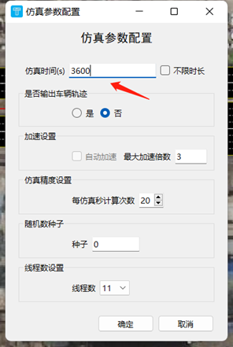
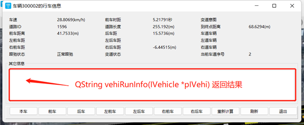

# 接口详解

## 1. 全局配置参数

### 1.1. main.py文件中config属性说明
在创建TESS NG工厂类实例前创建字典config，config配置了一些重要信息，说明如下：
```
{
   "__workspace"xxxxxx",
	"__netfilepath":"xxx.tess",
	"__simuafterload":False,
	"__timebycpu":False,
	"__custsimubysteps":False
}

```
"workspace"：指定“当前工作路径”，TESS NG会在“当前工作路径”的Cert子文件夹下读取认证文件，在”SimuResult”子文件夹下保存仿真结果，等。

"netfilepath"：指定TESSNG启动后加载的路网文件全路径名；

"simuafterload"：指定TESSNG加载路网文件（指定的路网文件或临时空白路网文件）后是否启动仿真；

"timebycpu"：指定每个仿真周期时间计算依据，是cpu时钟确定的时长（现实时长），还是由仿真精度确定的时长。在线仿真且算力吃紧时可以尝试设置此属性为True；

"custsimubysteps"：设置TESSNG对插件方法调用频次的依据，设为False表示每个计算周期都会调用一次插件实现的方法，即不依据插件端设置的调用频次；设为True时TESSNG依据插件设置的调用频次对插件实现的PyCustomerSimulator方法进行调用。

python二次开发环境下，如果运行车辆不多，可以将"custsimubysteps"设为False。如果运行车辆较多，可以将"__custsimubysteps"设为True，再设定实现的方法调用频次，使对仿真效率的负面影响最小化。

### 1.2. 插件方法调用频次控制

TESSNG调用插件方法的频次是指对插件实现的PyCustomerSimulator接口方法调用频次。

当"__custsimubysteps"设置为True时，**默认调用频次比较低，很多低到毫无意义，只为减少调用次数，不至于影响仿真运行效率**。如果某方法被实现，需要对该方法调用频次进行调整。可参见范例。

假设仿真精度是steps，即每秒计算steps次，各方法默认调用频次如下：

1）、车辆相关方法调用频次

计算下一位置前处理方法beforeNextPoint被调用频次：每steps * 300个仿真周期调用一次，即5分钟调用一次；

具体车辆一个步长计算完成后的处理方法afterStep被调用频次：每steps * 300个仿真周期调用一次，即5分钟调用一次；

确定是否停止车辆运行并移出路网方法isStopDriving调用频次：每steps * 300个仿真周期调用一次，即5分钟调用一次；

2）、驾驶行为相关方法调用频次

重新设置期望速度方法reCalcdesirSpeed被调用频次：每steps * 300个仿真周期调用一次，即5分钟调用一次，如果该方法被实现，建议将该方法调用频次设为1个计算周期调用1次或更大。

计算最大限速方法calcMaxLimitedSpeed被调用频次：每steps * 300个仿真周期调用一次，即5分钟调用一次。如果该方法被实现，建议将该方法调用频次设为20个计算周期调用1次或更小。

计算限制车道方法calcLimitedLaneNumber被调用频次：每steps个仿真周期调用一次，即每秒调用一次。如果该方法被实现，建议将该方法调用频次设为20个计算周期调用1次或更小。

计算车道限速方法calcSpeedLimitByLane被调用频次：每steps个仿真周期调用一次，即每秒调用一次。如果该方法被实现，建议将该方法调用频次设为20个计算周期调用1次或更小。

计算安全变道方法calcChangeLaneSafeDist被调用频次：每steps个仿真周期调用一次，即每秒调用一次。如果该方法被实现，建议将该方法调用频次设为20个计算周期调用1次或更小。

重新计算是否可以左强制变道方法reCalcToLeftLane被调用频次：每steps个仿真周期调用一次，即每秒调用一次。如果该方法被实现，建议将该方法调用频次设为20个计算周期调用1次或更小。

重新计算是否可以右强制变道方法reCalcToRightLane被调用频次：每steps个仿真周期调用一次，即每秒调用一次。如果该方法被实现，建议将该方法调用频次设为20个计算周期调用1次或更小。

重新计算是否可以左自由变道方法reCalcToLeftFreely被调用频次：每steps个仿真周期调用一次，即每秒调用一次。如果该方法被实现，建议将该方法调用频次设为20个计算周期调用1次或更小。

重新计算是否可以右自由变道方法reCalcToRightFreely被调用频次：每steps个仿真周期调用一次，即每秒调用一次。如果该方法被实现，建议将该方法调用频次设为20个计算周期调用1次或更小。

计算跟驰类型后处理方法afterCalcTracingType被调用频次：每steps * 300个仿真周期调用一次，即5分钟调用一次。如果该方法被实现，建议将该方法调用频次设为20个计算周期调用1次或更小。

连接段上汇入到车道前处理方法beforeMergingToLane被调用频次：每steps * 300个仿真周期调用一次，即5分钟调用一次。如果该方法被实现，建议将该方法调用频次设为1个计算周期调用1次或更大。

重新计算跟驰状态参数方法reSetFollowingType被调用频次：每steps * 300个仿真周期调用一次，即5分钟调用一次。如果该方法被实现，建议将该方法调用频次设为1个计算周期调用1次或更大。

计算加速度方法calcAcce被调用频次：每steps * 300个仿真周期调用一次，即5分钟调用一次。如果该方法被实现，建议将该方法调用频次设为1个计算周期调用1次或更大。

重新计算加速度方法reSetAcce被调用频次：每steps * 300个仿真周期调用一次，即5分钟调用一次。如果该方法被实现，建议将该方法调用频次设为1个计算周期调用1次或更大。

重置车速方法reSetSpeed被调用频次：每steps * 300个仿真周期调用一次，即5分钟调用一次。如果该方法被实现，建议将该方法调用频次设为1个计算周期调用1次或更大。

重新计算角度方法reCalcAngle被调用频次：每steps * 300个仿真周期调用一次，即5分钟调用一次。如果该方法被实现，建议将该方法调用频次设为1个计算周期调用1次或更大。

计算后续道路前处理方法beforeNextRoad被调用频次：每steps * 300个仿真周期调用一次，即5分钟调用一次。如果该方法被实现，建议将该方法调用频次设为1个计算周期调用1次或更大。

### 1.3. 仿真过程中gui界面车辆重绘控制

可以在PyCustomerSimulator的initVehicle(self, pIVehicle:Tessng.IVehicle)方法里通过pIVehicle设置TESSNG对PyCustomerSimulator不同方法调用频次及是否允许插件重绘车辆。

是否允许对车辆重绘方法的调用：默认为False，如果允许，可以传入True，如：pIVehicle.setIsPermitForVehicleDraw(True)。可以通过pIVehicle得到该车辆类型及ID等信息来确定是否允许对该车辆重绘。


## 2. 路网基本元素

### 2.1. IRoadNet

路网基本信息接口，设计此接口的目的是为了TESS NG在导入外源路网时能够保存这些路网的属性，如路网中心点坐标、空间参考等。

接口方法：

Ø **def id(self) -> int: ...**

路网ID

Ø **def netName(self) -> str: ...**

路网名称

Ø **def url(self) -> str: ..**

源数据路径，可以是本地文件，可以是网络地址

Ø **def type(self) -> str: ...**

来源分类："TESSNG"表示TESSNG自建；"OpenDrive"表示由OpenDrive数据导入；"GeoJson"表示由geojson数据导入

Ø **def bkgUrl(self) -> str: ...**

背景路径

Ø **def otherAttrs(self) -> typing.Dict: ...**

其它属性字曲数据

Ø **def explain(self) -> str: ...**

获取路网说明

Ø **def centerPoint(self) -> PySide2.QtCore.QPointF: ...**

获取路网中心点位置


### 2.2. ISection

路段与连接段的父类接口，方法如下：

Ø **def gtype(self) -> int: ...**

类型，GLinkType 或 GConnectorType。在Tessng.pyi / NetItemType类中定义了一批常量，每一个数值代表路网上一种元素类型。如：GLinkType代表路段、GConnectorType代表连接段。

Ø **def isLink(self) -> bool: ...**

是否是路段

Ø **def id(self) -> int: ...**

获取ID，如果是Link，id是Link的ID，如果是连接段，id是连接段ID

Ø **def sectionId(self) -> int: ...**

获取ID，如果是Link，id是Link的ID，如果是连接段，id是连接段ID+10000000，从而区分路段与连接段

Ø **def name(self) -> str: ...**

获取Section名称，路段名或连接段名

Ø **def setName(self, name:str) -> None: ...**

设置Section名称

Ø **def v3z(self) -> float: ...**

获取Section高程

Ø **def length(self) -> float: ...**

获取Section长度，默认单位：像素

Ø **def laneObjects(self) -> typing.List: ...**

车道与“车道连接”的父类接口列表

Ø **def fromSection(self, id:int=...) -> Tessng.ISection: ...**

根据ID获取上游Section。如果当前是路段, id 为 0 返回空，否则返回上游指定ID的连接段；如果当前是连接段，id 为 0 返回上游路段，否则返回空。

举例：

```python
# 根据id获取路段5上游id为2的连接段
sectionLink = tessngIFace().netInterface().findLink(5)
    sectionConnector = sectionLink.fromSection(2)
    if sectionConnector is not None and sectionConnector.gtype() == NetItemType.GConnectorType:
        print("路段5上游id为2的section为：", sectionConnector.id())

```

 

Ø **def toSection(self, id:int=...) -> Tessng.ISection: ...**

根据ID获取下游 Sction。如果当前是路段, id 为 0 返回空，否则返回下游指定ID的连接段；如果当前是连接段，id 为 0 返回下游路段，否则返回空。

Ø **def setOtherAttr(self, otherAttr:typing.Dict) -> None: ...**

设置路段或连接段其它属性

Ø **def castToLink(self) -> Tessng.ILink: ...**

转换成ILink，如果当前为连接段则返回空

Ø **def castToConnector(self) -> Tessng.IConnector: ...**

转换成IConnector，如果当前为路段则返回空

Ø **def polygon(self) -> PySide2.QtGui.QPolygonF: ...**

获取Section的多边型轮廓顶点构成的多边形

Ø **def workerKey(self) -> int: ...**

Worker节点标识，在分布式环境可用

Ø **def setWorkerKey(self, key:int) -> None: ...**

设置Worker节点，在分布式环境可用

Ø **def fromWorkerKey(self) -> int: ...**

上游Worker节点标识，在分布式环境可用

Ø **def setFromWorkerKey(self, key:int) -> None: ...**

设置上游Worker节点标识，在分布式环境可用

### 2.3 ILaneObject

车道与车道连接的父类接口，方法如下：

Ø **def gtype(self) -> int: ...**

类型，GLaneType或GLaneConnectorType

Ø **def isLane(self) -> bool: ...**

是否车道

Ø **def id(self) -> int: ...**

获取ID，如果是Lane，id是Lane的ID， 如果是车道连接，id是“车道连接”ID

Ø **def length(self) -> float: ...**

获取车道或“车道连接”长度，默认单位：像素

Ø **def section(self) -> Tessng.ISection: ...**

获取所属的ISection

Ø **def fromLaneObject(self, id:int=...) -> Tessng.ILaneObject: ...**

根据ID获取上游 LaneObject。如果当前是车道, id 为 0 返回空，否则返回上游指定ID的“车道连接”；如果当前是连接段，id 为 0 返回上游车道，否则返回空。

Ø **def toLaneObject(self, id:int=...) -> Tessng.ILaneObject: ...**

根据ID获取下游 LaneObject。如果当前是车道, id 为 0 返回空，否则返回下游指定ID的“车道连接”；如果当前是连接段，id 为 0 返回下游车道，否则返回空。

Ø **def centerBreakPoints(self) -> typing.List: ...**

车道或“车道连接”中心线断点集

Ø **def leftBreakPoints(self) -> typing.List: ...**

车道或“车道连接”左侧线断点集

Ø **def rightBreakPoints(self) -> typing.List: ...**

车道或“车道连接”右侧线断点集

Ø **def centerBreakPoint3Ds(self) -> typing.List: ...**

车道或“车道连接”中心线断点(三维)集

Ø **def leftBreakPoint3Ds(self) -> typing.List: ...**

车道或“车道连接”左侧线断点(三维)集

Ø **def rightBreakPoint3Ds(self) -> typing.List: ...**

车道或“车道连接”右侧线断点(三维)集

Ø **def leftBreak3DsPartly(self, fromPoint:PySide2.QtCore.QPointF, toPoint:PySide2.QtCore.QPointF) -> typing.List: ...**

车道或“车道连接”左侧部分断点(三维)集

参数：

[in] fromPoint：中心线上某一点作为起点

[in] toPoint：中心线上某一点作为终点

Ø **def rightBreak3DsPartly(self, fromPoint:PySide2.QtCore.QPointF, toPoint:PySide2.QtCore.QPointF) -> typing.List: ...**

车道或“车道连接”右侧部分断点(三维)集

参数：

[in] fromPoint：中心线上某一点作为起点

[in] toPoint：中心线上某一点作为终点

Ø **def distToStartPoint(self, p:PySide2.QtCore.QPointF) -> float: ...**

中心线上一点到起点距离

Ø **def distToStartPointWithSegmIndex(self, p:PySide2.QtCore.QPointF, segmIndex:int=..., bOnCentLine:bool=...) -> float: ...**

中心线上一点到起点距离，附加条件是该点所在车道上的分段序号

参数：

[in] p：当前中心线上点或附近点的坐标

[in] segmIndex：参数p点所在车道上的分段序号

[in] bOnCentLine：参数p点是否在中心线上

Ø **def getPointAndIndexByDist(self, dist:float, outPoint:PySide2.QtCore.QPointF, outIndex:int) -> bool: ...**

求中心线起点向前延伸dist距离后所在点及分段序号, 如果目标点不在中心线上返回False，否则返回True

参数：

[in] dist：中心线起点向前延伸的距离

[out] outPoint：中心线起点向前延伸dist距离后所在点

[out] outIndex：中心线起点向前延伸dist距离后所在分段序号

举例：

```python
# 路段5最左侧车道向前延伸140米后所在点及分段序号
        link = tessngIFace().netInterface().findLink(5)
        laneObjLeft = link.laneObjects()[-1] 
        outPoint = QPointF()
        outIndex = 0
        dist = m2p(140)
        if laneObjLeft.getPointAndIndexByDist(dist, outPoint, outIndex) is not None:
    print("路段5最左侧车道向前延伸140米后所在点坐标为：({}, {})，分段序号为：{}".format(outPoint.x(), outPoint.y(), outIndex))

```

 

Ø **def getPointByDist(self, dist:float, outPoint:PySide2.QtCore.QPointF) -> bool: ...**

求中心线起点向前延伸dist距离后所在点, 如果目标点不在中心线上返回False，否则返回True

Ø **def setOtherAttr(self, attr:typing.Dict) -> None: ...**

设置车道或“车道连接”其它属性

Ø **def castToLane(self) -> Tessng.ILane: ...**

将ILaneObject转换为ILane，如果当前ILaneObject是“车道连接”则返回空

Ø **def castToLaneConnector(self) -> Tessng.ILaneConnector: ...**

将ILaneObject转换为ILaneConnector，如果当前ILaneObject是车道则返回空

### 2.4. ILink

路段接口，方法如下：

Ø **def gtype(self) -> int: ...**

类型，返回GLinkType

Ø **def id(self) -> int: ...**

获取路段ID

Ø **def length(self) -> float: ...**

获取路段长度，默认单位：像素

Ø **def width(self) -> float: ...**

获取路段宽度

Ø **def z(self) -> float: ...**

获取路段高程

Ø **def v3z(self) -> float: ...**

获取路段高程，过载ISection的方法

Ø **def name(self) -> str: ...**

获取路段名称

Ø **def setName(self, name:str) -> None: ...**

设置路段名称

Ø **def linkType(self) -> str: ...**

获取路段类型，如：城市主干道、城市次干道、人行道等

Ø **def setType(self, type:str) -> None: ...**

设置路段类型，路段类型有10种，分别为：高速路、城市快速路、匝道、城市主要干道、次要干道、地方街道、非机动车道、人行道、公交专用道和机非共享

Ø **def laneCount(self) -> int: ...**

获取车道数

Ø **def limitSpeed(self) -> float: ...**

获取路段最高限速，单位：千米/小时

Ø **def setLimitSpeed(self, speed:float) -> None: ...**

设置最高限速

参数：

[in] speed：最高限速，单位：千米/小时

举例：

```python
link = None
# 创建路段省略
if link is not None:
# 设置路段限速30km/h
link.setLimitSpeed(30)

```

 

Ø **def minSpeed(self) -> float: ...**

最低限速，单位：千米/小时

Ø **def lanes(self) -> typing.List: ...**

车道接口列表

Ø **def laneObjects(self) -> typing.List: ...**

车道及“车道连接”的接口列表

Ø **def centerBreakPoints(self) -> typing.List: ...**

路段中心线断点集

Ø **def leftBreakPoints(self) -> typing.List: ...**

路段左侧线断点集

Ø **def rightBreakPoints(self) -> typing.List: ...**

路段右侧线断点集

Ø **def centerBreakPoint3Ds(self) -> typing.List: ...**

路段中心线断点(三维)集

Ø **def leftBreakPoint3Ds(self) -> typing.List: ...**

路段左侧线断点(三维)集

Ø **def rightBreakPoint3Ds(self) -> typing.List: ...**

路段右侧线断点(三维)集

Ø **def fromConnectors(self) -> typing.List: ...**

上游连接段列表

Ø **def toConnectors(self) -> typing.List: ...**

下游连接段列表

Ø **def fromSection(self, id:int=...) -> Tessng.ISection: ...**

根据ID获取上游Section。如果当前是路段, id 为 0 返回空，否则返回上游指定ID的连接段；如果当前是连接段，id 为 0 返回上游路段，否则返回空。

Ø **def toSection(self, id:int=...) -> Tessng.ISection: ...**

根据ID获取下游 Sction。如果当前是路段, id 为 0 返回空，否则返回下游指定ID的连接段；如果当前是连接段，id 为 0 返回下游路段，否则返回空。

Ø **def setOtherAttr(self, otherAttr:typing.Dict) -> None: ...**

设置路段其它属性

Ø **def setLaneTypes(self, lType:typing.Sequence) -> None: ...**

设置车道属性，属性类型包括："机动车道"、"机非共享"、"非机动车道"、"公交专用道"

Ø **def setLaneOtherAtrrs(self, lAttrs:typing.Sequence) -> None: ...**

设置车道其它属性

Ø **def distToStartPoint(self, p:PySide2.QtCore.QPointF) -> float: ...**

中心线上一点到起点距离

Ø **def getPointAndIndexByDist(self, dist:float, outPoint:PySide2.QtCore.QPointF, outIndex:int) -> bool: ...**

求中心线起点向前延伸dist距离后所在点及分段序号, 如果目标点不在中心线上返回False，否则返回True

参数：

[in] dist：中心线起点向前延伸的距离

[out] outPoint：中心线起点向前延伸dist距离后所在点

[out] outIndex：中心线起点向前延伸dist距离后所在分段序号

Ø **def getPointByDist(self, dist:float, outPoint:PySide2.QtCore.QPointF) -> bool: ...**

求中心线起点向前延伸dist距离后所在点, 如果目标点不在中心线上返回False，否则返回True

Ø **def polygon(self) -> PySide2.QtGui.QPolygonF: ...**

获取路段的多边型轮廓顶点


### 2.5. ILane

车道接口，方法如下：

Ø **def gtype(self) -> int: ...**

类型，车道类型为GLaneType

Ø **def id(self) -> int: ...**

获取车道ID

Ø **def link(self) -> Tessng.ILink: ...**

获取车道所在路段

Ø **def section(self) -> Tessng.ISection: ...**

获取车道所属Section

Ø **def length(self) -> float: ...**

获取车道长度，默认单位：像素

Ø **def width(self) -> float: ...**

获取车道宽度，默认单位：像素

Ø **def number(self) -> int: ...**

获取车道序号，从0开始（自外侧往内侧）

Ø **def actionType(self) -> str: ...**

获取车道的行为类型

Ø **def fromLaneObject(self, id:int=...) -> Tessng.ILaneObject: ...**

根据ID获取上游 LaneObject。id 为 0 返回空，否则返回上游指定ID的“车道连接

Ø **def toLaneObject(self, id:int=...) -> Tessng.ILaneObject: ...**

根据ID获取下游 LaneObject。id 为 0 返回空，否则返回下游指定ID的“车道连接”

Ø **def centerBreakPoints(self) -> typing.List: ...**

获取车道中心点断点集，断点坐标用像素表示

Ø **def leftBreakPoints(self) -> typing.List: ...**

车道左侧线断点集

Ø **def rightBreakPoints(self) -> typing.List: ...**

车道右侧线断点集

Ø **def centerBreakPoint3Ds(self) -> typing.List: ...**

车道中心线断点(三维)集

Ø **def leftBreakPoint3Ds(self) -> typing.List: ...**

车道左侧线断点(三维)集

Ø **def rightBreakPoint3Ds(self) -> typing.List: ...**

车道右侧线断点(三维)集

Ø **def leftBreak3DsPartly(self, fromPoint:PySide2.QtCore.QPointF, toPoint:PySide2.QtCore.QPointF) -> typing.List: ...**

车道左侧部分断点(三维)集

参数：

[in] fromPoint：中心线上某一点作为起点

[in] toPoint：中心线上某一点作为终点

Ø **def rightBreak3DsPartly(self, fromPoint:PySide2.QtCore.QPointF, toPoint:PySide2.QtCore.QPointF) -> typing.List: ...**

车道右侧部分断点(三维)集

参数：

[in] fromPoint：中心线上某一点作为起点

[in] toPoint：中心线上某一点作为终点

Ø **def distToStartPoint(self, p:PySide2.QtCore.QPointF) -> float: ...**

中心线上一点到起点距离

Ø **def distToStartPointWithSegmIndex(self, p:PySide2.QtCore.QPointF, segmIndex:int=..., bOnCentLine:bool=...) -> float: ...**

中心线上一点到起点距离，附加条件是该点所在车道上的分段序号

参数：

[in] p：当前中心线上该点坐标

[in] segmIndex：该点所在车道上的分段序号

[in] bOnCentLine：是否在中心线上

Ø **def getPointAndIndexByDist(self, dist:float, outPoint:PySide2.QtCore.QPointF, outIndex:int) -> bool: ...**

求中心线起点向前延伸dist距离后所在点及分段序号, 如果目标点不在中心线上返回False，否则返回True

参数：

[in] dist：中心线起点向前延伸的距离

[out] outPoint：中心线起点向前延伸dist距离后所在点

[out] outIndex：中心线起点向前延伸dist距离后所在分段序号

Ø **def getPointByDist(self, dist:float, outPoint:PySide2.QtCore.QPointF) -> bool: ...**

求中心线起点向前延伸dist距离后所在点, 如果目标点不在中心线上返回False，否则返回True

Ø **def setOtherAttr(self, attr:typing.Dict) -> None: ...**

设置车道其它属性

Ø **def setLaneType(self, type:str) -> None: ...**

设置车道类型

参数：

[in] type：车道类型，选下列几种类型其中一种："机动车道"、"机非共享"、"非机动车道"、 "公交专用道"

Ø **def polygon(self) -> PySide2.QtGui.QPolygonF: ...**

获取车道的多边型轮廓顶点


### 2.6. IConnector

连接段接口，方法如下：

Ø **def gtype(self) -> int: ...**

类型，连接段类型为GConnectorType

Ø **def id(self) -> int: ...**

获取连接段ID

Ø **def length(self) -> float: ...**

获取连接段长度

Ø **def z(self) -> float: ...**

获取连接段高程

Ø **def v3z(self) -> float: ...**

获取连接段高程，过载自ISection的方法

Ø **def name(self) -> str: ...**

获取连接段名称

Ø **def setName(self, name:str) -> None: ...**

设置连接段名称

Ø **def fromLink(self) -> Tessng.ILink: …**

获取起始路段

Ø **def toLink(self) -> Tessng.ILink: ...**

获取目标路段

Ø **def fromSection(self, id:int=...) -> Tessng.ISection: ...**

根据ID获取上游Section。如果当前是路段, id 为 0 返回空，否则返回上游指定ID的连接段；如果当前是连接段，id 为 0 返回上游路段，否则返回空。

Ø **def toSection(self, id:int=...) -> Tessng.ISection: ...**

根据ID获取下游 Sction。如果当前是路段, id 为 0 返回空，否则返回下游指定ID的连接段；如果当前是连接段，id 为 0 返回下游路段，否则返回空。

Ø **def limitSpeed(self) -> float: ...**

获取最高限速，以起始路段的最高限速作为连接段的最高限速

Ø **def minSpeed(self) -> float: ...**

获取最低限速，以起始路段的最低限速作为连接段的最低限速

Ø **def laneConnectors(self) -> typing.List: ...**

获取“车道连接”列表

Ø **def laneObjects(self) -> typing.List: ...**

车道及“车道连接”的接口列表

Ø **def setLaneConnectorOtherAtrrs(self, lAttrs:typing.Sequence) -> None: ...**

设置包含的“车道连接”其它属性

Ø **def setOtherAttr(self, otherAttr:typing.Dict) -> None: ...**

设置连接段其它属性

Ø **def polygon(self) -> PySide2.QtGui.QPolygonF: ...**

获取连接段的多边型轮廓顶点


### 2.7. ILaneConnector

“车道连接”接口，方法如下：

Ø **def gtype(self) -> int: ...**

类型，GLaneType或GLaneConnectorType，车道连接段为GLaneConnectorType

Ø **def id(self) -> int: ...**

获取车道连接ID

Ø **def connector(self) -> Tessng.IConnector: ...**

获取车道连接所在连接段

Ø **def section(self) -> Tessng.ISection: ...**

获取车道所属Section

Ø **def fromLane(self) -> Tessng.ILane: ...**

上游车道

Ø **def toLane(self) -> Tessng.ILane: ...**

下游车道

Ø **def fromLaneObject(self, id:int=...) -> Tessng.ILaneObject: ...**

根据ID获取上游 LaneObject。id 为 0 返回空，否则返回上游指定ID的“车道连接

Ø **def toLaneObject(self, id:int=...) -> Tessng.ILaneObject: ...**

根据ID获取下游 LaneObject。id 为 0 返回空，否则返回下游指定ID的“车道连接”

Ø **def length(self) -> float: ...**

“车道连接”长度，单位：像素

Ø **def centerBreakPoints(self) -> typing.List: ...**

获取“车道连接”中心线断点集，断点坐标用像素表示

Ø **def leftBreakPoints(self) -> typing.List: ...**

“车道连接”左侧线断点集

Ø **def rightBreakPoints(self) -> typing.List: ...**

“车道连接”右侧线断点集

Ø **def centerBreakPoint3Ds(self) -> typing.List: ...**

“车道连接”中心线断点(三维)集

Ø **def leftBreakPoint3Ds(self) -> typing.List: ...**

“车道连接”左侧线断点(三维)集

Ø **def rightBreakPoint3Ds(self) -> typing.List: ...**

“车道连接”右侧线断点(三维)集

Ø **def leftBreak3DsPartly(self, fromPoint:PySide2.QtCore.QPointF, toPoint:PySide2.QtCore.QPointF) -> typing.List: ...**

“车道连接”左侧部分断点(三维)集

Ø **def rightBreak3DsPartly(self, fromPoint:PySide2.QtCore.QPointF, toPoint:PySide2.QtCore.QPointF) -> typing.List: ...**

“车道连接”右侧部分断点(三维)集

Ø **def distToStartPoint(self, p:PySide2.QtCore.QPointF) -> float: ...**

中心线上一点到起点距离

Ø **def distToStartPointWithSegmIndex(self, p:PySide2.QtCore.QPointF, segmIndex:int=..., bOnCentLine:bool=...) -> float: ...**

中心线上一点到起点距离，附加条件是该点所在车道上的分段序号

参数：

[in] p：当前中心线上该点坐标

[in] segmIndex：该点所在车道上的分段序号

[in] bOnCentLine：是否在中心线上

Ø **def getPointAndIndexByDist(self, dist:float, outPoint:PySide2.QtCore.QPointF, outIndex:int) -> bool: ...**

求中心线起始point向前延伸dist距离后所在点及分段序号, 如果目标点不在中心线上返回False，否则返回True

参数：

[in] dist：中心线起点向前延伸的距离

[out] outPoint：中心线起点向前延伸dist距离后所在点

[out] outIndex：中心线起点向前延伸dist距离后所在分段序号

Ø **def getPointByDist(self, dist:float, outPoint:PySide2.QtCore.QPointF) -> bool: ...**

求中心线起始point向前延伸dist距离后所在点, 如果目标点不在中心线上返回False，否则返回True

Ø **def setOtherAttr(self, attr:typing.Dict) -> None: ...**

设置车道连接其它属性


### 2.8. IConnectorArea

面域接口，方法如下：

Ø **def id(self) -> int: ...**

面域ID

Ø **def allConnector(self) -> typing.List: ...**

面域相关所有连接段

Ø **def centerPoint(self) -> PySide2.QtCore.QPointF: ...**

面域中心点

Ø **def workerKey(self) -> int: ...**

获取Worker 标识符，分布式环境可用

Ø **def setWorkerKey(self, key:int) -> None: ...**

设置 Worker 标识符，分布式环境可用


### 2.9. IDispatchPoint

发车点接口，方法如下：

Ø **def id(self) -> int: ...**

获取发车点ID

Ø **def name(self) -> str: ...**

获取发车名称

Ø **def link(self) -> Tessng.ILink: ...**

获取发车点所在路段

Ø **def addDispatchInterval(self, vehiCompId:int, interval:int, vehiCount:int) -> int: ...**

为发车点增加发点间隔

参数：

vehicCompId：车型组成ID

interval：时间段，单位：秒

vehiCount：发车数

返回值：

返回发车间隔ID

举例：

```python
# 新建发车点,车型组成ID为动态创建的，600秒发300辆车
if link1:
    dp = netiface.createDispatchPoint(link1)
    if dp:
        dp.addDispatchInterval(vehiCompositionID, 600, 300)

```

Ø **def setDynaModified(self, bModified:bool) -> None: ...**

设置是否被动态修改，默认情况下发车信息被动态修改后，整个文件不能保存，以免破坏原有发车设置

Ø **def polygon(self) -> PySide2.QtGui.QPolygonF: ...**

获取发车点多边型轮廓的顶点


------


### 2.10. IDecisionPoint

决策点接口，方法如下：

Ø **def id(self) -> int: ...**

决策点ID

Ø **def name(self) -> str: ...**

决策点名称

Ø **def link(self) -> Tessng.ILink: ...**

决策点所在路段

Ø **def distance(self) -> float: ...**

距路段起点距离，默认单位：像素

Ø **def routings(self) -> typing.List: ...**

相关决策路径

Ø **def setDynaModified(self, bModified:bool) -> None: ...**

设置是否被动态修改，默认情况下发车信息被动态修改后，整个文件不能保存，以免破坏原有发车设置

参数：

[in] bModified：是否被动态修改，True为被动态修改，False为未被动态修改

Ø **def polygon(self) -> PySide2.QtGui.QPolygonF: ...**

决策点多边型轮廓

------


### 2.11. IRouting

路径接口，方法如下：

Ø **def id(self) -> int: ...**

路径ID

Ø **def calcuLength(self) -> float: ...**

计算路径长度

Ø **def getLinks(self) -> typing.List: ...**

获取路段序列

Ø **def deciPointId(self) -> int: ...**

所属决策点ID

Ø **def contain(self, pRoad:Tessng.ISection) -> bool: ...**

根据所给道路判断是否在当前路径上

Ø **def nextRoad(self, pRoad:Tessng.ISection) -> Tessng.ISection: ...**

根据所给道路求下一条道路

参数：

[in] pRoad：路段或连接段


### 2.12. ISignalLamp

信号灯接口，方法如下：

Ø **def id(self) -> int: ...**

获取信号灯ID

Ø **def setName(self, name:str) -> None: ...**

设置信号灯名称

Ø **def setLampColor(self, colorStr:str) -> None: ...**

设置信号灯颜色

参数：

[in] colorStr：字符串表达的颜色，有四种可选，分别是"红"、"绿"、"黄"、"灰"，或者是"R"、"G"、"Y"、"grey"。

Ø **def signalPhase(self) -> Tessng.ISignalPhase: ...**

获取信号灯所在相位

Ø **def signalGroup(self) -> Tessng.ISignalGroup: ...**

获取信号灯所在灯组

Ø **def setDistToStart(self, dist:float) -> None: ...**

设置信号灯距车道起点（或“车道连接”起点）距离，默认单位：像素

Ø **def polygon(self) -> PySide2.QtGui.QPolygonF: ...**

获取信号灯多边型轮廓


### 2.13. ISignalPhase

信号相位，接口方法：

Ø **def id(self) -> int: ...**

相位ID

Ø **def number(self) -> int: ...**

相位序号，从1开始

Ø **def phaseName(self) -> str: ...**

相位名称

Ø **def signalGroup(self) -> Tessng.ISignalGroup: ...**

相位所在信号灯组对象

Ø **def signalLamps(self) -> typing.List: ...**

本相位下的信号灯列表

Ø **def listColor(self) -> typing.List: ...**

相位灯色列表

Ø **def setColorList(self, lColor:typing.Sequence) -> None: ...**

设置信号灯列表

参数：

[in] lColor：灯色时长信息，包含信号灯颜色和信号灯时长

举例：

```python
#以L12路段相位直行信号灯相位为例（ID为7），由红90绿32黄3红25改为红10绿110黄3红28
if method_number == 3:
    signalPhase_L12_7 = netiface.findSignalPhase(7)
    color_list = []  # 按照红灯、绿灯、黄灯、红灯顺序计算
    color_list.append(Online.ColorInterval('红', 10))
    color_list.append(Online.ColorInterval('绿', 110))
    color_list.append(Online.ColorInterval('黄', 3))
    color_list.append(Online.ColorInterval('红', 28))
    signalPhase_L12_7.setColorList(color_list)

```

Ø **def setNumber(self, number:int) -> None: ...**

设置相位序号

Ø **def setPhaseName(self, name:str) -> None: ...**

设置相位名称

### 2.14. ISignalGroup

Ø **def id(self) -> int: ...**

信号灯组ID

Ø **def groupName(self) -> str: ..**

信号灯组名称

Ø **def periodTime(self) -> int: ...**

信号周期：单位秒

Ø **def fromTime(self) -> int: ...**

信号灯组工作的起始时间，自仿真开始计算，单位秒

Ø **def toTime(self) -> int: ...**

信号灯组工作的终止时间，自仿真开始计算，单位秒

Ø **def phases(self) -> typing.List: ...**

当前信号灯组下的相位列表

Ø **def setName(self, name:str) -> None: ...**

设置信号灯组名称

Ø **def setPeriodTime(self, period:int) -> None: ...**

设置信号周期

参数：

[in] period：信号周期，单位：秒

Ø **def setFromTime(self, time:int) -> None: ...**

设置起始时间，单位：秒

Ø **def setToTime(self, time:int) -> None: ...**


### 2.15. IBusLine

公交线路接口，接口方法：

Ø **def id(self) -> int: ...**

获取公交线路ID

Ø **def name(self) -> str: ...**

线路名称

Ø **def length(self) -> float: ...**

长度,单位：像素

Ø **def dispatchFreq(self) -> int: ...**

发车间隔(秒)

Ø **def dispatchStartTime(self) -> int: ...**

发车开始时间(秒)

Ø **def dispatchEndTime(self) -> int: ...**

发车结束时间(秒)

Ø **def desirSpeed(self) -> float: ...**

期望速度(km/h)

Ø **def passCountAtStartTime(self) -> int: ...**

起始载客人数

Ø **def links(self) -> typing.List: ...**

公交线路经过的路段

Ø **def stations(self) -> typing.List: ...**

线路所有站点

Ø **def stationLines(self) -> typing.List: ...**

公交站点线路，当前线路相关站点的上下客等参数

Ø **def setName(self, name:str) -> None: ...**

设置线路名称

Ø **def setDispatchFreq(self, freq:int) -> None: ...**

设置发车间隔，单位：秒

Ø **def setDispatchStartTime(self, startTime:int) -> None: ...**

设置开始发车时间

Ø **def setDispatchEndTime(self, endTime:int) -> None: ...**

设置结束发车时间

Ø **def setDesirSpeed(self, desirSpeed:float) -> None: ...**

设置线路的期望速度

举例：

```python
# 创建公交线路
busLine = tessngIFace().netInterface().createBusLine([link10, link11])
if busLine is not None:
    busLine.setDesirSpeed(m2p(60))

```

Ø **def setPassCountAtStartTime(self, count:int) -> None: ...**

设置起始载客人数


### 2.16. IBusStation

公交站点接口，接口方法：

Ø **def id(self) -> int: ...**

获取公交站点ID

Ø **def name(self) -> str: ...**

线路名称

Ø **def laneNumber(self) -> int: ...**

公交站点所在车道序号

Ø **def x(self) -> float: ...**

位置X

Ø **def y(self) -> float: ...**

位置Y

Ø **def length(self) -> float: ...**

长度，单位：像素

Ø **def stationType(self) -> int: ...**

站点类型 1：路边式、2：港湾式

Ø **def link(self) -> Tessng.ILink: ...**

公交站点所在路段

Ø **def lane(self) -> Tessng.ILane: ...**

公交站点所在车道

Ø **def distance(self) -> float: ...**

公交站点的起始位置距路段起点距离，默认单位：像素

Ø **def setName(self, name:str) -> None: ...**

设置站点名称

Ø **def setDistToStart(self, dist:float) -> None: ...**

设置站点起始点距车道起点距离，默认单位：像素

参数：

[in] dist：距车道起点距离

Ø **def setLength(self, length:float) -> None: ...**

设置长度，默认单位：像素

Ø **def setType(self, type:int) -> None: ...**

设置站点类型

参数：

[in] type：站点类型，1 路侧式、2 港湾式

Ø **def polygon(self) -> PySide2.QtGui.QPolygonF: ...**

公交站点多边型轮廓的顶点

------


### 2.17. IBusStationLine

公交站点-线路接口，通过此接口可以获取指定线路某站点运行参数，如靠站时间、下客百分比等，还可以设置这些参数。

接口方法：

Ø **def id(self) -> int: ...**

获取公交“站点-线路”ID

Ø **def stationId(self) -> int: ...**

公交站点ID

Ø **def lineId(self) -> int: ...**

公交线路ID

Ø **def busParkingTime(self) -> int: ...**

公交车辆停靠时间(秒)

Ø **def getOutPercent(self) -> float: ...**

下客百分比

Ø **def getOnTimePerPerson(self) -> float: ...**

平均每位乘客上车时间，单位：秒

Ø **def getOutTimePerPerson(self) -> float: ...**

平均每位乘客下车时间，单位：秒

Ø **def setBusParkingTime(self, time:int) -> None: ...**

设置车辆停靠时间(秒)

举例：

```python
lStationLine = busLine.stationLines()
if len(lStationLine)>0:
stationLine = lStationLine[0] 
# 设置车辆停靠时间(秒)
stationLine.setBusParkingTime(20)

```

 

Ø **def setGetOutPercent(self, percent:float) -> None: ..**

设置下客百分比

Ø **def setGetOnTimePerPerson(self, time:float) -> None: ...**

设置平均每位乘客上车时间

Ø **def setGetOutTimePerPerson(self, time:float) -> None: ...**

设置平均每位乘客下车时间

------


### 2.18. IVehicleDrivInfoCollector

数据采集器接口，方法如下：

Ø **def id(self) -> int: ...**

获取采集器ID

Ø **def collName(self) -> str: ...**

获取采集器名称

Ø **def onLink(self) -> bool: ...**

是否在路段上，如果True则connector()返回None

Ø **def link(self) -> Tessng.ILink: ...**

采集器所在路段

Ø **def connector(self) -> Tessng.IConnector: ...**

采集器所在连接段

Ø **def lane(self) -> Tessng.ILane: ...**

如果采集器在路段上则lane()返回所在车道，laneConnector()返回None

Ø **def laneConnector(self) -> Tessng.ILaneConnector: ...**

如果采集器在连接段上则laneConnector返回“车道连接”,lane()返回None

Ø **def distToStart(self) -> float: ...**

采集器距离起点距离，默认单位：像素

Ø **def point(self) -> PySide2.QtCore.QPointF: ...**

采集器所在点

Ø **def fromTime(self) -> int: ...**

采集器工作起始时间，单位：秒

Ø **def toTime(self) -> int: ...**

采集器工作停止时间，单位：秒

Ø **def aggregateInterval(self) -> int: ...**

集计数据时间间隔，单位：秒

Ø **def setName(self, name:str) -> None: ...**

设置采集器名称

Ø **def setDistToStart(self, dist:float) -> None: ...**

设置采集器距车道起点（或“车道连接”起点）距离

参数：

[in] dist：采集器距离车道起点（或“车道连接”起点）的距离，默认单位：像素

举例：

```python
collector = tessngIFace().netInterface().createVehiCollectorOnLink(leftLane, dist)
# 将采集器设置到距路段起点400米处
if collector is not None:
    collector.setDistToStart(m2p(400))

```

Ø **def setFromTime(self, time:int) -> None: ...**

设置工作起始时间(秒)

Ø **def setToTime(self, time:int) -> None: ...**

设置工作结束时间(秒)

Ø **def setAggregateInterval(self, interval:int) -> None: ...**

设置集计数据时间间隔(秒)

Ø **def polygon(self) -> PySide2.QtGui.QPolygonF: ...**

获取采集器的多边型轮廓顶点

------


### 2.19. IVehicleQueueCounter

排队计数器接口，方法如下：

Ø **def id(self) -> int: ...**

获取计数器ID

Ø **def counterName(self) -> str: ...**

获取计数器名称

Ø **def onLink(self) -> bool: ...**

是否在路段上，如果True则connector()返回None

Ø **def link(self) -> Tessng.ILink: ...**

计数器所在路段

Ø **def connector(self) -> Tessng.IConnector: ...**

计数器所在连接段

Ø **def lane(self) -> Tessng.ILane: ...**

如果计数器在路段上则lane()返回所在车道，laneConnector()返回None

Ø **def laneConnector(self) -> Tessng.ILaneConnector: ...**

如果计数器在连接段上则laneConnector返回“车道连接”,lane()返回None

Ø **def distToStart(self) -> float: ...**

计数器距离起点距离，默认单位：像素

Ø **def point(self) -> PySide2.QtCore.QPointF: ...**

计数器所在点

举例：

```python
# 在路段9最左侧车道100米处创建排队计数器
counter = tessngIFace().netInterface().createVehiQueueCounterOnLink(leftLane, dist)
if counter is not None:
    print(f"计数器所在点坐标为: ({counter.point().x()}, {counter.point().y()})")

```

Ø **def fromTime(self) -> int: ...**

计数器工作起始时间，单位：秒

Ø **def toTime(self) -> int: ...**

计数器工作停止时间，单位：秒

Ø **def aggregateInterval(self) -> int: ...**

计数集计数据时间间隔，单位：秒

Ø **def setName(self, name:str) -> None: ...**

设置计数器名称

Ø **def setDistToStart(self, dist:float) -> None: ...**

设置计数器距车道起点（或“车道连接”起点）距离

参数：

[in] dist：计数器距离车道起点（或“车道连接”起点）的距离，默认单位：像素

Ø **def setFromTime(self, time:int) -> None: ...**

设置工作起始时间(秒)

Ø **def setToTime(self, time:int) -> None: ...**

设置工作结束时间(秒)

Ø **def setAggregateInterval(self, interval:int) -> None: ...**

设置集计数据时间间隔(秒)

Ø **def polygon(self) -> PySide2.QtGui.QPolygonF: ...**

获取计数器的多边型轮廓顶点

------


### 2.20. IVehicleTravelDetector

行程时间检测器接口，方法如下：

Ø **def id(self) -> int: ...**

获取检测器ID

Ø **def detectorName(self) -> str: ...**

获取检测器名称

Ø **def isStartDetector(self) -> bool: ...**

是否检测器起始点

Ø **def isOnLink_startDetector(self) -> bool: ...**

检测器起点是否在路段上，如果否，则起点在连接段上

Ø **def isOnLink_endDetector(self) -> bool: ...**

检测器终点是否在路段上，如果否，则终点在连接段上

Ø **def link_startDetector(self) -> Tessng.ILink: ...**

如果检测器起点在路段上则link_startDetector()返回起点所在路段，laneConnector_startDetector()返回None

Ø **def laneConnector_startDetector(self) -> Tessng.ILaneConnector: ...**

如果检测器起点在连接段上则laneConnector_startDetector()返回起点“车道连接”,link_startDetector()返回None

Ø **def link_endDetector(self) -> Tessng.ILink: ...**

如果检测器终点在路段上则link_endDetector()返回终点所在路段，laneConnector_endDetector()返回None

Ø **def laneConnector_endDetector(self) -> Tessng.ILaneConnector: ...**

如果检测器终点在连接段上则laneConnector_endDetector()返回终点“车道连接”,link_endDetector()返回None

Ø **def distance_startDetector(self) -> float: ...**

检测器起点距离所在车道起点或“车道连接”起点距离，默认单位：像素

Ø **def distance_endDetector(self) -> float: ...**

检测器终点距离所在车道起点或“车道连接”起点距离，默认单位：像素

Ø **def point_startDetector(self) -> PySide2.QtCore.QPointF: ...**

检测器起点位置

Ø **def point_endDetector(self) -> PySide2.QtCore.QPointF: ...**

检测器终点位置

Ø **def fromTime(self) -> int: ...**

检测器工作起始时间，单位：秒

Ø **def toTime(self) -> int: ...**

检测器工作停止时间，单位：秒

Ø **def aggregateInterval(self) -> int: ...**

集计数据时间间隔，单位：秒

Ø **def setName(self, name:str) -> None: ...**

设置检测器名称

Ø **def setDistance_startDetector(self, dist:float) -> None: ...**

设置检测器起点距车道起点（或“车道连接”起点）距离，默认单位：像素

Ø **def setDistance_endDetector(self, dist:float) -> None: ...**

设置检测器终点距车道起点（或“车道连接”起点）距离，默认单位：像素

Ø **def setFromTime(self, time:int) -> None: ...**

设置工作起始时间，单位：秒

举例：

```python
lVehicleTravelDetector = tessngIFace().netInterface().createVehicleTravelDetector_link2link(link, link, m2p(50),m2p(550))
   if lVehicleTravelDetector is not None:
      for detector in lVehicleTravelDetector:
          detector.setFromTime(10)
          detector.setToTime(60)

```

 

Ø **def setToTime(self, time:int) -> None: ...**

设置工作结束时间，单位：秒

Ø **def aggregateInterval(self) -> int: ...**

设置集计数据时间间隔，单位：秒

Ø **def polygon_startDetector(self) -> PySide2.QtGui.QPolygonF: ...**

获取行程时间检测器起始点多边型轮廓的顶点

Ø **def polygon_endDetector(self) -> PySide2.QtGui.QPolygonF: ...**

获取行程时间检测器终止点多边型轮廓的顶点

------


### 2.21. IGuidArrow

导向箭头接口，方法如下：

Ø **def id(self) -> int: ...**

获取导向箭头ID

Ø **def lane(self) -> Tessng.ILane: ...**

获取导向箭头所在的车道

Ø **def length(self) -> float: ...**

获取导向箭头的长度，默认单位：像素

Ø **def distToTerminal(self) -> float: ...**

获取导向箭头到的终点距离，默认单位：像素

Ø **def polygon(self) -> PySide2.QtGui.QPolygonF: ...**

获取导向箭头的多边型轮廓的顶点

------

### 2.22. IAccidentZone

事故区接口，方法如下：

Ø **def id(self) -> int: ...**

获取事故区ID

Ø **def name(self) -> str: ...**

获取事故区名称

Ø **def location(self) -> float: ...**

获取事故区距所在路段起点的距离，默认单位：像素

Ø **def zoneLength(self) -> float: ...**

获取事故区长度，默认单位：像素

Ø **def section(self) -> Tessng.ISection: ...**

获取事故区所在的路段或连接段

Ø **def roadId(self) -> int: ...**

获取事故区所在路段的ID

Ø **def roadType(self) -> str: ...**

获取事故区所在的道路类型(路段或连接段)

举例：

```python
# 获取事故区所在的道路类型
zone = tessngIFace().netInterface().createAccidentZone(accidentZone)
print(zone.roadType())

```

 

Ø **def laneObjects(self) -> typing.List: ...**

获取事故区占用的车道列表

Ø **def level(self) -> int: ...**

事故等级，分4级，默认为未定等级(0级)持续时间未定，事故区不会自动移除，一般事故(1级)持续时间10分钟，普通事故(2)级持续时间1小时，重大事故(3级)持续时间3小时

Ø **def duration(self) -> int: ...**

事故持续时间，单位：秒。如果值为0，事故持续时间由事故等级决定，大于0则由此值决定

Ø **def needRescue(self) -> int: ...**

是否需要救援，如果为-1，由事故等级决定，重大事故需要求援，如为0不需救援，如果为1需要救援

Ø **def waitTimeBeforeRescue(self) -> int: ...**

救援车辆发车时间距事故产生的时间，默认单位：秒，默认60秒

Ø **def rescueTime(self) -> int: ...**

救援时间，默认60秒，即救援车辆停靠在事故区旁的时间，单位秒

------

### 2.23. IRoadWorkZone

施工区接口，方法如下：

Ø **def id(self) -> int: ...**

获取施工区ID

Ø **def name(self) -> str: ...**

获取施工区名称

Ø **def location(self) -> float: ...**

获取施工区距所在路段起点的距离，默认单位：像素

Ø **def zoneLength(self) -> float: ...**

获取施工区长度，默认单位：像素

Ø **def limitSpeed(self) -> float: ...**

施工区限速（最大车速:像素/秒）

Ø **def sectionId(self) -> int: ...**

获取施工区所在路段或连接段的ID

举例：

```python
# 获取路段9上施工区所在路段的ID
zone = tessngIFace().netInterface().createRoadWorkZone(workZone)
print("施工区所在路段或连接段ID为:", zone.sectionId())

```

Ø **def sectionName(self) -> str: ...**

获取施工区所在路段或连接段的名称

Ø **def sectionType(self) -> str: ...**

获取施工区所在道路的道路类型，link:路段, connector:连接段

Ø **def laneObjects(self) -> typing.List: ...**

获取施工区所占的车道列表

Ø **def duration(self) -> int: ...**

施工持续时间，单位：秒。自仿真过程创建后，持续时间大于此值，则移除

------


## 3. 车辆及驾驶行为


### 3.1. IVehicle

车辆接口，用于访问、控制车辆。通过此接口可以读取车辆属性，初始化时设置车辆部分属性，仿真过程读取当前道路情况、车辆前后左右相邻车辆及与它们的距离，可以在车辆未驰出路网时停止车辆运行等。


接口方法：

Ø **def id(self) -> int: ...**

车辆ID，车辆ID的组成方式为 x * 100000 + y，每个发车点的x值不一样，从1开始递增，y是每个发车点所发车辆序号，从1开始递增。第一个发车点所发车辆ID从100001开始递增，第二个发车点所发车辆ID从200001开始递增。

Ø **def startLink(self) -> Tessng.ILink: ...**

车辆进入路网时起始路段

Ø **def startSimuTime(self) -> int: ...**

车辆进入路网时起始时间

Ø **def roadId(self) -> int: ...**

车辆所在路段或连接段ID

Ø **def road(self) -> int: ...**

道路，如果在路段上返回ILink, 如果在连接段上返回IConnector

Ø **def section(self) -> Tessng.ISection: ...**

车辆所在的Section，即路段或连接段

Ø **def laneObj(self) -> Tessng.ILaneObject: ...**

车辆所在的车道或“车道连接”

Ø **def segmIndex(self) -> int: ...**

车辆在当前LaneObject上分段序号

Ø **def roadIsLink(self) -> bool: ...**

车辆所在道路是否路段

Ø **def roadName(self) -> str: ...**

道路名

Ø **def initSpeed(self, speed:float=...) -> float: ...**

初始化车速

参数：

[in] speed：车速，如果大于0，车辆以指定的速度从发车点出发，单位：像素/秒

返回：初始化车速，单位：像素/秒

Ø **def initLane(self, laneNumber:int, dist:float=..., speed:float=...) -> None: ...**

初始化车辆, laneNumber:车道序号，从0开始；dist，距起点距离，单位像素；speed：车速，像素/秒

参数：

[in] laneNumber：车道序号，从0开始

[in] dist：距离路段起点距离，单位：像素

[in] speed：起动时的速度，单位：像素/秒

举例：

```python
# 初始化飞机位置
if tmpId == 1:
    IVehicle.setVehiType(12)
    IVehicle.initLane(3, m2p(105), 0)

```

 

Ø **def initLaneConnector(self, laneNumber:int, toLaneNumber:int, dist:float=..., speed:float=...) -> None: ...**

初始化车辆, laneNumber: “车道连接”起始车道在所在路段的序号，从0开始自右往左；toLaneNumber:“车道连接”目标车道在所在路段的序号，从0开始自右往左， dist，距起点距离，单位像素；speed：车速，像素/秒

参数：

[in] laneNumber：车道序号，从0开始自右侧至左侧

[in] toLaneNumber：车道序号，从0开始自右侧至左侧

[in] dist：距离路段起点距离，单位：像素

[in] speed：起动时的速度，单位：像素/秒

Ø **def setVehiType(self, code:int) -> None: ...**

设置车辆类型，车辆被创建时已确定了类型，通过此方法可以改变车辆类型

参数：

[in] code：车辆类型编码

Ø **def length(self) -> float: ...**

路段或连接段长度，单位：像素

Ø **def setLength(self, len:float, bRestWidth:bool=...) -> None: ...**

设置车辆长度

参数：

[in] len：车辆长度，单位：像素

[in] bRestWidth：是否同比例约束宽度，默认为False

Ø **def laneId(self) -> int: ...**

如果toLaneId() 小于等于0，那么laneId()获取的是当前所在车道ID，如果toLaneId()大于0，则车辆在“车道连接”上，laneId()获取的是上游车道ID

Ø **def toLaneId(self) -> int: ...**

下游车道ID。如果小于等于0，车辆在路段的车道上，否则车辆在连接段的“车道连接”上

Ø **def lane(self) -> Tessng.ILane: ...**

获取当前车道，如果车辆在“车道连接”上，获取的是“车道连接”的上游车道

Ø **def toLane(self) -> Tessng.ILane: ...**

如果车辆在“车道连接”上，返回“车道连接”的下游车道，如果当前不在“车道连接”上，返回对象为空

Ø **def laneConnector(self) -> Tessng.ILaneConnector: ...**

获取当前“车道连接”，如果在车道上，返回空

Ø **def currBatchNumber(self) -> int: ...**

当前仿真计算批次

Ø **def roadType(self) -> int: ...**

车辆所在道路类型。包NetItemType中定义了一批常量，每一个数值代表路网上一种元素类型。如：GLinkType代表路段、GConnectorType代表连接段。

Ø **def limitMaxSpeed(self) -> float: ...**

车辆所在路段或连接段最大限速，兼顾到车辆的期望速度，单位：像素/秒

Ø **def limitMinSpeed(self) -> float: ...**

车辆所在路段或连接段最小限速，兼顾到车辆的期望速度，单位：像素/秒

Ø **def vehicleTypeCode(self) -> int: ...**

车辆类型编码。打开TESSNG，通过菜单“车辆”->“车辆类型”打开车辆类型编辑窗体，可以看到不同类型车辆的编码

Ø **def vehicleTypeName(self) -> str: ...**

获取车辆类型名，如“小客车”

Ø **def name(self) -> str: ...**

获取车辆名称

Ø **def vehicleDriving(self) -> Tessng.IVehicleDriving: ...**

获取车辆驾驶行为接口

Ø **def driving(self) -> None: ...**

驱动车辆。在每个运算周期，每个在运行的车辆被调用一次该方法

Ø **def pos(self) -> PySide2.QtCore.QPointF: ...**

当前位置，横纵坐标单位：像素

Ø **def zValue(self) -> float: ...**

当前高程，单位：像素

Ø **def acce(self) -> float: ...**

当前加速度，单位：像素/秒^2

Ø **def currSpeed(self) -> float: ...**

当前速度，单位：像素/秒

Ø **def angle(self) -> float: ...**

当前角度，北向0度顺时针

Ø **def isStarted(self) -> bool: ...**

是否在运行，如果返回False，表明车辆已驰出路网或尚未上路

Ø **def vehicleFront(self) -> Tessng.IVehicle: ...**

前车

Ø **def vehicleRear(self) -> Tessng.IVehicle: ...**

后车

Ø **def vehicleLFront(self) -> Tessng.IVehicle: ...**

左前车

Ø **def vehicleLRear(self) -> Tessng.IVehicle: ...**

左后车

Ø **def vehicleRFront(self) -> Tessng.IVehicle: ...**

右前车

Ø **def vehicleRRear(self) -> Tessng.IVehicle: ...**

右后车

Ø **def vehiDistFront(self) -> float: ...**

前车间距，单位：像素

Ø **def vehiSpeedFront(self) -> float: ...**

前车速度，单位：像素/秒

Ø **def vehiHeadwayFront(self) -> float: ...**

距前车时距

Ø **def vehiDistRear(self) -> float: ...**

后车间距，单位：像素

Ø **def vehiSpeedRear(self) -> float: ...**

后车速度，单位：像素/秒

Ø **def vehiHeadwaytoRear(self) -> float: ...**

距后车时距

Ø **def vehiDistLLaneFront(self) -> float: ...**

相邻左车道前车间距，单位：像素

Ø **def vehiSpeedLLaneFront(self) -> float: ...**

相邻左车道前车速度，单位：像素/秒

Ø **def vehiDistLLaneRear(self) -> float: ...**

相邻左车道后车间距，单位：像素

Ø **def vehiSpeedLLaneRear(self) -> float: ...**

相邻左车道后车速度，单位：像素/秒

Ø **def vehiDistRLaneFront(self) -> float: ...**

相邻右车道前车间距，单位：像素

Ø **def vehiSpeedRLaneFront(self) -> float: ...**

相邻右车道前车速度，单位：像素/秒

Ø **def vehiDistRLaneRear(self) -> float: ...**

相邻右车道后车间距，单位：像素

Ø **def vehiSpeedRLaneRear(self) -> float: ...**

相邻右车道后车速度，单位：像素/秒

Ø **def setIsPermitForVehicleDraw(self, bDraw:bool) -> None: ...**

设置是否允许插件绘制车辆

Ø **def lLaneObjectVertex(self) -> typing.List: ...**

车道或车道连接中心线内点集

Ø **def routing(self) -> Tessng.IRouting: ...**

当前路径

Ø **def picture(self) -> PySide2.QtGui.QPicture: ...**

获取车辆图片

Ø **def boundingPolygon(self) -> PySide2.QtGui.QPolygonF: ...**

获取车辆由方向和长度决定的四个拐角构成的多边型

Ø **def setTag(self, tag:int) -> None: ...**

设置标签表示的状态

Ø **def tag(self) -> int: ...**

获取标签表示的状态

Ø **def setTextTag(self, text:str) -> None: ...**

设置文本信息，用于在运行过程保存临时信息，方便开发

Ø **def textTag(self) -> str: ...**

文本信息，运行过程临时保存的信息，方便开发

Ø **def setJsonInfo(self, info:typing.Dict) -> None: ...**

设置json格式数据

Ø **def jsonInfo(self) -> typing.Dict: ...**

返回json格式数据

Ø **def jsonProperty(self, propName:str) -> typing.Any: ...**

返回json字段值

Ø **def setJsonProperty(self, key:str, value:typing.Any) -> None: ...**

设置json数据属性

   **以下方法设置****TESS NG****调用与车辆及驾驶行为相关方法时的调用频次**

Ø **def setSteps_afterCalcTracingType(self, steps:int) -> None: ...**

设置计算跟驰类型后处理方法afterCalcTracing被调用频次，即steps个计算周期调用1次

Ø **def setSteps_afterStep(self, steps:int) -> None: ...**

设置车辆一个计算周期后的处理方法afterStep被调用频次，即steps个计算周期调用1次

Ø **def setSteps_beforeMergingToLane(self, steps:int) -> None: ...**

设置车辆在连接段汇入前处理方法beforeMergingToLane被调用频次，即steps个计算周期调用1次

Ø **def setSteps_beforeNextRoad(self, steps:int) -> None: ...**

设置计算后续道路前处理方法beforeNextRoad被调用频次，即steps个计算周期调用1次

Ø **def setSteps_calcAcce(self, steps:int) -> None: ...**

设置计算加速度方法calcAcce被调用频次，即steps个计算周期调用1次

Ø **def setSteps_calcChangeLaneSafeDist(self, steps:int) -> None: ...**

设置计算安全变道距离方法calcChangeLaneSafeDist被调用频次，即steps个计算周期调用1次

Ø **def setSteps_calcDistToEventObj(self, steps:int) -> None: ...**

设置计算到事件对象距离方法calcDistToEventObj被调用频次，即steps个计算周期调用1次

Ø **def setSteps_calcLimitedLaneNumber(self, steps:int) -> None: ...**

设置计算限行车道方法calcLinitedLaneNumber被调用频次，即steps个计算周期调用1次

Ø **def setSteps_calcMaxLimitedSpeed(self, steps:int) -> None: ...**

设置计算最大限速方法calcMaxLinitedSpeed被调用频次，即steps个计算周期调用1次

Ø **def setSteps_calcSpeedLimitByLane(self, steps:int) -> None: ...**

设置计算车道限速方法calcSpeedLimitByLane被调用频次，即steps个计算周期调用1次

Ø **def setSteps_isStopDriving(self, steps:int) -> None: ...**

设置是否停止运行方法isStopDriving被调用频次，即steps个计算周期调用1次

Ø **def setSteps_reCalcAngle(self, steps:int) -> None: ...**

设置重新计算角度方法reCalcAngle被调用频次，即steps个计算周期调用1次

Ø **def setSteps_reCalcToLeftFreely(self, steps:int) -> None: ...**

设置计算左自由变道方法reCalcToLeftFreely被调用频次，即steps个计算周期调用1次

Ø **def setSteps_reCalcToLeftLane(self, steps:int) -> None: ...**

设置计算左强制变道方法reCalcToLeftLane被调用频次，即steps个计算周期调用1次

Ø **def setSteps_reCalcToRightFreely(self, steps:int) -> None: ...**

设置计算右自由变道方法reCalcToRightFreely被调用频次，即steps个计算周期调用1次

Ø **def setSteps_reCalcToRightLane(self, steps:int) -> None: ...**

设置计算右强制变道方法reCalcToRightLane被调用频次，即steps个计算周期调用1次

Ø **def setSteps_reCalcdesirSpeed(self, steps:int) -> None: ...**

设置重新计算期望速度方法reCalcdesirSpeed被调用频次，即steps个计算周期调用1次

Ø **def setSteps_reSetAcce(self, steps:int) -> None: ...**

设置重新计算加速度方法reSetAcce被调用频次，即steps个计算周期调用1次

Ø **def setSteps_reSetFollowingType(self, steps:int) -> None: ...**

设置重新计算跟驰类型方法reSetFollowingType被调用频次，即steps个计算周期调用1次

Ø **def setSteps_reSetSpeed(self, steps:int) -> None: ...**

设置重新计算车速方法reSetSpeed被调用频次，即steps个计算周期调用1次


------

### 3.2. IVehicleDriving

驾驶行为接口，通过此接口可以控制车辆的左右变道、设置车辆角度，对车辆速度、坐标位置等进行控制，可以在路网中间停止车辆运行，将车辆移出路网，等等。

接口方法：

Ø **def vehicle(self) -> Tessng.IVehicle: ...**

当前驾驶车辆

Ø **def getRandomNumber(self) -> int: ...**

获取随机数

Ø **def nextPoint(self) -> bool: ...**

计算下一点位置，过程包括计算车辆邻车关系、公交车是否进站是否出站、是否变道、加速度、车速、移动距离、跟驰类型、轨迹类型等

Ø **def zeroSpeedInterval(self) -> int: ...**

当前车速为零持续时间(毫秒)

Ø **def isHavingDeciPointOnLink(self) -> bool: ...**

当前是否在路段上且有决策点

Ø **def followingType(self) -> int: ...**

跟驰车辆的类型，即当前车辆前车的类型，分为：0：停车，1: 正常，5：急减速，6：急加速，7：汇入， 8：穿越，9：协作减速，10：协作加速，11：减速待转，12：加速待转

Ø **def isOnRouting(self) -> bool: ...**

当前是否在路径上

Ø **def stopVehicle(self) -> None: ...**

停止运行，车辆移出路网

Ø **def angle(self) -> float: ...**

旋转角，北向0度顺时针

Ø **def setAngle(self, angle:float) -> None: ...**

设置车辆旋转角

参数：

[in] angle：旋转角，一周360度

举例：

```python
if  vehi.roadId() == 5:         
    vehi_currentDistToEnd = vehi.vehicleDriving().distToEndpoint(True)       
    if  p2m(vehi_currentDistToEnd) < 50:            
        vehi.vehicleDriving().setAngle(vehi.angle() + 45.0) 
```

 

Ø **def euler(self, bPositive:bool=...) -> PySide2.QtGui.QVector3D: ...**

返回车辆欧拉角

参数：

[in] bPositive：车头方向是否正向计算，如果bPosiDire为False则反向计算

Ø **def desirSpeed(self) -> float: ...**

当前期望速度，与车辆自身期望速度和道路限速有关，不大于道路限速，单位：像素/秒

Ø **def getCurrRoad(self) -> Tessng.ISection: ...**

返回当前所在路段或连接段

Ø **def getNextRoad(self) -> Tessng.ISection: ...**

下一路段或连接段

Ø **def differToTargetLaneNumber(self) -> int: ...**

与目标车道序号的差值，不等于0表示有强制变道意图，大于0有左变道意图，小于0有右变道意图，绝对值大于0表示需要强制变道次数

Ø **def toLeftLane(self) -> None: ...**

左变道

Ø **def toRightLane(self) -> None: ...**

右变道

Ø **def laneNumber(self) -> int: ...**

当前车道序号，最右侧序号为0

Ø **def initTrace(self) -> None: ...**

初始化轨迹

Ø **def setTrace(self, lPoint:typing.Sequence) -> None: ...**

设置轨迹

参数：

[in] lPoint：轨迹点坐标集合

Ø **def calcTraceLength(self) -> None: ...**

计算轨迹长度

Ø **def tracingType(self) -> int: ...**

返回轨迹类型，分为：0：跟驰，1：左变道，2：右变道，3：左虚拟変道，4：右虚拟变道，5：左转待转，6：右转待转，7：入湾，8：出湾

Ø **def setTracingType(self, type:int) -> None: ...**

设置轨迹类型

Ø **def setLaneNumber(self, number:int) -> None: ...**

设置当前车道序号

参数：

[in] number：车道序号

Ø **def currDistance(self) -> float: ...**

当前计算周期移动距离，单位：像素

Ø **def currDistanceInRoad(self) -> float: ...**

当前路段或连接上已行驶距离，单位：像素

Ø **def setCurrDistanceInRoad(self, dist:float) -> None: ...**

设置当前路段已行驶距离

参数：

[in] dist：距离，单位：像素

Ø **def setVehiDrivDistance(self, dist:float) -> None: ...**

设置当前已行驶总里程

参数：

[in] dist：总里程，单位：像素

Ø **def getVehiDrivDistance(self) -> float: ...**

已行驶总里程

Ø **def currDistanceInSegment(self) -> float: ...**

当前分段已行驶距离

Ø **def setCurrDistanceInSegment(self, dist:float) -> None: ...**

设置当前分段已行驶的距离

Ø **def setSegmentIndex(self, index:int) -> None: ...**

设置分段序号

Ø **def setCurrDistanceInTrace(self, dist:float) -> None: ...**

设置曲化轨迹上行驶的距离

Ø **def setIndexOfSegmInTrace(self, index:int) -> None: ...**

设置曲化轨迹上的分段序号

Ø **def setChangingTracingType(self, b:bool) -> None: ...**

设置是否改变轨迹，当设为True时会对轨迹初始化，如设轨迹分段序号为0，等

Ø **def currDistance(self) -> float: ...**

当前时间段移动距离

Ø **def setRouting(self, pRouting:Tessng.IRouting) -> bool: ...**

设置路径，外界设置的路径不一定有决策点，可能是临时创建的，如果车辆不在此路径上则设置不成功并返回False

[in] pRouting：路径

举例：

```python
# 修改路径（L1所有车辆均修改为右转路径）
for vehi in allVehiStarted_lst:
    if vehi.roadId() == 1:
        # 修改车辆路径
        decisionPoints_lst = netiface.decisionPoints()
        decisionPoint_link1 = None
        for decisionPoint in decisionPoints_lst:
            if decisionPoint.link().id() == 1:
                decisionPoint_link1 = decisionPoint
                break
        decisionPoint_link1_routings_lst = []
        if decisionPoint_link1:
            decisionPoint_link1_routings_lst = decisionPoint_link1.routings()
        if len(decisionPoint_link1_routings_lst) > 0:
            if vehi.routing() != decisionPoint_link1_routings_lst[-1]:
                if (vehi.vehicleDriving().setRouting(decisionPoint_link1_routings_lst[-1])):
                    print("{}车辆修改路径成功。".format(vehi.id()))

```

 

Ø **def setSegmentIndex(self, index:int) -> None: ...**

设置分段序号

[in] index：分段序号

Ø **def currDistanceInSegment(self) -> float: ...**

当前在分段上已行驶距离

Ø **def setCurrDistanceInSegment(self, dist:float) -> None: ...**

设置在分段上已行驶距离

Ø **def setX(self, posX:float) -> None: ...**

设置横坐标

参数：

[in] posX：横坐标：单位：像素

Ø **def setY(self, posY:float) -> None: ...**

设置纵坐标

参数：

[in] posY：纵坐标：单位：像素

Ø **def setV3z(self, v3z:float) -> None: ...**

设置高程坐标

参数：

[in] v3z：高程坐标：单位：像素

Ø **def changingTrace(self) -> typing.List: ...**

变轨点集，车辆不在车道中心线或“车道连接”中心线上时的轨迹，如变道过程的轨迹点集

Ø **def changingTraceLength(self) -> float: ...**

变轨长度

Ø **def distToStartPoint(self, fromVehiHead:bool=..., bOnCentLine:bool=...) -> float: ...**

在车道或车道连接上到起点距离

参数：

[in] fromVehiHead：是否从车头计算，如果为False，从车辆中心点计算，默认值为False

[in] bOnCentLine：当前是否在中心线上

Ø **def distToEndpoint(self, fromVehiHead:bool=...) -> float: ...**

在车道或“车道连接”上车辆到终端距离

参数：

[in] fromVehiHead：是否从车头计算，如果为False，从车辆中心点计算，默认值为False

Ø **def setRouting(self, pRouting:Tessng.IRouting) -> bool: ...**

设置路径，外界设置的路径不一定有决策点，可能是临时创建的，如果车辆不在此路径上则设置不成功并返回False

Ø **def routing(self) -> Tessng.IRouting: ...**

当前路径

Ø **def moveToLane(self, pLane:Tessng.ILane, dist:float) -> bool: ...**

将车辆移到另一条车道上

参数：

[in] pLane：目标车道

[in] dist：到目标车道起点距离，单位：像素

Ø **def moveToLaneConnector(self, pLaneConnector:Tessng.ILaneConnector, dist:float) -> bool: ...**

将车辆移到另一条车道连接上

参数：

[in] pLaneConnector：目标车道

[in] dist：到目标车道起点距离，单位：像素

举例：

```python
# 20秒时，移动飞机
if simuTime == 20 * 1000:
    # 查找飞机和id为1的车道
    plane = tessngIFace().simuInterface().getVehicle(100001)
    lane = tessngIFace().netInterface().findLane(1)
    if plane.vehicleDriving().moveToLane(lane, 400):
        print("移动飞机成功")

```

 

Ø **def move(self, pILaneObject:Tessng.ILaneObject, dist:float) -> bool: ...**

移动车辆到到另一条车道或“车道连接”

参数：

[in] pILaneObject：目标车道或“车道连接”

[in] dist：到目标车道起点距离，单位：像素

举例：

```python
# 车辆位置移动（以L5路段上的车辆为例，在3秒时直接将该车移动过路口）
if simuTime == 10 * 1000:
    for index, vehi in enumerate(allVehiStarted_lst):
        print(index,vehi.id())
        if vehi.roadId() == 5:
            next_link = netiface.findLink(9)
            laneObjs_next_link_lst = next_link.laneObjects()
            if (vehi.vehicleDriving().move(laneObjs_next_link_lst[index % len(laneObjs_next_link_lst)],
                                           float(index % 100))):
                print("{}车辆移动成功。".format(vehi.id()))

```

 

Ø **def changingTrace(self) -> typing.List: ...**

变轨点集，如变道轨迹、公交车进入港湾式站点轨迹。

Ø **def changingTraceLength(self) -> float: ...**

变轨长度，如变道轨迹长度、公交车进入港湾式站点轨迹长度，单位：像素。

Ø **def calcTraceLength(self) -> None: ...**

计算变轨长度，如计算变道轨迹长度等。

Ø **def setTrace(self, lPoint:typing.Sequence) -> None: ...**

设置变轨轨迹

Ø **def setTracingType(self, type:int) -> None: ...**

设置轨迹类型

[in] type：轨迹类型 0：跟驰，1：左变道，2：右变道，3：左虚拟変道, 4：右虚拟变道，5：左转待转，6：右转待转, 7：入湾，8：出湾


？？？缺失 V3.1版本的冲突参数修改，优先级修改API ？？

------


## 4. 自定义窗口组件TessInterface

TessInterface 是TESSN对外暴露的顶级接口，下面有三个子接口：NetInterface、SimuInterface、GuiInterface，分别用于访问或控制路网、仿真过程和用户交互界面。

获取顶层接口的方法是：tessngIFace()。

下面是几个接口方法的说明：

Ø **def config(self) -> typing.Dict: ...**

获取json对象，其中保存了config.json配置文件中的信息。

每次加载路网时会重新加载配置信息，上次通过setConfigProperty()方法设置的属性会在重新加载路网后丢失。

Ø **def setConfigProperty(self, key:str, value:typing.Any) -> None: ...**

设置配置属性

Ø **def releasePlugins(self) -> None: ...**

卸载并释放插件

Ø **def netInterface(self) -> Tessng.NetInterface: ...**

返回用于访问控制路网的接口NetInterface

Ø **def simuInterface(self) -> Tessng.SimuInterface: ...**

返回用于控制仿真过程的接口SimuInterface

Ø **def guiInterface(self) -> Tessng.GuiInterface: ...**

返回用于访问控制用户介面的接口GuiInterface

Ø **def loadPluginFromMem(self, pPlugin:Tessng.TessPlugin) -> bool: ...**

从内存加载插件，此方法便于用户基于API进行二次开发。

下面对三个子接口进行详解：

### 4.1. NetInterface

NetInterface是TessInterface的子接口，用于访问、控制路网的接口，通过这个接口可以从文件加载路网、创建路段、连接段、发车点等。

下面对NetInterface接口方法作详细解释。

Ø **def openNetFle(self, filePath:str) -> None: ...**

打开保存在文件中的路网

参数：

[in] filePath：路网文件全路径名

举例：

```python
openNetFile("C:/TESSNG/Example/杭州武林门区域路网公交优先方案.tess")
```

 

Ø **def openNetByNetId(self, netId:int) -> None: ...**

从专业数据库加载路网

Ø **def saveRoadNet(self) -> None: ...**

保存路网

Ø **def netFilePath(self) -> str: ...**

获取路网文件全路径名，如果是专业数据保存的路网，返回的是路网ID

Ø **def roadNet(self) -> Tessng.IRoadNet: ...**

获取路网对象

Ø **def netAttrs (self) -> Tessng.IRoadNet: ...**

获取路网对象，如果路网是从opendrive导入的，此路网对象可能保存了路网中心点所在的经纬度坐标，以及大地坐标等信息

Ø **def setNetAttrs(self, name:str, sourceType:str=..., centerPoint:PySide2.QtCore.QPointF=..., backgroundUrl:str=..., otherAttrsJson:typing.Dict=...) -> Tessng.IRoadNet: ...**

设置路网基本信息

**参数：**

[in] name:路网名称

[in] centerPoint:中心点坐标所在路网，默认为(0,0) ，用户也可以将中心点坐标保存到otherAttrsJson字段里

[in] sourceType:数据来源分类，默认为 “TESSNG”，表示路网由TESSNG软件直接创建。取值“OPENDRIVE”，表示路网是经过opendrive路网导入而来

[in] backgroundUrl：底图路径

[in] otherAttrsJson:保存在json对象中的其它属性，如大地坐标等信息。

Ø **def graphicsScene(self) -> PySide2.QtWidgets.QGraphicsScene: ...**

获取场景对象

Ø **def graphicsView(self) -> PySide2.QtWidgets.QGraphicsView: ...**

获取视图对象

Ø **def sceneScale(self) -> float: ...**

场景中的像素比，单位：米/像素

Ø **def setSceneSize(self, w:float, h:float) -> None: ...**

设置场景大小，参数w及h分别是场景宽度和高度，单位：米

Ø **def sceneWidth(self) -> float: ...**

场景宽度，单位：米

Ø **def sceneHeight(self) -> float: ...**

场景高度，单位：米

Ø **def backgroundMap(self) -> PySide2.QtCore.QByteArray: ...**

背景图

Ø **def sections(self) -> typing.List: ...**

所有Section

Ø **def linkIds(self) -> typing.List: ...**

路段ID集

Ø **def linkCount(self) -> int: ...**

路段数

Ø **def links(self) -> typing.List: ...**

路段集

Ø **def findLink(self, id:int) -> Tessng.ILink: ...**

根据路段ID查找路段

Ø **def findLane(self, id:int) -> Tessng.ILane: ...**

根据车道ID查找车道

Ø **def findLaneConnector(self, fromLaneId:int, toLaneId:int) -> Tessng.ILaneConnector: ...**

根据“车道连接”ID查找“车道连接”

Ø **def connectorIds(self) -> typing.List: ...**

连接段ID集

Ø **def connectorCount(self) -> int: ...**

连接段数

Ø **def connectors(self) -> typing.List: ...**

连接段集

Ø **def findConnector(self, id:int) -> Tessng.IConnector: ...**

根据连接段ID查找连接段

Ø **def findConnectorArea(self, id:int) -> Tessng.IConnectorArea: ...**

根据面域ID查找面域

Ø **def findConnectorByLinkIds(self, fromLinkId:int, toLinkId:int) -> Tessng.IConnector: ...**

根据起始路段ID及目标路段ID查找连接段

Ø **def findLaneConnector(self, fromLaneId:int, toLaneId:int) -> Tessng.ILaneConnector: ...**

根据起始车道ID及目标车道ID查找“车道连接”

Ø **def guidArrowCount(self) -> int: ...**

导向箭头数

Ø **def guidArrowIds(self) -> typing.List: ...**

导向箭头ID集

Ø **def signalLampCount(self) -> int: ...**

信号灯数

Ø **def signalLampIds(self) -> typing.List: ...**

信号灯ID集

Ø **def signalLamps(self) -> typing.List: ...**

信号灯集

Ø **def findSignalLamp(self, id:int) -> Tessng.ISignalLamp: ...**

根据信号灯ID查找信号灯

Ø **def findSignalPhase(self, id:int) -> Tessng.ISignalPhase: ...**

根据信号相位ID查找信号相位

Ø **def findSignalPhase(self, id:int) -> Tessng.ISignalPhase: ...**

信号灯组数

Ø **def signalGroupIds(self) -> typing.List: ...**

信号灯组ID集

Ø **def signalGroups(self) -> typing.List: ...**

信号灯组集

Ø **def findSignalGroup(self, id:int) -> Tessng.ISignalGroup: ...**

根据信号灯组ID查找信号灯组

Ø **def dispatchPoints(self) -> typing.List: ...**

发车点集。

Ø **def findDispatchPoint(self, id:int) -> Tessng.IDispatchPoint: ...**

根据发车点ID查找发车点

参数：

[in] id：发车点ID

Ø **def buslines(self) -> typing.List: ...**

公交线路集

Ø **def findBusline(self, buslineId:int) -> Tessng.IBusLine: ...**

根据公交线路ID查找公交线路

参数：

[in] buslineId：公交线路ID

Ø **def findBuslineByFirstLinkId(self, linkId:int) -> Tessng.IBusLine: ...**

根据公交线路起始路段ID查找公交线路

参数：

[in] linkId：公交线路起始段ID

Ø **def busStations(self) -> typing.List: ...**

公交站点集

Ø **def findBusStation(self, stationId:int) -> Tessng.IBusStation: ...**

根据公交站点ID查询公交站点

Ø **def findBusStationLineByStationId(self, stationId:int) -> typing.List: ...**

根据公交站点ID查询相关BusLineStation

Ø **def allConnectorArea(self) -> typing.List: ...**

面域集

Ø **def laneCenterPoints(self, laneId:int) -> typing.List: ...**

**指定车道中心线断点集**

参数：­

[in]laneId：指定车道ID

Ø **def linkCenterPoints(self, linkId:int) -> typing.List: ...**

指定路段中心线断点集

参数：

[in]linkId：指定路段ID

Ø **def judgeLinkToCross(self, linkId:int) -> bool: ...**

判断路段去向是否进入交叉口， 以面域是否存在多连接段以及当前路段与后续路段之间的角度为依据

Ø **def getIDByItemName(self, name:str) -> int: ...**

根据路网元素名获取自增ID

参数：

[in] name：路网元素名。路网元素名的定义在文件plugin/_netitem.h中定义

Ø **def createLink(self, lCenterPoint:typing.Sequence, laneCount:int, linkName:str=..., bAddToScene:bool=...) -> Tessng.ILink: ...**

创建路段

参数：

[in] lCenterPoint：路段中心线断点集

[in] laneCount：车道数

[in] linkName：路段名，默认为空，将以路段ID作为路段名

[in] bAddToScene：创建后是否放入路网场景，默认为True

举例：

```python
startPoint = QPointF(m2p(-300), 0)
endPoint = QPointF(m2p(300), 0)
lPoint = [startPoint, endPoint]
link1 = netiface.createLink(lPoint, 7, "曹安公路")

```

 

 

返回：路段对象。

Ø **def createLink3D(self, lCenterV3:typing.Sequence, laneCount:int, linkName:str=..., bAddToScene:bool=...) -> Tessng.ILink: ...**

创建路段

参数：

[in] lCenterV3：路段中心线断点序列，每个断点都是三维空间的点

[in] laneCount：车道数

[in] linkName：路段名

返回：路段对象。

Ø **def createLinkWithLaneWidth(self, lCenterPoint:typing.Sequence, lLaneWidth:typing.Sequence, linkName:str=..., bAddToScene:bool=...) -> Tessng.ILink: ...**

创建路段

参数：

[in] lCenterPoint：路段中心线断点序列

[in] lLaneWidth：车道宽度列表

[in] linkName：路段名

[in] bAddToScene：是否加入场景，默认为True

返回：路段对象。

Ø **def createLink3DWithLaneWidth(self, lCenterV3:typing.Sequence, lLaneWidth:typing.Sequence, linkName:str=..., bAddToScene:bool=...) -> Tessng.ILink: ...**

创建路段

参数：

[in] lCenterV3：路段中心线断点序列，每个断点都是三维空间的点

[in] lLaneWidth：车道宽度列表

[in] linkName：路段名

[in] bAddToScene：是否加入场景，默认为True

返回：路段对象。

Ø **def createLink3DWithLanePoints(self, lCenterLineV3:typing.Sequence, lanesWithPoints:typing.Sequence, linkName:str=..., bAddToScene:bool=...) -> Tessng.ILink: ...**

创建路段

参数：

[in] lCenterLineV3：路段中心点集(对应TESSNG路段中心点)，每个[in\点都是三维空间的

[in] lanesWithPoints：车道数据集合，每个成员是QMap<QString, QList<QVector3D>>类型数据，有三个key，分别是“left”、“center”、“right”、分别表示一条车道左、中、右侧断点序列。

[in] linkName：路段名，默认为路段ID

[in] bAddToScene：是否加入路网，默认True表示加入

返回：路段对象

Ø **def createConnector(self, fromLinkId:int, toLinkId:int, lFromLaneNumber:typing.Sequence, lToLaneNumber:typing.Sequence, connName:str=..., bAddToScene:bool=...) -> Tessng.IConnector: ...**

创建连接段

参数：

[in] fromLinkId：起始路段ID

[in] toLinkId：目标路段ID

[in] lFromLaneNumber：连接段起始车道序号集

[in] LToLaneNumber：连接段目标车道序号集

[in] connName：连接段名，默认为空，以两条路段的ID连接起来作为名称

[in] bAddToScene：创建后是否放入路网场景，默认为True

 

Ø **def createConnector3DWithPoints(self, fromLinkId:int, toLinkId:int, lFromLaneNumber:typing.Sequence, lToLaneNumber:typing.Sequence, laneConnectorWithPoints:typing.Sequence, connName:str=..., bAddToScene:bool=...) -> Tessng.IConnector: ...**

创建连接段，创建连接段后将“车道连接”中自动计算的断点集用参数laneConnectorWithPoints断点替换

参数：

[in] fromLinkId：起始路段ID

[in] toLinkId：目标路段ID

[in] lFromLaneNumber：起始路段参于连接的车道序号

[in] lToLaneNumber：目标路段参于连接的车道序号

[in] laneConnectorWithPoints：“车道连接”数据列表，成员是QMap<QString, QList<QVector3D>>类型数据，有三种key，分别是“left”、“center”、“right”，表示一条“车道连接”左、中、右侧断点序列

[in] connName：连接段名，默认将起始路段ID和目标路段ID用“_”连接表示连接段名，如“100_101”。

[in] bAddToScene：是否加入到场景，默认为True

返回：连接段对象

Ø **def createDispatchPoint(self, pLink:Tessng.ILink, dpName:str=..., bAddToScene:bool=...) -> Tessng.IDispatchPoint: ...**

创建发车点

参数：

[in] pLink：路段，在其上创建发车点

[in] dpName：发车点名称，默认为空，将以发车点ID作为名称

[in] bAddToScene：创建后是否放入路网场景，默认为True

Ø **def createVehicleComposition(self, name:str, lVehiComp:typing.Sequence) -> int: ...**

创建车型组成，如果车型组成名已存在或相关车型编码不存在或相关车型占比小于0则返回-1，否则新建车型组成，并返回车型组成编码

参数：

[in] name：车型组成名

[in] lVehiComp：不同车型占比列表

举例：

```python
# 创建车辆组成及指定车辆类型
vehiType_proportion_lst = []
# 车型组成：小客车0.3，大客车0.2，公交车0.1，货车0.4
vehiType_proportion_lst.append(Online.VehiComposition(1, 0.3))
vehiType_proportion_lst.append(Online.VehiComposition(2, 0.2))
vehiType_proportion_lst.append(Online.VehiComposition(3, 0.1))
vehiType_proportion_lst.append(Online.VehiComposition(4, 0.4))
vehiCompositionID = netiface.createVehicleComposition("动态创建车型组成", vehiType_proportion_lst)

```

 

Ø **def shortestRouting(self, pFromLink:Tessng.ILink, pToLink:Tessng.ILink) -> Tessng.IRouting: ...**

计算最短路径

参数：

[in] pFromLink：起始路段

[in] pToLink：目标路段

返回：最短路径对象，包含经过的路段对象序列

Ø **def createRouting(self, lILink:typing.Sequence) -> Tessng.IRouting: ...**

用连续通达的路段序列创建路径

参数：

[in] lILink：路段对象序列

返回：路径对象

Ø **def decisionPoints(self) -> typing.List: ...**

决策点列表

Ø **def findDecisionPoint(self, id:int) -> Tessng.IDecisionPoint: ...**

根据ID查找决策点

[in] id：决策点ID

返回：决策点对象

Ø **def vehiInfoCollectors(self) -> typing.List: ...**

所有车辆检测器

Ø **def findVehiInfoCollector(self, id:int) -> Tessng.IVehicleDrivInfoCollector: ...**

根据ID查询车辆检测器

参数：

[in] id：车辆检测器ID

返回：车辆检测器对象

Ø **def vehiQueueCounters(self) -> typing.List: ...**

所有排队计数器

Ø **def findVehiQueueCounter(self, id:int) -> Tessng.IVehicleQueueCounter: ...**

根据ID查询车辆排队计数器

参数：

[in] id：排队计数器ID

返回：排队计数器对象

Ø **def findVehiQueueCounter(self, id:int) -> Tessng.IVehicleQueueCounter: ...**

所有车辆行程时间检测器，返回列表中的每一个元素是一对行程时间检测器的起始检测器

Ø **def findVehiTravelDetector(self, id:int) -> Tessng.IVehicleTravelDetector: ...**

根据ID查询车辆行程时间检测器，返回一对行程时间检测器中起始检测器

参数：

[in] id：行程时间检测器ID

返回：行程时间检测器对象

Ø **def findRouting(self, id:int) -> Tessng.IRouting: ...**

根据路径ID查找路径

Ø **def crossPoints(self, pLaneConnector:Tessng.ILaneConnector) -> typing.List: ...**

当前“车道连接”穿过其它“车道连接”形成的交叉点列表

参数：

[in] pLaneConnector：“车道连接”对象

返回：交叉点列表

举例：

```python
# 当前“车道连接”穿过其它“车道连接”形成的交叉点列表
laneConnectors = tessngIFace().netInterface().findConnector(6).laneConnectors()
for laneConnector in laneConnectors:
    crossPoints = tessngIFace().netInterface().crossPoints(laneConnector)
    for crossPoint in crossPoints:
        print("主车道连接，即被交叉的“车道连接”：", crossPoint.mpLaneConnector.id())
        print("交叉点坐标为：(", crossPoint.mCrossPoint.x(), ",", crossPoint.mCrossPoint.y(), ")")

```

 

Ø **def createEmptyNetFile(self, filePath:str, dbver:int=...) -> bool: ...**

创建空白路网

参数：

[in] filePath：空白路网全路径名

[in] dbver:：数据库版本

Ø **def createLink3DWithLanePointsAndAttrs(self, lCenterLineV3:typing.Sequence, lanesWithPoints:typing.Sequence, lLaneType:typing.Sequence, lAttr:typing.Sequence=..., linkName:str=..., bAddToScene:bool=...) -> Tessng.ILink: ...**

创建路段

参数：

[in] lCenterLineV3：路段中心点集(对应TESSNG路段中心点)

[in] lanesWithPoints：车道点集的集合

[in] lLaneType:车道类型集

[in] lAttr:车道附加属性集

[in] linkName：路段名，默认为路段ID,

[in] bAddToScene：是否加入路网，默认True表示加入

返回：路段对象

Ø **def removeLink(self, pLink:Tessng.ILink) -> None: ...**

移除路段，从场景中移除pLink，但不从文件中删除，保存路网后才会从路网文件中删除

参数：

[in] pLink：将要移除的路段

Ø **def updateLink(self, link:Tessng._Link, lLane:typing.Sequence=..., lPoint:typing.Sequence=...) -> Tessng.ILink: ...**

更新路段，更新后返回路段对象

参数：

[in] link：更新的路段数据

[in] lLink：更新的车道列表数据

[in] lPoint：更新的断点集合

返回：更新后的路段对象

Ø **def removeConnector(self, pConnector:Tessng.IConnector) -> None: ...**

移除连接段，从场景中移除pLink，但不从文件中删除，保存路网后才会从路网文件中删除

参数：

[in] pConnector：连接段对象

Ø **def updateConnector(self, connector:Tessng._Connector) -> Tessng.IConnector: ...**

更新连接段，更新后返回连接段对象

参数：

[in] connector：连接段数据

返回：更新后的连接段对象

Ø **def removeDispatchPoint(self, pDispPoint:Tessng.IDispatchPoint) -> bool: ...**

移除发车点

参数：

[in] pDispPoint：发车点对象

Ø **def createVehicleType(self, _vt:Tessng._VehicleType) -> bool: ...**

创建车型，如果创建成功，会将新创建的车辆类型存放到全局数据里供使用

参数：

[in] vt：车辆类型数据

Ø **def removeVehicleComposition(self, vehiCompId:int) -> bool: ...**

移除车型组成

参数：

[in] vehiCompId：车型组成ID

Ø **def createDecisionPoint(self, pLink:Tessng.ILink, distance:float, name:str=...) -> Tessng.IDecisionPoint: ...**

创建决策点

参数：

[in] pLink：决策点所在的路段

[in] distance：决策点距离路段起点的距离，默认单位：像素

[in] name：决策点的名称

返回：决策点对象

举例：

```python
# 创建决策点
decisionPoint = netiface.createDecisionPoint(link3, m2p(30))

```

 

Ø **def createDeciRouting(self, pDeciPoint:Tessng.IDecisionPoint, lILink:typing.Sequence) -> Tessng.IRouting: ...**

创建决策路径

参数：

[in] pDeciPoint：决策点

[in] lILink：决策路径所包含的路段集合

举例：

```python
# 创建路径(左，直，右)
decisionRouting1 = tessngIFace().netInterface().createDeciRouting(decisionPoint, [link3, link10, link6])
decisionRouting2 = tessngIFace().netInterface().createDeciRouting(decisionPoint, [link3, link10, link8])
decisionRouting3 = tessngIFace().netInterface().createDeciRouting(decisionPoint, [link3, link10, link7])

```

 

Ø **def removeDeciRouting(self, pDeciPoint:Tessng.IDecisionPoint, pRouting:Tessng.IRouting) -> bool: ...**

删除决策路径

参数：

[in] pDeciPoint：决策点

[in] pRouting：将要删除的路径

举例：

```python
# 删除右转路径
if (netiface.removeDeciRouting(decisionPoint, decisionRouting3)):
    print("删除右转路径成功。")

```

 

Ø **def updateDecipointPoint(self, deciPoint:Tessng._DecisionPoint, lFlowRatio:typing.Sequence=...) -> Tessng.IDecisionPoint: ...**

更新决策点及其各路径不同时间段流量比

参数：

[in] deciPoint：决策点数据

[in] lFlowRatio：各路径按时间段流量比的数据集合

返回：更新后的决策点

举例：

```python
# 分配左、直、右流量比
flowRatio_left = _RoutingFLowRatio()
flowRatio_left.RoutingFLowRatioID = 1
flowRatio_left.routingID = decisionRouting1.id()
flowRatio_left.startDateTime = 0
flowRatio_left.endDateTime = 999999
flowRatio_left.ratio = 2.0
flowRatio_straight = _RoutingFLowRatio()
flowRatio_straight.RoutingFLowRatioID = 2
flowRatio_straight.routingID = decisionRouting2.id()
flowRatio_straight.startDateTime = 0
flowRatio_straight.endDateTime = 999999
flowRatio_straight.ratio = 3.0
flowRatio_right = _RoutingFLowRatio()
flowRatio_right.RoutingFLowRatioID = 3
flowRatio_right.routingID = decisionRouting3.id()
flowRatio_right.startDateTime = 0
flowRatio_right.endDateTime = 999999
flowRatio_right.ratio = 1.0

# 决策点数据
decisionPointData = _DecisionPoint()
decisionPointData.deciPointID = decisionPoint.id()
decisionPointData.deciPointName = decisionPoint.name()
decisionPointPos = QPointF()
if decisionPoint.link().getPointByDist(decisionPoint.distance(), decisionPointPos):
    decisionPointData.X = decisionPointPos.x()
    decisionPointData.Y = decisionPointPos.y()
    decisionPointData.Z = decisionPoint.link().z()
# 更新决策点及其各路径不同时间段流量比
updated_decision_point = netiface.updateDecipointPoint(
    decisionPointData, [flowRatio_left, flowRatio_straight, flowRatio_right]
)

```

 

Ø **def createVehiCollectorOnLink(self, pLane:Tessng.ILane, dist:float) -> Tessng.IVehicleDrivInfoCollector: ...**

在路段的车道上创建车辆采集器

参数：

[in] pLane：车道对象

[in] dist：路车道起点距离，默认单位：像素

返回：车辆采集器

举例：

```python
#在路段9最左侧车道100米处创建车辆采集器
link = tessngIFace().netInterface().findLink(9)
if link is not None:
    leftLane = link.lanes()[-1]
    dist = m2p(100)
    collector = tessngIFace().netInterface().createVehiCollectorOnLink(leftLane, dist)
    # 将采集器设置到距路段起点400米处
    if collector is not None:
        collector.setDistToStart(m2p(400))

```

 

Ø **def createVehiCollectorOnConnector(self, pLaneConnector:Tessng.ILaneConnector, dist:float) -> Tessng.IVehicleDrivInfoCollector: ...**

在连接段的“车道连接”上创建采集器

参数：

[in] pLaneConnector：“车道连接”对象

[in] dist：距“车道连接”起点距离，单位像素

Ø **def removeVehiCollector(self, pCollector:Tessng.IVehicleDrivInfoCollector) -> bool: ...**

移除车辆信息采集器

参数：

[in] pCollector：车辆信息采集器

Ø **def createVehiQueueCounterOnLink(self, pLane:Tessng.ILane, dist:float) -> Tessng.IVehicleQueueCounter: ...**

在路段的车道上创建车辆排队计数器

参数：

[in] pLane：车道对象

[in] dist：默认单位：像素

返回：排队计数器对象

举例：

```python
#在路段9最左侧车道100米处创建排队计数器
link = tessngIFace().netInterface().findLink(9)
if link is not None:
  leftLane = link.lanes()[-1]
  dist = m2p(100)
  counter = tessngIFace().netInterface().createVehiQueueCounterOnLink(leftLane, dist)
  if counter is not None:
     print(f"计数器所在点坐标为: ({counter.point().x()}, {counter.point().y()})")

```

 

Ø **def createVehiQueueCounterOnConnector(self, pLaneConnector:Tessng.ILaneConnector, dist:float) -> Tessng.IVehicleQueueCounter: ...**

在连接段的车道连接上创建车辆排队计数器

参数：

[in] pLaneConnector：“车道连接”对象

[in] dist：距“车道连接”起点距离，默认单位：像素

返回：排队计数器对象

Ø **def createVehicleTravelDetector_link2link(self, pStartLink:Tessng.ILink, pEndLink:Tessng.ILink, dist1:float, dist2:float) -> typing.List: ...**

创建行程时间检测器，起点和终点都在路段上

参数：

[in] dist1：检测器起点距所在路段起始点距离，默认单位：像素

[in] dist2：检测器终点距所在路段起始点距离，默认单位：像素

举例：

```python
#在路段9 50-550米处创建行程检测器
lVehicleTravelDetector = tessngIFace().netInterface().createVehicleTravelDetector_link2link(link, link, m2p(50), m2p(550))
if lVehicleTravelDetector is not None:
for detector in lVehicleTravelDetector:
detector.setFromTime(10)
detector.setToTime(60)

```

 

Ø **def createVehicleTravelDetector_link2conn(self, pStartLink:Tessng.ILink, pEndLaneConnector:Tessng.ILaneConnector, dist1:float, dist2:float) -> typing.List: ...**

创建行程时间检测器，起点在路段上，终点都在连接段的“车道连接”上

参数：

[in] pStartLink：检测器起点所在路段对象

[in] pEndLaneConnector：检测器终点所在“车道连接”对象

[in] dist1：检测器起点距所在路段起始点距离，默认单位：像素

[in] dist2：检测器终点距所在“车道连接”起始点距离，默认单位：像素

返回：行程时间检测器对象

Ø **def createVehicleTravelDetector_conn2link(self, pStartLaneConnector:Tessng.ILaneConnector, pEndLink:Tessng.ILink, dist1:float, dist2:float) -> typing.List: ...**

创建行程时间检测器，起点在连接段的“车道连接”上，终点在路段上

参数：

[in] pStartLaneConnector：检测器起点所在“车道连接”对象

[in] pEndLink：检测器终点所在路段对象

[in] dist1：检测器起点距所在"车道连接”起始点距离，默认单位：像素

[in] dist2：检测器终点距所在路段起始点距离，默认单位：像素

返回：行程时间检测器对象

Ø **def createVehicleTravelDetector_conn2conn(self, pStartLaneConnector:Tessng.ILaneConnector, pEndLaneConnector:Tessng.ILaneConnector, dist1:float, dist2:float) -> typing.List: ...**

创建行程时间检测器，起点和终点都在连接段的“车道连接”上

参数：

[in] pStartLaneConnector：检测器起点所在“车道连接”对象

[in] pEndLaneConnector：检测器终点所在“车道连接”对象

[in] dist1：检测器起点距所在"车道连接”起始点距离，默认单位：像素

[in] dist2：检测器终点距所在“车道连接”起始点距离，默认单位：像素

返回：行程时间检测器对象

Ø **def createSignalGroup(self, name:str, period:int, fromTime:int, toTime:int) -> Tessng.ISignalGroup: ...**

创建信号灯组

参数：

[in] name：灯组名称

[in] period：周期，默认单位：秒

[in] fromTime：起始时间，默认单位：秒

[in] toTime:结束时间,默认单位：秒

返回：信号灯组对象

举例：

```python
# 创建信号灯组
signalGroup = netiface.createSignalGroup("信号灯组1", 60, 1, 3600)
```

 

Ø **def createSignalPhase(self, pGroup:Tessng.ISignalGroup, name:str, lColor:typing.Sequence) -> Tessng.ISignalPhase: ...**

创建相位

参数：

[in] pGroup：信号灯组

[in] name：相位名称

[in] lColor：相位灯色序列，新建相位排在已有相位序列的最后

返回：信号相位对象

举例：

```python
# 创建相位,40秒绿灯，黄灯3秒，全红3秒
red = Online.ColorInterval("G", 40)
green = Online.ColorInterval("Y", 3)
yellow = Online.ColorInterval("R", 3)
signalPhase = netiface.createSignalPhase(signalGroup, "信号灯组1相位1",
                                         [green, yellow, red])

```

 

Ø **def removeSignalPhase(self, pGroup:Tessng.ISignalGroup, phaseId:int) -> None: ...**

移除已有相位，相位移除后，原相位序列自动重排,

参数：

[in] pGroup：信号灯组对象

[in] phaseId：将要移除的相位ID

Ø **def createSignalLamp(self, pPhase:Tessng.ISignalPhase, name:str, laneId:int, toLaneId:int, distance:float) -> Tessng.ISignalLamp: ...**

创建信号灯

参数：

[in] pPhase：相位对象

[in] name：信号灯名称

[in] laneId：信号灯所在车道ID，或所在“车道连接”上游车道ID

[in] toLaneId：信号灯所在“车道连接”下游车道ID

[in] distance：信号灯距车道或“车道连接”起点距离，默认单位：像素

返回：信号灯对象

举例：

```python
# 创建信号灯
for index, laneObj in enumerate(lLaneObjects):
    signalLamp = netiface.createSignalLamp(signalPhase, "信号灯{}".format(index + 1), laneObj.fromLane().id(),laneObj.toLane().id(), m2p(2.0))

```

 

Ø **def createBusLine(self, lLink:typing.Sequence) -> Tessng.IBusLine: ...**

创建公交线路，lLink列表中相邻两路段可以是路网上相邻两路段，也可以不相邻，如果不相邻，TESSNG会在它们之间创建一条最短路径。如果lLink列表中相邻路段在路网上不相邻并且二者之间不存在最短路径，则相邻的第二条路段及后续路段无效。

参数：

[in] lLink，公交线路经过的路段对象集

返回：公交线路对象

举例：

```python
#创建公交线路
busLine = tessngIFace().netInterface().createBusLine([link10, link11])
if busLine is not None:
   busLine.setDesirSpeed(m2p(60))

```

 

Ø **def removeBusLine(self, pBusLine:Tessng.IBusLine) -> bool: ...**

移除公交线路

参数：

[in] pBusLine：将要移除的公交线路对象

Ø **def createBusStation(self, pLane:Tessng.ILane, length:float, dist:float, name:str=...) -> Tessng.IBusStation: ...**

创建公交站点

参数：

[in] pLane：车道

[in] length:站点长度(单位像素)

[in] dist:站点起始点距车道起点距离(单位像素)

返回：公交站点对象

举例：

```python
# 创建公交线路
busLine = tessngIFace().netInterface().createBusLine([link10, link11])
if busLine is not None:
   busLine.setDesirSpeed(m2p(60))
   busStation1 = tessngIFace().netInterface().createBusStation(link10.lanes()[0], m2p(30), m2p(50),"公交站1")
   busStation2 = tessngIFace().netInterface().createBusStation(link11.lanes()[0], m2p(15), m2p(50),"公交站2")

```

 

Ø **def removeBusStation(self, pStation:Tessng.IBusStation) -> bool: ...**

移除公交站点

参数：

[in] pStation：公交站点对象

Ø **def addBusStationToLine(self, pBusLine:Tessng.IBusLine, pStation:Tessng.IBusStation) -> bool: ...**

将公交站点关联到公交线路上

参数：

[in] pBusLine：公交线路

[in] pStation：公交站点

举例：

```python
# 创建公交线路
if busStation1 and tessngIFace().netInterface().addBusStationToLine(busLine, busStation1):
  	busStation1.setType(2)
    print("公交站1已关联到公交线路")
if busStation2 and tessngIFace().netInterface().addBusStationToLine(busLine, busStation2):
    print("公交站2已关联到公交线路")

```

 

Ø **def removeBusStationFromLine(self, pBusLine:Tessng.IBusLine, pStation:Tessng.IBusStation) -> bool: ...**

将公交站点与公交线路的关联关系解除

参数：

[in] pBusLine：公交线路

[in] pStation：公交站点

Ø **def initSequence(self, schemaName:str=...) -> bool: ...**

初始化数据库序列，对保存路网的专业数据库序列进行初始化，目前支持PostgreSql

参数：

[in] schemaName：数据库的schema名称

Ø **def buildNetGrid(self, width:float=...) -> None: ...**

路网的网格化

参数：

[in] width：单元格宽度，默认单位：米

Ø **def findSectionOn1Cell(self, point:PySide2.QtCore.QPointF) -> typing.List: ...**

根据point查询所在单元格所有经过的ISection

参数：

[in] point：路网场景中的点

返回：ISection列表

Ø **def findSectionOn4Cell(self, point:PySide2.QtCore.QPointF) -> typing.List: ...**

根据point查询最近4个单元格所有经过的ISection

参数：

[in] point：路网场景中的一个点

返回：ISection列表

Ø **def findSectionOn9Cell(self, point:PySide2.QtCore.QPointF) -> typing.List: ...**

根据point查询最近9个单元格所有经过的ISection

参数：

[in] point：路网场景中的一个点

返回：ISection列表

Ø **def locateOnSections(self, point:PySide2.QtCore.QPointF, lSection:typing.Sequence, referDistance:float=...) -> typing.List: ...**

根据point对lSection列表中每一个Section所有LaneObject求最短距离，返回Location列表，列表按最短距离排序，从小到大

参数：

[in] point：路网场景中的一个点

[in] lSection：section列表

[in] referDistance：LaneObject上与point最近的点到LaneObject起点距离，默认单位：像素，是大约数，只为提高计算效率，默认值为0

返回：Online::Location列表

举例：

```python
# 根据point对lSection列表中每一个Section所有LaneObject求最短距离
sections = tessngIFace().netInterface().sections()
# 创建一个点对象
point = QPointF(0, 0)
# 在分段上定位点并获取位置信息
locations = tessngIFace().netInterface().locateOnSections(point, sections)
# 遍历位置信息列表
for location in locations:
    # 输出相关车道或车道连接的ID
    print("相关车道或车道连接为:", location.pLaneObject.id())
    # 输出最近点的坐标
    print("最近点坐标: ({}, {})".format(location.point.x(), location.point.y()))
    # 输出到最近点的最短距离
    print("到最近点的最短距离:", location.leastDist)
    # 输出最近点到起点的里程
    print("最近点到起点的里程:", location.distToStart)
    # 输出最近点所在分段序号
    print("最近点所在分段序号:", location.segmIndex)
    print()  # 换行以分隔不同的位置信息

```

 

Ø **def locateOnCrid(self, point:PySide2.QtCore.QPointF, cellCount:int=...) -> typing.List: ...**

point周围若干个单元格里查询LaneObject

参数：

[in] point：路网场景中的一个点

[in] cellCount：单元格数，小于1时默认为1，大于1小于4时默认为4，大于4时默认为9

返回：Online::Location列表

Ø **def boundingRect(self, pIVehicle:Tessng.IVehicle, outRect:PySide2.QtCore.QRectF) -> bool: ...**

路网外围Rect，用以获取路网边界

Ø **def createRoadWorkZone(self, param:Tessng.Online.DynaRoadWorkZoneParam) -> Tessng.IRoadWorkZone: ...**

创建施工区

参数：

[in] param：动态施工区信息，数据类型在文件 Plugin/_datastruct.h中定义

举例：

```python
# 创建施工区和删除施工区示例,施工区和事故区的删除有两种方式，duration结束后自动删除以及主动删除(removeRoadWorkZone)，此处初始化前者
def createworkZone(self):
    """ 创建施工区
    :param :
    :return:
    """
    # 创建施工区
    workZone = Online.DynaRoadWorkZoneParam()
    # 道路ID
    workZone.roadId = int(5)
    # 施工区名称
    workZone.name = "施工区，限速40,持续20秒"
    # 位置，距离路段或连接段起点距离，单位米
    workZone.location = 50
    # 施工区长度，单位米
    workZone.length = 50
    # 车辆经过施工区的最大车速，单位千米/小时
    workZone.limitSpeed = 40
    # 施工区施工时长，单位秒
    workZone.duration = 20
    # 施工区起始车道
    workZone.mlFromLaneNumber = [0]
    # 创建施工区
    zone = tessngIFace().netInterface().createRoadWorkZone(workZone)

```

 

Ø **def removeRoadWorkZone(self, pIRoadWorkZone:Tessng.IRoadWorkZone) -> None: ...**

移除施工区

参数：

[in] pIRoadWorkZone：将要移除的施工区对象

Ø **def roadWorkZones(self) -> typing.List: ...**

获取所有施工区

Ø **def findRoadWorkZone(self, roadWorkZoneId:int) -> Tessng.IRoadWorkZone: ...**

根据ID查询施工区

参数：

[in] roadWorkZoneId：施工区ID

返回：施工区对象

Ø **def createAccidentZone(self, param:Tessng.Online.DynaAccidentZoneParam) -> Tessng.IAccidentZone: ...**

创建事故区

参数：

[in] param：动态事故区信息，数据类型在文件 Plugin/_datastruct.h中定义

举例：

```python
# 创建事故区
accidentZone = Online.DynaAccidentZoneParam()
# 道路ID
accidentZone.roadId = 9
# 事故区名称
accidentZone.name = "最左侧车道发生事故"
# 位置，距离路段或连接段起点距离，单位米
accidentZone.location = m2p(200)
# 事故区长度，单位米
accidentZone.length = m2p(50)
# 事故区起始车道序号列表
accidentZone.mlFromLaneNumber=[2]
# 事故等级
accidentZone.level = 1
# 创建事故区
zone = tessngIFace().netInterface().createAccidentZone(accidentZone)

```

 

Ø **def removeAccidentZone(self, pIAccidentZone:Tessng.IAccidentZone) -> None: ...**

移除事故区

Ø **def accidentZones(self) -> typing.List: ...**

获取所有事故区

Ø **def findAccidentZone(self, accidentZoneId:int) -> Tessng.IAccidentZone: ...**

根据ID查询事故区

参数：

[in] accidentZoneId：事故区ID


------


### 4.2. SimuInterface

SimuInterface是TessInterface的子接口， 通过此接口可以启动、暂停、停止仿真，可以设置仿真精度，获取仿真过程车辆对象、车辆状态（包括位置信息），获取几种检测器检测的样本数据和集计数据，等等。

下面对SimuInterface接口方法作详细解释。

Ø **def byCpuTime(self) -> bool: ...**

仿真时间是否由现实时间确定。

一个计算周期存在两种时间，一种是现实经历的时间，另一种是由仿真精度决定的仿真时间，如果仿真精度为每秒20次，仿真一次相当于仿真了50毫秒。默认情况下，一个计算周期的仿真时间是由仿真精度决定的。在线仿真时如果算力不够，按仿真精度确定的仿真时间会与现实时间存在时差。

Ø **def setByCpuTime(self, bByCpuTime:bool) -> bool: ...**

设置是否由现实时间确定仿真时间，如果设为True，每个仿真周期现实经历的时间作为仿真时间，这样仿真时间与现实时间相吻合。

参数：

[in] bByCpuTime：是否由现实时间确定仿真时间

Ø **def startSimu(self) -> bool: ...**

启动仿真

举例：

```python
# TESSNG 顶层接口
iface = tessngIFace()
# TESSNG 仿真子接口
simuiface = iface.simuInterface()
simuiface.startSimu()

```

Ø **def pauseSimu(self) -> bool: ...**

暂停仿真

举例：

```python
simuiface.pauseSimu()
```

 

Ø **def stopSimu(self) -> bool: ...**

停止仿真运行 

举例：

```python
 simuiface.stopSimu()
```

 

Ø **def pauseSimuOrNot(self) -> None: ...**

暂停或恢复仿真。如果当前处于仿真运行状态，此方法暂停仿真，如果当前处于暂停状态，此方法继续仿真

举例：

```python
 simuiface.pauseSimuOrNot()
```

 

Ø **def isRunning(self) -> bool: ...**

仿真是否在进行

Ø **def isPausing(self) -> bool: ...**

仿真是否处于暂停状态

Ø **def isRecordTrace(self) -> bool: ...**

仿真是否记录车辆轨迹

Ø **def setIsRecordTrace(self, bRecord:bool) -> None: ...**

设置是否记录车辆轨迹

参数：

[in] bRecord：是否记录车辆轨迹

Ø **def simuIntervalScheming(self) -> int: ...**

预期仿真时长，即仿真设置窗口设置的仿真时间



Ø **def setSimuIntervalScheming(self, interval:int) -> None: ...**

设置预期仿真时长

参数：

[in] interval：预期仿真时长，默认单位：秒

Ø **def simuAccuracy(self) -> int: ...**

获取仿真精度

Ø **def setSimuAccuracy(self, accuracy:int) -> None: ...**

设置仿真精度，即每秒计算次数

参数：

[in] accuracy：每秒计算次数

Ø **def acceMultiples(self) -> int: ...**

获取加速倍数

Ø **def setAcceMultiples(self, multiples:int) -> None: ...**

设置加速倍数

参数：

[in] multiples 加速倍数

Ø **def setThreadCount(self, count:int) -> None: ...**

设置工作线程数

Ø **def batchNumber(self) -> int: ...**

当前仿真批次

Ø **def batchIntervalReally(self) -> float: ...**

当前批次实际时间

Ø **def batchNumber(self) -> int: ...**

当前批次

Ø **def startMSecsSinceEpoch(self) -> int: ...**

获取仿真开始的现实时间

Ø **def stopMSecsSinceEpoch(self) -> int: ...**

仿真结束的现实时间

Ø **def simuTimeIntervalWithAcceMutiples(self) -> int: ...**

获取当前已仿真时间

Ø **def delayTimeOnBatchNumber(self, batchNumber:int) -> int: ...**

仿真到指定批次时总延误，单位：毫秒；

在算力不足的情况下，存在仿真计算每一个周期所需时间大于设置周期时间的情况，造成延误。

参数：

[in] batchNumber：仿真批次

返回值：仿真到batchNumber批次时的总延误

Ø **def vehiCountTotal(self) -> int: ...**

车辆总数，包括已创建尚未进入路网的车辆、正在运行的车辆、已驶出路网的车辆

Ø **def vehiCountRunning(self) -> int: ...**

正在运行车辆数

Ø **def getVehicle(self, vehiId:int) -> Tessng.IVehicle: ...**

根据车辆ID获取车辆对象

参数：

[in] vehiId：车辆ID

Ø **def allVehiStarted(self) -> typing.List: ...**

所有正在运行车辆

Ø **def allVehicle(self) -> typing.List: ...**

所有车辆，包括已创建尚未进入路网的车辆、正在运行的车辆、已驶出路网的车辆

Ø **def getVehisStatus(self) -> typing.List: ...**

获取所有正在运行的车辆状态，包括轨迹

返回：车辆状态（包括轨迹）Online.VehicleStatus列表

举例：

```python
# TESSNG 顶层接口
iface = tessngIFace()
# TESSNG 仿真子接口
simuiface = iface.simuInterface()
# 当前正在运行车辆列表
vehis = simuiface.allVehiStarted()

```

 

 

Ø **def getVehiTrace(self, vehiId:int) -> typing.List: ...**

获取指定车辆运行轨迹 
note: 需要将菜单栏的“是否输出轨迹”选项选择“是”，否则返回值为空列表

参数：

[in] vehiId：车辆ID

返回：车辆运行轨迹，即Online.VehiclePosition列表

Ø **def getSignalPhasesColor(self) -> typing.List: ...**

获取当前所有信号灯组相位颜色

返回:当前相位颜色Online.SignalPhaseColo列表，包括各相位当前颜色设置的时间和已持续时间。 

Ø **def getVehisInfoCollected(self) -> typing.List: ...**

获取当前完成穿越车辆数据采集器的所有车辆信息

返回：采集的车辆信息列表。数据结构Online::VehiInfoCollected在文件Plugin/_datastruct.h中定义。

举例：

```python
# TESSNG 顶层接口
iface = tessngIFace()
# TESSNG 仿真子接口
simuiface = iface.simuInterface()
# 获取当前仿真时间完成穿越采集器的所有车辆信息
lVehiInfo = simuiface.getVehisInfoCollected()

```

 

 

Ø **def getVehisInfoAggregated(self) -> typing.List: ...**

获取最近集计时间段内采集器采集的所有车辆集计信息

返回：采集器集计数据Online.VehiInfoAggregated列表

Ø **def getVehisQueueCounted(self) -> typing.List: ...**

获取当前排队计数器计数的车辆排队信息

返回：车辆排队信息Online.VehiQueueCounted列表

Ø **def getVehisQueueAggregated(self) -> typing.List: ...**

获取最近集计时间段内排队计数器集计数据

返回：排队计数器集计数据Online.VehiQueueAggregated列表

Ø **def getVehisTravelDetected(self) -> typing.List: ...**

​    获取当前行程时间检测器完成的行程时间检测信息

返回：行程时间检测器数据Online.VehiTravelDetected列表

Ø **def getVehisTravelAggregated(self) -> typing.List: ...**

获取最近集计时间段内行程时间检测器集计数据

返回：行程时间集计数据Online.VehiTravelAggregated列表

Ø **def createGVehicle(self, dynaVehi:Tessng.Online.DynaVehiParam) -> Tessng.IVehicle: ...**

动态创建车辆

参数:

[in]: dynaVehi：动态车辆信息

举例：

```python
# 在指定车道和位置动态加载车辆(示例：在0,1,2车道不同位置动态加载车辆)
dvp_lane0 = Online.DynaVehiParam()
dvp_lane1 = Online.DynaVehiParam()
dvp_lane2 = Online.DynaVehiParam()
dvp_lane0.vehiTypeCode = 1
dvp_lane1.vehiTypeCode = 2
dvp_lane2.vehiTypeCode = 3
dvp_lane0.roadId = link3.id()
dvp_lane1.roadId = link3.id()
dvp_lane2.roadId = link4.id()
dvp_lane0.laneNumber = 0
dvp_lane1.laneNumber = 1
dvp_lane2.laneNumber = 2
dvp_lane0.dist = m2p(50)
dvp_lane1.dist = m2p(100)
dvp_lane2.dist = m2p(50)
dvp_lane0.speed = 20
dvp_lane0.speed = 30
dvp_lane0.speed = 40
dvp_lane0.color = "#FF0000"
dvp_lane1.color = "#008000"
dvp_lane2.color = "#0000FF"
vehi_lane0 = simuiface.createGVehicle(dvp_lane0)
vehi_lane1 = simuiface.createGVehicle(dvp_lane1)
vehi_lane2 = simuiface.createGVehicle(dvp_lane2)

```

 

 

Ø **def createBus(self, pBusLine:Tessng.IBusLine, startSimuDateTime:float) -> Tessng.IVehicle: ...**

动态创建公交车

参数：

[in] pBusLine：公交线路

[in] startSimuDateTime：发车时间，单位毫秒

举例：

```python
#  动态创建公交车
bus = tessngIFace().simuInterface().createBus(busLine, 10 * 1000)

```

 

Ø **def catchSnapshotAsString(self) -> str: ...**

创建快照，需要分布式组件支持

Ø **def loadSnapshotFromString(self, data:str) -> bool: ...**

加载快照，需要分布式组件支持

参数：

[in] data：快照数据

Ø **def stopVehicleDriving(self, pVehicle:Tessng.IVehicle) -> None: ...**

停止指定车辆的仿真运行，车辆被移出路网

参数：

[in] pVehicle：车辆对象

举例：

```python
# L5路段车辆行驶至离路段终点50m处被移出路网
if vehi.roadId() == 5:
    vehi_currentDistToEnd = vehi.vehicleDriving().distToEndpoint(True)
    if p2m(vehi_currentDistToEnd) < 50:
        simuiface.stopVehicleDriving(vehi)

```

 

Ø **def vehisInLink(self, linkId:int) -> typing.List: ...**

指定ID路段上的车辆

参数

[in] linkId：路段ID

返回：车辆列表

举例：

```python
class IVehicle():
	#。。。
    def vehisInLink(self, linkid):
    # TESSNG 顶层接口
    iface = tessngIFace()
    # TESSNG 仿真子接口
    simuiface = iface.simuInterface()
    # ID等于1路段上车辆
    vehis = iface.simuInterface().vehisInLink(1)
	return List()

```

Ø **def vehisInLane(self, laneId:int) -> typing.List: ...**

指定ID车道上的车辆

参数：

[in] laneId：车道ID

返回：车辆列表

Ø **def vehisInConnector(self, connectorId:int) -> typing.List: ...**

指定ID连接段上的车辆

参数：

[in] connectorId：连接段ID

返回：车辆列表

Ø **def vehisInLaneConnector(self, connectorId:int, fromLaneId:int, toLaneId:int) -> typing.List: ...**

指定连接段ID及上游车道ID和下游车道ID相关“车道连接”上的车辆

参数：

[in] connectorId: 连接段ID

[in] fromLaneId：上游车道ID

[in] toLaneId：下游车道ID

------

### 4.3.  GuiInterface

GuiInterface是TessInterface的子接口， 通过此接口可以访问控制TESSNG主窗体，在主窗体上创建菜单、自定义窗体等。

Ø **def mainWindow(self) -> PySide2.QtWidgets.QMainWindow: ...**

获取TESS NG主窗体

------


## 5. 自定义插件TessPlugin

TessPlugin是用户开发的插件顶级接口，下面有三个子接口：PyCustomerNet、PyCustomerSimulator、CustomerGui。TESS NG通过这三个子接口分别在路网、仿真过程、窗体这三个方面与用户插件进行交互。

获取插件顶层接口的方法：tessngPlugin()。

虽然用户可以通过接口TessInterface下的三个子接口访问控制TESS NG的路网、仿真过程及窗体，但用户只能调用TESS NG接口方法，不能深入接口方法内部改变运行逻辑。通过实现接口TessPlugin子接口的方法，用户可以在TESS NG的方法内部施加影响，改变运行逻辑。

TessPlugin下的子接口PyCustomerNet、PyCustomerSimulator可以让用户较多地参于加载路网及仿真过程，改变TESSNG内部运行逻辑。比如，通过实现PyCustomerNet、PyCustomerSimulator接口方法可以让用户加载路网后进行必要的处理，点击仿真按钮后根据需要确定是否继续仿真或者放弃，还可以在仿真过程对部分或全部车辆的速度施加影响，主动干预车辆的自由变道，等等。

插件的三个子接口PyCustomerNet、PyCustomerSimulator、CustomerGui的所有方法都有默认实现，用户可以根据需要实现其中部分方法或全部方法，这些方法都由TESSNG在加载并初始化插件、打开路网前后、仿真前、仿真过程中、仿真结束后进行调用，正是通过TESS NG对这些接口方法的调用达到控制或影响TESS NG运行的目的。

由于插件接口方法调用的场景、目的都不一样，为了尽可尽可能统一对插件接口方法理解，很多方法采用如下结构形式：

```python
def method(self, outParam:type) -> bool
```

TESS NG在调用这些方法时作以下理解：如果返加值为False，视为用户没有反应，忽略。如果返回值为True，表明用户有反应，这时再视参数outParam值进行处理。举范例中的一个例子，曹安路上的车辆排成方正，飞机后的车辆速度重新设置，保持与飞机相同的速度。PyCustomerSimulator的子类MySimulator实现了reSetSpeed方法如下：

```python
def ref_reSetSpeed(self, vehi, ref_inOutSpeed):
    tmpId = vehi.id() % 100000
    roadName = vehi.roadName()
    if roadName == "曹安公路":
        if tmpId == 1:
            self.mrSpeedOfPlane = vehi.currSpeed()
        elif tmpId >= 2 and tmpId <= self.mrSquareVehiCount:
            ref_inOutSpeed.value = self.mrSpeedOfPlane
        return True
    return False

```

TESS NG在计算车辆的速度后会调用插件的reSetSpeed方法，如果该方法返回True，视插件对此方法作出响应，这时再用outSpeed值取代原先计算的车速。

下面对PyCustomerNet、PyCustomerSimulator两个子接口进行说明

### 5.1. PyCustomerNet

PyCustomerNet是TessPlugin子接口，用户实现这个接口，TESSNG在加载路网前后会调用用户实现的接口方法。范例在加载临时路网后创建路段、连接段和发车点。TESSNG在绘制部分路网元素时也会调用PyCustomerNet实现类相关方法。范例通过实现方法labelNameAndFont让部分路段和连接段用路段名（默认为ID）绘制标签。

下面对PyCustomerNet接口方法作详细解释。

 

Ø **def ref_netFileSuffix(self, ref_suffix:Tessng.objstring) -> bool: ...**

路网文件后缀，由用户通过参数suffix设置

参数：

[out] suffix：路网文件后缀名

Ø **def customerTableDDL(self) -> typing.Dict: ...**

添加用户设计的表

返回：用户数据库的表定义map，key为表名，value为表的定义

Ø **def insertCustomerData(self) -> None: ...**

插入用户插件创建的表数据

Ø **def deleteCustomerData(self) -> None: ...**

删除用户插件创建的表数据

Ø **def beforeLoadNet(self) -> None: ...**

打开路网前调用，用户可以通过此方法在加载路网前作必要的初始化准备工作

Ø **def afterLoadNet(self) -> None: ...**

加载路网后调用。

举例：

​    范例加载路网后读路段数，如果路段数为0创建路段、连接段和发车点，创建完成后根据参数'__simuafterload'值决定是否启动仿真：

```python
def afterLoadNet(self):
    # 代表TESS NG的接口
    iface = tessngIFace()
    # 代表TESS NG的路网子接口
    netiface = iface.netInterface()
    # 获取路段数
    count = netiface.linkCount()
    if(count == 0):
        self.createNet()

```

```
 
```

 

Ø **def linkType(self, lType:typing.Sequence) -> bool: ...**

路段类型

参数：

[out] lType：用户定义的路段类型列表

Ø **def laneType(self, lType:typing.Sequence) -> bool: ...**

车道类型

参数：

[out] lType：用户定义的车道类型列表

Ø **def linkBuildGLanes(self, pILink:Tessng.ILink) -> bool: ...**

创建车道

参数：

[in] pILink：路段对象

返回：如果返回True，表示用户已创建了车道，TESSNG不再创建

Ø **def isPermitForCustDraw(self) -> bool: ...**

在绘制路网过程中是否允许调用客户绘制逻辑，默认为False。本方法的目的是在python环境减少不必要的对python代码调用，消除对运行效率的负面影响。可参数范例。

Ø **def linkBrushColor(self, linkId:int, color:PySide2.QtGui.QColor) -> bool: ...**

路段笔刷颜色

参数：

[in] linkId：路段ID

[out] color：笔刷颜色

返回：如果返回False，TESSNG会忽略，否则用color颜色绘制路段 

Ø **def paint(self, itemType:int, itemId:int, painter:PySide2.QtGui.QPainter) -> bool: ...**

绘制路网元素

参数：

[in] itemType：路网元素类型，在包NetItemType中定义

[in] itemId：路网元素ID

[in] painter：QPainter对象

返回：如果返回True，TESS NG认为插件已绘制，TESS NG不再绘制，否则TESS NG进行绘制。

Ø **def linkBrushAndPen(self, linkId:int, brush:PySide2.QtGui.QBrush, pen:PySide2.QtGui.QPen) -> bool: ...**

根据指定ID设置绘制路段的笔刷。

参数：

[in] linkId：路段ID

[out] brush：绘刷

[out] pen：绘笔

返回：False 忽略，True 用brush及pen参数绘制ID等于linkId的路段。

Ø **def laneBrushAndPen(self, laneId:int, brush:PySide2.QtGui.QBrush, pen:PySide2.QtGui.QPen) -> bool: ...**

根据指定车道ID设置绘制车道的笔刷。

[in] laneId：车道ID

[out] brush：绘刷

[out] pen：绘笔

返回：False 忽略，True 用brush及pen参数绘制ID等于laneId的车道

Ø **def connectorAreaBrushColor(self, connAreaId:int, color:PySide2.QtGui.QColor) -> bool: ...**

面域笔刷颜色

参数：

[in] connAreaId：面域ID

[out] color：笔刷颜色

返回：False：忽略，True：TESSNG用color绘制面域

Ø **def connectorAreaBrushAndPen(self, connAreaId:int, brush:PySide2.QtGui.QBrush, pen:PySide2.QtGui.QPen) -> bool: ...**

根据指定面域ID设置绘制面域的笔刷。

[in] connAreaId：面域ID

[out] brush：绘刷

[out] pen：绘笔

返回：False 忽略，True 用brush及pen参数绘制ID等于connAreaId的面域

Ø **def ref_labelNameAndFont(self, itemType:int, itemId:int, ref_outPropName:Tessng.objint, ref_outFontSize:Tessng.objreal) -> None: ...**

根据路网元素类型及ID确定用标签用ID或名称作为绘制内容。

参数：

[in] itemType：路段元素类型，类型常量在文件Plugin/_netitemtype.h中定义；

[in] itemId：路网元素ID；

[out] outPropName：枚举值，在文件Plugin/_netitem.h中定义，如果赋值GraphicsItemPropName::Id，则用ID作为绘制内容，如果赋值GraphicsItemPropName::Name，则用路网元素名作为绘制内容；

 [out] outFontSize：字体大小，单位：米。假设车道宽度是3米，如果赋给outFontSize的值是6，绘出的文字将占用两个车道的宽度。

返回：False 忽略，True 则根据设定的outPropName 值确定用ID或名称绘制标签，并且用指定大小绘制。

举例：

范例中的路段和连接段的标签内容部分是名称，部分是ID。

```python
def ref_labelNameAndFont(self, itemType, itemId, ref_outPropName, ref_outFontSize):
    # 代表TESS NG的接口
    iface = tessngIFace()
    # 代表TESS NG仿真子接口
    simuiface = iface.simuInterface()
    # 如果仿真正在进行，设置ref_outPropName.value等于GraphicsItemPropName.None_，路段和车道都不绘制标签
    if simuiface.isRunning():
        ref_outPropName.value = GraphicsItemPropName.None_
        return
    # 默认绘制ID
    ref_outPropName.value = GraphicsItemPropName.Id
    # 标签大小为6米
    ref_outFontSize.value = 6
    # 如果是连接段一律绘制名称
    if itemType == NetItemType.GConnectorType:
        ref_outPropName.value = GraphicsItemPropName.Name
    elif itemType == NetItemType.GLinkType:
        if itemId == 1 or itemId == 5 or itemId == 6:
            ref_outPropName.value = GraphicsItemPropName.Name

```

 

 

Ø **def isDrawLinkCenterLine(self, linkId:int) -> bool: ...**

是否绘制路段中心线

参数：

[in] linkId：路段ID；

返回值：True绘制，False不绘制。

Ø **def isDrawLinkCorner(self, linkId:int) -> bool: ...**

是否绘制路段四个拐角的圆形和正方型。

参数：

[in] linkId：路段ID；

返回值：True绘制，False不绘制。

Ø **def isDrawLaneCenterLine(self, laneId:int) -> bool: ...**

是否绘制车道中心线。

参数：

[in] laneId：车道ID；

返回值：True绘制，False不绘制。

Ø **def afterViewKeyReleaseEvent(self, event:PySide2.QtGui.QKeyEvent) -> None: ...**

QGraphicsView的keyReleaseEvent事件后行为，用户可以根据自己的需要接入键盘事件，实现自身业务逻辑。

Ø **def afterViewMouseDoubleClickEvent(self, event:PySide2.QtGui.QMouseEvent) -> None: ...**

QGraphicsView的mouseDoubleClickEvent事件后的行为，用户可以根据自己的需要编写鼠标双击事件响应代码。

Ø **def afterViewMouseMoveEvent(self, event:PySide2.QtGui.QMouseEvent) -> None: ...**

QGraphicsView的mouseMoveEvent事件后的行为，用户可以根据自己的需要编写鼠标移动事件响应代码。

Ø **def afterViewMousePressEvent(self, event:PySide2.QtGui.QMouseEvent) -> None: ...**

QGraphicsView的mousePressEvent事件后的行为，用户可以根据自己的需要编写鼠标点击事件响应代码。

Ø **def afterViewMouseReleaseEvent(self, event:PySide2.QtGui.QMouseEvent) -> None: ...**

QGraphicsView的mouseReleaseEvent事件后的行为，用户可以根据自己的需要编写鼠标释放事件响应代码。

Ø **def afterViewResizeEvent(self, event:PySide2.QtGui.QResizeEvent) -> None: ...**

QGraphicsView的resizeEvent事件后的行为，用户可以根据自己的需要编写屏幕缩放事件响应代码。

Ø **def afterViewWheelEvent(self, event:PySide2.QtGui.QWheelEvent) -> None: ...**

QGraphicsView的鼠标滚动事件后的行为，用户可以根据自己的需要编写鼠标滚动事件后响应代码。

Ø **def afterViewScrollContentsBy(self, dx:int, dy:int) -> None: ...**

QGraphicsView滚动条移动事件后的行为，用户可以根据自己的需要实现视窗滚动条移动后响应代码。

------

### 5.2. PyCustomerSimulator

PyCustomerSimulator是TessPlugin子接口，用户实现这个接口。TESS NG在仿真前后以及仿真过程中调用这个接口实现的方法，达到与插件交互的目的，用户可以通过这个接口的实现在仿真前后以及仿真运算过程中对TESS NG的仿真进行干预，大到可以控制仿真是否进行，小到干预某一车辆的驾驶行为。

用户对车辆驾驶行为的干预主要通过车速和变道来实现。对车速的干预主要有以下几个方法：

1）重新计算车速；

2）修改路段限速；

3）重新计算加速度；

4）修改跟驰安全距离和安全时距、重新设置前车距

以上几个方法的优先级依次降低。在没有插件干预的情况下，车辆行驶的最高速度受到道路的最高速度限制；在有插件的干预下，如果直接修改了车速，则不受道路最高限速的限制。

下面对PyCustomerSimulator接口方法作详细解释。

Ø **def ref_beforeStart(self, ref_keepOn:Tessng.objbool) -> None: ...**

仿真前的准备。如果需要，用户可通过设置keepOn为False来放弃仿真。

参数：

[out] ref_keepOn：是否继续，默认为True；

Ø **def afterStart(self) -> None: ...**

启动仿真后的操作。这个方法的处理时间尽量短，否则影响仿真时长的计算，因为调用这个方法的过程仿真已经计时。仿真前的操作尽可能放到beforeStart方法中处理。

Ø **def afterStop(self) -> None: ...**

Ø 仿真结束后的操作，如果需要，用户可以在此方法释放资源。**def calcDynaDispatchParameters(self) -> typing.List: ...**

计算动态发车信息，用来修改发车点相关参数，此方法可以用来实现实时动态仿真。

返回：动态发车信息Online.DispatchInterval列表。

举例：

```python
def calcDynaDispatchParameters(self):
        # TESSNG 顶层接口
        iface = tessngIFace()
        currSimuTime = iface.simuInterface().simuTimeIntervalWithAcceMutiples()
        if currSimuTime % (10 * 1000) == 0 and currSimuTime < 60 * 1000:
            # ID等于5路段上车辆
            lVehi = iface.simuInterface().vehisInLink(5)
            if currSimuTime < 1000 * 30 or len(lVehi) > 0:
                return []
            else:
                now = datetime.now()
                # 当前时间秒
                currSecs = now.hour * 3600 + now.minute * 60 + now.second
                # 仿真10秒后且ID等于1的路段上车辆数为0，则为ID等于1的发车点增加发车间隔
                di = Online.DispatchInterval()
                # 动作控制案例-机动车交叉口L5路段发车点ID为11
                di.dispatchId = 11
                di.fromTime = currSecs
                di.toTime = di.fromTime + 300 - 1
                di.vehiCount = 300
                di.mlVehicleConsDetail = [Online.VehiComposition(1, 60), Online.VehiComposition(2, 40)]
                print("流量修改完成，当前时间为{}".format(currSimuTime))
                return [di]
        return []

```

 

Ø **def calcDynaFlowRatioParameters(self) -> typing.List: ...**

一个或一次数据来源里保存的所有决策点在一个时间间隔的路径流量分配信息，此方法可以用来实现实时动态仿真。

返回：决策点流量分配信息Online.DecipointFlowRatioByInterval列表。

Ø **def calcDynaSignalContralParameters(self) -> typing.List: ...**

一个或一次数据来源里保存的所有信号灯组的信号控制信息。

返回：信号灯组控制参数Online.SignalContralParam列表。

Ø **def initVehicle(self, pIVehicle:Tessng.IVehicle) -> None: ...**

初始化车辆，此方法在车辆起动加入路网时被调用，用户可以在这个方法里调用IVehicle的setVehiType方法重新设置类型，调用initLane或initLaneConnector方法对车辆的车道序号、起始位置、车辆大小进行初始化。

参数：

[in] pIVehicle：车辆对象

举例：

```python
def initVehicle(self, vehi):
        tmpId = vehi.id() % 100000
        # 车辆所在路段名或连接段名
        roadName = vehi.roadName()
        # 车辆所在路段ID或连接段ID
        roadId = vehi.roadId()
        if roadName == '曹安公路':
            #飞机
            if tmpId == 1:
                vehi.setVehiType(12)
                vehi.initLane(3, m2p(105), 0)
            #工程车
            elif tmpId >=2 and tmpId <=8:
                vehi.setVehiType(8)
                vehi.initLane((tmpId - 2) % 7, m2p(80), 0)
            #消防车
            elif tmpId >=9 and tmpId <=15:
                vehi.setVehiType(9)
                vehi.initLane((tmpId - 2) % 7, m2p(65), 0)
            #消防车
            elif tmpId >=16 and tmpId <=22:
                vehi.setVehiType(10)
                vehi.initLane((tmpId - 2) % 7, m2p(50), 0)
            #最后两队列小车
            elif tmpId == 23:
                vehi.setVehiType(1)
                vehi.initLane(1, m2p(35), 0)
            elif tmpId == 24:
                vehi.setVehiType(1)
                vehi.initLane(5, m2p(35), 0)
            elif tmpId == 25:
                vehi.setVehiType(1)
                vehi.initLane(1, m2p(20), 0)
            elif tmpId == 26:
                vehi.setVehiType(1)
                vehi.initLane(5, m2p(20), 0)
            elif tmpId == 27:
                vehi.setVehiType(1)
                vehi.initLane(1, m2p(5), 0)
            elif tmpId == 28:
                vehi.setVehiType(1)
                vehi.initLane(5, m2p(5), 0)
            # 最后两列小车的长度设为一样长，这个很重要，如果车长不一样长，导致的前车距就不一样，会使它们变道轨迹长度不一样，就会步调不一致。
            if tmpId >= 23 and tmpId <= 28:
                vehi.setLength(m2p(4.5), True)
        # 此处宽度设置为True，表示车身宽度也等比例变化，如果为False，则车身宽度不变
        return True


```

 

  

Ø **def ref_beforeCreateGVehiclesForBusLine(self, pBusLine:Tessng.IBusLine, ref_keepOn:Tessng.objbool) -> None: ...**

创建公交车辆前的预处理

参数：

[in] pBusLine：公交线路

[in、out] keepOn：是否继续执行创建公交车辆，如果KeepOn被赋值为False，TESSNG不再创建公交车辆

Ø **def shape(self, pIVehicle:Tessng.IVehicle, outShape:PySide2.QtGui.QPainterPath) -> bool: ...**

车辆外型，用户可以用此方法改变车辆外观

参数：

[in] pIVehicle：车辆对象

[in、out] outShape：车辆外形

返回：如果返回False，则忽略

Ø **def ref_beforeCalcLampColor(self, ref_keepOn:Tessng.objbool) -> bool: ...**

计算信号灯色前的预处理。

参数：

[in、out] 是否断续计算

返回：如果返回 True，且keepOn等于False，TESS NG不再计算信号灯色。

Ø **def calcLampColor(self, pSignalLamp:Tessng.ISignalLamp) -> bool: ...**

计算信号灯的灯色。ISignalLamp有设置信号灯颜色方法。

参数：

[in] pSignalLamp：信号灯对象；

返回值：

如果返回True，表明用户已修改了信号灯颜色，TESS NG不再计算灯色。

Ø **def reCalcToLeftLane(self, pIVehicle:Tessng.IVehicle) -> bool: ...**

计算是否要左强制变道，TESS NG在移动车辆时计算强制左变道的条件，当条件不足时让插件计算，如果返回值为True，强制左变道。

参数：

[in] pIVehicle：车辆对象。

返回：False：忽略，True：强制左变道

Ø **def reCalcToRightLane(self, pIVehicle:Tessng.IVehicle) -> bool: ...**

计算是否要右强制变道，TESS NG在先移动车辆时计算强制右变道的条件，当条件不足时让插件计算，如果返回值为True，强制右变道。

参数：

[in] pIVehicle：车辆对象

返回：False：忽略，True：强制右变道

Ø **def ref_beforeToLeftFreely(self, pIVehicle:Tessng.IVehicle, ref_keepOn:Tessng.objbool) -> None: ...**

自由左变道前处理，如果bKeepOn被赋值为False，TESSNG不再计算是否自由左变道

参数：

[in] pIVehicle：车辆

[in、out] bKeepOn：是否继续，如果设为False，不再计算是否可以左自由变道

Ø **def ref_beforeToRightFreely(self, pIVehicle:Tessng.IVehicle, ref_keepOn:Tessng.objbool) -> None: ...**

自由右变道前处理，如果bKeepOn被赋值为False，TESSNG不再计算是否自由右变道

[in] pIVehicle：车辆

[in、out] bKeepOn：是否继续，如果设为False，不再计算是否可以右自由变道

举例：

```python
# 自由左变道前预处理
def ref_beforeToLeftFreely(self, pIVehicle, ref_keepOn):
   if pIVehicle.roadId()==9:
       pIVehicle.setColor("#0000FF")
# 自由右变道前预处理
def ref_beforeToRightFreely(self, pIVehicle, ref_keepOn):
    if pIVehicle.roadId() == 9:
        pIVehicle.setColor("#EE0000")

```

 

Ø **def reCalcToLeftFreely(self, pIVehicle:Tessng.IVehicle) -> bool: ...**

重新计算是否要自由左变道。TESS NG在移动车辆时计算自由左变道条件，当条件不足时让插件计算，如果返回值为True，自由左变道。

[in] pIVehicle：车辆

返回：False：忽略，True：左自由変道，但在一些特殊场景也会放弃变道，如危险

Ø **def reCalcToRightFreely(self, pIVehicle:Tessng.IVehicle) -> bool: ...**

重新计算是否要自由右变道。TESS NG在移动车辆时计算自由右变道条件，当条件不足时让插件计算，如果返回值为True，自由右变道。

参数：

[in] pIVehicle：车辆对象

返回：False：忽略，True：右自由変道，但在一些特殊场景也会放弃变道，如危险

Ø **def reCalcDismissChangeLane(self, pIVehicle:Tessng.IVehicle) -> bool: ...**

重新计算是否撤销变道，通过pIVehicle获取到自身条件数据及当前周边环境条件数据，判断是否要撤销正在进行的变道。

参数：

[in] pIVehicle：车辆

返回：True 如果当前变道完成度不超过三分之一，则撤销当前变道行为；False 忽略。

Ø **def ref_reCalcdesirSpeed(self, pIVehicle:Tessng.IVehicle, ref_desirSpeed:Tessng.objreal) -> bool: ...**

重新计算期望速度，TESS NG调用此方法时将车辆当前期望速度赋给inOutDesirSpeed，如果需要，用户可在此方法重新计算期望速度，并赋给inOutDesirSpeed。

参数：

[in] pIVehicle：车辆对象；

[in、out] inOutDesirSpeed：重新设置前后的车辆期望速度，单位：像素/秒；

举例：

```python
def ref_reCalcdesirSpeed(self, vehi, ref_desirSpeed):
        # 当前已仿真时间，单位：毫秒
        iface = tessngIFace()
        currSimuTime = iface.simuInterface().simuTimeIntervalWithAcceMutiples()
        if (currSimuTime > 30 * 1000):
            return False
        roadId = vehi.roadId()
        # 以动作控制案例 - 机动车交叉口路网的L5路段为例
        if roadId == 5:
            # L5离路段起点50-150m处为减速区
            distToStart = vehi.vehicleDriving().distToStartPoint()
            if m2p(50) < distToStart < m2p(100) and vehi.lane:
                if vehi.vehicleTypeCode() == 1:
                    ref_desirSpeed.value = m2p(10)
                    print(vehi.id(), "的小客车进入减速区，减速为10，当前速度为", vehi.currSpeed())
                elif vehi.vehicleTypeCode() == 2:
                    print(vehi.id(), "的大客车进入减速区，减速为5，当前速度为", vehi.currSpeed())
                    ref_desirSpeed.value = m2p(5)
                return True
        return False
```

Ø **def ref_reSetFollowingType(self, pIVehicle:Tessng.IVehicle, ref_outTypeValue:Tessng.objint) -> bool: ...**

重新设置跟驰类型，在计算加速度的过程中被调用

参数：

[in] pIVehicle：车辆对象

[out] outTypeValue：跟驰类型，0：停车，1: 正常，5：急减速，6：急加速，7：汇入, 8：穿越，9：协作减速，10：协作加速，11：减速待转，12：加速待转

返回：False：忽略，True：用outTypeValue设置车辆驾驶行为的跟驰类型

Ø **def ref_reSetFollowingParam(self, pIVehicle:Tessng.IVehicle, ref_inOutSafeInterval:Tessng.objreal, ref_inOutSafeDistance:Tessng.objreal) -> bool: ...**

重新设置跟驰模型的安全间距和安全时距。

参数：

[in] pIVehicle：车辆对象；

[in、out] inOutSafeInterval：安全时距，单位：秒；

[in、out] inOutSafeDistance：安全间距：单位：像素；

举例：

```python
范例将第二条连接段上的车辆跟车安全间距设为30米。代码如下：
def ref_reSetFollowingParam(self, vehi, ref_inOutSi, ref_inOutSd):
    roadName = vehi.roadName()
    if roadName == "连接段2":
        ref_inOutSd.value = m2p(30);
        return True
    return False

```

 

Ø **def reSetFollowingParams(self) -> typing.List: ...**

重新设置跟驰模型参数，影响所有车辆。此方法被TESS NG调用，用返回的跟驰模型取代当前仿真正在采用的跟驰模型。

返回：跟驰参数列表，可对机动车和非机车的跟驰参数重新设置，设置以后会被采用，直到被新的参数所代替。

Ø **def ref_reSetDistanceFront(self, pIVehicle:Tessng.IVehicle, distance:Tessng.objreal, s0:Tessng.objreal) -> bool: ...**

重新设置前车距及安全跟车距离

参数：

[in] pIVehicle：车辆对象

[in、out] distance：当前车辆与前车的距离，默认单位：像素

[in、out] s0：安全跟车距离，默认单位：像素

返回：False：忽略，True：用distance设置前车距，用s0设置安全跟车距离

Ø **def ref_reSetSpeed(self, pIVehicle:Tessng.IVehicle, ref_inOutSpeed:Tessng.objreal) -> bool: ...**

重新设置车速。TESS NG调用此方法时将当前计算所得车速赋给**ref_inOutSpeed.value**，如果需要，用户可以在此方法重新计算车速并赋给ref_inOutSpeed.value。

参数：

[in] pIVehicle：车辆对象；

[in、out] inOutSpeed：重新计算前后的车速，单位：像素/秒。

返回：False：忽略，True：用inOutSpeed设置车辆当前速度

举例：

```python
def ref_reSetSpeed(self, vehi, ref_inOutSpeed):
    # 尝试让L12等待的车辆强制闯红灯
    if vehi.roadId() == 12:
        vehi_currentSpeed = vehi.currSpeed()
        vehi_currentDistToEnd = vehi.vehicleDriving().distToEndpoint(True)
        if m2p(vehi_currentSpeed) < 20 and p2m(vehi_currentDistToEnd) < 3:
            random_number = random.random()
            if random_number < 0.3:
                ref_inOutSpeed.value = m2p(15)
                print(vehi.id(), vehi.currSpeed())
                return True
    # 强制L5路段车辆在距路段终点50m处停车
    vehi_currentDistToEnd = vehi.vehicleDriving().distToEndpoint(True)
    if p2m(vehi_currentDistToEnd) < 50:
        if vehi.roadId() == 5:
            ref_inOutSpeed.value = m2p(0)
            return True

```

 

Ø **def ref_beforeMergingToLane(self, pIVehicle:Tessng.IVehicle, ref_keepOn:Tessng.objbool) -> None: ...**

在“车道连接”上汇入车道前的计算，可以让TESS NG放弃汇入计算，以便于用户实现自己的汇入逻辑。

参数：

[in] pIVehicle：车辆对象；

[out] **ref_keepOn**：是否放弃，默认为True。赋值**ref_keepOn.value**为False，TESSNG则放弃汇入。

Ø **def afterOneStep(self) -> None: ...**

一个计算批次后的计算，这个时候所有车辆都完成同一个批次的计算。通常在这个方法中获取所有车辆轨迹、检测器数据、进行必要的小计等。在这个方法中进行的计算基本不影响仿真结果的一致性，但效率不高，如果计算量大对仿真效率会有影响。

举例：

```python
范例中在这个方法中获取车辆对象和轨迹等信息。代码如下：
def afterOneStep(self):
    #= == == == == == =以下是获取一些仿真过程数据的方法 == == == == == ==
    # TESSNG 顶层接口
    iface = tessngIFace()
    # TESSNG 仿真子接口
    simuiface = iface.simuInterface()
    # TESSNG 路网子接口
    netiface = iface.netInterface()
    # 当前仿真计算批次
    batchNum = simuiface.batchNumber()
    # 当前已仿真时间，单位：毫秒
    simuTime = simuiface.simuTimeIntervalWithAcceMutiples()
    # 开始仿真的现实时间
    startRealtime = simuiface.startMSecsSinceEpoch()
    # 当前正在运行车辆列表
    vehis = simuiface.allVehiStarted()

```

 

 

Ø **def duringOneStep(self) -> None: ...**

该方法在各个线程进行同一批次的计算过程中调用，这时存在部分车辆计算完成，部分车辆仍在计算过程中。这个方法中的计算不够安全，但效率较高。

Ø **def ref_beforeNextRoad(self, pIVehicle:Tessng.IVehicle, pRoad:PySide2.QtWidgets.QGraphicsItem, ref_keepOn:Tessng.objbool) -> None: ...**

计算下一道路前的处理

参数：

[in] pIVehicle：车辆

[in] pRoad：暂不使用

[in、out] keepOn：是否继续计算，False：TESSNG不再计算后续道路，True：继续计算

Ø **def candidateLaneConnectors(self, pIVehicle:Tessng.IVehicle, lInLC:typing.Sequence) -> typing.List: ...**

计算当车辆离开路段时后续可经过的“车道连接”, lInLC是已计算出的当前车道可达的所有“车道连接”，用户可以从中筛选或重新计算。如果车辆有路径，则忽略

参数：

[in] pIVehicle 当前车辆

[in] lInLC：TESS NG计算出的后续可达“车道连接”列表

返回：用户确定的后续可达“车道连接”列表

Ø **def candidateLaneConnectors(self, pIVehicle:Tessng.IVehicle, lInLC:typing.Sequence) -> typing.List: ...**

计算车辆后续“车道连接”，此时车辆正跨出当前路段，将驶到pCurrLaneConnector。此方法可以改变后续“车道连接”。如果返回的“车道连接”为空，TESSNG会忽略此方法的调用。如果返回的“车道连接”不在原有路径上，或者此方法设置了新路径且新路径不经过返回的“车道连接”，TESSNG调用此方法后会将路径设为空。

Ø **def ref_beforeNextPoint(self, pIVehicle:Tessng.IVehicle, ref_keepOn:Tessng.objbool) -> None: ...**

计算车辆移动到下一点前的操作，用户可以通过此方法让TESSNG放弃对指定车辆到下一点的计算。

参数：

[in] pIVehicle：车辆对象；

[out] keepOn：是否继续, 默认为True，如果keepOn赋值为False，TESSNG放弃移动到下一点的计算，但不移出路网。

Ø **def calcLimitedLaneNumber(self, pIVehicle:Tessng.IVehicle) -> typing.List: ...**

计算限制车道序号：如管制、危险等，最右侧编号为0。

参数：

[in] pVehicle：车辆对象；

返回：车道序号集，保存车辆不可以驰入的车道序号。

Ø **def ref_calcSpeedLimitByLane(self, pILink:Tessng.ILink, laneNumber:int, ref_outSpeed:Tessng.objreal) -> bool: ...**

由车道确定的限制车速（最高速度, 公里/小时）

参数：

[in] pILink：路段

[in] laneNumber：,laneNumber:车道序号，最右侧编号为0

[in、out] outSpeed：限制速度，公里/小时

返回：False：忽略，True：用outSpeed限制指定车道速度

Ø **def ref_calcMaxLimitedSpeed(self, pIVehicle:Tessng.IVehicle, ref_inOutLimitedSpeed:Tessng.objreal) -> bool: ...**

重新计算车辆当前最大限速，不受道路限速的影响。在没有插件干预的情况下，车辆速度大于道路限度时按道路最大限速行驶，在此方法的干预下，可以提高限速，让车辆大于道路限速行驶。

TESS NG调用此方法时将当前最高限速赋给inOutLimitedSpeed，如果需要，用户可以在方法里重新设置inOutLimitedSpeed值。

参数：

[in] pIVehicle：车辆对象；

[in、out] inOutLimitedSpeed：计算前后的最大限速，单位：像素/秒。

返回结果：

​    如果返回False则忽略，否则取inOutLimitedSpeed为当前道路最大限速。

Ø **def ref_calcDistToEventObj(self, pIVehicle:Tessng.IVehicle, ref_dist:Tessng.objreal) -> bool: ...**

计算到事件对象距离，如到事故区、施工区的距离

参数：

[in] pIVehicle：车辆

[in、out] dist：车辆中心点距事件对象距离，单位像素

返回：False：忽略，True：用dist计算安全变道距离等

Ø **def ref_calcChangeLaneSafeDist(self, pIVehicle:Tessng.IVehicle, ref_dist:Tessng.objreal) -> bool: ...**

计算安全变道距离。

参数：

[in] pIVehicle：车辆，计算该车辆安全变道距离。

[in、out] dist：安全变道距离，dist.value保存了TESSNG已算得的安全变道距离，用户可以在此方法重新计算。

Ø 返回：False 忽略，True TESS NG取dist.value作为安全变道距离**def afterStep(self, pIVehicle:Tessng.IVehicle) -> None: ...**

完成车辆pIVehicle“一个批次计算”后的处理。可以在此获取车辆当前信息，如当前道路、位置、方向角、速度、期望速度、前后左右车辆等。

参数：

[in] pIVehicle：车辆对象；

Ø **def ref_calcAcce(self, pIVehicle:Tessng.IVehicle, ref_acce:Tessng.objreal) -> bool: ...**

计算加速度

[in] pIVehicle：待计算加速度的车辆

[out] ref_acce：计算结果，单位：像素/秒^2

返回：False 忽略，True 则TES NG用调用此方法后所得ref_acce.value作为当前车辆的加速度。

Ø **def isCalcVehicleVector3D(self) -> bool: ...**

是否计算车辆3D属性，如欧拉角等

Ø **def calcVehicleEuler(self, pIVehicle:Tessng.IVehicle, bPosiDire:bool=...) -> PySide2.QtGui.QVector3D: ...**

计算欧拉角

参数：

[in] pIVehicle：车辆对象

[in] bPosiDire：车头方向是否正向计算，如果bPosiDire为False则反向计算

Ø **def ref_reSetAcce(self, pIVehicle:Tessng.IVehicle, ref_inOutAcce:Tessng.objreal) -> bool: ...**

重新计算加速度。TESS NG调用此方法时将当前计算所得加速度赋给inOutAcce，如果需要，用户可以在此方法中重新计算加速度并赋给ref_inOutAcce.value。

参数：

[in] pIVehicle：车辆对象

[in、out] ref_inOutAcce：重新计算前及计算后的加速度，单位：像素/秒^2

返回结果：

如果返回False则忽略，如果返回True，则将inOutAcce作为当前加速度。

举例：

```python
def ref_reSetAcce(self, vehi, inOutAcce):
    roadName = vehi.roadName()
    if roadName == "连接段1":
        if vehi.currSpeed() > m2p(20 / 3.6):
            inOutAcce.value = m2p(-5)
            return True
        elif vehi.currSpeed() > m2p(20 / 3.6):
            inOutAcce.value = m2p(-1)
            return True
    return False

```

 

 

Ø **def afterCalcTracingType(self, pIVehicle:Tessng.IVehicle) -> None: ...**

计算跟驰类型后处理

参数：

[in] pIVehicle：车辆

Ø **def travelOnChangingTrace(self, pIVehicle:Tessng.IVehicle) -> bool: ...**

是否在变轨迹上

参数：

[in] pIVehicle：车辆

Ø **def travelOnChangingTrace(self, pIVehicle:Tessng.IVehicle) -> bool: ...**

获取车辆边界矩形

参数：

[in] pIVehicle：车辆对象

[out] outRect：车辆边界矩形

Ø **def shape(self, pIVehicle:Tessng.IVehicle, outShape:PySide2.QtGui.QPainterPath) -> bool: ...**

获取车辆图形路径

参数：

[in] pIVehicle：车辆对象

[out] outShape：车辆形状路径

Ø **def rePaintVehicle(self, pIVehicle:Tessng.IVehicle, painter:PySide2.QtGui.QPainter) -> None: ...**

绘制车辆

参数：

[in] pIVehicle：车辆对象

[in] painter：笔刷

返回：True，TESSNG不再绘制车辆，False，TESSNG认为用户没有绘制，继续绘制

Ø **def ref_paintVehicleWithRotation(self, pIVehicle:Tessng.IVehicle, painter:PySide2.QtGui.QPainter, ref_inOutRotation:Tessng.objreal) -> bool: ...**

绘制车辆，绘制前将车辆对象旋转指定角度

参数：

[in] pIVehicle：车辆对象

[in] painter：QPainter指针

[in] inOutRotation：旋转的角度

返回：True，TESSNG不再绘制车辆，False，TESSNG认为用户没有绘制，继续绘制

Ø **def ref_paintVehicleWithRotation(self, pIVehicle:Tessng.IVehicle, painter:PySide2.QtGui.QPainter, ref_inOutRotation:Tessng.objreal) -> bool: ...**

以设定的角度绘制车辆

参数：

[in] pIVehicle，车辆对象

[in] painter：QT的QPainter对象

[in、out] ref_inOutRotation：角度，TESS NG在调用此方法时传入车辆的旋转角，这个方法内部可以修改这个角度，改变TESS NG计算结果

返回：如果True，TESS NG不再绘制，否则TESS NG按原有规则绘制车辆。

Ø **def paintVehicle(self, pIVehicle:Tessng.IVehicle, painter:PySide2.QtGui.QPainter) -> bool: ...**

绘制车辆

参数：

[in] pIVehicle，要重绘制的车辆

[in] painter，QPainter对象

返回：如果返回True，TESS NG不再绘制，否则TESS NG按原有规则绘制车辆。

Ø **def rePaintVehicle(self, pIVehicle:Tessng.IVehicle, painter:PySide2.QtGui.QPainter) -> None: ...**

绘制车辆后的再绘制，客户可在此方法增加绘制内容

参数：

[in] pIVehicle，要重绘制的车辆

[in] painter，QPainter对象

Ø **def ref_reCalcAngle(self, pIVehicle:Tessng.IVehicle, ref_outAngle:Tessng.objreal) -> bool: ...**

重新计算角度。TESS NG调用此方法时将当前算得的角度赋给ref_outAngle.value，如果需要，用户可在此方法中重新计算车辆角度，并将算得的角度赋给ref_outAngle.value。

参数：

[in] pIVehicle：车辆对象；

[in、out] ref_outAngle：重新计算前后角度，北向0度顺时针，一周360度

Ø **def isStopDriving(self, pIVehicle:Tessng.IVehicle) -> bool: ...**

是否停车运行，TESS NG在计算下一点位置后调用，判断是否要停止车辆pIVehicle的运行。

参数：

[in] pIVehicle：车辆对象；

返回结果：

如果返回True，则停止该车辆运行，移出路网。

Ø **def isPassbyEventZone(self, pIVehicle:Tessng.IVehicle) -> bool: ...**

是否正在经过事件区（如：施工区、限速区等）

参数：

[in] pIVehicle：车辆对象

Ø **def beforeStopVehicle(self, pIVehicle:Tessng.IVehicle) -> None: ...**

车辆停止运行前的处理。

参数：

[in] pIVehicle：车辆对象；

Ø **def afterStopVehicle(self, pIVehicle:Tessng.IVehicle) -> None: ...**

车辆停止运行后的处理

参数：

[in] pIVehicle：车辆对象。

Ø **def recoveredSnapshot(self) -> bool: ...**

用快照恢复仿真场景，分布式环境可用

Ø **def vehiRunInfo(self, pIVehicle:Tessng.IVehicle) -> str: ...**

车辆运行信息。在仿真过程中如果某辆车被单选，按ctrl+i 会弹出被单选车辆运行状态，文本框中的“其它信息”就是当前方法返回的字符串，开发者可以借此对实现的业务逻辑进行了解，用户可以了解仿真过程中具体车辆的一些特殊信息。




<!-- ex_nonav -->

