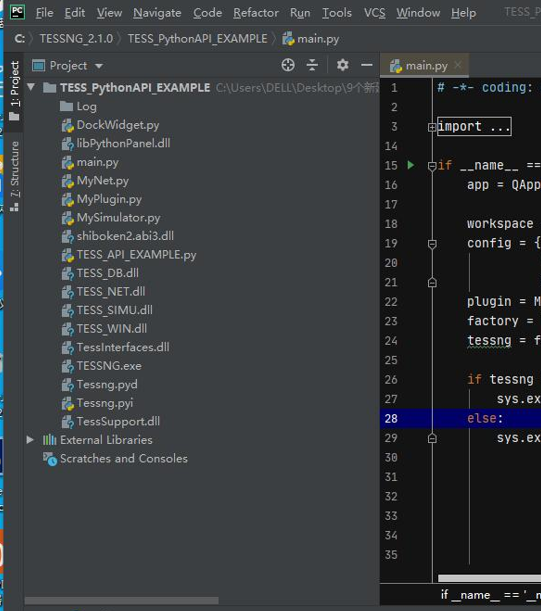

# 软件安装

## 下载

win10系统: [TESSNG V3.1 二次开发包](https://139.196.85.33/downloads/)

Linux系统： [TESSNG V3.1 二次开发包](https://139.196.85.33/downloads/)

## 安装与激活

第一步：下载TESSNG Python二次开发包 [TESSNG V3.1 二次开发包](https://139.196.85.33/downloads/)并解压

TESS NG python 接口开发包有两个关键文件（Windows环境）：Tessng.pyd，以及附加动态库shiboken2.abi3.dll。另外Tessng.pyi是文本形式的描述文件，在开发时提供方便，但不是必须的。

开发包主要文件截图如下：

第二步：安装python3.6环境和IDE（建议使用pycharm）

第三步：pycharm打开下载的二次开发包中的范例工程TESS_PythonAPI_EXAMPLE

第四步：激活TESSNG软件license

用户在首次使用二次开发包时需要激活软件；激活方式：运行main.py函数，弹出激活弹窗，选择激活license文件。具体激活界面如下：

试用用户与首次激活软件流程相同，采用安装包的Cert文件夹下的JidaTraffic_key激活即可。

​    软件的试用期为30天，以前激活过软件的客户激活V3.0.1版本时重新延长30天试用期（识别激活电脑的物理地址）。试用期结束后将无法调用接口的二次开发功能。

​    商业版用户使用不受限制。

第五步： 激活后关闭弹窗，重新运行main.py即可运行范例

<!-- ex_nonav -->

