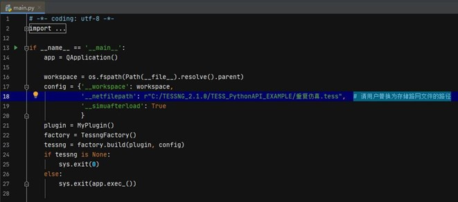
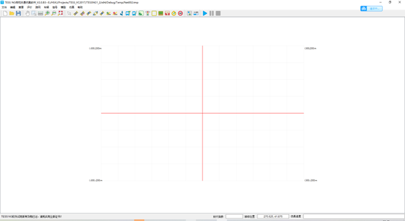
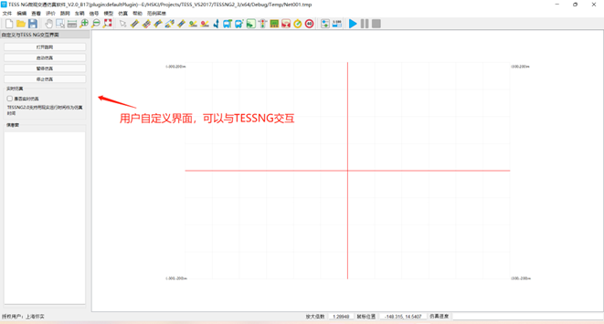
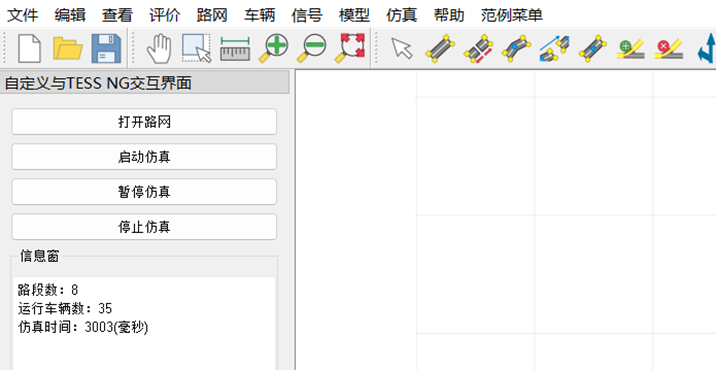
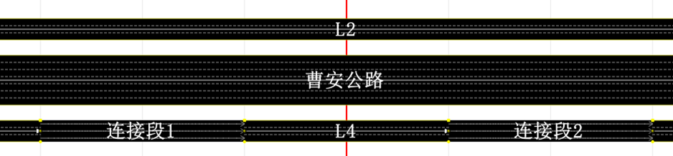
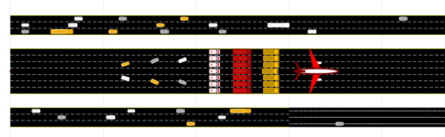

# 快速入门

## 1. 运行DEMO

用户需要运行安装包目录下的TESS PythonAPI demo下的具体的demo文件时（如\TESS_PythonAPI_demo\2车辆发车及属性更改），直接将demo文件夹所有文件复制替换掉TESS_PythonAPI_EXAMPLE文件夹中的对应文件，并核查文件路径即可运行执行main.py函数。**注：如果路径错误，会加载默认路网及出现其它异常情况。**



​    注：运行过程中提示缺少其它Python环境模块，可直接按提示安装即可。

## 2. 用户新建案例

第一步：用户可选择指定位置新建pycharm工程，；

第二步：将TESS_PythonAPI_EXAMPLE文件下的文件复制到新的空工程中；

第三步：根据业务按需修改其中的main.py, MyNet.py, MyPlugin.py, MySimulator.py

2.1和2.2章节简单介绍了实现几个定制化需求的修改方式


### 2.1. 启动TESSNG

#### 2.1.1 简单启动

在main.py文件中加入简单几行代码就可以启动TESSSNG。代码如下：

```python
# -*- coding: utf-8 -*-
import os
from pathlib import Path
import sys

from PySide2.QtCore import *
from PySide2.QtGui import *
from PySide2.QtWidgets import *

from Tessng import *

if __name__ == '__main__':
    app = QApplication()

    workspace = os.fspath(Path(__file__).resolve().parent)
    config = {'__workspace':workspace }
 
    factory = TessngFactory()
    tessng = factory.build(None, config)
    if tessng is None:
        sys.exit(0)
    else:
        sys.exit(app.exec_())


```

结果如下：

  


#### 2.1.2 指定路网启动

在config中增加"__simuafterload"属性，如下

```python
config = {'__workspace':workspace,
        '__netfilepath':"C:/TESSNG_3.0.1/Example/上海虹桥枢纽.tess" 
       }

```

#### 2.1.3 启动并自动进行仿真

```python
config = {'__workspace':workspace,
        '__netfilepath':"C:/TESSNG_3.0.1/Example/上海虹桥枢纽.tess",
        '__simuafterload':True
}

```

其中'__simuafterload'设为True指定TESS NG加载路网后自动开始仿真计算。

### 2.2. 通过插件与TESSNG 交互

与TESS NG交互、对TESS NG施加控制，主要是通过插件方式实现的，插件有两种形式：1）可以是符合TESS NG插件规范的动态连接库，由TESS NG启动时加载；2）也可以直接在内存中创建。后者是TESS NG 二次开发的主要技术路线，二种技术路线不能同时使用。

范例：./TESS_PythonAPI_EXAMPLE/MyPlugin.py

范例通过插件在TESS NG主窗体增加一个QDockWidget对象， QDockWidget对象包含一个用户创建的QWidget，在这个QWidget上可以创建按钮、信息框等组件，用于和TESS NG进行交互。将QDockWidget对象加入TESS NG主窗体是通过调用TessInterface子接口GuiInterface的方法addDockWidgetToMainWindow来实现的

```python
def initGui(self):
    # 在TESS NG主界面上增加 QDockWidget对象
    self.examleWindow = TESS_API_EXAMPLE()

    iface = tessngIFace()
    win = iface.guiInterface().mainWindow()

    dockWidget = QDockWidget("自定义与TESS NG交互界面", win)
    dockWidget.setObjectName("mainDockWidget")
    dockWidget.setFeatures(QDockWidget.NoDockWidgetFeatures)
    dockWidget.setAllowedAreas(Qt.LeftDockWidgetArea)
    dockWidget.setWidget(self.examleWindow.centralWidget())
    iface.guiInterface().addDockWidgetToMainWindow(Qt.DockWidgetArea(1), dockWidget)
    		               

```

范例实例化插件后作为参数传给工厂类的build方法得到TESS NG实例，代码如下：

```python
 plugin = MyPlugin()
 factory = TessngFactory()
 tessng = factory.build(plugin, config)
```

启动TESS NG结果如下图：



范例在自定义界面上按放了几个按钮，其中按钮“启动仿真”的槽函数里用下列代码启动仿真：

```python
def startSimu(self):
    iface = tessngIFace()
    if not iface:
        return
    if not iface.simuInterface().isRunning() or iface.simuInterface().isPausing():
        iface.simuInterface().startSimu()

```


## 3 度量单位

TESS NG在运行过程涉及的度量单位有多种，有基本的度量单位，如：长度单位，复合型度量单位，如：速度单位。在启动TESS NG后需要设置长度基本度量单位，默认基本度量单位是像素，像素与米存在转换关系，这个关系通常在画路网前设置像素比时就已确定。

在二次开发过程中需要根据说明将大部分与长度有关的单位改成像素。像素与米制的相互转换方法如下，默认情况下1个像素表示1米：

米制转换像素：def m2p(value:float) -> float:

像素转换米制：def p2m(value:float) -> float:


## 4 范例简介

范例“TESS NG PYAPI EXAMPLE”展示了在窗体界面、路网展示、仿真过程三个方面如何对TESS NG施加影响。

范例启动时从内存加载插件，企业版用户可成功加载插件，之后加载路网。如果成功加载了插件，插件会检测路网上的路段数，如果没有路段会创建几条路段、连接段以及发车点。之后TESS NG 再根据config参数"__simuafterload"值决定是否起动仿真。

### 4.1 增加窗体控件

在窗体界面上的影响：范例在窗体放置一个QDockWidget对象，QDockWidget对象包含了自定义界面，自定义界面上放置一些控件，通过这些控件操作TESS NG的路网加载、仿真运行，如下图如示：




### 4.2 改变路网元素展示内容

在路网展示上的影响：范例在加载路网后判断路网上是否有路段，如果没有则创建几条路段、连接段和几个发车点。其中名称为“曹安路”的路段的标签显示路段名，其它路段标签显示ID，连接段标签显示的都是名称，如下图所示：




### 4.3 控制车辆驾驶行为

在仿真过程上的影响：范例在仿真过程的影响包括初始化车辆车道、位置、速度，从几个方面改变车辆速度，以及控制自由变道，如下图所示：



通过车辆对象设置车辆长度函数setLength(self, len:float, bRestWidth:bool)中，如果bRestWidth为“True”，则车身宽度会随长度等比例变化，如果设为False，则车身宽度不会改变。


### 4.4 在路段和连接段中间任意位置发车

在仿真过程上的影响：范例在仿真过程动态从路段及连接段上距起点一定距离的位置发车，无需发车点发车，如下图所示：


 


<!-- ex_nonav -->

