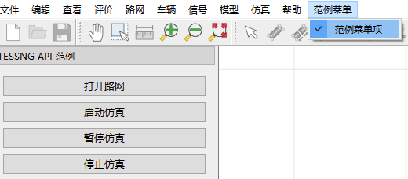
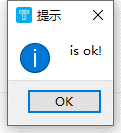
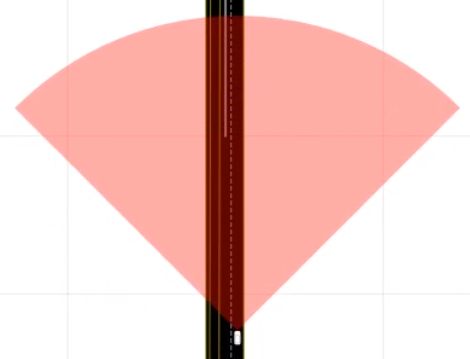
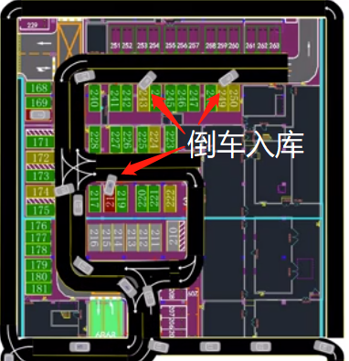

# 高频接口实战

| 大类           | 功能点                           |
| -------------- | -------------------------------- |
| 仿真窗口操作   | 自定义菜单栏；自定义按钮事件     |
| 路网编辑       | 新建路网                         |
|                | 获取，修改，删除路网             |
|                | 新增编辑路网上的附着物           |
| 信控编辑       | 新建信号灯                       |
|                | 信号灯组新建，编辑               |
|                | 双环信控方案下发                 |
| 需求加载与管理 | 流量加载                         |
|                | 路径管理                         |
|                | 路径重构                         |
| 仿真运行       | 流程控制                         |
|                | 动作控制                         |
|                | 管控手段控制                     |
| 底层模型修改   | 跟驰模型                         |
|                | 换道模型                         |
|                | 冲突交互模型（暂不支持二次开发） |
|                | 车辆汇入模型                     |
|                | 车辆穿越模型                     |
| 仿真输出       | 检测器编辑                       |
|                | 采集器编辑                       |
|                | 输出控制                         |
| 特殊应用场景   | 公交系统                         |
|                | 行人系统                         |
|                | 停车场系统                       |
|                | 收费站系统                       |

本章所有接口范例均可在安装包《安装目录/SecondaryDevCases/SecondaryDevCases.py》中找到；用户可以到GitHub下载

[GitHub](https://github.com/jida-traffic/TESSNG_SecondaryDev_Doc) 

[官网下载](): 

## 1. 界面交互

### 1.1. 增加菜单及菜单项

利用TessInterface及其子接口实现，可以在插件init()方法中创建菜单及菜单项，代码如下:

```python

# 用户插件，继承自TessPlugin
class MyPlugin(TessPlugin):
    def __init__(self):
        super(MyPlugin, self).__init__()
        self.mNetInf = None
        self.mSimuInf = None

    def initGui(self):
        # 在TESS NG主界面上增加 QDockWidget对象
        self.examleWindow = TESS_API_EXAMPLE()

        iface = tessngIFace()
        win = iface.guiInterface().mainWindow()

        dockWidget = QDockWidget("自定义与TESS NG交互界面", win)
        dockWidget.setObjectName("mainDockWidget")
        dockWidget.setFeatures(QDockWidget.NoDockWidgetFeatures)
        dockWidget.setAllowedAreas(Qt.LeftDockWidgetArea)
        dockWidget.setWidget(self.examleWindow.centralWidget())
        iface.guiInterface().addDockWidgetToMainWindow(Qt.DockWidgetArea(1), dockWidget)

        # 增加菜单及菜单项
        menuBar = iface.guiInterface().menuBar()
        menu = QMenu(menuBar)
        menu.setObjectName("menuExample")
        menuBar.addAction(menu.menuAction())
        menu.setTitle("范例菜单")
        actionOk = menu.addAction("范例菜单项")
        actionOk.setCheckable(True)
        actionOk.triggered.connect(self.examleWindow.isOk)
```

结果如下：



点击菜单项“范例菜单项”弹出对话框：



### 1.2. 自定义车辆显示内容

下图展示自动驾驶车辆，雷达探测范围100米。



为了增添车辆展示的内容，可以实现接口PyCustomerSimulator的如下方法

def rePaintVehicle(self, pIVehicle:Tessng.IVehicle, painter:PySide2.QtGui.QPainter) -> None: ...


## 2. 路网编辑

### 2.1.  代码新建路网

1- 新建link

2- 新建connector

```python
def createNet(self):
    # 代表TESS NG的接口
    iface = tessngIFace()
    # 代表TESS NG的路网子接口
    netiface = iface.netInterface()

    # 第一条路段
    startPoint = QPointF(m2p(-300), 0)
    endPoint = QPointF(m2p(300), 0)
    lPoint = [startPoint, endPoint]
    link1 = netiface.createLink(lPoint, 7, "曹安公路")
    if link1 is not None:
        # 车道列表
        lanes = link1.lanes()
        # 打印该路段所有车道ID列表
        print("曹安公路车道ID列表：", [lane.id() for lane in lanes])
        # 在当前路段创建发车点
        dp = netiface.createDispatchPoint(link1)
        if dp != None:
            # 设置发车间隔，含车型组成、时间间隔、发车数
            dp.addDispatchInterval(1, 2, 28)

    # 第二条路段
    startPoint = QPointF(m2p(-300), m2p(-25))
    endPoint = QPointF(m2p(300), m2p(-25))
    lPoint = [startPoint, endPoint]
    link2 = netiface.createLink(lPoint, 7, "次干道")
    if link2 is not None:
        dp = netiface.createDispatchPoint(link2)
        if dp is not None:
            dp.addDispatchInterval(1, 3600, 3600)
        # 将外侧车道设为”公交专用道"
        lanes = link2.lanes()
        lanes[0].setLaneType("公交专用道")

    # 第三条路段
    startPoint = QPointF(m2p(-300), m2p(25))
    endPoint = QPointF(m2p(-150), m2p(25))
    lPoint = [startPoint, endPoint]
    link3 = netiface.createLink(lPoint, 3)
    if link3 is not None:
        dp = netiface.createDispatchPoint(link3)
        if dp is not None:
            dp.addDispatchInterval(1, 3600, 3600)

    # 创建第四条路段
    startPoint = QPointF(m2p(-50), m2p(25))
    endPoint = QPointF(m2p(50), m2p(25))
    lPoint = [startPoint, endPoint]
    link4 = netiface.createLink(lPoint, 3)

    # 创建第五条路段
    startPoint = QPointF(m2p(150), m2p(25))
    endPoint = QPointF(m2p(300), m2p(25))
    lPoint = [startPoint, endPoint]
    link5 = netiface.createLink(lPoint, 3, "自定义限速路段")
    if link5 is not None:
        link5.setLimitSpeed(30)

    # 创建第六条路段
    startPoint = QPointF(m2p(-300), m2p(50))
    endPoint = QPointF(m2p(300), m2p(50))
    lPoint = [startPoint, endPoint]
    link6 = netiface.createLink(lPoint, 3, "动态发车路段")
    if link6 is not None:
        link6.setLimitSpeed(80)

    # 创建第七条路段
    startPoint = QPointF(m2p(-300), m2p(75))
    endPoint = QPointF(m2p(-250), m2p(75))
    lPoint = [startPoint, endPoint]
    link7 = netiface.createLink(lPoint, 3)
    if link7 is not None:
        link7.setLimitSpeed(80)

    # 创建第八条路段
    startPoint = QPointF(m2p(-50), m2p(75))
    endPoint = QPointF(m2p(300), m2p(75))
    lPoint = [startPoint, endPoint]
    link8 = netiface.createLink(lPoint, 3)
    if link8 is not None:
        link8.setLimitSpeed(80)

    # 创建第一条连接段
    if link3 is not None and link4 is not None:
        lFromLaneNumber = [1, 2, 3]
        lToLaneNumber = [1, 2, 3]
        conn1 = netiface.createConnector(link3.id(), link4.id(), lFromLaneNumber, lToLaneNumber, "连接段1", True)

    # 创建第二条连接段
    if link4 is not None and link5 is not None:
        lFromLaneNumber = [1, 2, 3]
        lToLaneNumber = [1, 2, 3]
        conn2 = netiface.createConnector(link4.id(), link5.id(), lFromLaneNumber, lToLaneNumber, "连接段2", True)

    # 创建第三条连接段
    if link7 is not None and link8 is not None:
        lFromLaneNumber = [1, 2, 3]
        lToLaneNumber = [1, 2, 3]
        conn3 = netiface.createConnector(link7.id(), link8.id(), lFromLaneNumber, lToLaneNumber, "动态发车连接段",
                                         True)
    routing = netiface.createRouting([link7, link8])
    print(routing)

```


### 2.2. 地图转TESSNG路网

导入opendrive， osm shapely生成tessng路网；直接使用pytessng的工具代码;

截图：


工具链接：[pytessng](https://pypi.org/search/?q=pytessng)

安装命令： 

```sh
pip install pytessng
```


### 2.3. 修改路网元素

1-修改删除link编号，名称，形状，长度，宽度等属性

2-修改connector的laneconnector连接关系，形状；

3- 获取link, connector, connectorarea, laneconnector形状，属性

用户可以先获取目标对象，在修改对象属性

详见[接口详解]()


### 2.4. 编辑路网附着物

1-新建删除车道导向箭头；

2-限速区：指定车道位置设置，限速区的长度，生效时间, 速度值

3-施工区：根据车辆序号和位置，施工区长度新建

```python
def createworkZone(self):
    """ 创建施工区
    :param :
    :return:
    """
    # 创建施工区
    workZone = Online.DynaRoadWorkZoneParam()
    # 道路ID
    workZone.roadId = int(5)
    # 施工区名称
    workZone.name = "施工区，限速40,持续20秒"
    # 位置，距离路段或连接段起点距离，单位米
    workZone.location = 50
    # 施工区长度，单位米
    workZone.length = 50
    # 车辆经过施工区的最大车速，单位千米/小时
    workZone.limitSpeed = 40
    # 施工区施工时长，单位秒
    workZone.duration = 20
    # 施工区起始车道
    workZone.mlFromLaneNumber = [0]
    # 创建施工区
    zone = tessngIFace().netInterface().createRoadWorkZone(workZone)

```

5-事故区：根据车道序号，位置，影响范围新建

```python
# 创建事故区
accidentZone = Online.DynaAccidentZoneParam()
# 道路ID
accidentZone.roadId = 9
# 事故区名称
accidentZone.name = "最左侧车道发生事故"
# 位置，距离路段或连接段起点距离，单位米
accidentZone.location = m2p(200)
# 事故区长度，单位米
accidentZone.length = m2p(50)
# 事故区起始车道序号列表
accidentZone.mlFromLaneNumber=[2]
# 事故等级
accidentZone.level = 1
# 创建事故区

```

6-公交站：根据车道序号，位置，长度，类型设置；

```python
# 创建公交线路
busLine = tessngIFace().netInterface().createBusLine([link10, link11])
if busLine is not None:
   busLine.setDesirSpeed(m2p(60))
   busStation1 = tessngIFace().netInterface().createBusStation(link10.lanes()[0], m2p(30), m2p(50),"公交站1")
   busStation2 = tessngIFace().netInterface().createBusStation(link11.lanes()[0], m2p(15), m2p(50),"公交站2")
# 创建公交线路
if busStation1 and tessngIFace().netInterface().addBusStationToLine(busLine, busStation1):
  	busStation1.setType(2)
    print("公交站1已关联到公交线路")
if busStation2 and tessngIFace().netInterface().addBusStationToLine(busLine, busStation2):
    print("公交站2已关联到公交线路")

```

```python
lStationLine = busLine.stationLines()
    if len(lStationLine)>0:
    stationLine = lStationLine[0] 
    # 设置车辆停靠时间(秒)
    stationLine.setBusParkingTime(20)
```

详见[接口详解]()


## 3. 信控编辑

### 3.1. 新建信号灯

1- 根据车道序号，位置新建信号灯

```python
for index, laneObj in enumerate(lLaneObjects):
    signalLamp = netiface.createSignalLamp(signalPhase, "信号灯{}".format(index + 1), laneObj.fromLane().id(),laneObj.toLane().id(), m2p(2.0))

```


### 3.2.  编辑信号灯组

2- 新建信号灯组，设置信号相位相序和灯色

核心代码

```python
def edit_signal_controller(self):
    """ 信控编辑
    :return:
    """
    # 代表TESS NG的接口
    iface = tessngIFace()
    # 代表TESS NG的路网子接口
    netiface = iface.netInterface()

    # 创建两条新路段和一条连接段作为示例
    startPoint1 = QPointF(m2p(-300), m2p(-200))
    endPoint1 = QPointF(m2p(-50), m2p(-200))
    lPoint1 = [startPoint1, endPoint1]
    link1 = netiface.createLink(lPoint1, 3, "信控编辑路段1")

    startPoint2 = QPointF(m2p(50), m2p(-200))
    endPoint2 = QPointF(m2p(300), m2p(-200))
    lPoint2 = [startPoint2, endPoint2]
    link2 = netiface.createLink(lPoint2, 3, "信控编辑路段2")

    # 连接段车道连接列表
    lLaneObjects = []
    if link1 and link2:
        lFromLaneNumber = [1, 2, 3]
        lToLaneNumber = [1, 2, 3]
        connector = netiface.createConnector(link1.id(), link2.id(), lFromLaneNumber, lToLaneNumber,
                                             "信控编辑连接段", True)
        if connector:
            lLaneObjects = connector.laneObjects()
            for laneObj in lLaneObjects:
                print("上游车道ID", laneObj.fromLane().id(), "下游车道ID", laneObj.toLane().id())
    # 创建发车点
    if link1:
        dp = netiface.createDispatchPoint(link1)
        if dp:
            dp.addDispatchInterval(1, 3600, 3600)

    # 创建信号灯组
    signalGroup = netiface.createSignalGroup("信号灯组1", 60, 1, 3600)
    # 创建相位,40秒绿灯，黄灯3秒，全红3秒
    red = Online.ColorInterval("G", 40)
    green = Online.ColorInterval("Y", 3)
    yellow = Online.ColorInterval("R", 3)
    signalPhase = netiface.createSignalPhase(signalGroup, "信号灯组1相位1",
                                             [green, yellow, red])
    # 创建信号灯
    for index, laneObj in enumerate(lLaneObjects):
        signalLamp = netiface.createSignalLamp(signalPhase, "信号灯{}".format(index + 1), laneObj.fromLane().id(),
                                               laneObj.toLane().id(), m2p(2.0))
```


### 3.3. 信控方案下发

3- 支持双环结构信控方案下发（前提是已正确新建信号灯；已知一个路口所有进口道的流向及车道对应的信号灯id）

核心代码 

```python
from Tessng import Online
def double_ring_signal_control(self, current_simuTime):
    """ 双环信控方案下发
    :param current_simuTime: 当前仿真时间
    :return:
    """

    # 代表TESS NG的接口
    iface = tessngIFace()
    # 代表TESS NG的路网子接口
    netiface = iface.netInterface()

    # 读取方案数据
    with open('./Data/Signal_Plan_Data_1109.json', 'r', encoding='utf-8') as json_file:
        signal_groups_dict = json.load(json_file)

    # 创建信号灯组和相位
    for group_name, group in signal_groups_dict.items():
        # 当前灯组
        current_signal_group = None
        # 通过灯组名称查询到灯组
        all_signal_groups_lst = netiface.signalGroups()
        for signal_group in all_signal_groups_lst:
            if signal_group.groupName() == group_name:
                current_signal_group = signal_group
                break
        if current_signal_group:
            current_signal_group_phases_lst = current_signal_group.phases()
        else:
            print("FindError: The signalGroup not in current net.")
            break

        # 获取所有灯组的起始时间
        signal_group_startTime_lst = list(group.keys())
        for index, group_data in enumerate(group.values()):
            start_time = signal_group_startTime_lst[index]
            end_time = signal_group_startTime_lst[index + 1] if index != len(
                signal_group_startTime_lst) - 1 else "24:00"
            # 起始时间和结束时间的秒数表示
            start_time_seconds = time_to_seconds(start_time)
            end_time_seconds = time_to_seconds(end_time)
            # 若当前仿真时间位于当前时段内，修改当前时段信号灯组的相位
            if start_time_seconds <= current_simuTime < end_time_seconds:
                period_time = group_data['cycle_time']
                phases = group_data['phases']
                # 修改周期
                current_signal_group.setPeriodTime(int(period_time))
                for phase in phases:
                    phase_name = phase['phase_name']
                    phase_number = int(phase['phase_number'])
                    color_list = []  # 按照红灯、绿灯、黄灯、红灯顺序计算
                    color_list.append(Online.ColorInterval('红', int(phase['start_time'])))
                    color_list.append(Online.ColorInterval('绿', int(phase['green_time'])))
                    color_list.append(Online.ColorInterval('黄', 3))
                    if int(period_time - phase['start_time'] - phase['green_time'] - 3) > 0:
                        color_list.append(
                            Online.ColorInterval('红',
                                                 int(period_time - phase['start_time'] - phase['green_time'] - 3)))

                    # 当前灯组包含的相位序号
                    current_phase = None
                    for current_signal_group_phase in current_signal_group_phases_lst:
                        if phase_number == int(current_signal_group_phase.number()):
                            current_phase = current_signal_group_phase
                            break

                    # 若已存在该相位，修改相位灯色顺序，否则添加相位
                    if current_phase:
                        # 修改相位
                        current_phase.setColorList(color_list)
                    else:
                        signal_phase = netiface.createSignalPhase(current_signal_group, phase_name, color_list)
                        # 设置相位序号
                        signal_phase.setNumber(phase_number)
                    # 设置相位包含的信号灯
                    for lampId in phase["lamp_lst"]:
                        lamp = netiface.findSignalLamp(int(lampId))
                        if lamp:
                            '''
                            目前一个信号灯属于多个相位，相位间不交叉。因此如果要实际下发方案时，应按照仿真时间实时管理相位序号。
                            '''
                            lamp.setPhaseNumber(phase_number)
                        else:
                            print("FindError:未查找到信号灯:", lampId)

```


## 4. 需求加载与管理

### 4.1. 流量加载

支持多种方式加载车辆，供用户灵活使用

1-新建发车点，设置发车流量时间间隔；设置发车分布；设置车辆组成，车辆类型（发车点已创建后无法修改车辆组成和车辆类型，可以创建车辆组成和车辆类型后设置发车点）；


2-动态发车：不设置发车点，在指定车道和位置处加载车辆（一辆一辆加载）

核心代码

```python
def traffic_loading(self):
    """ 流量加载
    :return:
    """
    # 代表TESS NG的接口
    iface = tessngIFace()
    # 代表TESS NG的路网子接口
    netiface = iface.netInterface()
    # 代表TESS NG的仿真子接口
    simuiface = iface.simuInterface()

    '''1.新建发车点'''
    # 创建两条新路段和一条连接段作为示例
    startPoint1 = QPointF(m2p(-300), m2p(-180))
    endPoint1 = QPointF(m2p(-50), m2p(-180))
    lPoint1 = [startPoint1, endPoint1]
    link1 = netiface.createLink(lPoint1, 3, "流量加载路段1")

    startPoint2 = QPointF(m2p(50), m2p(-180))
    endPoint2 = QPointF(m2p(300), m2p(-180))
    lPoint2 = [startPoint2, endPoint2]
    link2 = netiface.createLink(lPoint2, 3, "流量加载路段2")

    # 连接段车道连接列表
    lLaneObjects = []
    if link1 and link2:
        lFromLaneNumber = [1, 2, 3]
        lToLaneNumber = [1, 2, 3]
        connector = netiface.createConnector(link1.id(), link2.id(), lFromLaneNumber, lToLaneNumber,
                                             "流量加载连接段", True)
        if connector:
            lLaneObjects = connector.laneObjects()
            for laneObj in lLaneObjects:
                print("上游车道ID", laneObj.fromLane().id(), "下游车道ID", laneObj.toLane().id())

            # 创建车辆组成及指定车辆类型
        vehiType_proportion_lst = []
        # 车型组成：小客车0.3，大客车0.2，公交车0.1，货车0.4
        vehiType_proportion_lst.append(Online.VehiComposition(1, 0.3))
        vehiType_proportion_lst.append(Online.VehiComposition(2, 0.2))
        vehiType_proportion_lst.append(Online.VehiComposition(3, 0.1))
        vehiType_proportion_lst.append(Online.VehiComposition(4, 0.4))
        vehiCompositionID = netiface.createVehicleComposition("动态创建车型组成", vehiType_proportion_lst)
        if vehiCompositionID != -1:
            print("车型组成创建成功，id为：", vehiCompositionID)
            # 新建发车点,车型组成ID为动态创建的，600秒发300辆车
            if link1:
                dp = netiface.createDispatchPoint(link1)
                if dp:
                    dp.addDispatchInterval(vehiCompositionID, 600, 300)

        '''2.动态发车'''
        # 创建两条新路段和一条连接段作为示例
        startPoint3 = QPointF(m2p(-300), m2p(-160))
        endPoint3 = QPointF(m2p(-50), m2p(-160))
        lPoint3 = [startPoint3, endPoint3]
        link3 = netiface.createLink(lPoint3, 3, "动态加载车辆段")

        startPoint4 = QPointF(m2p(50), m2p(-160))
        endPoint4 = QPointF(m2p(300), m2p(-160))
        lPoint4 = [startPoint4, endPoint4]
        link4 = netiface.createLink(lPoint4, 3, "动态加载车辆段")

        # 连接段车道连接列表
        lLaneObjects = []
        if link3 and link4:
            lFromLaneNumber = [1, 2, 3]
            lToLaneNumber = [1, 2, 3]
            connector = netiface.createConnector(link3.id(), link4.id(), lFromLaneNumber, lToLaneNumber,
                                                 "动态加载加载连接段", True)
            if connector:
                lLaneObjects = connector.laneObjects()
                for laneObj in lLaneObjects:
                    print("上游车道ID", laneObj.fromLane().id(), "下游车道ID", laneObj.toLane().id())

        # 在指定车道和位置动态加载车辆(示例：在0,1,2车道不同位置动态加载车辆)
        dvp_lane0 = Online.DynaVehiParam()
        dvp_lane1 = Online.DynaVehiParam()
        dvp_lane2 = Online.DynaVehiParam()
        dvp_lane0.vehiTypeCode = 1
        dvp_lane1.vehiTypeCode = 2
        dvp_lane2.vehiTypeCode = 3
        dvp_lane0.roadId = link3.id()
        dvp_lane1.roadId = link3.id()
        dvp_lane2.roadId = link4.id()
        dvp_lane0.laneNumber = 0
        dvp_lane1.laneNumber = 1
        dvp_lane2.laneNumber = 2
        dvp_lane0.dist = m2p(50)
        dvp_lane1.dist = m2p(100)
        dvp_lane2.dist = m2p(50)
        dvp_lane0.speed = 20
        dvp_lane0.speed = 30
        dvp_lane0.speed = 40
        dvp_lane0.color = "#FF0000"
        dvp_lane1.color = "#008000"
        dvp_lane2.color = "#0000FF"
        vehi_lane0 = simuiface.createGVehicle(dvp_lane0)
        vehi_lane1 = simuiface.createGVehicle(dvp_lane1)
        vehi_lane2 = simuiface.createGVehicle(dvp_lane2)

```

3- 路径（veh path）加载：单车车辆路径（根据方式4间接实现）

或者通过IVehicleDriving类实现

```python
# 修改路径（L1所有车辆均修改为右转路径）
for vehi in allVehiStarted_lst:
    if vehi.roadId() == 1:
        # 修改车辆路径
        decisionPoints_lst = netiface.decisionPoints()
        decisionPoint_link1 = None
        for decisionPoint in decisionPoints_lst:
            if decisionPoint.link().id() == 1:
                decisionPoint_link1 = decisionPoint
                break
        decisionPoint_link1_routings_lst = []
        if decisionPoint_link1:
            decisionPoint_link1_routings_lst = decisionPoint_link1.routings()
        if len(decisionPoint_link1_routings_lst) > 0:
            if vehi.routing() != decisionPoint_link1_routings_lst[-1]:
                if (vehi.vehicleDriving().setRouting(decisionPoint_link1_routings_lst[-1])):
                    print("{}车辆修改路径成功。".format(vehi.id()))

```

4- flow 路径加载：发车点+静态路径

```python
def flow_loading(self):
    """ 路径加载
    :return:
    """
    # 代表TESS NG的接口
    iface = tessngIFace()
    # 代表TESS NG的路网子接口
    netiface = iface.netInterface()
    # 代表TESS NG的仿真子接口
    simuiface = iface.simuInterface()

    # 以标准四岔路口为例 (L3-C2-L10)
    link3 = netiface.findLink(3)
    link10 = netiface.findLink(10)
    link6 = netiface.findLink(6)
    link7 = netiface.findLink(7)
    link8 = netiface.findLink(8)
    # 新建发车点
    if link3:
        dp = netiface.createDispatchPoint(link3)
        if dp:
            dp.addDispatchInterval(1, 1800, 900)
    # 创建决策点
    decisionPoint = netiface.createDecisionPoint(link3, m2p(30))
    # 创建路径(左，直，右)
    decisionRouting1 = tessngIFace().netInterface().createDeciRouting(decisionPoint, [link3, link10, link6])
    decisionRouting2 = tessngIFace().netInterface().createDeciRouting(decisionPoint, [link3, link10, link8])
    decisionRouting3 = tessngIFace().netInterface().createDeciRouting(decisionPoint, [link3, link10, link7])

    # 分配左、直、右流量比
    flowRatio_left = _RoutingFLowRatio()
    flowRatio_left.RoutingFLowRatioID = 1
    flowRatio_left.routingID = decisionRouting1.id()
    flowRatio_left.startDateTime = 0
    flowRatio_left.endDateTime = 999999
    flowRatio_left.ratio = 2.0
    flowRatio_straight = _RoutingFLowRatio()
    flowRatio_straight.RoutingFLowRatioID = 2
    flowRatio_straight.routingID = decisionRouting2.id()
    flowRatio_straight.startDateTime = 0
    flowRatio_straight.endDateTime = 999999
    flowRatio_straight.ratio = 3.0
    flowRatio_right = _RoutingFLowRatio()
    flowRatio_right.RoutingFLowRatioID = 3
    flowRatio_right.routingID = decisionRouting3.id()
    flowRatio_right.startDateTime = 0
    flowRatio_right.endDateTime = 999999
    flowRatio_right.ratio = 1.0

    # 决策点数据
    decisionPointData = _DecisionPoint()
    decisionPointData.deciPointID = decisionPoint.id()
    decisionPointData.deciPointName = decisionPoint.name()
    decisionPointPos = QPointF()
    if decisionPoint.link().getPointByDist(decisionPoint.distance(), decisionPointPos):
        decisionPointData.X = decisionPointPos.x()
        decisionPointData.Y = decisionPointPos.y()
        decisionPointData.Z = decisionPoint.link().z()
    # 更新决策点及其各路径不同时间段流量比
    updated_decision_point = netiface.updateDecipointPoint(
        decisionPointData, [flowRatio_left, flowRatio_straight, flowRatio_right]
    )
    if updated_decision_point:
        print("决策点创建成功。")
        # 删除右转路径
        if (netiface.removeDeciRouting(decisionPoint, decisionRouting3)):
            print("删除右转路径成功。")

```

5- 断面流量+转向比例（路径比例）加载

```python
def flow_loading_section(self, current_time):
    """ 路径断面流量加载
    :param current_time: 当前仿真时间
    :return:
    """
    # 代表TESS NG的接口
    iface = tessngIFace()
    # 代表TESS NG的路网子接口
    netiface = iface.netInterface()
    # 代表TESS NG的仿真子接口
    simuiface = iface.simuInterface()
    # 读取方案数据
    with open('./Data/flow_ratio_quarter.json', 'r', encoding='utf-8') as json_file:
        flow_ratio_quarter_dict = json.load(json_file)
    for linkId, quarter_ratios in flow_ratio_quarter_dict.items():
        decisionPoint = None
        # 查找到决策点
        decisionPoints_lst = netiface.decisionPoints()
        for _decisionPoint in decisionPoints_lst:
            if _decisionPoint.link().id() == int(linkId):
                decisionPoint = _decisionPoint
                break
        if decisionPoint:
            quarter_startTime_lst = list(quarter_ratios.keys())
            for index, quarter_ratio in enumerate(quarter_ratios.values()):
                quarter_time_seconds = time_to_seconds(quarter_startTime_lst[index])
                if index != len(quarter_startTime_lst) - 1:
                    quarter_time_seconds_next = time_to_seconds(quarter_startTime_lst[index + 1])
                else:
                    quarter_time_seconds_next = quarter_time_seconds + 1
                if quarter_time_seconds <= current_time < quarter_time_seconds_next:
                    # 获取决策点现有路径
                    decision_routings_lst = decisionPoint.routings()
                    if (len(decision_routings_lst) == 3):
                        # 分配左、直、右流量比
                        flowRatio_left = _RoutingFLowRatio()
                        flowRatio_left.RoutingFLowRatioID = decision_routings_lst[0].id()
                        flowRatio_left.routingID = decision_routings_lst[0].id()
                        flowRatio_left.startDateTime = 0
                        flowRatio_left.endDateTime = 999999
                        flowRatio_left.ratio = quarter_ratio["left"]
                        flowRatio_straight = _RoutingFLowRatio()
                        flowRatio_straight.RoutingFLowRatioID = decision_routings_lst[1].id()
                        flowRatio_straight.routingID = decision_routings_lst[1].id()
                        flowRatio_straight.startDateTime = 0
                        flowRatio_straight.endDateTime = 999999
                        flowRatio_straight.ratio = quarter_ratio["straight"]
                        flowRatio_right = _RoutingFLowRatio()
                        flowRatio_right.RoutingFLowRatioID = decision_routings_lst[2].id()
                        flowRatio_right.routingID = decision_routings_lst[2].id()
                        flowRatio_right.startDateTime = 0
                        flowRatio_right.endDateTime = 999999
                        flowRatio_right.ratio = quarter_ratio["right"]
                        # 决策点数据
                        decisionPointData = _DecisionPoint()
                        decisionPointData.deciPointID = decisionPoint.id()
                        decisionPointData.deciPointName = decisionPoint.name()
                        decisionPointPos = QPointF()
                        if decisionPoint.link().getPointByDist(decisionPoint.distance(), decisionPointPos):
                            decisionPointData.X = decisionPointPos.x()
                            decisionPointData.Y = decisionPointPos.y()
                            decisionPointData.Z = decisionPoint.link().z()
                        # 更新决策点及其各路径不同时间段流量比
                        updated_decision_point = netiface.updateDecipointPoint(
                            decisionPointData, [flowRatio_left, flowRatio_straight, flowRatio_right]
                        )
                        if updated_decision_point:
                            print("{}流量更新成功。".format(quarter_startTime_lst[index]))
                    else:
                        print("DecisionRoutingsError:决策点{}需要包含左、直、右三条路径。".format(decisionPoint.id()))
        else:
            # 需路段存在决策点，才可更新，因此可用flow_loading函数新建决策点
            print("FindError:ID为{}的路段不存在决策点".format(linkId))

```


### 4.2.  路径管理

1- 新建决策点；新建决策路径，编辑决策路径流量比例，时间，路径的link,connector，删除路径。

```python
# 创建决策点
decisionPoint = netiface.createDecisionPoint(link3, m2p(30))
# 创建路径(左，直，右)
decisionRouting1 = tessngIFace().netInterface().createDeciRouting(decisionPoint, [link3, link10, link6])
decisionRouting2 = tessngIFace().netInterface().createDeciRouting(decisionPoint, [link3, link10, link8])
decisionRouting3 = tessngIFace().netInterface().createDeciRouting(decisionPoint, [link3, link10, link7])
# 分配左、直、右流量比
flowRatio_left = _RoutingFLowRatio()
flowRatio_left.RoutingFLowRatioID = 1
flowRatio_left.routingID = decisionRouting1.id()
flowRatio_left.startDateTime = 0
flowRatio_left.endDateTime = 999999
flowRatio_left.ratio = 2.0
flowRatio_straight = _RoutingFLowRatio()
flowRatio_straight.RoutingFLowRatioID = 2
flowRatio_straight.routingID = decisionRouting2.id()
flowRatio_straight.startDateTime = 0
flowRatio_straight.endDateTime = 999999
flowRatio_straight.ratio = 3.0
flowRatio_right = _RoutingFLowRatio()
flowRatio_right.RoutingFLowRatioID = 3
flowRatio_right.routingID = decisionRouting3.id()
flowRatio_right.startDateTime = 0
flowRatio_right.endDateTime = 999999
flowRatio_right.ratio = 1.0

# 决策点数据
decisionPointData = _DecisionPoint()
decisionPointData.deciPointID = decisionPoint.id()
decisionPointData.deciPointName = decisionPoint.name()
decisionPointPos = QPointF()
if decisionPoint.link().getPointByDist(decisionPoint.distance(), decisionPointPos):
    decisionPointData.X = decisionPointPos.x()
    decisionPointData.Y = decisionPointPos.y()
    decisionPointData.Z = decisionPoint.link().z()
# 更新决策点及其各路径不同时间段流量比
updated_decision_point = netiface.updateDecipointPoint(
    decisionPointData, [flowRatio_left, flowRatio_straight, flowRatio_right]
)


# 删除右转路径
if (netiface.removeDeciRouting(decisionPoint, decisionRouting3)):
    print("删除右转路径成功。")


```

2 - 运行过程中编辑决策路径的属性（流量比例，时间段信息），暂时不要求新增，删除，修改已有路径的“路径”（link,connector）

见PyCustomerSimulator

```python
 # 过载父类方法，动态修改决策点不同路径流量比
    def calcDynaFlowRatioParameters(self):
        # TESSNG 顶层接口
        iface = tessngIFace()
        # 当前仿真计算批次
        batchNum = iface.simuInterface().batchNumber()
        # 在计算第20批次时修改某决策点各路径流量比
        if batchNum == 20:
            # 一个决策点某个时段各路径车辆分配比
            dfi = Online.DecipointFlowRatioByInterval()
            # 决策点编号
            dfi.deciPointID = 5
            # 起始时间 单位秒
            dfi.startDateTime = 1
            # 结束时间 单位秒
            dfi.endDateTime = 84000
            rfr1 = Online.RoutingFlowRatio(10, 1)
            rfr2 = Online.RoutingFlowRatio(11, 2)
            rfr3 = Online.RoutingFlowRatio(12, 3)
            dfi.mlRoutingFlowRatio = [rfr1, rfr2, rfr3]
            return [dfi]
        return []
```

以上两点需求可在流量加载中找到实现方式。


### 4.3.  路径重构

1- 断面流量+转向流量重构车辆路径，并加载到仿真中;(暂时忽略)

2- OD数据重构路径，并加载到仿真中(暂时忽略)

用户可以利用自有算法实现OD分配、路径重构，然后依据4.1中所述的流量加载方式实现TESSNG 软件加载路径重构结果


## 5. 仿真运行

### 5.1. 倒车入库

在实现自动泊车的仿真及调度时需要展示车辆倒车入库的过程，这个过程可让车辆顺向前移，将车辆旋转180度，展现的便是倒着行驶状态。



 为了实现倒着行驶效果，可以实现PyCustomerSimulator的如下方法

def ref_reCalcAngle(self, pIVehicle:Tessng.IVehicle, ref_outAngle:Tessng.objreal) -> bool: ...

 

### 5.2. 循环仿真

对加载的路网启动仿真后，不需要人工干预的情况下重复仿真指定次数，且每次仿真前自动进行参数设置，仿真后输出仿真结果到文件。

1）、仿真前判断当前仿真路网与上次仿真路网是否相同，如果不同设置仿真次数为1；

2）、仿真结束后判断仿真次数是否小于指定次数，如果小于指定次数则发送要求仿真的消息给TESSNG主窗体，TESSNG主窗体启动仿真。

```python
def afterStop(self):
    # 这里设置要停止后仿真几次，
    if self.mAutoStartSimuCount >= 10:
        return
    iface = tessngIFace()
    netface = iface.netInterface()
    filePath = netface.netFilePath()
    #范例打开临时路段会会创建车辆方阵，需要进行一些仿真过程控制
    if "Temp" not in filePath:
        self.mAutoInOutSi = random.randint(1,15)
        self.mAutoInOutSd = random.randint(1,15)
        self.mAutoStartSimuCount += 1
        self.forReStartSimu.emit()

```


### 5.3. 流程控制

1-开始仿真

2- 暂停仿真

3- 恢复仿真

4-结束关闭仿真

5-生成仿真快照

6-加载仿真快照

```python
def process_control(self, method_number):
    """ 流程控制
          :param method_number：调用的方法序号
          :return:
          """
    # TESSNG 顶层接口
    iface = tessngIFace()
    # TESSNG 仿真子接口
    simuiface = iface.simuInterface()
    # TESSNG 路网子接口
    netiface = iface.netInterface()
    '''1. 启动、暂停、恢复、停止仿真'''
    if method_number == 1:
        simuiface.startSimu()
    elif method_number == 2:
        simuiface.pauseSimu()
    elif method_number == 3:
        simuiface.stopSimu()
    elif method_number == 4:
        simuiface.pauseSimuOrNot()
    '''2. 生成、加载仿真快照'''
    if method_number == 5:
        # 没生效，需分布式组件支持，暂时不清楚如何用
        snapshotStr = simuiface.catchSnapshotAsString()
        print(snapshotStr)
    '''8. 获取运动信息'''
    # 8.1 获取路网在途车辆，见MySimulator中afterOneStep的simuiface.allVehiStarted()
    # 8.2 根据路段|车道获取车辆list
    if method_number == 8.2:
        vehiOnRoad5_lst = simuiface.vehisInLink(5)
        vehiOnLane20_lst = simuiface.vehisInLane(20)
        print("L5路段车辆id：")
        for vehi in vehiOnRoad5_lst:
            print(vehi.id())
        print("lane20车道车辆id：")
        for vehi in vehiOnLane20_lst:
            print(vehi.id())
    # 8.3 根据车辆id获取具体的车辆信息,以id为300001的车辆为例
    if method_number == 8.3:
        vehi_300001 = simuiface.getVehicle(300001)
        print("300001车辆的具体信息：")
        print("所在路段:", vehi_300001.roadId())
        print("所在车道:", vehi_300001.lane().id())
        print("当前车速:", vehi_300001.currSpeed())
        print("当前加速度:", vehi_300001.acce())
        print("当前角度:", vehi_300001.angle())
        print("当前位置:", vehi_300001.pos())
        print("其它:", "......")
    # 没看太懂
    # 8.4 获取仿真模型中各种对象的信息
    # 8.5 根据对象实例ID获取具体某一个对象的具体信息
    # 8.6 根据车辆位置获取道路局部坐标；根据车辆车道局部坐标得到全局坐标
    # 8.7 tessng平面坐标与地理坐标互转（转经纬度？，是的话暂时没有这个方法）
    # 8.8 获取RSU预警信息（暂时没有）
    '''9. 设置随机种子'''
    # 目前无法设置随机种子。
    '''10. 设置仿真精度'''
    if method_number == 10:
        simuiface.setSimuAccuracy(10)
    '''11. 设置仿真开始结束时间'''
    # 可以设置仿真时长，无法设置仿真开始的时间，不过可以由定时器定时启动和结束仿真实现设置仿真开始结束时间，此处仅展示二次开发的设置仿真时长方法
    if method_number == 11:
        simuiface.setSimuIntervalScheming(30)
    '''12. 设置仿真加速比'''
    if method_number == 12:
        simuiface.setAcceMultiples(10)


```


### 5.4.  动作控制

运行过程中的操作：

1- 修改发车流量信息，删除发车点

2- 修改限速区，事故区信息；删除减速区，限速区，事故区

3-车辆位置移动

4-修改车辆速度

```python
def ref_reSetSpeed(self, vehi, ref_inOutSpeed):
    # 尝试让L12等待的车辆强制闯红灯
    if vehi.roadId() == 12:
        vehi_currentSpeed = vehi.currSpeed()
        vehi_currentDistToEnd = vehi.vehicleDriving().distToEndpoint(True)
        if m2p(vehi_currentSpeed) < 20 and p2m(vehi_currentDistToEnd) < 3:
            random_number = random.random()
            if random_number < 0.3:
                ref_inOutSpeed.value = m2p(15)
                print(vehi.id(), vehi.currSpeed())
                return True
    # 强制L5路段车辆在距路段终点50m处停车
    vehi_currentDistToEnd = vehi.vehicleDriving().distToEndpoint(True)
    if p2m(vehi_currentDistToEnd) < 50:
        if vehi.roadId() == 5:
            ref_inOutSpeed.value = m2p(0)
            return True

```

5-修改车辆路径（nextroad, 甚至nextlane）

```python
# 修改路径（L1所有车辆均修改为右转路径）
for vehi in allVehiStarted_lst:
    if vehi.roadId() == 1:
        # 修改车辆路径
        decisionPoints_lst = netiface.decisionPoints()
        decisionPoint_link1 = None
        for decisionPoint in decisionPoints_lst:
            if decisionPoint.link().id() == 1:
                decisionPoint_link1 = decisionPoint
                break
        decisionPoint_link1_routings_lst = []
        if decisionPoint_link1:
            decisionPoint_link1_routings_lst = decisionPoint_link1.routings()
        if len(decisionPoint_link1_routings_lst) > 0:
            if vehi.routing() != decisionPoint_link1_routings_lst[-1]:
                if (vehi.vehicleDriving().setRouting(decisionPoint_link1_routings_lst[-1])):
                    print("{}车辆修改路径成功。".format(vehi.id()))

```

6-强制车辆不变道

```python
# 撤销变道，可用于强制车辆不变道
def reCalcDismissChangeLane(self, vehi):
    # 禁止车辆变道到最右侧车道
    lane = vehi.lane()
    if lane.number() == 1:
        if self.secondary_dev.judge_vehicle_laneChange_direction(vehi) == "right":
            return True
    return False

```

7-强制车辆变道

```python
	def reCalcToLeftFreely(self, pIVehicle:Tessng.IVehicle) -> bool:
    	return True
```

8-强制车辆闯红灯


9-强制车辆停车

10-强制清除车辆（车辆消失）

11-修改车辆航向角

12-修改车辆速度，加速度

```python
def ref_reSetSpeed(self, vehi, ref_inOutSpeed):
    # 尝试让L12等待的车辆强制闯红灯
    if vehi.roadId() == 12:
        vehi_currentSpeed = vehi.currSpeed()
        vehi_currentDistToEnd = vehi.vehicleDriving().distToEndpoint(True)
        if m2p(vehi_currentSpeed) < 20 and p2m(vehi_currentDistToEnd) < 3:
            random_number = random.random()
            if random_number < 0.3:
                ref_inOutSpeed.value = m2p(15)
                print(vehi.id(), vehi.currSpeed())
                return True
    # 强制L5路段车辆在距路段终点50m处停车
    vehi_currentDistToEnd = vehi.vehicleDriving().distToEndpoint(True)
    if p2m(vehi_currentDistToEnd) < 50:
        if vehi.roadId() == 5:
            ref_inOutSpeed.value = m2p(0)
            return True

 def ref_reSetAcce(self, vehi, inOutAcce):
    roadName = vehi.roadName()
    if roadName == "连接段1":
        if vehi.currSpeed() > m2p(20 / 3.6):
            inOutAcce.value = m2p(-5)
            return True
        elif vehi.currSpeed() > m2p(20 / 3.6):
            inOutAcce.value = m2p(-1)
            return True
    return False

```

13- 车道关闭，恢复

```python
def action_control(self):
    """ 动作控制
    :param current_time: 当前仿真时间
    :return:
    """
    # 代表TESS NG的接口
    iface = tessngIFace()
    # 代表TESS NG的路网子接口
    netiface = iface.netInterface()
    # 代表TESS NG的仿真子接口
    simuiface = iface.simuInterface()

    # 以动作控制案例-机动车交叉口路网的L5路段为例
    '''1. 修改发车流量信息，删除发车点'''
    # 修改发车流量信息需在MySimulator中的calcDynaDispatchParameters函数,删除发车点位于afterOneStep函数中
    '''2. 修改决策路径的属性，删除决策路径'''
    # 见路径加载/路径管理模块
    '''3. 修改减速区，施工区，事故区信息；删除减速区，施工区，事故区'''
    # 减速区见MySimulator中的ref_reCalcdesirSpeed函数，可由这种方式实现，无减速区类
    # 施工区和事故区仅有创建和删除，无法进行修改，以施工区为例
    '''4. 车辆位置移动'''
    # 见afterOneStep函数
    '''5. 修改车辆速度'''
    # 同3减速区
    '''6. 修改车辆路径,next_lane暂时需要具体策略去做'''
    # 以L1路段上的路径为例，见afterOneStep
    '''7. 强制车辆不变道'''
    # 已经可以了
    '''8. 强制车辆变道'''
    # MySimulator中的reCalcToLeftFreely和reCalcToRightFreely,return true即可，但是变道后仍有可能会变回来
    '''9. 强制车辆闯红灯'''
    # 见MySimulator的ref_reSetSpeed函数
    '''10. 强制车辆停车'''
    # 见MySimulator的ref_reSetSpeed函数
    '''11. 强制车辆跟车'''
    # pass
    '''12. 强制清除车辆（车辆消失）'''
    # 以L5路段上的路径为例，见afterStep
    '''13. 修改车辆航向角'''
    # 以L5路段上的路径为例，见afterStep
    '''14. 修改车辆速度，加速度'''
    # 同5，修改加速度函数为MySimulator的ref_reSetAcce，用法与设置速度相同
    '''15. 车道关闭，恢复'''
    # 几种方法都可以实现：1.设置事件区。2.MySimulator中的自由变道，以L5路段50-100m处最右侧封闭30秒为例


def createworkZone(self):
    """ 创建施工区
    :param :
    :return:
    """
    # 创建施工区
    workZone = Online.DynaRoadWorkZoneParam()
    # 道路ID
    workZone.roadId = int(5)
    # 施工区名称
    workZone.name = "施工区，限速40,持续20秒"
    # 位置，距离路段或连接段起点距离，单位米
    workZone.location = 50
    # 施工区长度，单位米
    workZone.length = 50
    # 车辆经过施工区的最大车速，单位千米/小时
    workZone.limitSpeed = 40
    # 施工区施工时长，单位秒
    workZone.duration = 20
    # 施工区起始车道
    workZone.mlFromLaneNumber = [0]
    # 创建施工区
    zone = tessngIFace().netInterface().createRoadWorkZone(workZone)

```


### 5.5. 管控手段控制

1- 修改信号灯灯色（直接修改某个直行方向的信号灯颜色，如红色直接切换为绿色）

2- 修改信号灯组方案

```python
def double_ring_signal_control(self, current_simuTime):
        """ 双环信控方案下发
        :param current_simuTime: 当前仿真时间
        :return:
        """

        # 代表TESS NG的接口
        iface = tessngIFace()
        # 代表TESS NG的路网子接口
        netiface = iface.netInterface()

        # 读取方案数据
        with open('./Data/Signal_Plan_Data_1109.json', 'r', encoding='utf-8') as json_file:
            signal_groups_dict = json.load(json_file)

        # 创建信号灯组和相位
        for group_name, group in signal_groups_dict.items():
            # 当前灯组
            current_signal_group = None
            # 通过灯组名称查询到灯组
            all_signal_groups_lst = netiface.signalGroups()
            for signal_group in all_signal_groups_lst:
                if signal_group.groupName() == group_name:
                    current_signal_group = signal_group
                    break
            if current_signal_group:
                current_signal_group_phases_lst = current_signal_group.phases()
            else:
                print("FindError: The signalGroup not in current net.")
                break

            # 获取所有灯组的起始时间
            signal_group_startTime_lst = list(group.keys())
            for index, group_data in enumerate(group.values()):
                start_time = signal_group_startTime_lst[index]
                end_time = signal_group_startTime_lst[index + 1] if index != len(
                    signal_group_startTime_lst) - 1 else "24:00"
                # 起始时间和结束时间的秒数表示
                start_time_seconds = time_to_seconds(start_time)
                end_time_seconds = time_to_seconds(end_time)
                # 若当前仿真时间位于当前时段内，修改当前时段信号灯组的相位
                if start_time_seconds <= current_simuTime < end_time_seconds:
                    period_time = group_data['cycle_time']
                    phases = group_data['phases']
                    # 修改周期
                    current_signal_group.setPeriodTime(int(period_time))
                    for phase in phases:
                        phase_name = phase['phase_name']
                        phase_number = int(phase['phase_number'])
                        color_list = []  # 按照红灯、绿灯、黄灯、红灯顺序计算
                        color_list.append(Online.ColorInterval('红', int(phase['start_time'])))
                        color_list.append(Online.ColorInterval('绿', int(phase['green_time'])))
                        color_list.append(Online.ColorInterval('黄', 3))
                        if int(period_time - phase['start_time'] - phase['green_time'] - 3) > 0:
                            color_list.append(
                                Online.ColorInterval('红',
                                                     int(period_time - phase['start_time'] - phase['green_time'] - 3)))

                        # 当前灯组包含的相位序号
                        current_phase = None
                        for current_signal_group_phase in current_signal_group_phases_lst:
                            if phase_number == int(current_signal_group_phase.number()):
                                current_phase = current_signal_group_phase
                                break

                        # 若已存在该相位，修改相位灯色顺序，否则添加相位
                        if current_phase:
                            # 修改相位
                            current_phase.setColorList(color_list)
                        else:
                            signal_phase = netiface.createSignalPhase(current_signal_group, phase_name, color_list)
                            # 设置相位序号
                            signal_phase.setNumber(phase_number)
                        # 设置相位包含的信号灯
                        for lampId in phase["lamp_lst"]:
                            lamp = netiface.findSignalLamp(int(lampId))
                            if lamp:
                                '''
                                目前一个信号灯属于多个相位，相位间不交叉。因此如果要实际下发方案时，应按照仿真时间实时管理相位序号。

```

3- 修改相位绿灯时间长度

4- 修改限速区，施工区，事故区

目前无修改方法,只能删除后新增

5- 修改link, connector 限速

6- 修改link, connector 允许的车辆类型（暂时无法实现）

```python
def control_Measures(self, method_number):
    """ 管控手段控制
    :param method_number:调用的方法序号
    :return:
    """
    # TESSNG 顶层接口
    iface = tessngIFace()
    # TESSNG 仿真子接口
    simuiface = iface.simuInterface()
    # TESSNG 路网子接口
    netiface = iface.netInterface()
    '''1. 修改信号灯灯色'''
    # 见MySimulator的afterOneStep函数，L5路段信号灯第10秒红灯变绿灯，持续20秒。
    '''2. 修改信号灯组方案'''
    # 见双环管控方案下发，目前仅可用该方法修改。
    '''3. 修改相位绿灯时间长度'''
    # 除双环管控方案下所包含方法外，还有相位类自带的修改方法,以L12路段相位直行信号灯相位为例（ID为7），由红90绿32黄3红25改为红10绿110黄3红28
    if method_number == 3:
        signalPhase_L12_7 = netiface.findSignalPhase(7)
        color_list = []  # 按照红灯、绿灯、黄灯、红灯顺序计算
        color_list.append(Online.ColorInterval('红', 10))
        color_list.append(Online.ColorInterval('绿', 110))
        color_list.append(Online.ColorInterval('黄', 3))
        color_list.append(Online.ColorInterval('红', 28))
        signalPhase_L12_7.setColorList(color_list)
    '''4. 修改减速区，施工区，事故区'''
    # 目前二次开发，施工区/事故区无修改方法，且经测试，施工区的“获取施工区所在的车道列表”方法暂时无效。
    '''5. 修改link, connector 限速'''
    # 以L5路段最高限速由80调整至20，连接段无法修改限速。
    if method_number == 5:
        link5 = netiface.findLink(5)
        link5.setLimitSpeed(20)
    '''6. 修改link, connector 允许的车辆类型'''
    # 修改后，发车点发出的车仍会按照类型发出，被禁止的车辆类型仍会驶入。
    if method_number == 6:
        pass
```


## 6. 底层模型修改

### 6.1 跟驰模型

1-修改跟驰模型参数（机动车，非机动车）

```python
def reSetFollowingParams(self):
    """ 重设跟驰模型参数
    :return: 返回 'Tessng.Online.FollowingModelParam' 的列表
    """
    # 机动车
    followingModelParam_motor = Online.FollowingModelParam()
    followingModelParam_motor.vtype = Online.Motor
    followingModelParam_motor.alfa = 5
    followingModelParam_motor.beit = 3
    followingModelParam_motor.safeDistance = 15
    followingModelParam_motor.safeInterval = 10

    # 非机动车
    followingModelParam_Nonmotor = Online.FollowingModelParam()
    followingModelParam_Nonmotor.vtype = Online.Nonmotor
    followingModelParam_Nonmotor.alfa = 3
    followingModelParam_Nonmotor.beit = 1
    followingModelParam_Nonmotor.safeDistance = 5
    followingModelParam_Nonmotor.safeInterval = 6

    followingModelParam_lst = []
    followingModelParam_lst.append(followingModelParam_motor)
    followingModelParam_lst.append(followingModelParam_Nonmotor)

    return followingModelParam_lst
```


### 6.2. 换道模型

1-选择变道类型：强制变道，压迫变道，自由变道

暂不支持二次开发接口选择变道类型

2- 设置强制变道，压迫变道参数(暂不支持，仅支持自有变道参数修改)

```python
def lane_changing_model(self, method_number):
    """ 换道模型
    :param method_number：调用的方法序号
    :return:
    """
    # TESSNG 顶层接口
    iface = tessngIFace()
    # TESSNG 仿真子接口
    simuiface = iface.simuInterface()
    # TESSNG 路网子接口
    netiface = iface.netInterface()
    '''1. 选择变道类型：强制变道，压迫变道，自由变道'''
    '''2. 设置强制变道，压迫变道参数'''
    # 目前仅有MySimulator中的ref_reSetChangeLaneFreelyParam函数设置安全操作时间、安全变道(完成变道前半段)后距前车距离、目标车道后车影响系数
    # 以L5路段两侧车道往中间变道为例

    

def judge_vehicle_laneChange_direction(self, vehi):
    '''
    判断车辆是左变道还是右变道。
    :param vehi: 运行车辆
    :return:
    '''
    lane = vehi.lane()
    vehi_currPos = vehi.pos()
    vehi_currDistToStart = lane.distToStartPoint(vehi_currPos)
    lane_centerBreakPoints = lane.centerBreakPoints()
    vehi_segmentIndex = -1
    # 获取车辆所在的道路分段号
    for index, centerBreakPoint in enumerate(lane_centerBreakPoints):
        lane_centerBreakPoints_distToStart = lane.distToStartPoint(centerBreakPoint)
        if vehi_currDistToStart < lane_centerBreakPoints_distToStart:
            vehi_segmentIndex = index
            break
    if 0 < vehi_segmentIndex < len(lane_centerBreakPoints):
        start_breakPoint = lane_centerBreakPoints[vehi_segmentIndex - 1]
        end_breakPoint = lane_centerBreakPoints[vehi_segmentIndex]
        # 以点积判断车辆处于中心线左侧还是右侧
        vehi_direction = car_position_road(start_breakPoint, end_breakPoint, vehi_currPos)
        # 判断车头角度偏度
        breakLane_angle = calculate_angle(start_breakPoint, end_breakPoint)
        # 若车辆处于中心线右侧且车头右偏，则判定为右变道意图
        if vehi_direction == "right" and vehi.angle() > breakLane_angle:
            print("right:", vehi.id(), vehi.angle(), breakLane_angle)
            return "right"
        # 若车辆处于中心线左侧且车头左偏，则判定为左变道意图
        elif vehi_direction == "left" and vehi.angle() < breakLane_angle:
            print("left:", vehi.id(), vehi.angle(), breakLane_angle)
            return "left"
        else:
            return "noChange"
    else:
        print("FindError:can't find the segment,relevant info:", vehi_segmentIndex, vehi_currDistToStart,
              vehi_currPos)
```


### 6.3. 冲突交互模型

1-根据link,车道序号\|连接器编号获取冲突连接器对的优先关系

2-修改连接器对的优先关系

3- 修改连接器对的冲突模型参数

4- 新增，修改，删除冲突模型参数

5-获取所有冲突关系的冲突连接器对

6- 一键设置同等路权的工具函数

7- 重置优先关系

8- 获取面域与连接器的映射关系

**目前版本暂不支持二次开发方式操作以上参数， 用户只能在建模阶段人工设置**

### 6.4.  车辆汇入模型

暂不支持二次开发操作，用户可根据跟车模型，自由换道模型调整车辆运动行为

### 6.5. 车辆穿越模型

暂不支持二次开发操作，用户可根据跟车模型，自由换道模型，冲突交互模型调整车辆运动行为


## 7. 仿真输出

### 7.1. 获取路网几何线性数据

路网二维平面主要由路段连接段组成，路段由路段自身和车道组成，连接段由连接段自身和“车道连接”组成，路段、车道、“车道连接”都存在中心线断点序列，车辆都是在这些点构成的线上移动的。取得这些断点序列的步骤如下：

1）获取所有路段；

2）获取路段的所有车道；

3）获取车道的中心线断点序列

4）获取所有连接段

5）获取连接段的所有“车道连接”

6）获取“车道连接”中心线断点序列

```python
def afterLoadNet(self):
    # 代表TESS NG的接口
    iface = tessngIFace()
    # 代表TESS NG的路网子接口
    netiface = iface.netInterface()
    # 获取路段数
    count = netiface.linkCount()
    # if (count == 0):
    #     self.createNet()

    '''调用相应二次开发案例函数'''
    # 信控编辑案例 （默认路网）
    # self.secondary_dev.edit_signal_controller()
    # 双环信控方案下发单次测试（输入测试仿真时间）
    # self.secondary_dev.double_ring_signal_control(27000)
    # 流量加载
    # self.secondary_dev.traffic_loading()
    # 路径加载
    # self.secondary_dev.flow_loading()
    # 动作控制
    # self.secondary_dev.action_control()
    if(netiface.linkCount() > 0):
        #所有路段
        lLink = netiface.links()
        #ID等于1的路段
        link = netiface.findLink(1)
        if link is not None:
            #路段中心线断点集
            lPoint = link.centerBreakPoints()
            # print("一条路段中心线断点：", [(p.x(), p.y()) for p in lPoint])
            lLane = link.lanes()
            if lLane is not None and len(lLane) > 0:
                #第一条车道中心线断点
                lPoint = lLane[0].centerBreakPoints()
                # print("一条车道中心线断点：", [(p.x(), p.y()) for p in lPoint])
        #所有连接段
        lConnector = netiface.connectors()
        if lConnector is not None and len(lConnector) > 0:
            #第一条连接段的所有“车道连接”
            lLaneConnector = lConnector[0].laneConnectors()
            #其中第一条“车道连接”
            laneConnector = lLaneConnector[0]
            #"车道连接“断点集
            lPoint = laneConnector.centerBreakPoints()
            # print("一条'车道连接'中心线断点：", [(p.x(), p.y()) for p in lPoint])
```


### 7.2. 检测器|采集器|排队计数器编辑

1-根据车道序号，位置新建排队计数器

```python
# 在路段9最左侧车道100米处创建排队计数器
counter = tessngIFace().netInterface().createVehiQueueCounterOnLink(leftLane, dist)
if counter is not None:
print(f"计数器所在点坐标为: ({counter.point().x()}, {counter.point().y()})")

```

2-根据车道序号，位置新建行程时间检测器

```python
lVehicleTravelDetector = tessngIFace().netInterface().createVehicleTravelDetector_link2link(link, link, m2p(50),m2p(550))
   if lVehicleTravelDetector is not None:
      for detector in lVehicleTravelDetector:
          detector.setFromTime(10)
          detector.setToTime(60)

```

3-根据路段，车道序号获取检测器

4- 根据检测器获取车道

5-设置检测器属性，如检测开始结束时间，检测间隔

```python
lVehicleTravelDetector = tessngIFace().netInterface().createVehicleTravelDetector_link2link(link, link, m2p(50),m2p(550))
   if lVehicleTravelDetector is not None:
      for detector in lVehicleTravelDetector:
          detector.setFromTime(10)
          detector.setToTime(60)
```

详见: 详见 [接口详解 IVehicleDrivInfoCollector]()、[接口详解IVehicleQueueCounter]、[接口详解IVehicleTravelDetector]

### 7.3. 输出控制

1- 设置仿真过程中输出

```python

def afterOneStep(self):
    # = == == == == == =以下是获取一些仿真过程数据的方法 == == == == == ==
    # TESSNG 顶层接口
    iface = tessngIFace()
    # TESSNG 仿真子接口
    simuiface = iface.simuInterface()
    # TESSNG 路网子接口
    netiface = iface.netInterface()
    # 当前仿真计算批次
    batchNum = simuiface.batchNumber()
    # 当前已仿真时间，单位：毫秒
    simuTime = simuiface.simuTimeIntervalWithAcceMutiples()
    # 当前正在运行车辆列表
    lAllVehi = simuiface.allVehiStarted()
    # 获取最近集计时间段内排队计数器集计数据
    lVehiQueueAggr = simuiface.getVehisQueueAggregated()
    if len(lVehiQueueAggr) > 0 and simuTime > (300 + 20) * 1000:
        print(simuTime)
        self.lVehiQueueAggrInterval.append((simuTime / 1000) - 300)
        for vqAggr in lVehiQueueAggr:
            vehiCounterId = vqAggr.counterId
            # 定位到示例路段上的排队计数器
            if vehiCounterId in [4501, 4502, 4503, 4504]:
                if vehiCounterId not in self.VehiQueueAggregationDict:
                    self.VehiQueueAggregationDict[vehiCounterId] = []
                self.VehiQueueAggregationDict[vehiCounterId].append(vqAggr.avgQueueLength)
                print("车辆排队集计数据：", vqAggr.counterId, vqAggr.avgQueueLength, vqAggr.maxQueueLength)
                self.vehiQueueAggregateFlag = True
```

2- 设置仿真结束后输出

3- 设置轨迹输出频率，仿真过程中输出还是仿真结束后输出；输出的路径和名称

 4- 输出结构化路网

5- 输出连接器和车道的路网的映射关系

```python
def afterOneStep(self):
    # = == == == == == =以下是获取一些仿真过程数据的方法 == == == == == ==
    # TESSNG 顶层接口
    iface = tessngIFace()
    # TESSNG 仿真子接口
    simuiface = iface.simuInterface()
    # TESSNG 路网子接口
    netiface = iface.netInterface()
    # 当前仿真计算批次
    batchNum = simuiface.batchNumber()
    # 当前已仿真时间，单位：毫秒
    simuTime = simuiface.simuTimeIntervalWithAcceMutiples()
    # 仿真速度调整
    # simuiface.setAcceMultiples(1)
    # 正在运行的所有车辆
    allVehiStarted_lst = simuiface.allVehiStarted()
    # 获取车辆状态，含位置
    lVehiStatus = simuiface.getVehisStatus()
    # print("车辆位置：", [(status.vehiId, status.mPoint.x(), status.mPoint.y()) for status in lVehiStatus])
    # 信号灯组相位颜色
    lPhoneColor = simuiface.getSignalPhasesColor()
    # print("信号灯组相位颜色", [(pcolor.signalGroupId, pcolor.phaseNumber, pcolor.color, pcolor.mrIntervalSetted, pcolor.mrIntervalByNow) for pcolor in lPhoneColor])
    # 获取当前仿真时间完成穿越采集器的所有车辆信息
    lVehiInfo = simuiface.getVehisInfoCollected()
    # if len(lVehiInfo) > 0:
    #    print("车辆信息采集器采集信息：", [(vinfo.collectorId, vinfo.vehiId) for vinfo in lVehiInfo])
    # 获取最近集计时间段内采集器采集的所有车辆集计信息
    lVehisInfoAggr = simuiface.getVehisInfoAggregated()
    # if len(lVehisInfoAggr) > 0:
    #    print("车辆信息采集集计数据：", [(vinfo.collectorId, vinfo.vehiCount) for vinfo in lVehisInfoAggr])
    # 获取当前仿真时间排队计数器计数的车辆排队信息
    lVehiQueue = simuiface.getVehisQueueCounted()
    # if len(lVehiQueue) > 0:
    #    print("车辆排队计数器计数：", [(vq.counterId, vq.queueLength) for vq in lVehiQueue])
    # 获取最近集计时间段内排队计数器集计数据
    lVehiQueueAggr = simuiface.getVehisQueueAggregated()
    # if len(lVehiQueueAggr) > 0:
    #    print("车辆排队集计数据：", [(vqAggr.counterId, vqAggr.avgQueueLength) for vqAggr in lVehiQueueAggr])
    # 获取当前仿真时间行程时间检测器完成的行程时间检测信息
    lVehiTravel = simuiface.getVehisTravelDetected()
    # if len(lVehiTravel) > 0:
    #    print("车辆行程时间检测信息：", [(vtrav.detectedId, vtrav.travelDistance) for vtrav in lVehiTravel])
    # 获取最近集计时间段内行程时间检测器集计数据
    lVehiTravAggr = simuiface.getVehisTravelAggregated()
    # if len(lVehiTravAggr) > 0:
    #    print("车辆行程时间集计数据：", [(vTravAggr.detectedId, vTravAggr.vehiCount, vTravAggr.avgTravelDistance) for vTravAggr in lVehiTravAggr])
```


## 8. 特殊应用场景

### 8.1. 公交系统

1-新建公交站点（港湾式，路侧式）

```python
# 创建公交线路
busLine = tessngIFace().netInterface().createBusLine([link10, link11])
if busLine is not None:
   busLine.setDesirSpeed(m2p(60))
   busStation1 = tessngIFace().netInterface().createBusStation(link10.lanes()[0], m2p(30), m2p(50),"公交站1")
   busStation2 = tessngIFace().netInterface().createBusStation(link11.lanes()[0], m2p(15), m2p(50),"公交站2")
   busStation2.setType(1) #站点类型 1：路边式、2：港湾式

```

2-新建公交线路

```python
# 创建公交线路
busLine = tessngIFace().netInterface().createBusLine([link10, link11])
if busLine is not None:
   busLine.setDesirSpeed(m2p(60))
   busStation1 = tessngIFace().netInterface().createBusStation(link10.lanes()[0], m2p(30), m2p(50),"公交站1")
   busStation2 = tessngIFace().netInterface().createBusStation(link11.lanes()[0], m2p(15), m2p(50),"公交站2")

```

3-编辑线路站点

```python
//创建公交线路
IBusLine* pBusLine = gpTessInterface->netInterface()->createBusLine(QList<ILink*>() << pLink10 << pLink11);
if (pBusLine) {
			pBusLine->setDesirSpeed(m2p(60));
			IBusStation* pBusStation1 = gpTessInterface->netInterface()->createBusStation(pLink10->lanes()[0], m2p(30), m2p(50), "公交站1");
			IBusStation* pBusStation2 = gpTessInterface->netInterface()->createBusStation(pLink11->lanes()[0], m2p(15), m2p(50), "公交站2");
}

# 关联公交线路
if busStation1 and tessngIFace().netInterface().addBusStationToLine(busLine, busStation1):
  	busStation1.setType(2)
    print("公交站1已关联到公交线路")
if busStation2 and tessngIFace().netInterface().addBusStationToLine(busLine, busStation2):
    print("公交站2已关联到公交线路")

QList<IBusStationLine*> lStationLine = pBusLine->stationLines();
		if (!lStationLine.isEmpty())
		{
			IBusStationLine* pStationLine = lStationLine.first();
			// 设置车辆停靠时间(秒)
			pStationLine->setBusParkingTime(20);
		}


```


<!-- ex_nonav -->


 

